# 第 12 章：部署与故障排查

## 本章的组织方式与前面不同

前十一章按代码版本递进。**部署不是代码演进，而是一系列必须做对的检查**，所以本章按上线阶段组织：

| 阶段 | 内容 |
|---|---|
| 一 | 环境隔离 |
| 二 | Python 程序部署 |
| 三 | IIS 与 WebForms 部署 |
| 四 | 安全加固 |
| 五 | 监控与日志 |
| 六 | 上线验收 |
| 附录 | 错误码速查、故障决策树、运维查询 |

## 本章要交付的东西

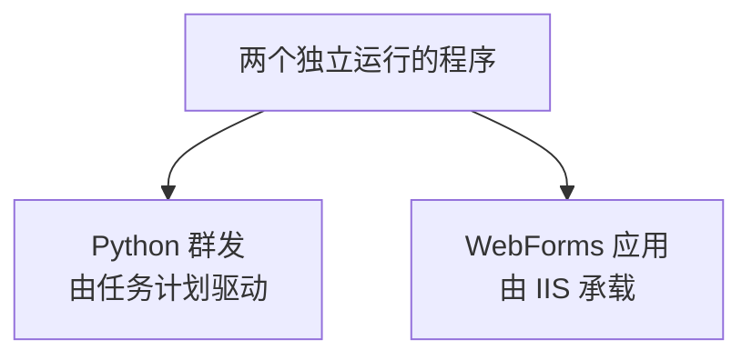

它们共享 SQL Server，但互不调用。这是全教程的架构原则，部署时也要保持这个边界。

---

# 阶段一：环境隔离

## 为什么必须做两套环境

这是上线前最重要的一个决定。

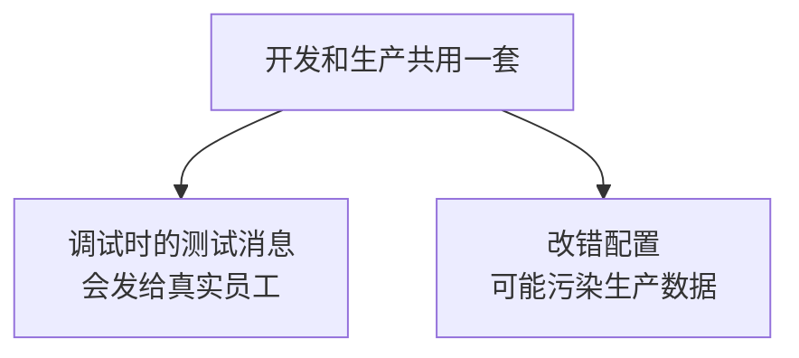

群发消息**无法撤回**。一次误发全员的测试消息，影响远大于搭建第二套环境的成本。

## 隔离到什么程度

| 项目 | 是否分开 | 说明 |
|---|---|---|
| 自建应用 | **分开** | 两个应用，各自的 AgentId 和 Secret |
| 应用可见范围 | **分开** | 开发环境只含开发者自己 |
| 数据库 | **分开** | 两个库，避免测试数据混入 |
| 域名 | 建议分开 | 用子域名区分 |
| 通讯录 Secret | 只能共用 | 全企业唯一，无法分开 |

注意最后一行：**通讯录 Secret 全企业只有一个，无法隔离。**所以开发时权限务必设为只读（第 1 章强调过），这样即使代码写错也不会破坏真实通讯录。

## 配置文件的组织

### Python 端

```text
config.py              当前使用的配置，不入版本库
config.dev.py          开发环境模板
config.prod.py         生产环境模板
config.example.py      不含真实值的示例，入版本库
```

部署时把对应的模板复制成 `config.py`。不要用代码里的开关切换环境——**开关本身可能被误设**。

### C# 端

用 `Web.config` 的转换机制：

```text
Web.config             基础配置，不含机密
Web.Debug.config       开发环境覆盖
Web.Release.config     生产环境覆盖
```

发布时选 Release，转换自动生效。

## 一个更稳妥的做法：机密不进任何配置文件

把机密放到独立文件，用 `configSource` 引用：

```xml
<appSettings configSource="secrets.config" />
```

`secrets.config` 只存在于服务器上，从不进版本库，也不随发布包分发。

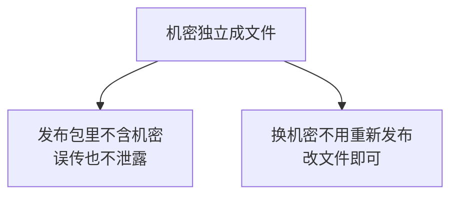

## 环境标识

生产环境的页面上应该能看出来自己在哪个环境，避免误操作：

```xml
<add key="App.Environment" value="production" />
```

```csharp
protected string EnvBanner
{
    get
    {
        string env = ConfigurationManager.AppSettings["App.Environment"];
        return string.Equals(env, "development",
            StringComparison.OrdinalIgnoreCase)
            ? "<div class='env-dev'>开发环境</div>"
            : "";
    }
}
```

开发环境显示醒目标识，生产环境不显示。**这样你一眼能确认自己正在操作哪一套。**

---

# 阶段二：Python 程序部署

## 目标

让群发程序在服务器上无人值守运行。

## 第 1 步：固定依赖版本

开发机上导出：

```bash
pip freeze > requirements.txt
```

服务器上安装：

```bash
python -m venv venv
venv\Scripts\activate
pip install -r requirements.txt
```

## 为什么要锁定版本

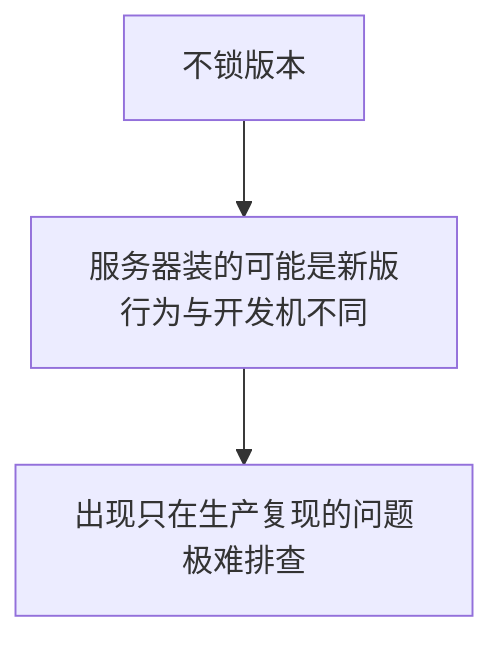

`pip freeze` 输出的是精确版本号，保证两边一致。

## 第 2 步：目录结构

```text
C:\WeComApp\
├── venv\                虚拟环境
├── config.py            机密配置，权限受限
├── wecom.py             第 2 章的消息模块
├── media.py             第 5 章的素材模块
├── sender.py            第 4 章的群发主程序
├── requirements.txt
└── logs\                日志目录
```

## 第 3 步：目录权限

| 目录或文件 | 权限要求 |
|---|---|
| `config.py` | 只有运行账户和管理员可读 |
| `logs\` | 运行账户可写 |
| 程序目录 | 运行账户可读可执行 |

**`config.py` 的权限尤其重要**，它含 Secret。移除普通用户的读取权限。

## 第 4 步：任务计划程序配置

| 项目 | 填什么 |
|---|---|
| 程序或脚本 | `C:\WeComApp\venv\Scripts\python.exe` |
| 添加参数 | `sender.py` |
| **起始于** | `C:\WeComApp` |
| 触发器 | 每 5 分钟重复，无限期 |

## 第 4 章讲过的五个坑，这里汇总确认

这五项每一项都会导致「手工运行正常、任务计划失败」：

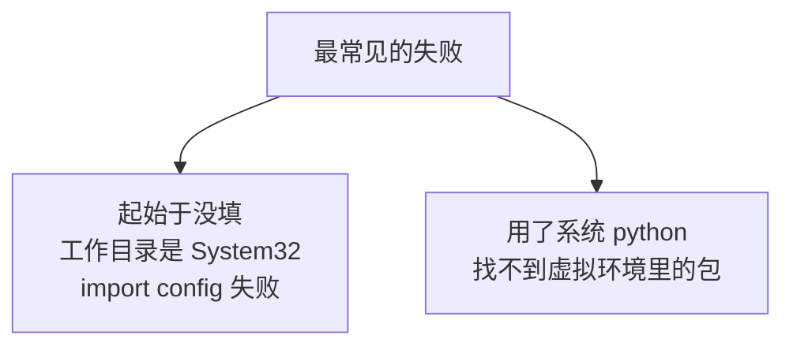

| 坑 | 现象 | 解决 |
|---|---|---|
| 1 未填「起始于」 | `No module named config` | 设为项目目录 |
| 2 用系统 python | `No module named requests` | 指向虚拟环境的 python.exe |
| 3 控制台编码 | `UnicodeEncodeError` | 写日志文件并指定 utf-8 |
| 4 允许并行运行 | 日志交错、资源浪费 | 设「不启动新实例」 |
| 5 不管用户是否登录 | 访问不到映射盘 | 用 UNC 路径 |

## 关于第 5 项的补充

勾选「不管用户是否登录都要运行」是必须的，否则注销后任务不跑。但它有三个连带影响：

| 影响 | 处理 |
|---|---|
| 需要保存账户密码 | 密码变更后要回来更新任务 |
| 映射网络驱动器不可用 | 第 5 章的 `FilePath` 要用 UNC 路径 |
| 账户需要数据库权限 | 用 `Trusted_Connection` 时要确认 |

## 第 5 步：日志轮转

第 4 章的日志会一直增长。改用按大小轮转：

```python
import logging
from logging.handlers import RotatingFileHandler

handler = RotatingFileHandler(
    "logs/sender.log",
    maxBytes=10 * 1024 * 1024,     # 单个文件 10 MB
    backupCount=10,                 # 保留 10 个历史文件
    encoding="utf-8",               # 必须指定，否则中文报错
)
handler.setFormatter(logging.Formatter(
    "%(asctime)s [%(levelname)s] %(message)s"))

logging.basicConfig(level=logging.INFO, handlers=[handler])
```

上限约 100 MB，不会占满磁盘。

## 第 6 步：验证部署

不要靠猜，逐项确认：

| 检查 | 方法 | 期望 |
|---|---|---|
| 手工触发 | 任务计划里右键运行 | 上次运行结果为 `0x0` |
| 日志生成 | 查看 `logs\sender.log` | 有新记录，中文正常 |
| 数据库连通 | 查任务状态变化 | 状态有更新 |
| 定时生效 | 等两个周期 | 日志有两次运行记录 |

**「上次运行结果」是 `0x1` 说明程序抛异常了**，去看日志。

---

# 阶段三：IIS 与 WebForms 部署

## 第 1 步：发布

Visual Studio 里用「发布」而不是直接拷源码。发布会：

| 动作 | 意义 |
|---|---|
| 编译成 DLL | 源码不出现在服务器上 |
| 剔除无关文件 | 不带 `.cs`、项目文件 |
| 应用配置转换 | Release 配置生效 |

**确认发布包里不含 `secrets.config`。**它应该只存在于服务器上。

## 第 2 步：应用程序池

| 设置 | 值 | 原因 |
|---|---|---|
| .NET CLR 版本 | v4.0 | WebForms 属于 .NET Framework |
| 托管管道模式 | 集成 | 默认即可 |
| 标识 | ApplicationPoolIdentity | 最小权限 |
| 启用 32 位应用程序 | False | 除非有 32 位依赖 |

## 回收策略

默认设置会导致 Session 频繁丢失（第 8 章 V7 讲过）：

| 设置 | 默认 | 建议 | 原因 |
|---|---|---|---|
| 空闲超时 | 20 分钟 | 0 | 避免无人访问时关闭 |
| 定期回收间隔 | 1740 分钟 | 0 | 关掉不定时的回收 |
| 固定时间回收 | 无 | 凌晨 3 点 | 改成可预期的时间 |

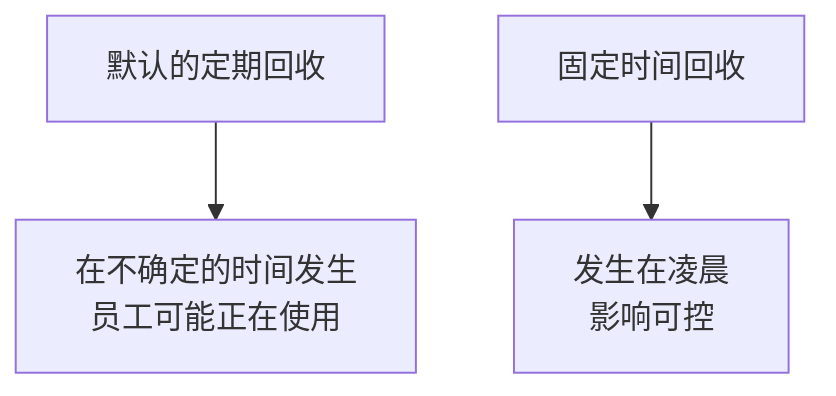

## 第 3 步：目录权限

| 目录 | 应用程序池标识需要的权限 |
|---|---|
| 站点根目录 | 读取、执行 |
| `App_Data`（如有） | 修改 |
| 日志目录 | 修改 |
| 其他目录 | 只读 |

**不要给站点根目录写权限**。Web 目录可写意味着上传的文件可能被执行。

## 第 4 步：TLS 的两个方向

这一点容易只做一半：

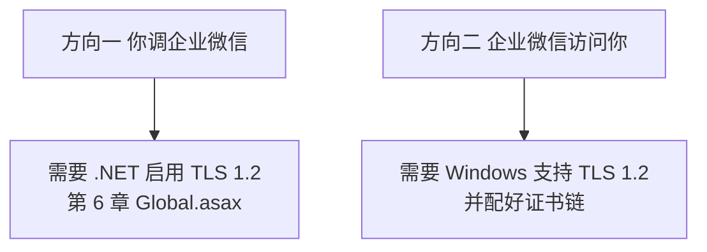

| 方向 | 检查 | 出错表现 |
|---|---|---|
| 出站 | `Global.asax` 里设了 `SecurityProtocol` | 「基础连接已关闭」 |
| 入站 | 证书链完整、系统启用 TLS 1.2 | 手机打不开页面 |

第 7 章 V3 讲过入站方向的检查方法：用在线 SSL 检测工具，**不能只用电脑浏览器验证**。

## 第 5 步：固定 machineKey

第 8 章 V7 的登录 Cookie 依赖它。不显式配置时，密钥可能在重启或多服务器间不一致，导致 Cookie 解不开。

```xml
<system.web>
  <machineKey validationKey="你生成的验证密钥"
              decryptionKey="你生成的解密密钥"
              validation="HMACSHA256"
              decryption="AES" />
</system.web>
```

**这两个值属于机密**，应该放进 `secrets.config` 而不是 `Web.config`。

## 第 6 步：关闭详细错误页

```xml
<system.web>
  <customErrors mode="RemoteOnly" defaultRedirect="~/Error.aspx" />
  <compilation debug="false" targetFramework="4.6.1" />
</system.web>
```

两处都要改：

| 设置 | 作用 |
|---|---|
| `customErrors` 为 `RemoteOnly` | 远程访问看不到堆栈 |
| `debug` 为 `false` | **性能影响很大，必须关** |

`debug="true"` 上线是常见疏漏。它会禁用某些优化、增大内存占用、让超时时间变长。

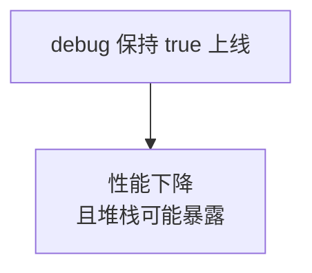

## 第 7 步：其他关键配置

```xml
<system.web>
  <!-- 全量同步耗时较长，见第 6 章 V7 -->
  <httpRuntime executionTimeout="600" maxRequestLength="30000"
               targetFramework="4.6.1" enableVersionHeader="false" />

  <!-- 第 8 章 V7：适当放宽登录有效期 -->
  <sessionState mode="InProc" timeout="120" cookieless="false" />

  <!-- Cookie 只走 HTTPS 且禁止脚本读取 -->
  <httpCookies httpOnlyCookies="true" requireSSL="true" />
</system.web>

<system.webServer>
  <!-- 第 7 章 V9：静态资源长缓存，配合版本号 -->
  <staticContent>
    <clientCache cacheControlMode="UseMaxAge"
                 cacheControlMaxAge="30.00:00:00" />
  </staticContent>

  <!-- 移除暴露技术栈的响应头 -->
  <httpProtocol>
    <customHeaders>
      <remove name="X-Powered-By" />
      <add name="X-Content-Type-Options" value="nosniff" />
      <add name="X-Frame-Options" value="SAMEORIGIN" />
    </customHeaders>
  </httpProtocol>
</system.webServer>
```

## 关于 `requireSSL="true"` 的一个注意点

它要求所有 Cookie 只在 HTTPS 下发送。**本机用 `http://localhost` 调试时 Session 会失效**，因为 Cookie 发不出去。

所以这一项应该只在生产配置里设置，通过 `Web.Release.config` 转换加入。

## 第 8 步：回调地址的特殊处理

第 11 章的 `CallbackHandler.ashx` 有两点要确认：

| 项目 | 要求 |
|---|---|
| 允许匿名访问 | 它不是员工访问，没有登录状态 |
| 不被 HTTPS 跳转干扰 | 企业微信直接访问 HTTPS，正常不受影响 |

如果站点有全局登录拦截，要放行它：

```xml
<location path="CallbackHandler.ashx">
  <system.web>
    <authorization>
      <allow users="*" />
    </authorization>
  </system.web>
</location>
```

同理，第 7 章的域名校验文件也需要放行。

## 第 9 步：验证部署

| 检查 | 方法 | 期望 |
|---|---|---|
| 页面可访问 | 手机移动网络打开主页 | 正常显示 |
| 免登录 | 从工作台进入 | 无需输入 |
| 出站 TLS | 打开员工查询页 | 能取到数据 |
| 入站证书 | 在线 SSL 检测 | 链完整 |
| 签名一致 | 第 9 章的诊断页 | 两个 URL 完全一致 |
| 回调可达 | 后台重新保存回调配置 | 保存成功 |
| 错误页 | 访问一个不存在的页面 | 显示友好页而非堆栈 |


---

# 阶段四：安全加固

## 全部机密项清单

先分清哪些是机密、哪些不是。判断标准是第 1 章讲的**标识与凭证之分**：

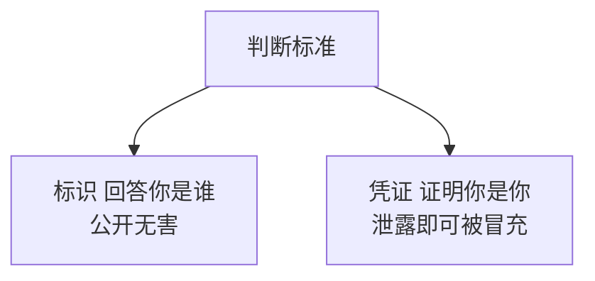

| 项目 | 类型 | 泄露后果 |
|---|---|---|
| 企业 CorpID | 标识 | 无实质危害，第 9 章还要传给浏览器 |
| AgentId | 标识 | 无实质危害 |
| UserId | 标识 | 属于个人信息，不宜大范围公开 |
| **应用 Secret** | 凭证 | 可冒充应用发消息、做 OAuth |
| **通讯录 Secret** | 凭证 | 可读取甚至修改全公司通讯录 |
| **回调 Token** | 凭证 | 可伪造事件推送 |
| **EncodingAESKey** | 凭证 | 可解密回调内容 |
| **地图服务 Key** | 凭证 | 配额被盗用 |
| **machineKey** | 凭证 | 可伪造登录 Cookie |
| **数据库连接串** | 凭证 | 数据库被直接访问 |

后七项必须保护。

## 三道防护

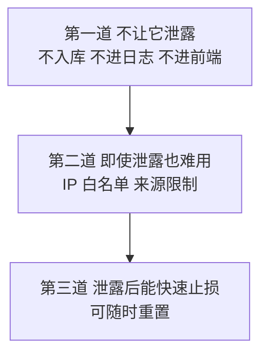

第 1 章讲 IP 白名单时说过这个思路：**不指望单一措施万无一失。**

## 第一道：不让它泄露

| 渠道 | 措施 |
|---|---|
| 版本库 | `.gitignore` 排除，机密放独立文件 |
| 日志 | 只记接口名，token 脱敏（第 2 章 V12、第 6 章 V11） |
| 前端 | 只输出签名，绝不输出 ticket 和 Secret（第 9 章） |
| 错误页 | `customErrors` 关闭详细堆栈 |
| URL | 地图和企业微信调用的完整 URL 不记日志（第 10 章 V5） |

## 加密 Web.config 里的配置节

即使有人拿到了服务器上的配置文件，也不能直接读出内容：

```text
aspnet_regiis.exe -pe "appSettings" -app "/YourAppPath"
aspnet_regiis.exe -pe "connectionStrings" -app "/YourAppPath"
```

加密后文件里是密文，而应用读取时框架自动解密，**代码完全不用改**。

需要理解它的边界：

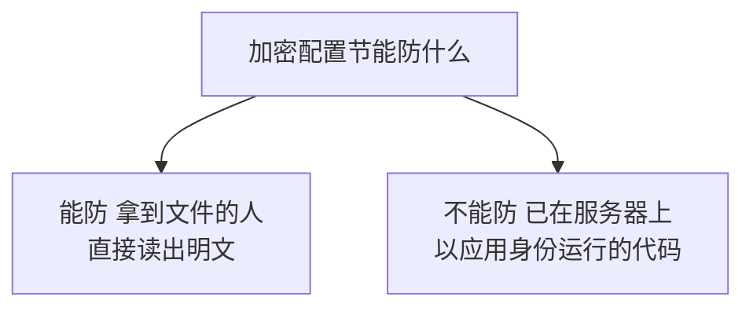

因为解密密钥就在这台机器上。它提高的是门槛，不是绝对屏障。

## 第二道：来源限制

| 凭证 | 限制方式 | 配置位置 |
|---|---|---|
| 应用 Secret | 企业可信 IP | 应用详情页 |
| 通讯录 Secret | 可信 IP | 管理工具 → 通讯录同步 |
| 地图 Key | 来源 IP 白名单 | 地图服务后台 |

**注意前两项是两个独立的白名单**，第 1 章强调过，只配一处另一处照样报 60020。

## 第三道：泄露后的应急处理

发现泄露时的处理动作，按凭证类型不同：

| 凭证 | 应急动作 | 影响 |
|---|---|---|
| 应用 Secret | 后台重置 | 旧 Secret 立即失效，需更新配置 |
| 通讯录 Secret | 后台重置 | 同上 |
| 回调 Token | 后台改掉并更新配置 | 期间回调会验签失败 |
| EncodingAESKey | 后台重新生成 | 期间回调无法解密 |
| 地图 Key | 后台重置或删除重建 | 地址解析暂时不可用 |
| machineKey | 生成新值替换 | **所有员工需重新授权** |

**重置的顺序要注意**：先在后台重置，再改服务器配置，中间会有短暂不可用。如果先改配置，旧凭证还在生效，等于没有及时止损。

## 最小权限清单

| 项目 | 最小权限设置 |
|---|---|
| 通讯录 Secret | **只读**（第 1 章强调过） |
| 应用可见范围 | 只含实际需要使用的部门 |
| 数据库账户 | 只给业务表的读写权限，不给 `db_owner` |
| 应用程序池标识 | `ApplicationPoolIdentity`，不用管理员账户 |
| 站点根目录 | 不给写权限 |

## 数据库账户的具体权限

```sql
-- 创建专用登录，不要用 sa
CREATE LOGIN WeComApp WITH PASSWORD = '强密码';
GO

USE WeComTutorial;
CREATE USER WeComApp FOR LOGIN WeComApp;

-- 只给必要的权限
ALTER ROLE db_datareader ADD MEMBER WeComApp;
ALTER ROLE db_datawriter ADD MEMBER WeComApp;
GO
```

**不要用 `db_owner`。**那意味着应用能删表、改结构。一个 SQL 注入漏洞的破坏力会因此放大。

本教程全程用参数化查询，注入风险很低，但**权限收紧是免费的保险**。

## 一个容易忽略的点：Python 与 C# 的数据库权限可以不同

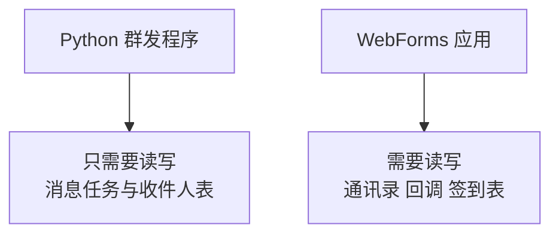

严格做法是建两个数据库账户，各自只授权自己用到的表。这样一边被攻破也影响不到另一边的数据。

---

# 阶段五：监控与日志

## 需要监控的五项指标

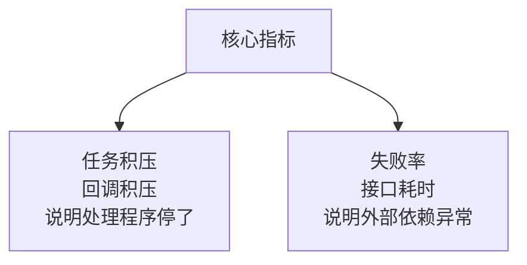

| 指标 | 异常含义 | 查询 |
|---|---|---|
| 待发送任务积压 | Python 程序没在运行 | 见下 |
| 回调事件积压 | 处理器没在运行 | 见下 |
| 接口失败率 | 配置或网络问题 | 见下 |
| 接口平均耗时 | 外部服务变慢 | 见下 |
| 重复推送率 | 回调响应太慢 | 第 11 章 V10 |

## 监控查询

```sql
-- 1 任务积压：超过 30 分钟未处理的待发送任务
SELECT COUNT(*) AS 积压任务数,
       MIN(CreatedAt) AS 最早创建时间
FROM MessageTask
WHERE Status = 0
  AND CreatedAt < DATEADD(MINUTE, -30, SYSDATETIME())
  AND (NextRetryAt IS NULL OR NextRetryAt <= SYSDATETIME());

-- 2 回调积压
SELECT COUNT(*) AS 待处理事件数,
       MIN(ReceivedAt) AS 最早接收时间
FROM CallbackEvent
WHERE Status = 0
  AND ReceivedAt < DATEADD(MINUTE, -30, SYSDATETIME());

-- 3 接口失败率（近一小时）
SELECT Source,
       COUNT(*) AS 总调用,
       SUM(CASE WHEN ErrCode <> 0 THEN 1 ELSE 0 END) AS 失败数,
       CAST(SUM(CASE WHEN ErrCode <> 0 THEN 1.0 ELSE 0 END)
            / NULLIF(COUNT(*), 0) * 100 AS DECIMAL(5,2)) AS 失败率百分比
FROM ApiLog
WHERE CreatedAt >= DATEADD(HOUR, -1, SYSDATETIME())
GROUP BY Source;

-- 4 慢接口
SELECT ApiName,
       COUNT(*) AS 次数,
       AVG(ElapsedMs) AS 平均毫秒,
       MAX(ElapsedMs) AS 最慢毫秒
FROM ApiLog
WHERE CreatedAt >= DATEADD(DAY, -1, SYSDATETIME())
GROUP BY ApiName
HAVING AVG(ElapsedMs) > 1000
ORDER BY 平均毫秒 DESC;

-- 5 各错误码分布，定位主要问题
SELECT ErrCode, COUNT(*) AS 次数, MAX(ErrMsg) AS 示例信息
FROM ApiLog
WHERE ErrCode <> 0
  AND CreatedAt >= DATEADD(DAY, -1, SYSDATETIME())
GROUP BY ErrCode
ORDER BY 次数 DESC;
```

## 用企业微信给自己发告警

这是最省事的告警方式：**你已经有了发消息的能力，直接用它通知运维。**

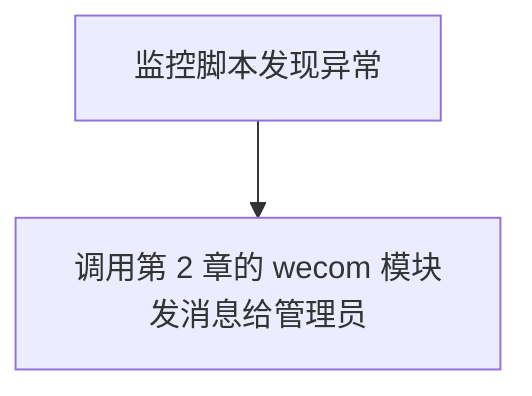

```python
# -*- coding: utf-8 -*-
"""监控脚本。发现异常时用企业微信通知管理员。"""

import pyodbc
import config
import wecom

# 阈值配置
THRESHOLD_TASK_BACKLOG = 50
THRESHOLD_CALLBACK_BACKLOG = 100
THRESHOLD_FAIL_RATE = 20        # 百分比


def check_all():
    """返回告警文本列表，空列表表示一切正常。"""
    alerts = []
    conn = pyodbc.connect(config.CONN_STR)
    cursor = conn.cursor()

    try:
        # 任务积压
        cursor.execute("""
            SELECT COUNT(*) FROM MessageTask
            WHERE Status = 0
              AND CreatedAt < DATEADD(MINUTE, -30, SYSDATETIME())
              AND (NextRetryAt IS NULL OR NextRetryAt <= SYSDATETIME())
        """)
        n = cursor.fetchone()[0]
        if n > THRESHOLD_TASK_BACKLOG:
            alerts.append(f"消息任务积压 {n} 条，请检查群发程序是否在运行")

        # 回调积压
        cursor.execute("""
            SELECT COUNT(*) FROM CallbackEvent
            WHERE Status = 0
              AND ReceivedAt < DATEADD(MINUTE, -30, SYSDATETIME())
        """)
        n = cursor.fetchone()[0]
        if n > THRESHOLD_CALLBACK_BACKLOG:
            alerts.append(f"回调事件积压 {n} 条，请检查处理器是否在运行")

        # 失败率
        cursor.execute("""
            SELECT COUNT(*),
                   SUM(CASE WHEN ErrCode <> 0 THEN 1 ELSE 0 END)
            FROM ApiLog
            WHERE CreatedAt >= DATEADD(HOUR, -1, SYSDATETIME())
        """)
        total, failed = cursor.fetchone()
        if total and total > 20:
            rate = (failed or 0) * 100.0 / total
            if rate > THRESHOLD_FAIL_RATE:
                alerts.append(
                    f"近一小时接口失败率 {rate:.1f}%（{failed}/{total}）")
    finally:
        conn.close()

    return alerts


if __name__ == "__main__":
    alerts = check_all()

    if not alerts:
        print("一切正常")
    else:
        text = "**系统监控告警**\n\n"
        for a in alerts:
            text += f"> {a}\n"

        # 告警本身失败也要能看到，所以打印一份
        print(text)
        try:
            wecom.send_markdown(text, to_user=config.ADMIN_USER_ID)
        except Exception as ex:
            print(f"告警发送失败：{ex}")
```

## 告警设计的两个要点

### 告警发送失败也要留痕

```python
print(text)
try:
    wecom.send_markdown(...)
except Exception as ex:
    print(f"告警发送失败：{ex}")
```

**如果告警通道本身坏了，你需要从别处知道。**先打印再发送，这样任务计划的日志里总有一份。

### 阈值要能避免频繁误报

```python
if total and total > 20:
```

调用量太小时失败率没有意义：2 次调用失败 1 次就是 50%，但这可能只是一次偶发超时。

**加一个最小样本量的判断，能过滤掉大量噪声。**

---

# 阶段六：上线验收

## 后台配置检查

| 项 | 确认内容 |
|---|---|
| 1 | 生产环境用的是独立的自建应用 |
| 2 | 应用可见范围符合预期 |
| 3 | 应用 Secret 已配置到生产配置 |
| 4 | 通讯录同步已开启，权限为只读 |
| 5 | 应用详情页的可信 IP 含生产服务器 |
| 6 | 通讯录同步页的可信 IP 含生产服务器 |
| 7 | 主页地址指向生产域名 |
| 8 | 网页授权可信域名已配 |
| 9 | JS-SDK 可信域名已配 |
| 10 | 回调 URL、Token、EncodingAESKey 已配且保存成功 |

## Python 端检查

| 项 | 确认内容 |
|---|---|
| 11 | 虚拟环境已建，依赖按 `requirements.txt` 安装 |
| 12 | `config.py` 用的是生产配置 |
| 13 | `config.py` 权限已收紧 |
| 14 | 任务计划的「起始于」已填 |
| 15 | 程序路径指向虚拟环境的 python.exe |
| 16 | 已设「不启动新实例」 |
| 17 | 已勾选「不管用户是否登录都要运行」 |
| 18 | 日志已配置轮转 |
| 19 | 手工触发一次，结果为 `0x0` |
| 20 | **`ALLOW_SEND_ALL` 确认为 False** |

第 20 项特别重要。第 4 章 V8 讲过：**同一句 `@all` 在开发环境发 1 人，生产环境发全公司，而群发无法撤回。**

## IIS 端检查

| 项 | 确认内容 |
|---|---|
| 21 | 发布包不含 `secrets.config` 和源码 |
| 22 | 应用程序池 CLR v4.0、集成模式 |
| 23 | 回收策略已调整为固定时间 |
| 24 | 站点根目录无写权限 |
| 25 | `Global.asax` 里启用了 TLS 1.2 |
| 26 | 证书链完整，在线检测通过 |
| 27 | `machineKey` 已固定 |
| 28 | `customErrors` 为 `RemoteOnly` |
| 29 | **`compilation debug` 为 `false`** |
| 30 | 回调地址与校验文件已放行匿名访问 |

## 安全检查

| 项 | 确认内容 |
|---|---|
| 31 | 版本库里没有任何 Secret 和 Key |
| 32 | 日志里没有完整 token 或 Secret |
| 33 | 数据库用专用账户，非 `sa`，非 `db_owner` |
| 34 | 地图 Key 已设来源限制 |
| 35 | 配置节已加密（可选但建议） |

## 功能验证

| 项 | 验证方法 | 期望 |
|---|---|---|
| 36 | 手机企业微信工作台点图标 | 打开入口页 |
| 37 | 查看第 9 章诊断页 | 签名 URL 与地址栏一致 |
| 38 | 员工查询 | 能查到全公司 |
| 39 | 位置签到 | 有文字地址且落点准确 |
| 40 | 建一条测试任务，收件人只有自己 | 收到消息 |
| 41 | 进入应用 | `CallbackEvent` 有记录 |
| 42 | 重复推送同一报文 | 只入库一条 |
| 43 | 非管理员访问管理页 | 被拒绝 |
| 44 | 外部浏览器打开 | 提示需在企业微信内使用 |
| 45 | 访问不存在的页面 | 友好错误页，无堆栈 |

## 灰度放开的建议

不要一上线就把可见范围设成全公司：

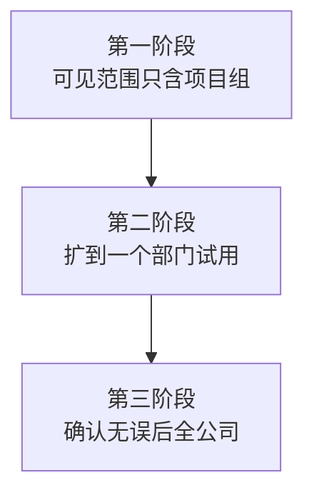

这样做的价值在于：**可见范围是企业微信后台的一个设置，收缩它比回滚代码快得多。**出问题时先把范围缩回去，再从容排查。

---

# 附录 A：错误码速查表

## 怎么用这张表

按第 1 章的**三层检查模型**归类，先判断错误属于哪一层，再看具体原因：

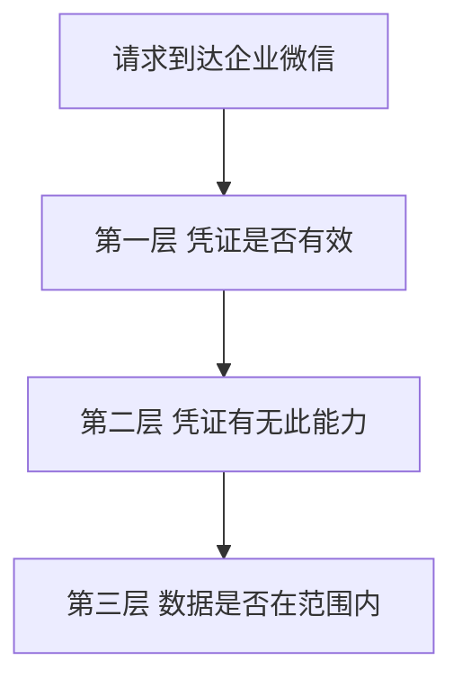

## 换取 token 阶段

| 错误码 | 含义 | 检查 |
|---|---|---|
| 40001 | Secret 不正确 | 是否抄错，是否拿错了另一个 Secret |
| 40013 | 企业 ID 不正确 | CorpID 是否正确 |
| 60020 | IP 不在白名单 | **错误信息里 `from ip` 就是要加的 IP** |

## 第一层：凭证有效性

| 错误码 | 含义 | 检查 |
|---|---|---|
| 40014 | access_token 不合法 | 是否用了别的应用或通讯录的 token |
| 41001 | 缺少 access_token | 参数名是否拼错 |
| 42001 | access_token 已过期 | 缓存是否做了提前过期 |

## 第二层：凭证能力域

| 错误码 | 含义 | 检查 |
|---|---|---|
| 60011 | 无操作权限 | **查通讯录必须用通讯录 Secret** |
| 60011 | 无操作权限 | AgentId 与 Secret 是否属于同一应用 |
| 48002 | 接口无权限 | 应用是否有该接口的权限 |

## 第三层：数据范围

| 错误码 | 含义 | 检查 |
|---|---|---|
| 301002 | 无权查看该成员 | 是否用应用 Secret 查范围外的人 |
| 81013 | UserId 不存在 | 填的是账号还是姓名 |
| `invaliduser` 有值 | 部分成员未收到 | 成员是否在应用可见范围内 |

## 消息与素材

| 错误码 | 含义 | 检查 |
|---|---|---|
| 44004 | 内容为空 | `content` 是否为空字符串 |
| 40005 | 文件类型不合法 | 扩展名与 `type` 是否匹配 |
| 40006 | 文件大小超限 | 见第 5 章限制表 |
| 40007 | media_id 不合法 | 是否已过期，临时素材仅 3 天 |
| 41005 | 缺少媒体文件 | 字段名是否为 `media`，文件是否为空 |
| 301019 | 文件类型不支持 | 换用支持的类型 |

## OAuth 授权

| 错误码 | 含义 | 检查 |
|---|---|---|
| 40029 | code 无效 | **刷新回调页最常导致此错** |
| 40029 | code 无效 | 是否已用过、已过期、或用错应用的 token |
| redirect_uri 参数错误 | 回调地址问题 | 域名是否可信域名，是否 URL 编码 |

## JS-SDK

| 错误信息 | 含义 | 检查 |
|---|---|---|
| `invalid signature` | 签名不一致 | **先对比签名 URL 与地址栏** |
| `invalid signature` | 签名不一致 | 拼接顺序、小写、ticket 是否混用 |
| `permission denied` | 无权限 | 域名是否在 JS-SDK 可信域名 |
| `agentConfig:fail` | 应用级配置失败 | 是否用了企业 ticket 算应用签名 |
| `wx.invoke is not a function` | 接口不可用 | `beta` 是否为 `true` |

## 回调

| 现象 | 含义 | 检查 |
|---|---|---|
| 签名校验失败 | Token 或参数不对 | Token 是否一致，读体是否用 UTF-8 |
| XML 解析失败 | 内容非法 | 编码是否正确 |
| AESKey 非法 | 密钥格式错 | EncodingAESKey 是否 43 位 |
| receiveid 校验失败 | 企业不匹配 | CorpID 是否正确 |
| AES 解密失败 | 解密参数错 | **`BlockSize` 是否误设为 256** |
| buffer 非法 | 填充处理错 | 是否按 32 字节处理填充 |

## 地图服务

| 现象 | 检查 |
|---|---|
| status 非 0 | Key 是否有效、是否超配额 |
| 位置落在国外或海里 | `location` 参数是否写成了「经度,纬度」 |
| 地址偏移几百米 | `getLocation` 的 `type` 是否为 `gcj02` |
| 坐标解析失败 | 是否用了 `InvariantCulture` |

## 官方错误码查询工具

遇到表里没有的错误码：

```text
https://open.work.weixin.qq.com/devtool/query?e=错误码
```

把数字换成你遇到的码即可。**这比搜索引擎准确**，因为搜到的可能是微信公众号的资料。

---

# 附录 B：故障排查决策树

## 总入口

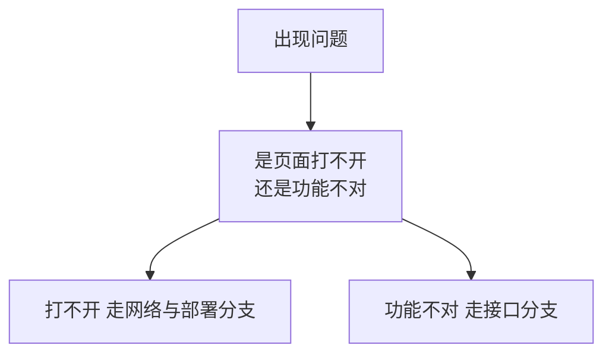

## 分支一：页面打不开

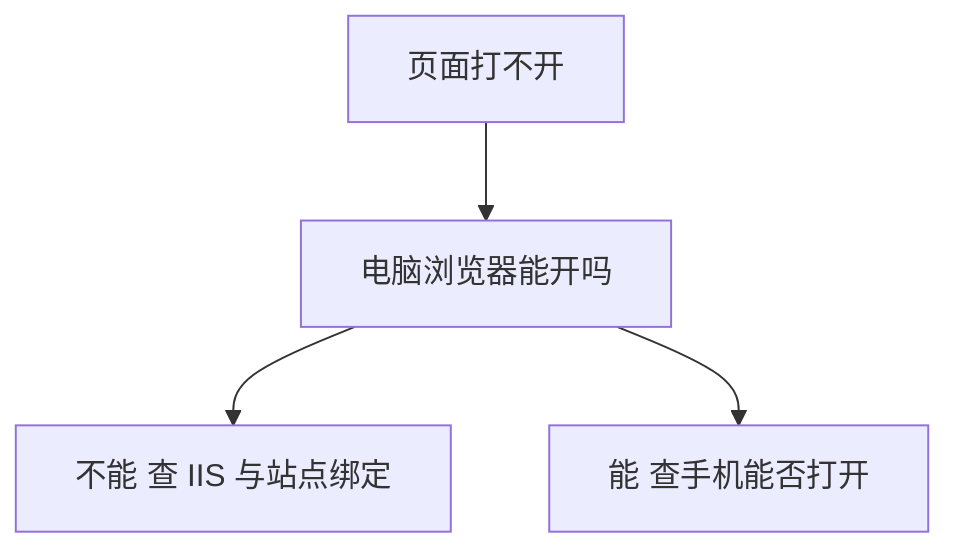

手机打不开而电脑正常，几乎一定是证书链问题（第 7 章 V3）。

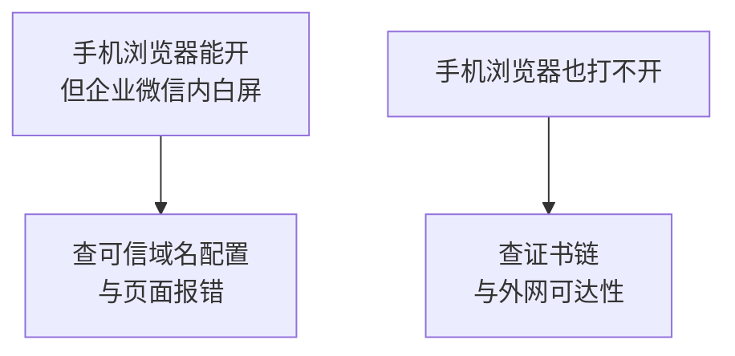

## 分支二：接口调用失败

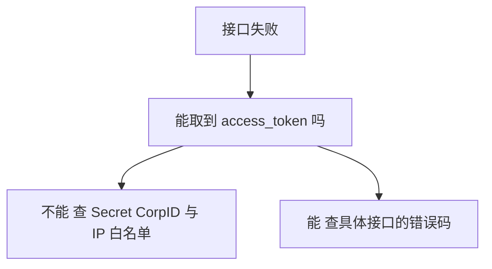

## 分支三：消息发不到

```mermaid
graph TB
    A["员工没收到消息"] --> B["errcode 是 0 吗"]
    B --> C["不是 0 查错误码表"]
    B --> D["是 0 查 invaliduser 字段"]
```

`errcode` 为 0 但有 `invaliduser`，说明成员不在可见范围（第 2 章 V3）。

## 分支四：回调收不到

```mermaid
graph TB
    A["回调没反应"] --> B["CallbackRaw 表有记录吗"]
    B --> C["没有 请求未到达<br/>查域名 证书 防火墙"]
    B --> D["有 用离线工具验签解密"]
```

这一步的价值在于**立刻区分了网络问题和加解密问题**（第 11 章 V10）。

## 分支五：JS-SDK 不可用

```mermaid
graph TB
    A["JS-SDK 有问题"] --> B["wx 对象存在吗"]
    B --> C["不存在 JS 文件未加载"]
    B --> D["存在 看卡在哪一级配置"]
```

```mermaid
graph TB
    A["config 失败"] --> B["查签名 URL 与企业 ticket"]
    C["config 成功 agentConfig 失败"] --> D["几乎必然是<br/>两种 ticket 混用"]
```

## 一个通用原则

```mermaid
graph TB
    A["排查任何问题"] --> B["先确定问题发生在哪一段<br/>再查那一段的原因"]
    B --> C["不要同时改多个地方<br/>否则无法判断哪个修好的"]
```

全书的每一章都在用这个方法：**把长链条切成若干段，每段的可能原因互不重叠。**

---

# 附录 C：数据保留与清理

## 各表的建议保留期

| 表 | 建议保留 | 理由 |
|---|---|---|
| `MessageTask` | 1 年 | 业务追溯 |
| `MessageRecipient` | 1 年 | 与任务同步 |
| `MediaCache` | 过期后 7 天 | 只是凭据缓存 |
| `WeComEmployee` | 长期 | 软删除保留历史关联 |
| `WeComDepartment` | 长期 | 同上 |
| `CallbackRaw` | 30 天 | 体积大，仅调试用 |
| `CallbackEvent` | 90 天 | 事件追溯 |
| `CheckinRecord` | 按企业规定 | **含位置信息，属个人信息** |
| `GeocodeCache` | 长期 | 地址不常变，命中率高 |
| `ApiLog` | 90 天 | 排错用 |
| `UserLoginLog` | 按企业规定 | **含 IP，属个人相关信息** |
| `SyncFlag` | 长期 | 只有一行标记，无需清理 |

两处标注的表要特别注意：**位置和 IP 属于个人信息，保留期限应按企业的合规要求确定，不宜无限期保留。**

## 清理脚本

```sql
/* 每日清理。分批删除，避免长事务导致日志膨胀 */

DELETE TOP (5000) FROM CallbackRaw
WHERE ReceivedAt < DATEADD(DAY, -30, SYSDATETIME());

DELETE TOP (5000) FROM ApiLog
WHERE CreatedAt < DATEADD(DAY, -90, SYSDATETIME());

DELETE TOP (5000) FROM CallbackEvent
WHERE ReceivedAt < DATEADD(DAY, -90, SYSDATETIME())
  AND Status IN (2, 3);          -- 只删已处理完的

DELETE TOP (5000) FROM MediaCache
WHERE ExpireAt < DATEADD(DAY, -7, SYSDATETIME());

/* 消息记录先删子表再删主表，避免外键冲突 */
DELETE TOP (5000) r FROM MessageRecipient r
JOIN MessageTask t ON t.Id = r.TaskId
WHERE t.CreatedAt < DATEADD(DAY, -365, SYSDATETIME());

DELETE TOP (5000) FROM MessageTask
WHERE CreatedAt < DATEADD(DAY, -365, SYSDATETIME())
  AND NOT EXISTS (SELECT 1 FROM MessageRecipient r WHERE r.TaskId = Id);
```

## 为什么都用 `TOP (5000)`

```mermaid
graph TB
    A["一次删除全部"] --> B["长事务锁表<br/>日志文件暴涨"]
    C["分批删除"] --> D["每批快速提交<br/>影响可控"]
```

反复执行到删完为止。可以放进任务计划每天凌晨跑一次。

## 备份

| 对象 | 频率 | 说明 |
|---|---|---|
| 数据库 | 每日完整 + 日志备份 | 按 SQL Server 常规做法 |
| `secrets.config` | 变更时 | 单独安全保存，不与代码同存 |
| 证书文件与密码 | 变更时 | 同上 |
| 发布包 | 每次发布保留 | 便于快速回滚 |

**机密的备份也是机密**，不要为了方便把它和代码备份放在一起。

---

# 附录 D：全书原理索引

散在各章的核心原理，方便日后回查：

| 原理 | 在哪一章 |
|---|---|
| 长期凭证换短期凭证，为什么要有 access_token | 01、02 V1 |
| token 是查表的钥匙，不是加密数据 | 01、02 V6 |
| 企业微信重复获取 token 返回同一个（与公众号相反） | 01、02 V6、06 V2 |
| 权限跟着凭证走，两种 Secret 的分工 | 01、06、08 V8 |
| 请求要过三层检查，错误码按层归类 | 01 |
| HTTP 200 不代表业务成功，两层判断 | 02 V2、10 V5 |
| 部分成功与 `invaliduser`，第三层判断 | 02 V3 |
| `msgtype` 决定读哪个同名对象 | 02 V1、02 V8 |
| 字节与字符的区别，截断不能切字节 | 02 V10 |
| 超时不代表没发出去，重试的两难 | 02 V4、05 V9 |
| 幂等的本质是能判断是否已执行 | 03 V2 |
| 为什么必须有「处理中」中间态 | 03 V2 |
| 唯一索引比「先查再插」可靠 | 03 V6、11 V7 |
| `UPDATE ... OUTPUT` 原子领取 | 03 V7、10 V7、11 V8 |
| 软删除保留历史关联 | 03 V8、06 V9 |
| 拉模式与推模式的取舍 | 04 V1 |
| 成功者要用差集算出来 | 04 V4 |
| 可重试与不可重试错误的判断标准 | 04 V5、05 V9 |
| 上传是幂等的，所以可以重试 | 05 V9 |
| 缓存键必须包含决定结果的全部输入 | 05 V7、10 V7 |
| `HttpClient` 必须复用 | 06 V1 |
| WebForms 里不能用 `.Result` | 06 V1 |
| 同步部分失败时必须跳过删除标记 | 06 V7 |
| CSV 中文乱码与 UTF-8 BOM | 06 V10 |
| 反向代理会丢掉协议信息 | 07 V8、09 V4 |
| UA 只能用于提示，不能用于安全判断 | 07 V6 |
| 为什么要用 code 中转而不直接传 userid | 08 V1 |
| `state` 防跨站请求伪造 | 08 V3 |
| 开放重定向与 `//` 的陷阱 | 08 V4 |
| Cookie 内容里也要带过期时间 | 08 V7 |
| 认证与授权是两件事 | 08 V11 |
| 隐藏菜单不等于权限控制 | 08 V11、10 V10 |
| 签名必须服务端算，ticket 不能出现在浏览器 | 09 V2 |
| ticket 该缓存，签名不该缓存 | 09 V5 |
| 两级配置两种 ticket 不能混用 | 09 V6 |
| 三套坐标系与偏移 | 10 V3 |
| 精度必须纳入范围判断 | 10 V9 |
| 定位不能作为唯一到岗依据 | 10 V9 |
| 区域无关的格式化与比较 | 10 V5、11 V3 |
| 回调必须快速响应，否则触发重推 | 11 V6 |
| 重复推送是必然会发生的 | 11 V7 |
| 合并触发：把大量信号压缩成一次动作 | 11 V8 |
| 标识与凭证之分，泄露后果不同 | 01、12 |
| 纵深防御：IP 白名单是第二道门 | 01、12 |

---

# 全书回顾

## 十二章的结构

```mermaid
graph TB
    A["阶段一 01 到 06<br/>本机即可完成"] --> B["Python 群发<br/>C# 员工查询"]
    C["阶段二 07 到 11<br/>需要 HTTPS 域名"] --> D["免登录 JS-SDK<br/>定位 回调"]
```

第 12 章是上线收尾。

## 最终交付物

| 程序 | 语言 | 承载方式 | 功能 |
|---|---|---|---|
| 群发程序 | Python | 任务计划程序 | 消息群发、素材上传 |
| Web 应用 | C# WebForms | IIS | 员工查询、免登录、签到、回调 |
| 监控脚本 | Python | 任务计划程序 | 指标检查与告警 |
| 数据库 | SQL Server | —— | 12 张表 |

## 架构原则的坚持

全书自始至终保持了一条边界：

```mermaid
graph TB
    A["Python 直接调用企业微信"] --> C["共享 SQL Server"]
    B["C# 直接调用企业微信"] --> C
```

两者从不互相调用。这个设计能成立，依赖第 1 章验证过的一个事实：**企业微信在有效期内重复获取 access_token 会返回同一个**，所以两边各自缓存是安全的。

如果换成微信公众号那种「新的一发旧的失效」的模型，就必须引入一个统一的 token 中控服务，架构会复杂很多。**一个底层机制的差异，决定了整个架构的形态。**

## 如果要继续扩展

本教程没有覆盖但常用的方向：

| 方向 | 大致做法 |
|---|---|
| 自定义应用菜单 | 调菜单接口，配合第 11 章的 `click` 事件 |
| 审批流对接 | 审批相关接口，配合回调获知状态变化 |
| 打卡数据读取 | 打卡接口，注意时间范围限制 |
| 外部联系人 | 客户联系相关 Secret 与接口 |
| 群机器人 | Webhook 方式，比自建应用简单得多 |
| 通讯录增量同步 | 用第 11 章的 `change_contact` 事件替代全量 |

其中**群机器人**值得单独提一句：如果你只需要往某个群发通知，不需要身份识别和网页，用群机器人的 Webhook 会简单很多，不用走本教程的整套流程。**选择合适的方案比套用复杂方案更重要。**

## 一个建议

本教程强调了很多「坑」，但真正重要的是排查方法而不是记住每个坑：

```mermaid
graph TB
    A["记住具体的坑"] --> B["只对遇到过的问题有效"]
    C["掌握分段排查"] --> D["面对新问题也能定位"]
```

遇到没见过的问题时，回到附录 B 的方法：**先确定问题发生在哪一段，再查那一段的原因。**

## 免责说明

本教程为技术学习材料，示例代码用于演示原理，未经充分测试不建议直接用于生产。涉及员工位置、通讯录等个人信息的功能，请按所在企业和当地的合规要求使用，遵循明确告知、最小必要和限期保留的原则。
