# 第 13 章：Windows Server 2022 从零搭建（IIS + WebForms + SSL）

## 本章定位

前面各章假设服务器已经就绪。本章补上这个缺口：**从一台刚装好系统的 Windows Server 2022，搭到能跑企业微信应用。**

## 适用范围

| 项目 | 本章覆盖 |
|---|---|
| 操作系统 | Windows Server 2022（IIS 10.0） |
| 应用框架 | ASP.NET WebForms（.NET Framework 4.8） |
| Web 服务器 | IIS |
| 证书 | 正式签发的 SSL 证书 |

**不覆盖** Server 2016/2019（TLS 行为不同）和 ASP.NET Core（承载方式完全不同）。

## 阅读顺序建议

如果你是从裸机开始，本章应该在**第 7 章之前**做：

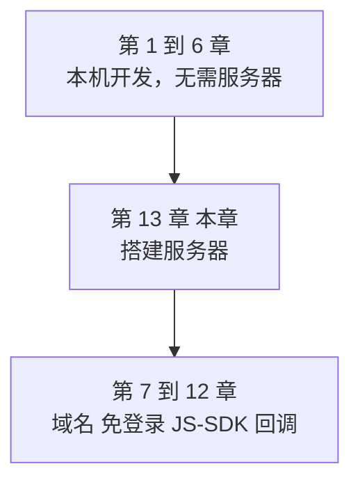

编号放在最后只是因为它是后补的，不代表顺序。

## 本章的组织方式

按操作顺序分十个阶段。**每个阶段结束都有一道验证关卡，过不了不要往下走。**

搭建类操作最怕的是前面某步没成、后面一直查错方向。所以每关都给出「怎么确认成功」和「失败了查什么」。

| 阶段 | 内容 |
|---|---|
| 一 | 服务器准备与前置确认 |
| 二 | 安装 IIS 与 ASP.NET 4.8 |
| 三 | 第一个页面：确认 WebForms 能执行 |
| 四 | 域名解析与出口 IP |
| 五 | SSL 证书安装与绑定 |
| 六 | TLS 协议配置 |
| 七 | HTTP 强制跳转 HTTPS |
| 八 | 生产站点、应用程序池与权限 |
| 九 | 企业微信侧配置与诊断页 |
| 十 | IIS 错误码排查 |

## 操作方式：命令为主，界面为辅

本章每一步都给 **PowerShell 命令**，同时给界面点击路径。

推荐用命令，原因有三个：

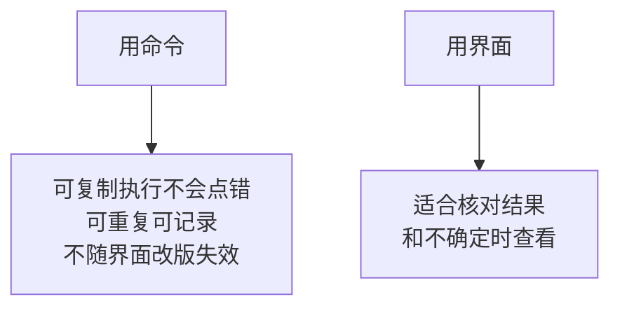

**所有 PowerShell 都必须在「以管理员身份运行」的窗口里执行。**普通窗口会报权限错误，而错误信息有时不明显。

---

# 阶段一：服务器准备与前置确认

## 1.1 确认系统版本

```powershell
Get-ComputerInfo | Select-Object WindowsProductName, WindowsVersion, OsBuildNumber
```

期望输出里 `WindowsProductName` 含 `Windows Server 2022`。

如果是 2016 或 2019，本章的 TLS 部分不适用，其余步骤基本相同。

## 1.2 系统时间同步（很多人漏掉的一步）

**这一步必须做，而且要放在最前面。**

### 为什么时间这么重要

企业微信有三处依赖时间，服务器时间不准会导致难以理解的失败：

| 功能 | 依赖 | 时间不准的后果 |
|---|---|---|
| JS-SDK 签名 | `timestamp` 参数 | 第 9 章的 `invalid signature` |
| 回调验签 | 时间戳容差 10 分钟 | 第 11 章回调被拒 |
| token 缓存 | 提前 5 分钟过期的计算 | 第 1 章讲的临界失效 |

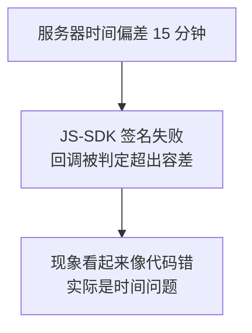

**这类问题极难排查**，因为代码逻辑完全正确。所以先把时间弄准。

### 操作

```powershell
# 查看当前同步状态
w32tm /query /status

# 配置 NTP 服务器（国内建议用阿里云的，海外可用 time.windows.com）
w32tm /config /manualpeerlist:"ntp.aliyun.com,0x9 ntp1.aliyun.com,0x9" `
    /syncfromflags:manual /reliable:yes /update

# 重启时间服务并立即同步
Restart-Service w32time
w32tm /resync
```

### 验证

```powershell
w32tm /query /status | Select-String "Last Successful Sync Time", "Source"
```

`Source` 应该是你配置的 NTP 地址，`Last Successful Sync Time` 应该是刚刚。

再和权威时间对一下：

```powershell
# 显示本机时间与 UTC
Get-Date -Format "yyyy-MM-dd HH:mm:ss zzz"
[DateTime]::UtcNow.ToString("yyyy-MM-dd HH:mm:ss")
```

用手机查一下标准时间对比，**偏差应在几秒以内**。

### 顺便确认时区

```powershell
Get-TimeZone
# 如需修改为中国标准时间
Set-TimeZone -Id "China Standard Time"
```

时区错了会让日志时间难以解读，但不影响签名（签名用的是 UTC 时间戳）。

## 1.3 开放防火墙端口

```powershell
New-NetFirewallRule -DisplayName "HTTP-In-80" -Direction Inbound `
    -Protocol TCP -LocalPort 80 -Action Allow

New-NetFirewallRule -DisplayName "HTTPS-In-443" -Direction Inbound `
    -Protocol TCP -LocalPort 443 -Action Allow
```

### 验证

```powershell
Get-NetFirewallRule -DisplayName "HTTP*In*", "HTTPS*In*" |
    Select-Object DisplayName, Enabled, Direction, Action
```

`Enabled` 应为 `True`。

### 注意：防火墙不是唯一的一道

如果服务器在云上，还有一层安全组：

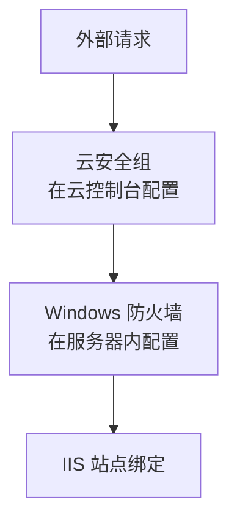

**三处任何一处没放行，外部都访问不到。**这三处要分别确认，不能只看一处。

## 1.4 确认公网出口 IP

第 1 章讲过企业微信的可信 IP 要填**公网出口 IP**。现在先记下来。

```powershell
# 方法一：查询外部服务
(Invoke-RestMethod -Uri "https://api.ipify.org?format=json").ip
```

如果服务器不能访问外网，或者你不确定这个结果对不对，用**权威方法**：

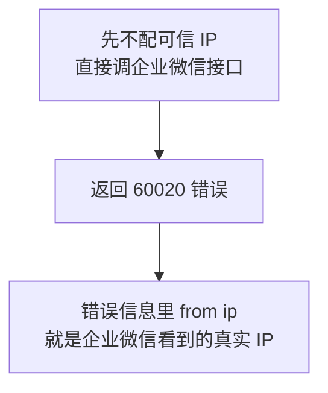

第 1 章第六节讲过这个技巧。**企业微信自己告诉你的 IP 才是准的**，因为可能存在 NAT 或多出口的情况。

阶段九的诊断页会把这个检测做成一个按钮。

## 1.5 关卡一：确认通过再往下

| 检查项 | 命令 | 期望 |
|---|---|---|
| 系统是 2022 | `Get-ComputerInfo` | 含 Windows Server 2022 |
| 时间已同步 | `w32tm /query /status` | Source 是 NTP 地址 |
| 时间偏差 | 与手机对比 | 几秒以内 |
| 防火墙已放行 | `Get-NetFirewallRule` | 两条规则 Enabled |
| 记下出口 IP | —— | 已记录 |

**时间同步这一关不要跳过。**它现在花两分钟，能省掉后面第 9、11 章几个小时的排查。

---

# 阶段二：安装 IIS 与 ASP.NET 4.8

## 2.1 一条命令装齐

WebForms 需要的功能比默认安装多几项。用下面的清单一次装好：

```powershell
$features = @(
    'Web-Server',                # IIS 主体
    'Web-WebServer',
    'Web-Common-Http',
    'Web-Default-Doc',           # 默认文档
    'Web-Static-Content',        # 静态文件，域名校验文件要用
    'Web-Http-Errors',
    'Web-Http-Redirect',         # HTTP 重定向
    'Web-Http-Logging',          # 访问日志，排查必备
    'Web-Stat-Compression',      # 静态压缩
    'Web-Filtering',             # 请求筛选
    'Web-Net-Ext45',             # .NET 扩展性 4.5+
    'Web-Asp-Net45',             # ASP.NET 4.x，WebForms 的关键
    'Web-ISAPI-Ext',             # ISAPI 扩展，ASP.NET 依赖
    'Web-ISAPI-Filter',          # ISAPI 筛选器
    'Web-Mgmt-Console',          # IIS 管理器界面
    'Web-Mgmt-Tools',
    'NET-Framework-45-ASPNET'    # .NET Framework 的 ASP.NET 组件
)

Install-WindowsFeature -Name $features -IncludeManagementTools
```

功能名称参照微软的 IIS 启用指南与社区整理的清单（[如何在 Windows Server 上启用 IIS 及关键功能](https://techcommunity.microsoft.com/blog/iis-support-blog/how-to-enable-iis-and-key-features-on-windows-server-a-step-by-step-guide/4229883)、[IIS 与 ASP.NET 在 Server 2019/2022 上的安装](https://software.keyfactor.com/Core-OnPrem/v11.0/Content/InstallingServer/Main/Windows%20Server%202019.htm)。内容已改写以符合授权要求）。

## 2.2 三个最关键的功能

如果你想精简清单，这三个绝对不能省：

| 功能 | 少了会怎样 |
|---|---|
| `Web-Asp-Net45` | **`.aspx` 被当成文本下载**，不执行 |
| `Web-ISAPI-Ext` | ASP.NET 无法挂进管道 |
| `Web-Static-Content` | 域名校验文件、CSS、图片返回 404 |

第一条是最常见的现象。第 7 章 V1 提过，这里给出根因：**ASP.NET 没注册，IIS 不知道 `.aspx` 该交给谁处理**，于是按静态文件返回。

## 2.3 界面路径（用于核对）

```text
服务器管理器 → 管理 → 添加角色和功能
  → 安装类型：基于角色或基于功能的安装
  → 服务器角色：勾选 Web 服务器 (IIS)
  → 角色服务：
       常见 HTTP 功能 → 全部勾选
       应用程序开发 → .NET 扩展性 4.8
       应用程序开发 → ASP.NET 4.8        ← 必须
       应用程序开发 → ISAPI 扩展          ← 必须
       应用程序开发 → ISAPI 筛选器        ← 必须
       运行状况和诊断 → HTTP 日志
       性能 → 静态内容压缩
       安全性 → 请求筛选
       管理工具 → IIS 管理控制台
```

## 2.4 验证安装结果

### 确认功能已装

```powershell
Get-WindowsFeature -Name Web-Asp-Net45, Web-ISAPI-Ext, Web-Static-Content |
    Select-Object Name, InstallState
```

三项的 `InstallState` 都应该是 `Installed`。

### 确认 IIS 服务在跑

```powershell
Get-Service W3SVC | Select-Object Name, Status, StartType
```

`Status` 应为 `Running`，`StartType` 应为 `Automatic`。

### 确认 .NET Framework 版本

Windows Server 2022 自带 .NET Framework 4.8：

```powershell
(Get-ItemProperty 'HKLM:\SOFTWARE\Microsoft\NET Framework Setup\NDP\v4\Full').Release
```

**返回值大于或等于 528040 表示 4.8 或更高。**这个数字叫 Release 值，微软用它标识具体版本。

Server 2022 后续的累积更新可能把它升到 4.8.1，Release 值会更大，这没问题（[Server 2022 的 .NET Framework 更新说明](https://support.microsoft.com/zh-cn/topic/%E9%80%82%E7%94%A8%E4%BA%8E-windows-%E7%9A%84-microsoft-net-framework-4-8-%E8%84%B1%E6%9C%BA%E5%AE%89%E8%A3%85%E7%A8%8B%E5%BA%8F-9d23f658-3b97-68ab-d013-aa3c3e7495e0)。内容已改写以符合授权要求）。

### 确认 IIS 能响应

```powershell
Invoke-WebRequest -Uri "http://localhost" -UseBasicParsing |
    Select-Object StatusCode, StatusDescription
```

期望 `StatusCode` 为 200。

也可以在服务器上用浏览器打开 `http://localhost`，看到 IIS 欢迎页。

## 2.5 如果 ASP.NET 没生效的补救

正常情况下 `Web-Asp-Net45` 已经完成注册。如果后面发现 `.aspx` 不执行，用这条命令重新注册：

```powershell
& "$env:windir\Microsoft.NET\Framework64\v4.0.30319\aspnet_regiis.exe" -i
```

注意路径里的 `Framework64` 是 64 位版本。**如果你的应用程序池启用了 32 位，要改用 `Framework` 目录**。

## 2.6 一个安装顺序的提醒

本章用的是 .NET Framework，顺序问题不严重。但记住一条通用原则：

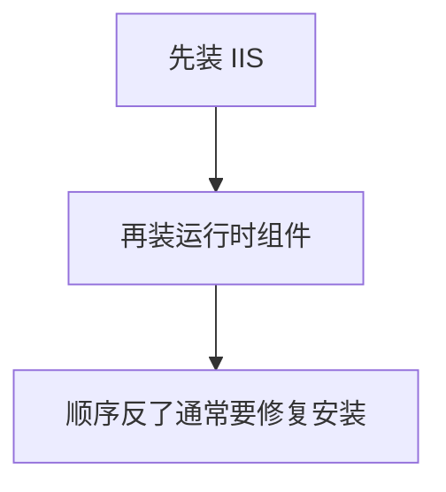

如果你以后要在同一台机器上部署 ASP.NET Core，这一点尤其重要：Hosting Bundle 装在 IIS 之前，装完不会正常工作，需要修复（[Hosting Bundle 的安装顺序要求](https://software.keyfactor.com/Core/Current/Content/InstallingServer/Main/Windows%20Server%202019.htm)。内容已改写以符合授权要求）。

## 2.7 关卡二

| 检查项 | 命令 | 期望 |
|---|---|---|
| 三个关键功能已装 | `Get-WindowsFeature` | 都是 Installed |
| IIS 服务运行中 | `Get-Service W3SVC` | Running |
| .NET 版本 | 查 Release 值 | ≥ 528040 |
| IIS 能响应 | `Invoke-WebRequest http://localhost` | 200 |

---

# 阶段三：第一个页面，确认 WebForms 能执行

## 3.1 为什么单独设一个阶段

因为「IIS 装好了」和「WebForms 能跑」是两件事。

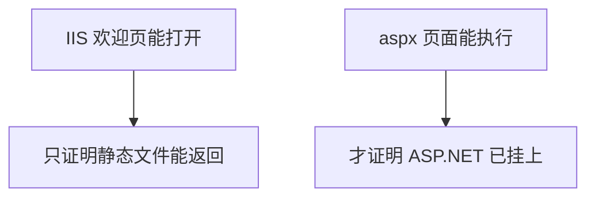

现在用最小的代价把这件事确认掉，比等到部署完整应用时再发现问题好得多。

## 3.2 建一个测试页

先在默认站点里测，暂时不建新站点：

```powershell
$testPage = @'
<%@ Page Language="C#" %>
<!DOCTYPE html>
<html>
<head><meta charset="utf-8" /><title>IIS 自检</title></head>
<body style="font-family:Consolas,monospace;font-size:14px">
<h3>ASP.NET 运行正常</h3>
<table border="1" cellpadding="6" style="border-collapse:collapse">
<tr><td>服务器时间</td><td><%= DateTime.Now.ToString("yyyy-MM-dd HH:mm:ss") %></td></tr>
<tr><td>UTC 时间</td><td><%= DateTime.UtcNow.ToString("yyyy-MM-dd HH:mm:ss") %></td></tr>
<tr><td>.NET 版本</td><td><%= Environment.Version %></td></tr>
<tr><td>是否 64 位进程</td><td><%= Environment.Is64BitProcess %></td></tr>
<tr><td>机器名</td><td><%= Environment.MachineName %></td></tr>
<tr><td>应用池标识</td><td><%= System.Security.Principal.WindowsIdentity.GetCurrent().Name %></td></tr>
<tr><td>访问协议</td><td><%= Request.Url.Scheme %></td></tr>
<tr><td>访问主机</td><td><%= Request.Url.Host %></td></tr>
<tr><td>客户端 IP</td><td><%= Request.UserHostAddress %></td></tr>
</table>
</body>
</html>
'@

$testPage | Out-File -FilePath "C:\inetpub\wwwroot\iistest.aspx" `
    -Encoding UTF8 -Force
```

## 3.3 验证

```powershell
$r = Invoke-WebRequest -Uri "http://localhost/iistest.aspx" -UseBasicParsing
$r.StatusCode
$r.Content -match "ASP.NET 运行正常"
```

期望 `200` 和 `True`。

在服务器上用浏览器打开 `http://localhost/iistest.aspx`，应该看到一张表格。

## 3.4 这张表的每一行都有用

| 行 | 用途 |
|---|---|
| 服务器时间、UTC 时间 | 复核阶段一的时间同步 |
| .NET 版本 | 确认运行在 4.x CLR 上 |
| 是否 64 位进程 | 决定 `aspnet_regiis` 用哪个目录 |
| 应用池标识 | 后面配目录权限要用这个身份 |
| 访问协议、主机 | 第 7 章 V8 讲的反向代理问题要看这两项 |

**建议先别删这个文件**，后面几个阶段都要用它做验证。第九阶段会把它升级成完整的诊断页。

## 3.5 三种失败与原因

| 现象 | 原因 | 处理 |
|---|---|---|
| 浏览器下载了 `.aspx` 文件 | ASP.NET 未注册 | 回到 2.5 执行 `aspnet_regiis -i` |
| 500.21 错误 | 处理程序映射缺失 | 同上 |
| 500.19 错误 | 配置文件问题或权限 | 见阶段十 |
| 404.17 错误 | 静态处理程序接了动态请求 | 说明 ASP.NET 未挂上，同 2.5 |
| 页面显示但中文乱码 | 文件编码不对 | 确认存为 UTF-8 |

**404.17 这个错误码值得记住**：它的字面意思是「请求的内容似乎是脚本，但被静态文件处理程序处理了」，直接指向 ASP.NET 未注册。

## 3.6 关卡三

| 检查项 | 期望 |
|---|---|
| `iistest.aspx` 返回 200 | 是 |
| 页面显示表格而非源码 | 是 |
| 服务器时间正确 | 与标准时间差几秒内 |
| 记下应用池标识 | 已记录，后面配权限用 |

**到这里，服务器已经能跑 WebForms 了。**接下来是让外网能访问，以及加上 HTTPS。


---

# 阶段四：域名解析与外网可达

## 4.1 为什么必须用域名

第 7 章讲过原因，这里复述结论：**企业微信不接受 IP 地址**，可信域名、主页地址、回调地址都要求域名。

而且 SSL 证书也是签发给域名的，用 IP 访问必然报证书错误。

## 4.2 配置解析

在你的域名服务商处添加 A 记录，指向服务器公网 IP：

```text
类型：A
主机记录：wecom（或你想用的子域名）
记录值：你的服务器公网 IP
TTL：默认
```

## 4.3 验证解析生效

```powershell
Resolve-DnsName -Name "your-domain.com" -Type A
```

返回的 `IPAddress` 应该是你服务器的公网 IP。

**如果刚改完解析，可能需要等几分钟到几十分钟生效。**用下面的方式绕过本地缓存查权威结果：

```powershell
Resolve-DnsName -Name "your-domain.com" -Type A -Server 223.5.5.5
```

指定一个公共 DNS 服务器查询，能看到解析是否真的已经发布。

## 4.4 验证外网能访问

这一步**必须从服务器之外**测试。在服务器上测 `localhost` 说明不了任何问题。

三种方式，按可靠性排序：

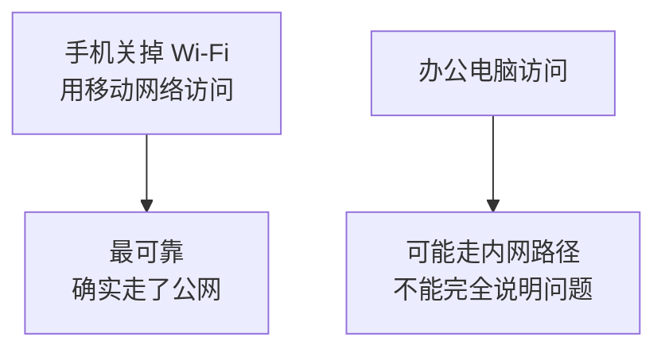

用手机移动网络打开：

```text
http://your-domain.com/iistest.aspx
```

应该看到阶段三那张表格。

## 4.5 访问不到时的排查顺序

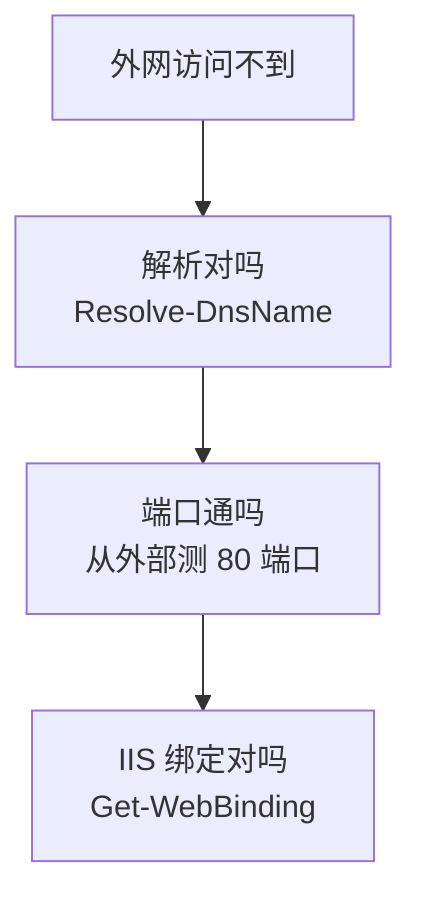

从外部测端口连通性，在**你自己的电脑**上执行：

```powershell
Test-NetConnection -ComputerName your-domain.com -Port 80
```

`TcpTestSucceeded` 为 `True` 说明端口通了。为 `False` 说明被拦，按下表逐一排查：

| 位置 | 怎么查 |
|---|---|
| 云安全组 | 云控制台的安全组规则，放行 80 和 443 |
| Windows 防火墙 | 阶段一的 `Get-NetFirewallRule` |
| IIS 站点绑定 | `Get-WebBinding -Name "Default Web Site"` |
| 运营商封禁 | 部分家用宽带封 80，需换端口或用云服务器 |

**最后一条要特别注意**：国内部分家用宽带确实封禁 80 端口。如果你在家里的机器上试，这可能是原因。

## 4.6 关卡四

| 检查项 | 方法 | 期望 |
|---|---|---|
| 解析正确 | `Resolve-DnsName` 指定公共 DNS | 返回服务器公网 IP |
| 端口连通 | 从外部 `Test-NetConnection` | True |
| 手机移动网络能打开 | 浏览器访问 | 看到测试表格 |

**「手机用移动网络能打开」这一关必须过。**这是企业微信客户端访问你服务器的等效条件。

---

# 阶段五：SSL 证书安装与绑定

## 5.1 证书从哪来

三种途径：

| 途径 | 特点 |
|---|---|
| 云服务商签发 | 常有免费额度，直接下载，最省事 |
| Let's Encrypt | 免费，但有效期 90 天，需自动续期 |
| 企业内部 CA | 不被公网信任，**企业微信不接受** |

第三种要说清楚：**自签名证书和企业内部 CA 签发的证书都不行。**企业微信客户端不信任它们，页面会打不开。必须用公网可信的 CA 签发的证书。

## 5.2 拿到什么文件

正常情况下你会拿到一个 `.pfx`（也叫 PKCS#12），里面包含证书和私钥。有些服务商给的是分开的文件：

| 文件 | 内容 | 必要性 |
|---|---|---|
| `.pfx` 或 `.p12` | 证书 + 私钥 | 有它就够了 |
| `.crt` 或 `.cer` | 只有证书 | 需配合私钥 |
| `.key` | 私钥 | —— |
| 中间证书 | CA 的中间证书 | **必须有，见 5.5** |

如果服务商给的是 Nginx 格式（`.crt` + `.key`），需要转成 `.pfx` 才能给 IIS 用。可以用 OpenSSL 转换，或者直接在服务商控制台下载 IIS 格式。

## 5.3 导入证书

把 `.pfx` 放到服务器上，例如 `C:\certs\site.pfx`：

```powershell
# 交互式输入密码，避免密码出现在命令历史里
$pwd = Read-Host -Prompt "请输入 pfx 密码" -AsSecureString

Import-PfxCertificate -FilePath "C:\certs\site.pfx" `
    -CertStoreLocation Cert:\LocalMachine\My `
    -Password $pwd
```

**注意存储位置是 `LocalMachine\My`**，也就是「本地计算机 → 个人」。不能导到「当前用户」下，否则 IIS 找不到。

命令会输出证书的指纹（Thumbprint），记下来。

## 5.4 确认证书已导入

```powershell
Get-ChildItem Cert:\LocalMachine\My |
    Select-Object Subject, NotAfter, Thumbprint, HasPrivateKey |
    Format-List
```

三项要确认：

| 项 | 期望 |
|---|---|
| `Subject` | 含你的域名 |
| `HasPrivateKey` | **必须是 True** |
| `NotAfter` | 过期时间，记下来 |

**`HasPrivateKey` 为 `False` 说明只导入了公钥**，无法用于 HTTPS。这种情况通常是导入了 `.crt` 而不是 `.pfx`。

## 5.5 导入中间证书（最容易漏的一步）

第 7 章 V3 讲过这个坑，这里给操作。

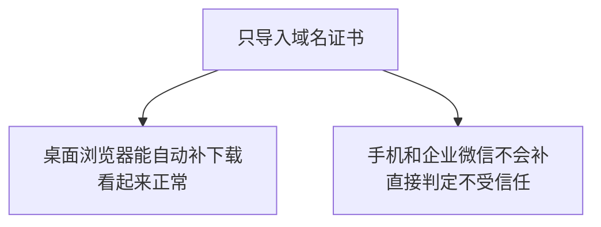

**所以桌面浏览器显示正常，不代表证书装对了。**

导入中间证书：

```powershell
Import-Certificate -FilePath "C:\certs\intermediate.crt" `
    -CertStoreLocation Cert:\LocalMachine\CA
```

`LocalMachine\CA` 对应「本地计算机 → 中间证书颁发机构」。

多数情况下 `.pfx` 里已经带了完整链，导入时会自动放好。**但一定要用 5.8 的方法验证，不要假设。**

## 5.6 绑定到 443 端口

先看当前站点名（现在还是默认站点）：

```powershell
Get-Website | Select-Object Name, ID, State, PhysicalPath
```

添加 HTTPS 绑定：

```powershell
# 取出证书对象
$cert = Get-ChildItem Cert:\LocalMachine\My |
    Where-Object { $_.Subject -like "*your-domain.com*" } |
    Select-Object -First 1

# 添加 443 绑定，SslFlags 1 表示启用 SNI
New-WebBinding -Name "Default Web Site" -Protocol https -Port 443 `
    -HostHeader "your-domain.com" -SslFlags 1

# 把证书绑到这个绑定上
$binding = Get-WebBinding -Name "Default Web Site" -Protocol https
$binding.AddSslCertificate($cert.Thumbprint, "My")
```

## 5.7 界面路径（这一步用界面可能更省事）

证书绑定是少数用界面更方便的操作：

```text
IIS 管理器 → 选中站点 → 右侧「绑定」
  → 添加
      类型：https
      IP 地址：全部未分配
      端口：443
      主机名：your-domain.com
      勾选「需要服务器名称指示」（即 SNI）
      SSL 证书：从下拉列表选择你导入的证书
  → 确定
```

## 5.8 关于 SNI 要不要勾

| 情况 | 是否需要 SNI |
|---|---|
| 这台服务器只有一个 HTTPS 站点 | 可不勾 |
| 一台服务器多个域名的 HTTPS 站点 | **必须勾** |

建议**一律勾上**。它让同一个 IP 上多个域名各用自己的证书，现在勾了以后加站点不用回头改。

## 5.9 验证证书（三重验证，都要做）

### 验证一：本机确认绑定

```powershell
Get-WebBinding | Select-Object protocol, bindingInformation

# 查看 SSL 绑定与证书指纹的对应关系
netsh http show sslcert | Select-String "IP:port", "Hostname:port", "Certificate Hash"
```

### 验证二：本机检查证书链

```powershell
# 导出证书再验证链，-urlfetch 会去下载缺失的中间证书做检查
certutil -verify -urlfetch "C:\certs\site.crt"
```

输出里找 `Verified Issuance Policies` 和最后的结论。**如果报「找不到证书链的颁发者」，说明中间证书缺失。**

### 验证三：外部检查（最重要）

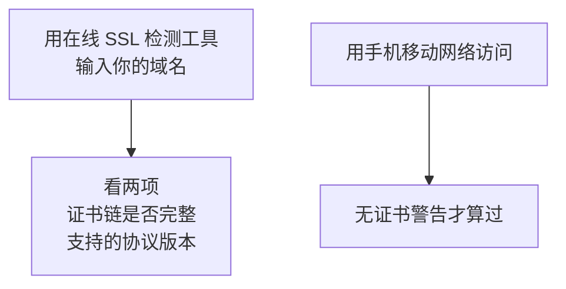

搜索「SSL 证书检测」能找到多个在线工具。重点看：

| 检查项 | 期望 |
|---|---|
| 证书链 | 完整，无 missing intermediate |
| 协议 | 支持 TLS 1.2 |
| 域名匹配 | 与证书 Subject 一致 |

然后用**手机移动网络**打开：

```text
https://your-domain.com/iistest.aspx
```

页面里的「访问协议」这一行应该显示 `https`。

## 5.10 记下过期时间并设提醒

```powershell
Get-ChildItem Cert:\LocalMachine\My |
    Where-Object { $_.Subject -like "*your-domain.com*" } |
    Select-Object Subject, NotAfter,
        @{Name="剩余天数"; Expression={($_.NotAfter - (Get-Date)).Days}}
```

**证书过期是一类典型的「突然全挂」故障**：某天早上所有员工都打不开应用，而代码一行没改。

建议现在就在日历上设两个提醒：到期前 30 天和 7 天。

## 5.11 关卡五

| 检查项 | 方法 | 期望 |
|---|---|---|
| 证书已导入且有私钥 | `Get-ChildItem Cert:\LocalMachine\My` | HasPrivateKey 为 True |
| 443 绑定存在 | `Get-WebBinding` | 有 https 绑定 |
| 证书链完整 | 在线检测工具 | 完整 |
| 手机能打开 https | 移动网络访问 | 无证书警告 |
| 页面显示 https | 看测试页「访问协议」 | https |
| 已记录过期时间并设提醒 | —— | 已完成 |

---

# 阶段六：TLS 协议配置

## 6.1 Server 2022 的默认状态

好消息是 Server 2022 的默认配置基本够用：

| 协议 | Server 2022 默认 | 企业微信要求 |
|---|---|---|
| TLS 1.3 | 支持 | 可用 |
| TLS 1.2 | 启用 | **必需** |
| TLS 1.1 | 启用但已弃用 | 建议关 |
| TLS 1.0 | 启用但已弃用 | 建议关 |
| SSL 3.0 及更早 | 禁用 | —— |

TLS 1.3 从 Windows 11 和 Windows Server 2022 开始支持，在更早的系统上启用它不是安全配置（[Schannel 支持的协议版本](https://learn.microsoft.com/tr-tr/windows/desktop/SecAuthN/protocols-in-tls-ssl--schannel-ssp-)。内容已改写以符合授权要求）。

**这也是本章只写 2022 的原因**：2016 和 2019 没有 TLS 1.3，且 TLS 1.2 的启用状态需要额外确认。

## 6.2 所以这一步做什么

Server 2022 上你**不需要为了让企业微信能用而改任何东西**。这一阶段做的是安全加固：关掉过时的协议。

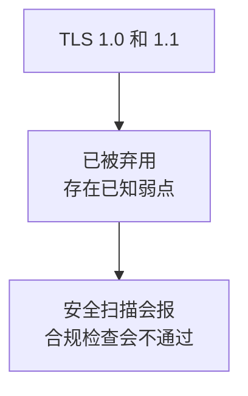

## 6.3 关闭旧协议

**改注册表前先看 6.5 的风险提示。**

```powershell
# 关闭 TLS 1.0 和 TLS 1.1 的服务端与客户端
$protocols = @('TLS 1.0', 'TLS 1.1')
$roles = @('Server', 'Client')
$base = 'HKLM:\SYSTEM\CurrentControlSet\Control\SecurityProviders\SCHANNEL\Protocols'

foreach ($p in $protocols) {
    foreach ($r in $roles) {
        $path = Join-Path $base "$p\$r"
        if (-not (Test-Path $path)) {
            New-Item -Path $path -Force | Out-Null
        }
        # Enabled 为 0 表示禁用
        New-ItemProperty -Path $path -Name 'Enabled' -Value 0 `
            -PropertyType DWord -Force | Out-Null
        # DisabledByDefault 为 1 表示默认不协商
        New-ItemProperty -Path $path -Name 'DisabledByDefault' -Value 1 `
            -PropertyType DWord -Force | Out-Null
    }
}

Write-Host "已写入注册表。必须重启服务器后生效。"
```

**两个键要一起写**：`Enabled` 控制能否使用，`DisabledByDefault` 控制是否默认参与协商。只写一个可能不生效。

## 6.4 显式启用 TLS 1.2

Server 2022 上 TLS 1.2 默认已启用。但显式写一遍能避免被其他配置或安全基线策略意外关掉：

```powershell
$base = 'HKLM:\SYSTEM\CurrentControlSet\Control\SecurityProviders\SCHANNEL\Protocols'

foreach ($r in @('Server', 'Client')) {
    $path = Join-Path $base "TLS 1.2\$r"
    if (-not (Test-Path $path)) { New-Item -Path $path -Force | Out-Null }
    New-ItemProperty -Path $path -Name 'Enabled' -Value 1 `
        -PropertyType DWord -Force | Out-Null
    New-ItemProperty -Path $path -Name 'DisabledByDefault' -Value 0 `
        -PropertyType DWord -Force | Out-Null
}
```

## 6.5 改注册表前必须知道的三件事

### 风险一：会影响这台机器上的所有程序

Schannel 是系统级的。关掉 TLS 1.0 后，**这台服务器上任何依赖 TLS 1.0 的程序都会连不上**。

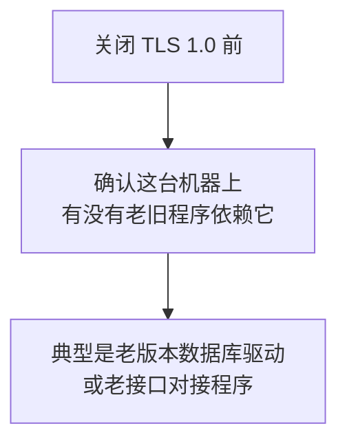

### 风险二：必须重启才生效

注册表改完不重启是不生效的。**不要在业务时间做这一步。**

### 风险三：远程桌面也走 TLS

RDP 使用 TLS，现代 Windows 支持 1.2，正常不受影响。但如果你是通过一个很老的客户端连接，**关掉旧协议后可能连不上服务器**。

稳妥做法：

| 措施 | 说明 |
|---|---|
| 先确认有带外访问方式 | 云控制台的 VNC 或串口 |
| 或先只关 TLS 1.0 | 观察一天再关 1.1 |
| 记录改动 | 出问题能快速回滚 |

## 6.6 回滚方法

把 `Enabled` 改回 1、`DisabledByDefault` 改回 0，重启即可：

```powershell
# 回滚：重新启用 TLS 1.0（应急用）
$path = 'HKLM:\SYSTEM\CurrentControlSet\Control\SecurityProviders\SCHANNEL\Protocols\TLS 1.0\Server'
Set-ItemProperty -Path $path -Name 'Enabled' -Value 1
Set-ItemProperty -Path $path -Name 'DisabledByDefault' -Value 0
```

**做改动前先把这段回滚命令存到记事本里**，出问题时不用现查。

## 6.7 .NET Framework 的出站 TLS

前面配的是**入站**（别人访问你）。还有**出站**（你调企业微信）。

第 6 章 V1 讲过要在 `Global.asax` 里设置 `ServicePointManager`。除此之外，还可以在系统层面让 .NET 默认使用强加密：

```powershell
# 让 .NET Framework 默认启用强加密（含 TLS 1.2）
$paths = @(
    'HKLM:\SOFTWARE\Microsoft\.NETFramework\v4.0.30319',
    'HKLM:\SOFTWARE\WOW6432Node\Microsoft\.NETFramework\v4.0.30319'
)
foreach ($p in $paths) {
    if (Test-Path $p) {
        New-ItemProperty -Path $p -Name 'SchUseStrongCrypto' -Value 1 `
            -PropertyType DWord -Force | Out-Null
        New-ItemProperty -Path $p -Name 'SystemDefaultTlsVersions' -Value 1 `
            -PropertyType DWord -Force | Out-Null
    }
}
```

.NET Framework 4.8 通常已经默认使用系统默认协议，但显式设置更稳妥。

**注意这不能替代代码里的 `ServicePointManager` 设置。**两个都做，互为保险。

## 6.8 重启并验证

```powershell
Restart-Computer -Confirm
```

重启后验证：

| 检查项 | 方法 | 期望 |
|---|---|---|
| 站点仍可访问 | 手机打开 https 页面 | 正常 |
| 协议版本 | 在线 SSL 检测工具 | TLS 1.2 支持，1.0/1.1 已关 |
| 远程桌面可用 | 重新连接服务器 | 能连上 |

## 6.9 关卡六

| 检查项 | 期望 |
|---|---|
| 已重启 | 是 |
| 手机仍能正常打开页面 | 是 |
| 在线检测显示支持 TLS 1.2 | 是 |
| 远程桌面正常 | 是 |
| 回滚命令已保存 | 是 |

---

# 阶段七：HTTP 强制跳转 HTTPS

## 7.1 为什么需要

员工可能通过旧链接、书签或手工输入访问 `http`。而企业微信的功能都要求 `https`。

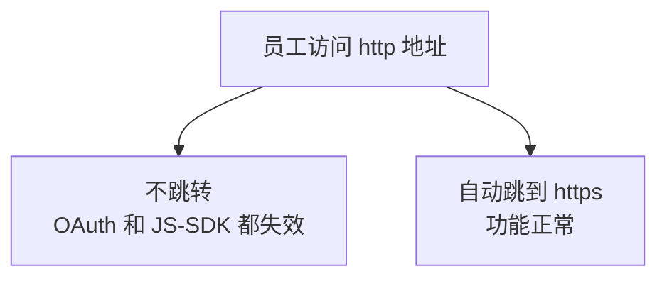

## 7.2 两种实现方式

| 方式 | 优点 | 缺点 |
|---|---|---|
| URL Rewrite 模块 | 在 IIS 层完成，效率高 | 需额外安装模块 |
| 代码里判断跳转 | 不装模块 | 请求已进入应用才跳转 |

第 7 章 V2 给的是第二种（`Global.asax` 里判断）。这里给第一种，两者选一即可。**如果你已经用了代码方案，这一阶段可以跳过。**

## 7.3 安装 URL Rewrite 模块

**这个模块不是 IIS 自带的**，需要单独下载安装。

从微软 IIS 官网下载「URL Rewrite」（当前是 2.1 版），双击安装。

验证：

```powershell
# 检查模块是否已注册
Get-WebGlobalModule | Where-Object { $_.Name -like "*Rewrite*" } |
    Select-Object Name, Image
```

也可以在 IIS 管理器里看：选中服务器节点，功能视图里应该出现「URL 重写」图标。

## 7.4 配置规则

在站点根目录的 `Web.config` 里加规则：

```xml
<?xml version="1.0" encoding="utf-8"?>
<configuration>
  <system.webServer>
    <rewrite>
      <rules>
        <!-- 域名归属校验文件必须允许 http 访问，放在最前面并 stopProcessing -->
        <rule name="Allow WeCom Verify File" stopProcessing="true">
          <match url="^WW_verify_.*\.txt$" />
          <action type="None" />
        </rule>

        <!-- 其余 http 请求全部跳转到 https -->
        <rule name="Redirect to HTTPS" stopProcessing="true">
          <match url="(.*)" />
          <conditions>
            <add input="{HTTPS}" pattern="^OFF$" />
          </conditions>
          <action type="Redirect" url="https://{HTTP_HOST}/{R:1}"
                  redirectType="Permanent" />
        </rule>
      </rules>
    </rewrite>
  </system.webServer>
</configuration>
```

## 7.5 三个要点

### 校验文件的规则必须放在前面

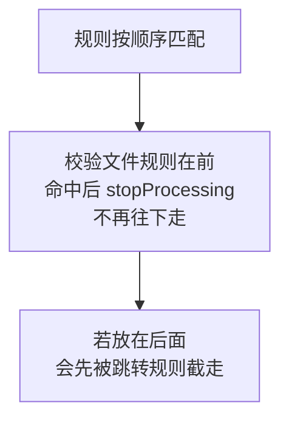

第 7 章 V4 列过校验文件返回 302 的情况，根因就是被跳转规则拦了。**现在就把放行规则写好，能避免那一类问题。**

### `redirectType` 用 Permanent 还是 Found

| 值 | HTTP 状态码 | 含义 |
|---|---|---|
| `Permanent` | 301 | 永久重定向，浏览器会缓存 |
| `Found` | 302 | 临时重定向，不缓存 |

**调试阶段建议先用 `Found`（302）。**因为 301 会被浏览器长期缓存，配错了很难清掉，尤其在手机上。确认无误后再改成 `Permanent`。

### `{R:1}` 是什么

它代表 `match url="(.*)"` 里括号捕获到的内容，也就是原始路径。这样跳转后能保持在同一个页面，而不是回到首页。

## 7.6 验证

在**你自己的电脑**上执行，看返回的状态码和跳转目标：

```powershell
$r = Invoke-WebRequest -Uri "http://your-domain.com/iistest.aspx" `
    -MaximumRedirection 0 -SkipHttpErrorCheck -UseBasicParsing
$r.StatusCode
$r.Headers.Location
```

期望：

| 项 | 期望值 |
|---|---|
| `StatusCode` | 301 或 302 |
| `Location` | `https://your-domain.com/iistest.aspx` |

注意 `Location` 里的路径要和请求一致。如果跳到了首页，说明 `{R:1}` 没写对。

## 7.7 关卡七

| 检查项 | 期望 |
|---|---|
| URL Rewrite 模块已装 | `Get-WebGlobalModule` 能查到 |
| http 请求返回 301 或 302 | 是 |
| 跳转后路径保持不变 | 是 |
| 校验文件路径不被跳转 | 用 `http` 访问一个 `WW_verify_*.txt` 不返回 302 |

最后一项现在还没有真实的校验文件，可以先建一个空文件测试：

```powershell
"test" | Out-File "C:\inetpub\wwwroot\WW_verify_test.txt" -Encoding ASCII
```

测完记得删掉。


---

# 阶段八：生产站点、应用程序池与权限

## 8.1 为什么不继续用默认站点

前面为了快速验证一直用默认站点。生产环境应该单独建：

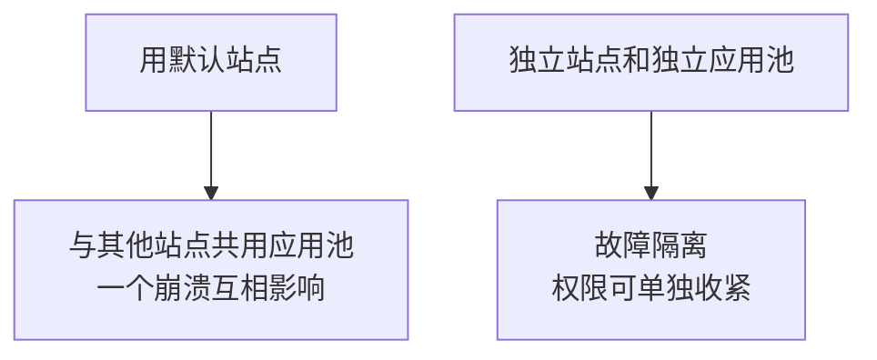

## 8.2 目录结构

```powershell
# 站点目录
New-Item -Path "C:\WeComWeb" -ItemType Directory -Force
# 日志目录，应用要能写
New-Item -Path "C:\WeComWeb\logs" -ItemType Directory -Force
# 机密配置目录（不放在站点目录下，避免被 Web 访问）
New-Item -Path "C:\WeComSecrets" -ItemType Directory -Force
```

**机密文件放在站点目录之外**是有意的：即使某天 IIS 配置出错把 `.config` 当静态文件返回，也读不到它。

## 8.3 创建应用程序池

```powershell
Import-Module WebAdministration

New-WebAppPool -Name "WeComAppPool" -Force

# CLR v4.0，WebForms 必需
Set-ItemProperty "IIS:\AppPools\WeComAppPool" -Name managedRuntimeVersion -Value "v4.0"
# 集成管道模式
Set-ItemProperty "IIS:\AppPools\WeComAppPool" -Name managedPipelineMode -Value "Integrated"
# 64 位运行
Set-ItemProperty "IIS:\AppPools\WeComAppPool" -Name enable32BitAppOnWin64 -Value $false
# 使用最小权限的内置标识
Set-ItemProperty "IIS:\AppPools\WeComAppPool" -Name processModel.identityType -Value "ApplicationPoolIdentity"
```

## 8.4 调整回收策略

第 8 章 V7 和第 12 章讲过默认策略导致 Session 频繁丢失。这里给命令：

```powershell
# 空闲超时设为 0：无人访问也不关闭进程
Set-ItemProperty "IIS:\AppPools\WeComAppPool" `
    -Name processModel.idleTimeout -Value ([TimeSpan]::Zero)

# 关掉按时长的定期回收（默认 1740 分钟，即 29 小时，时间不固定）
Set-ItemProperty "IIS:\AppPools\WeComAppPool" `
    -Name recycling.periodicRestart.time -Value ([TimeSpan]::Zero)

# 改成每天凌晨 3 点固定回收
Clear-ItemProperty "IIS:\AppPools\WeComAppPool" `
    -Name recycling.periodicRestart.schedule -ErrorAction SilentlyContinue
New-ItemProperty "IIS:\AppPools\WeComAppPool" `
    -Name recycling.periodicRestart.schedule -Value @{value="03:00:00"}
```

### 为什么这样改

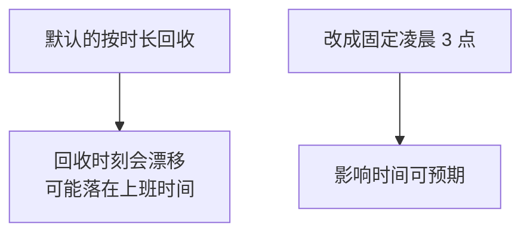

**回收本身不是坏事**，它能释放泄漏的内存。要控制的是「什么时候发生」。

## 8.5 创建站点

```powershell
New-Website -Name "WeComWeb" `
    -PhysicalPath "C:\WeComWeb" `
    -ApplicationPool "WeComAppPool" `
    -Port 80 -HostHeader "your-domain.com" -Force

# 加 443 绑定
$cert = Get-ChildItem Cert:\LocalMachine\My |
    Where-Object { $_.Subject -like "*your-domain.com*" } | Select-Object -First 1

New-WebBinding -Name "WeComWeb" -Protocol https -Port 443 `
    -HostHeader "your-domain.com" -SslFlags 1

$b = Get-WebBinding -Name "WeComWeb" -Protocol https
$b.AddSslCertificate($cert.Thumbprint, "My")
```

### 注意与默认站点的端口冲突

默认站点也占着 80 端口。两种处理：

| 做法 | 命令 |
|---|---|
| 停掉默认站点（推荐） | `Stop-Website -Name "Default Web Site"` |
| 保留但让它只响应特定主机名 | 给它加 `-HostHeader` |

因为你的新站点绑了主机名，理论上可以共存。但**为了避免混淆，建议停掉默认站点**。

```powershell
Stop-Website -Name "Default Web Site"
Set-ItemProperty "IIS:\Sites\Default Web Site" -Name serverAutoStart -Value $false
```

## 8.6 配置目录权限

先确认应用池标识的名字。它的形式是 `IIS AppPool\应用池名`：

```powershell
# 站点目录：只给读取和执行
icacls "C:\WeComWeb" /grant "IIS AppPool\WeComAppPool:(OI)(CI)(RX)"

# 日志目录：需要写入
icacls "C:\WeComWeb\logs" /grant "IIS AppPool\WeComAppPool:(OI)(CI)(M)"

# 机密目录：只给读取，且只给这个标识
icacls "C:\WeComSecrets" /grant "IIS AppPool\WeComAppPool:(OI)(CI)(R)"
# 移除普通用户组的访问权限
icacls "C:\WeComSecrets" /remove "Users" "Authenticated Users"
```

### 权限标记的含义

| 标记 | 含义 |
|---|---|
| `(OI)` | 对象继承，文件继承此权限 |
| `(CI)` | 容器继承，子目录继承此权限 |
| `R` | 只读 |
| `RX` | 读取和执行 |
| `M` | 修改（含写入和删除） |

### 为什么站点根目录不给写权限

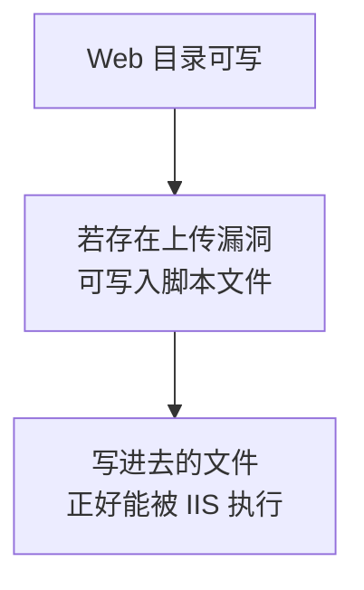

这是一条通用的加固原则：**可执行的目录不可写，可写的目录不可执行。**日志目录虽然可写，但里面是 `.log`，IIS 不会执行它。

## 8.7 机密配置分离

第 12 章讲过用 `configSource` 引用外部文件。把机密放到站点外：

`C:\WeComSecrets\secrets.config`：

```xml
<?xml version="1.0" encoding="utf-8"?>
<appSettings>
  <add key="WeCom.CorpId" value="你的企业ID" />
  <add key="WeCom.AgentId" value="1000002" />
  <add key="WeCom.AppSecret" value="你的应用Secret" />
  <add key="WeCom.ContactsSecret" value="你的通讯录Secret" />
  <add key="WeCom.BaseUrl" value="https://qyapi.weixin.qq.com/cgi-bin" />
  <add key="Callback.Token" value="你的回调Token" />
  <add key="Callback.AesKey" value="你的EncodingAESKey" />
</appSettings>
```

站点的 `Web.config` 里引用它：

```xml
<appSettings configSource="..\WeComSecrets\secrets.config" />
```

### 一个限制要知道

`configSource` 的路径**必须在应用目录之下或其相对路径可达**，而且 ASP.NET 对跨目录引用有限制。如果这条路走不通，退回到把 `secrets.config` 放在站点目录内，但用 IIS 请求筛选禁止访问：

```xml
<system.webServer>
  <security>
    <requestFiltering>
      <hiddenSegments>
        <add segment="secrets.config" />
      </hiddenSegments>
    </requestFiltering>
  </security>
</system.webServer>
```

实际上 IIS 默认就禁止访问 `.config` 文件，这一条是双重保险。

## 8.8 部署应用文件

从开发机发布后，把发布输出复制到 `C:\WeComWeb`。

```powershell
# 示例：从共享目录复制
Copy-Item -Path "\\devmachine\publish\*" -Destination "C:\WeComWeb" -Recurse -Force

# 复制完重新授权（新文件可能没继承权限）
icacls "C:\WeComWeb" /grant "IIS AppPool\WeComAppPool:(OI)(CI)(RX)" /T
```

**复制新文件后要重新执行 `icacls`**，参数 `/T` 表示递归应用到所有子项。这一步经常漏，表现是新加的页面报 403 或 500.19。

## 8.9 验证站点

```powershell
# 站点和应用池状态
Get-Website -Name "WeComWeb" | Select-Object Name, State, PhysicalPath
Get-WebAppPoolState -Name "WeComAppPool"

# 应用池关键配置复核
Get-ItemProperty "IIS:\AppPools\WeComAppPool" |
    Select-Object managedRuntimeVersion, managedPipelineMode,
        @{n='identity';e={$_.processModel.identityType}},
        @{n='idleTimeout';e={$_.processModel.idleTimeout}}
```

期望：

| 项 | 期望值 |
|---|---|
| 站点 State | Started |
| 应用池 State | Started |
| managedRuntimeVersion | v4.0 |
| managedPipelineMode | Integrated |
| identity | ApplicationPoolIdentity |
| idleTimeout | 00:00:00 |

## 8.10 关卡八

| 检查项 | 期望 |
|---|---|
| 站点与应用池都是 Started | 是 |
| 应用池 CLR 为 v4.0、集成模式 | 是 |
| 空闲超时为 0，固定凌晨回收 | 是 |
| 站点根目录无写权限 | 是 |
| 日志目录可写 | 是 |
| 手机能通过域名打开站点页面 | 是 |

---

# 阶段九：企业微信侧配置与诊断页

## 9.1 服务器侧要为企业微信做的三件事

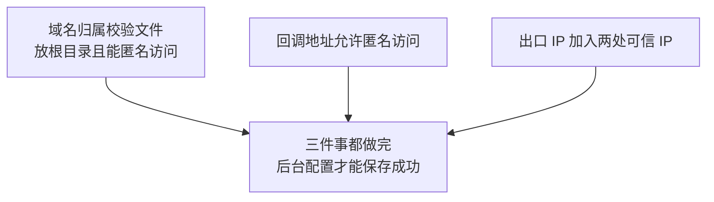

## 9.2 域名校验文件

从企业微信后台下载校验文件后：

```powershell
# 放到站点物理根目录
Copy-Item "C:\downloads\WW_verify_xxxxxxxx.txt" -Destination "C:\WeComWeb\"

# 确认能访问
Invoke-WebRequest -Uri "https://your-domain.com/WW_verify_xxxxxxxx.txt" `
    -UseBasicParsing | Select-Object StatusCode, Content
```

第 7 章 V4 列了 404 的六种原因。**在服务器上最常见的是权限**：复制进去的新文件没有继承权限，重新执行 `icacls` 即可。

## 9.3 回调地址匿名访问

第 11 章的 `CallbackHandler.ashx` 由企业微信服务器访问，没有员工登录状态。如果站点有全局登录拦截，要放行：

```xml
<location path="CallbackHandler.ashx">
  <system.web>
    <authorization>
      <allow users="*" />
    </authorization>
  </system.web>
</location>
```

## 9.4 可信 IP 两处都要配

第 1 章强调过，这里再列一次位置：

| 用哪个 Secret | 配置位置 |
|---|---|
| 应用 Secret | 应用详情页 → 开发者接口 → 企业可信 IP |
| 通讯录 Secret | 安全与管理 → 管理工具 → 通讯录同步 → 可信 IP |

## 9.5 诊断页：一个页面定位大部分搭建问题

把阶段三的测试页升级成完整诊断页。它把前面八个阶段的关键指标集中显示。

`C:\WeComWeb\Diag.aspx`：

```aspx
<%@ Page Language="C#" Async="true" AutoEventWireup="true" %>
<%@ Import Namespace="System.Net" %>
<%@ Import Namespace="System.Net.Http" %>
<%@ Import Namespace="System.Configuration" %>
<%@ Import Namespace="System.Threading.Tasks" %>
<!DOCTYPE html>
<html>
<head runat="server">
    <meta charset="utf-8" />
    <meta name="viewport" content="width=device-width, initial-scale=1" />
    <title>搭建诊断</title>
    <style>
        body { font-family: Consolas, monospace; font-size: 14px; padding: 10px; }
        table { border-collapse: collapse; width: 100%; max-width: 800px; }
        td, th { border: 1px solid #ccc; padding: 6px; word-break: break-all; }
        th { background: #f0f0f0; text-align: left; width: 36%; }
        .ok { color: #0a0; font-weight: bold; }
        .bad { color: #c00; font-weight: bold; }
    </style>
</head>
<body>
<form id="f" runat="server">
    <h3>搭建诊断</h3>
    <asp:Literal ID="litInfo" runat="server" />
    <p>
        <asp:Button ID="btnToken" runat="server" Text="测试取 token"
                    OnClick="btnToken_Click" />
        <asp:Button ID="btnIp" runat="server" Text="检测出口 IP"
                    OnClick="btnIp_Click" />
    </p>
    <asp:Literal ID="litResult" runat="server" />
</form>

<script runat="server">
    // 复用整个应用共享一个 HttpClient，避免端口耗尽（第 6 章 V1）
    private static readonly HttpClient Client = new HttpClient
    {
        Timeout = TimeSpan.FromSeconds(15)
    };

    protected void Page_Load(object sender, EventArgs e)
    {
        Response.Cache.SetCacheability(HttpCacheability.NoCache);
        if (!IsPostBack) { ShowInfo(); }
    }

    private void ShowInfo()
    {
        var sb = new System.Text.StringBuilder();
        sb.Append("<table>");

        // 阶段一：时间
        Row(sb, "服务器本地时间", DateTime.Now.ToString("yyyy-MM-dd HH:mm:ss"));
        Row(sb, "服务器 UTC 时间", DateTime.UtcNow.ToString("yyyy-MM-dd HH:mm:ss"));
        Row(sb, "时区", TimeZoneInfo.Local.DisplayName);
        Row(sb, "请对照手机时间", "偏差应在几秒内，否则签名和回调会失败");

        // 阶段二：运行环境
        Row(sb, "CLR 版本", Environment.Version.ToString());
        Row(sb, "64 位进程", Environment.Is64BitProcess.ToString());
        Row(sb, "应用池标识",
            System.Security.Principal.WindowsIdentity.GetCurrent().Name);

        // 阶段五到七：协议与地址
        bool isHttps = Request.IsSecureConnection;
        Row(sb, "IsSecureConnection", Mark(isHttps, isHttps ? "https" : "http，检查跳转"));
        Row(sb, "Request.Url.Scheme", Request.Url.Scheme);
        Row(sb, "X-Forwarded-Proto",
            Request.Headers["X-Forwarded-Proto"] ?? "(无，说明没走反向代理)");
        Row(sb, "主机名", Request.Url.Host);
        Row(sb, "RawUrl", Request.RawUrl);

        // 第 9 章签名要用的地址，务必与手机地址栏一致
        string scheme = Request.Headers["X-Forwarded-Proto"];
        if (string.IsNullOrEmpty(scheme))
        {
            scheme = Request.IsSecureConnection ? "https" : "http";
        }
        string publicUrl = scheme + "://" + Request.Url.Host + Request.RawUrl;
        int hash = publicUrl.IndexOf('#');
        if (hash >= 0) { publicUrl = publicUrl.Substring(0, hash); }
        Row(sb, "JS-SDK 签名用地址", publicUrl + "<br/><small>必须与地址栏完全一致</small>");

        Row(sb, "客户端 IP", Request.UserHostAddress);
        Row(sb, "X-Forwarded-For", Request.Headers["X-Forwarded-For"] ?? "(无)");
        Row(sb, "UserAgent", Request.UserAgent);

        // 是否在企业微信内打开（第 7 章 V6）
        string ua = (Request.UserAgent ?? "").ToLowerInvariant();
        bool inWeCom = ua.Contains("wxwork");
        Row(sb, "是否企业微信内打开",
            Mark(inWeCom, inWeCom ? "是" : "否，OAuth 和 JS-SDK 不可用"));

        // 配置项是否读到（只显示是否配置，不显示值）
        Row(sb, "CorpId", ConfigValue("WeCom.CorpId", false));
        Row(sb, "AgentId", ConfigValue("WeCom.AgentId", false));
        Row(sb, "AppSecret", ConfigValue("WeCom.AppSecret", true));
        Row(sb, "ContactsSecret", ConfigValue("WeCom.ContactsSecret", true));
        Row(sb, "Callback.Token", ConfigValue("Callback.Token", true));
        Row(sb, "Callback.AesKey", ConfigValue("Callback.AesKey", true));

        sb.Append("</table>");
        litInfo.Text = sb.ToString();
    }

    /// <summary>读取配置。机密项只显示是否已配置和长度，绝不显示内容。</summary>
    private string ConfigValue(string key, bool secret)
    {
        string v = ConfigurationManager.AppSettings[key];
        if (string.IsNullOrEmpty(v))
        {
            return Mark(false, "未配置");
        }
        return secret
            ? Mark(true, string.Format("已配置（长度 {0}）", v.Length))
            : Server.HtmlEncode(v);
    }

    private string Mark(bool ok, string text)
    {
        return string.Format("<span class='{0}'>{1}</span>",
            ok ? "ok" : "bad", Server.HtmlEncode(text));
    }

    private void Row(System.Text.StringBuilder sb, string k, string v)
    {
        sb.AppendFormat("<tr><th>{0}</th><td>{1}</td></tr>",
            Server.HtmlEncode(k), v);
    }

    // ---------- 测试取 token ----------
    protected void btnToken_Click(object sender, EventArgs e)
    {
        RegisterAsyncTask(new PageAsyncTask(TestTokenAsync));
    }

    private async Task TestTokenAsync()
    {
        var sb = new System.Text.StringBuilder("<h4>取 token 测试</h4><table>");

        foreach (string key in new[] { "WeCom.AppSecret", "WeCom.ContactsSecret" })
        {
            string label = key == "WeCom.AppSecret" ? "应用 Secret" : "通讯录 Secret";
            string secret = ConfigurationManager.AppSettings[key];

            if (string.IsNullOrEmpty(secret))
            {
                Row(sb, label, Mark(false, "未配置，跳过"));
                continue;
            }

            try
            {
                string url = string.Format("{0}/gettoken?corpid={1}&corpsecret={2}",
                    ConfigurationManager.AppSettings["WeCom.BaseUrl"],
                    ConfigurationManager.AppSettings["WeCom.CorpId"], secret);

                string json = await Client.GetStringAsync(url);
                var obj = Newtonsoft.Json.Linq.JObject.Parse(json);
                int code = obj.Value<int>("errcode");

                if (code == 0)
                {
                    string t = obj.Value<string>("access_token");
                    // token 脱敏，只留首尾（第 2 章 V12）
                    Row(sb, label, Mark(true, string.Format(
                        "成功，有效期 {0} 秒，token {1}...{2}",
                        obj.Value<int>("expires_in"),
                        t.Substring(0, 6), t.Substring(t.Length - 4))));
                }
                else
                {
                    string hint = code == 60020
                        ? "IP 不在白名单。错误信息里 from ip 就是要添加的 IP"
                        : (code == 40001 ? "Secret 不正确" : "");
                    Row(sb, label, Mark(false, string.Format(
                        "errcode={0} {1} {2}", code,
                        obj.Value<string>("errmsg"), hint)));
                }
            }
            catch (Exception ex)
            {
                // 出站 TLS 未配好时会走到这里
                Row(sb, label, Mark(false,
                    "请求异常：" + ex.Message + "（若提示连接关闭，检查出站 TLS 1.2）"));
            }
        }

        sb.Append("</table>");
        litResult.Text = sb.ToString();
    }

    // ---------- 检测出口 IP ----------
    protected void btnIp_Click(object sender, EventArgs e)
    {
        RegisterAsyncTask(new PageAsyncTask(TestIpAsync));
    }

    private async Task TestIpAsync()
    {
        try
        {
            string ip = await Client.GetStringAsync("https://api.ipify.org");
            litResult.Text = string.Format(
                "<h4>出口 IP</h4><p>{0}</p>"
                + "<p>把它加入企业微信两处可信 IP。若与 60020 错误里的 from ip "
                + "不一致，以后者为准。</p>", Server.HtmlEncode(ip.Trim()));
        }
        catch (Exception ex)
        {
            litResult.Text = "<p class='bad'>检测失败："
                + Server.HtmlEncode(ex.Message)
                + "。可改用 60020 错误信息里的 from ip。</p>";
        }
    }
</script>
</body>
</html>
```

## 9.6 这个页面能定位哪些问题

| 显示项 | 对应哪个阶段的问题 |
|---|---|
| 时间偏差 | 阶段一，会导致签名和回调失败 |
| CLR 版本、64 位 | 阶段二，应用池配置 |
| 应用池标识 | 阶段八，目录权限该给谁 |
| IsSecureConnection | 阶段五到七，HTTPS 与跳转 |
| JS-SDK 签名用地址 | 第 9 章，与地址栏比对 |
| 是否企业微信内打开 | 第 7、8 章功能可用性 |
| 配置项是否读到 | 阶段八的 `configSource` 是否生效 |
| 取 token 结果 | 出站 TLS、Secret、可信 IP |

**一个页面覆盖了八个阶段的关键指标。**遇到问题先打开它，能立刻缩小范围。

## 9.7 单文件页面的说明

这个诊断页把代码写在 `.aspx` 里（用 `<script runat="server">`），不需要编译，**直接复制到服务器就能用**。这是为了让你在服务器上快速验证，不用来回发布。

它依赖 `Newtonsoft.Json`。如果站点的 `bin` 目录里还没有这个库，把取 token 的部分注释掉即可，其余信息照样显示。

## 9.8 上线前必须处理

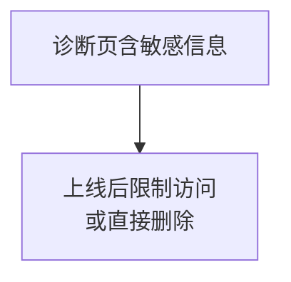

虽然代码里机密项只显示长度不显示内容，但它暴露了服务器时间、路径、UA 等信息。**上线后应该加上第 8 章的角色限制，或者直接删掉。**

## 9.9 关卡九

| 检查项 | 期望 |
|---|---|
| 域名校验文件能通过 https 访问 | 返回 200 |
| 后台可信域名保存成功 | 是 |
| 诊断页时间与手机一致 | 偏差几秒内 |
| 诊断页显示 IsSecureConnection 为 https | 是 |
| 取 token 测试两个 Secret 都成功 | 是 |
| 出口 IP 已加入两处可信 IP | 是 |
| 手机企业微信工作台能点开应用 | 是 |
| 诊断页里「是否企业微信内打开」为是 | 是 |

**取 token 成功这一关最关键。**它一次性验证了出站 TLS、Secret 配置、可信 IP 三件事。

---

# 阶段十：IIS 错误码排查

## 10.1 先分清是谁在报错

```mermaid
graph TB
    A["看到错误页"] --> B["IIS 层错误<br/>形如 500.19 404.17<br/>带小数点"]
    A --> C["应用层错误<br/>ASP.NET 黄页<br/>或你的自定义错误页"]
```

**带小数点的错误码是 IIS 报的**，说明请求还没进入你的代码。这时查配置和权限，不用看业务逻辑。

## 10.2 IIS 常见错误码

| 错误码 | 含义 | 首先检查 |
|---|---|---|
| **500.19** | 配置数据无效 | `Web.config` 语法、`configSource` 路径、目录权限 |
| **500.21** | 处理程序模块错误 | ASP.NET 未注册，执行 `aspnet_regiis -i` |
| **404.17** | 静态处理程序处理了动态请求 | 同上，ASP.NET 未挂上 |
| 500.24 | 集成模式下模拟用户 | `Web.config` 里的 `identity impersonate` |
| 403.4 | 需要 SSL | 站点要求 SSL 但用 http 访问 |
| 403.14 | 目录浏览被拒 | 缺少默认文档 |
| 401.3 | 权限不足 | 应用池标识对目录无读取权限 |
| 502.5 | 进程失败 | 主要出现在 ASP.NET Core，本章场景少见 |
| 503 | 服务不可用 | **应用池已停止**，见 10.4 |

## 10.3 三个最常见的详解

### 500.19：看清具体原因

这个错误码下面通常还有更详细的说明，要看清楚：

| 附加信息 | 原因 |
|---|---|
| 无法读取配置文件 | 应用池标识对目录无读权限 |
| 配置节被锁定 | 该节在服务器级别被锁，需解锁或移除 |
| 无法识别的属性 | `Web.config` 里有当前 IIS 不认识的配置 |
| 找不到 `configSource` 指向的文件 | 阶段八的机密文件路径不对 |

解锁配置节的命令（谨慎使用）：

```powershell
# 例如解锁 handlers 节
& "$env:windir\system32\inetsrv\appcmd.exe" unlock config `
    -section:system.webServer/handlers
```

### 500.21 与 404.17：同一个根因

两者都指向 **ASP.NET 没有正确注册**。

```mermaid
graph TB
    A["IIS 不知道 aspx 交给谁处理"] --> B["按静态文件处理<br/>报 404.17"]
    A --> C["或处理程序映射损坏<br/>报 500.21"]
```

处理：

```powershell
# 确认功能已装
Get-WindowsFeature -Name Web-Asp-Net45, Web-ISAPI-Ext | Select Name, InstallState

# 重新注册
& "$env:windir\Microsoft.NET\Framework64\v4.0.30319\aspnet_regiis.exe" -i

# 重启 IIS
iisreset
```

### 503：应用池停了

应用池连续崩溃会被 IIS 自动停用，这叫快速故障保护。

```powershell
# 查看应用池状态
Get-WebAppPoolState -Name "WeComAppPool"

# 手工启动
Start-WebAppPool -Name "WeComAppPool"
```

**但直接启动只是治标。**要查它为什么崩，看事件查看器：

```powershell
Get-WinEvent -LogName Application -MaxEvents 30 |
    Where-Object { $_.ProviderName -like "*ASP.NET*" -or $_.Id -eq 5011 } |
    Select-Object TimeCreated, Id, Message | Format-List
```

## 10.4 三个必备的排查工具

### 工具一：IIS 访问日志

```powershell
# 日志默认位置
Get-ChildItem "C:\inetpub\logs\LogFiles" -Recurse -Filter "*.log" |
    Sort-Object LastWriteTime -Descending | Select-Object -First 3 FullName

# 看最近 20 条
Get-Content "C:\inetpub\logs\LogFiles\W3SVC2\u_exXXXXXX.log" -Tail 20
```

日志里的 `sc-status` 和 `sc-substatus` 两列合起来就是错误码，例如 `500` 和 `19` 就是 500.19。

### 工具二：事件查看器

```powershell
# 系统日志里的 IIS 相关事件
Get-WinEvent -LogName System -MaxEvents 50 |
    Where-Object { $_.ProviderName -like "*IIS*" -or $_.ProviderName -like "*WAS*" } |
    Select-Object TimeCreated, ProviderName, Id, LevelDisplayName
```

### 工具三：失败请求跟踪

这是 IIS 最强的排查工具，能记录请求在管道里每一步的详情。

```powershell
# 先确认功能已装
Get-WindowsFeature -Name Web-Http-Tracing | Select Name, InstallState
# 未装则安装
Install-WindowsFeature -Name Web-Http-Tracing
```

启用后在 IIS 管理器里配置规则（选中站点 → 失败请求跟踪规则），指定要抓的状态码。它会生成 XML 文件，用浏览器打开可以看到完整的处理链路。

**这个工具适合处理「偶发」和「没有明显错误信息」的问题。**平时不用开，开着会有性能开销。

## 10.5 排查决策树

```mermaid
graph TB
    A["页面打不开"] --> B["错误码带小数点吗"]
    B --> C["带：IIS 层问题<br/>查 10.2 表格"]
    B --> D["不带：进了应用<br/>查应用日志"]
```

```mermaid
graph TB
    A["完全没有响应"] --> B["本机 localhost 能开吗"]
    B --> C["能：外网链路问题<br/>回阶段四"]
    B --> D["不能：IIS 或应用池<br/>查 503 和事件日志"]
```

## 10.6 一个通用建议

```mermaid
graph TB
    A["排查时"] --> B["一次只改一个地方<br/>改完立刻验证"]
    B --> C["同时改多处<br/>无法判断是哪个修好的"]
```

搭建阶段尤其如此。**每改一处就用诊断页确认一次**，比一次改五处然后困惑「到底哪个起作用」高效得多。

---

# 本章验收清单

按顺序逐项确认，全部通过才算搭建完成：

## 阶段一到三：基础

| 项 | 检查 |
|---|---|
| 1 | 系统为 Windows Server 2022 |
| 2 | 时间已同步，与标准时间偏差几秒内 |
| 3 | 防火墙放行 80 和 443 |
| 4 | 已记录公网出口 IP |
| 5 | IIS 三个关键功能已装 |
| 6 | .NET Framework Release ≥ 528040 |
| 7 | `iistest.aspx` 能执行而非下载 |

## 阶段四到七：网络与加密

| 项 | 检查 |
|---|---|
| 8 | 域名解析指向服务器公网 IP |
| 9 | 手机移动网络能访问 http 页面 |
| 10 | 证书已导入且 HasPrivateKey 为 True |
| 11 | 中间证书已导入，在线检测显示链完整 |
| 12 | 手机访问 https 无证书警告 |
| 13 | 已记录证书过期时间并设提醒 |
| 14 | TLS 1.0/1.1 已关闭，1.2 可用 |
| 15 | 已重启并确认站点和远程桌面正常 |
| 16 | http 访问自动跳转 https 且路径保持 |
| 17 | 校验文件路径不被跳转规则拦截 |

## 阶段八到九：生产化与对接

| 项 | 检查 |
|---|---|
| 18 | 独立站点和独立应用池，均为 Started |
| 19 | 应用池 CLR v4.0、集成模式、内置标识 |
| 20 | 空闲超时 0，固定凌晨回收 |
| 21 | 站点根目录无写权限，日志目录可写 |
| 22 | 机密配置在站点目录之外且权限已收紧 |
| 23 | 域名校验文件可访问，后台保存成功 |
| 24 | 回调地址允许匿名访问 |
| 25 | 出口 IP 已加入两处可信 IP |
| 26 | 诊断页取 token 两个 Secret 都成功 |
| 27 | 手机企业微信工作台能点开应用 |
| 28 | 诊断页显示已在企业微信内打开 |
| 29 | 诊断页已限制访问或已删除 |

**第 26 项是整章最重要的一关**：它同时验证了出站 TLS、Secret 配置和可信 IP 三件事。

---

# 与其他章节的关系

| 本章内容 | 对应章节的原理说明 |
|---|---|
| 时间同步 | 第 9 章签名、第 11 章回调容差 |
| IIS 功能勾选 | 第 7 章 V1 |
| 证书链完整性 | 第 7 章 V3 |
| 域名校验文件 | 第 7 章 V4 |
| HTTP 跳转与校验文件放行 | 第 7 章 V2、V4 |
| 反向代理协议识别 | 第 7 章 V8 |
| 出站 TLS 1.2 | 第 6 章 V1 |
| 应用池回收与 Session | 第 8 章 V7 |
| 机密配置分离 | 第 12 章阶段一 |
| 可信 IP 两处 | 第 1 章 |

**本章是操作步骤，原理都在对应章节。**遇到不理解「为什么要这样做」时，去查上表指向的位置。

# 下一步

搭建完成后：

```mermaid
graph TB
    A["本章：服务器已就绪"] --> B["第 7 章<br/>应用主页与可信域名配置"]
    B --> C["第 8 到 11 章<br/>免登录 JS-SDK 定位 回调"]
```

第 7 章的很多验证步骤本章已经做过，可以快速过一遍，重点看那些讲原理的小节。

# 免责说明

本章命令均针对 Windows Server 2022 和 IIS 10.0。修改注册表和防火墙会影响整台服务器，**建议先在测试机上完整走一遍**，确认无误后再在生产服务器执行。涉及 TLS 协议关闭的操作请务必先阅读阶段六的风险提示，并准备好带外访问方式。
