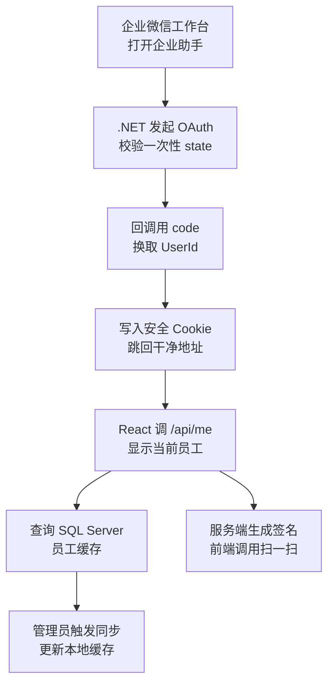
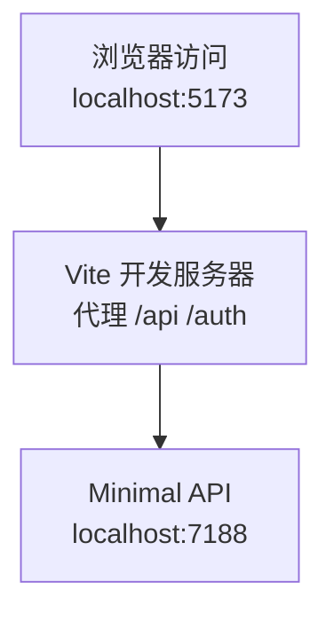
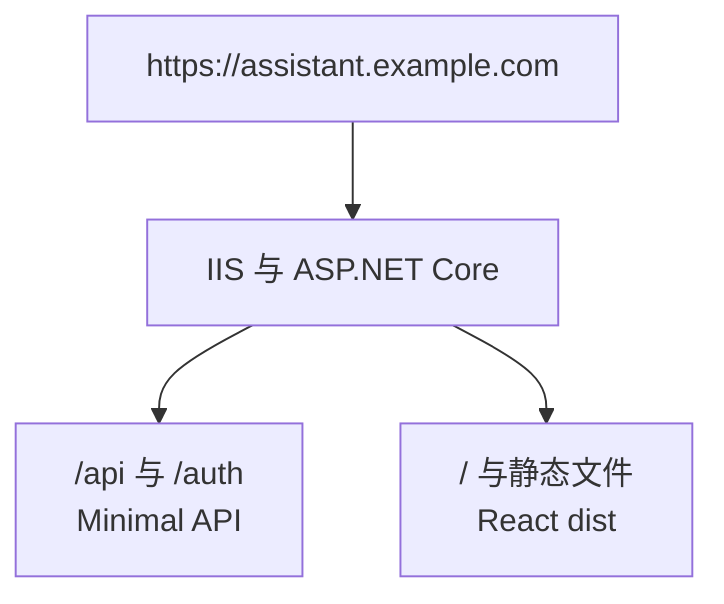
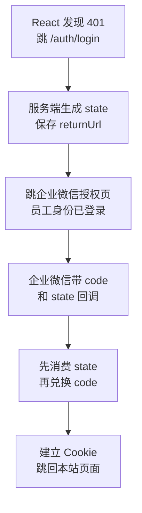
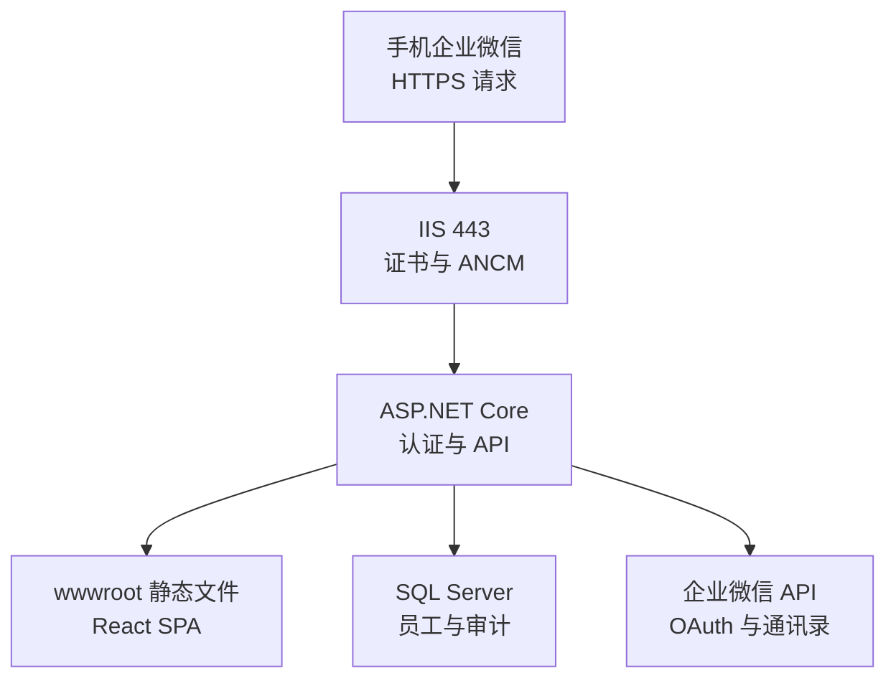
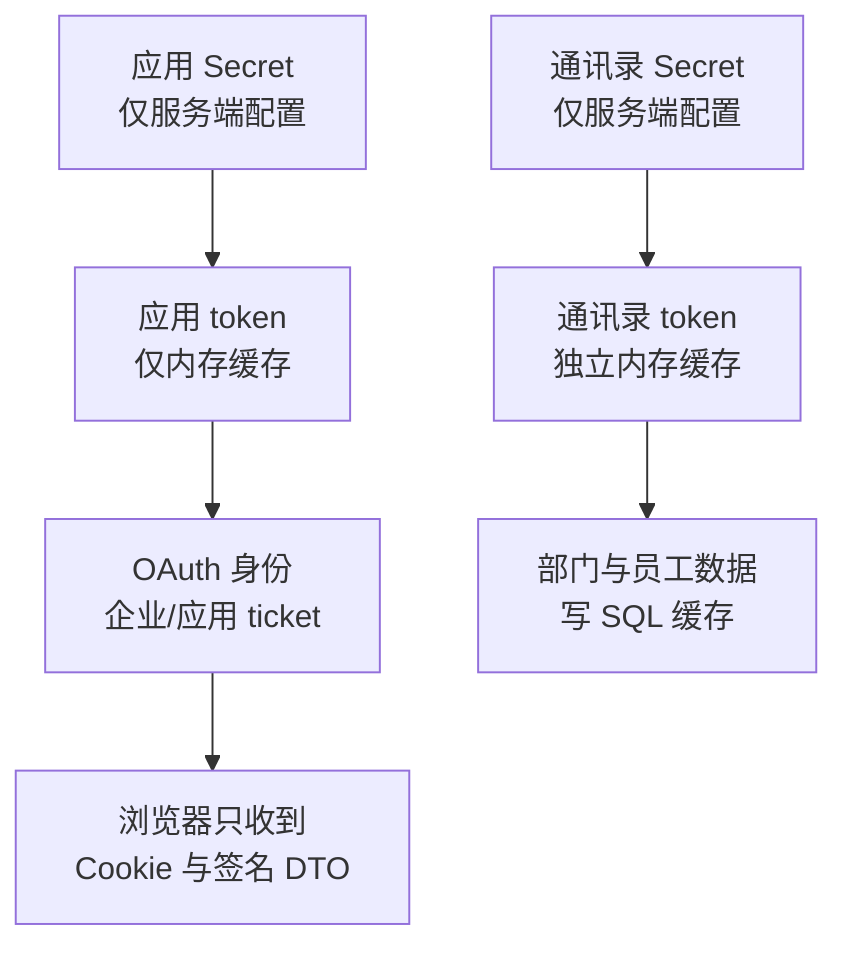
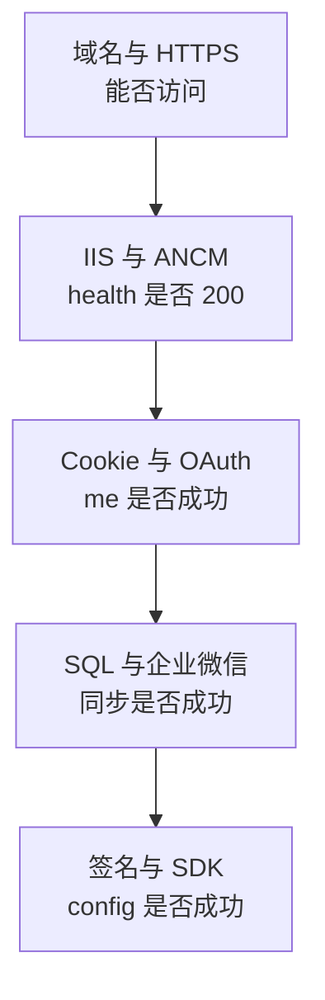

# 第 14 章：React 19 + TypeScript + Vite + Ant Design Mobile + .NET 10 Minimal API 企业助手

## 语言边界

本章是一个前后端分层的完整场景：

- **React 19 + TypeScript** 只负责手机端界面、路由、调用本站 API 和企业微信 JS-SDK。
- **.NET 10 ASP.NET Core Minimal API** 负责 OAuth、Cookie 登录、企业微信 API、JS-SDK 签名、授权和 SQL Server。
- **SQL Server** 保存通讯录缓存、登录审计和 API 审计。
- 本章不调用 Python，也不调用前面章节的 WebForms 程序。

最重要的边界是：`CorpSecret`、`ContactsSecret`、`access_token`、`jsapi_ticket` 和数据库连接串只能存在于服务端。它们绝不能进入 React 源码、构建后的 JavaScript、浏览器响应或任何 `VITE_*` 变量。

## 本章目标

实现一个可独立运行的手机端“企业助手”：

1. 员工从企业微信工作台打开 H5。
2. Minimal API 发起 OAuth，在回调中用 `code` 换到 `UserId`。
3. 服务端签发安全 Cookie；React 调 `/api/me` 显示姓名、部门、职位。
4. 员工列表从 SQL Server 的本地通讯录缓存分页查询。
5. 管理员可触发通讯录同步；服务端同时做身份、角色和 CSRF 检查。
6. 扩展示例用企业微信 JS-SDK 调起扫一扫。
7. 生产环境由 ASP.NET Core 托管 Vite 的 `dist`，H5、`/api`、`/auth` 同域。

最终调用链如下：



## 前置条件

### 企业微信侧

- 已完成第 1 章：有自建应用的 `CorpID`、`AgentId`、应用 Secret 和通讯录 Secret。
- 应用可见范围包含测试成员；通讯录 Secret 至少有读取所需范围的权限。
- 已完成第 7、8、9 章对应的后台配置：应用主页、网页授权可信域名、JS-SDK 可信域名。
- 已把服务器公网出口 IP 加入**应用 Secret**和**通讯录 Secret**各自的可信 IP。
- 有公网可访问、证书链完整的 HTTPS 域名，例如 `https://assistant.example.com`。

### 开发机

- Node.js 的当前 LTS 版本和 npm。
- .NET 10 SDK；执行 `dotnet --list-sdks` 能看到 `10.0.x`。
- SQL Server，且能创建或使用数据库 `WeComTutorial`。
- Git；本章命令在项目根目录执行。

### 一个必须先说清的事实

普通浏览器可以在本机验证 React、API、SQL、Cookie 和分页，但**真实企业微信 OAuth 与 JS-SDK 不能只靠 `localhost` 完成**。可信域名、回调和签名都要求真实的公网 HTTPS 地址，并且扫一扫要在支持该能力的企业微信客户端中验证。

开发时的 Vite proxy 只解决“前端开发服务器怎样访问本地 API”，不会把本机变成企业微信可信公网域名。

## 版本与包的地图

| 层 | 本章基线 | 说明 |
|---|---|---|
| 前端 | React 19、TypeScript strict | 所有浏览器代码均为 TypeScript，禁止 `any` |
| 构建 | Vite，`react-ts` 模板 | 开发代理 `/api`、`/auth` 到 Minimal API |
| UI | Ant Design Mobile | 适合企业微信手机内置浏览器 |
| 路由 | React Router | 使用 Browser Router，不使用 hash 路由 |
| 后端 | .NET 10 LTS、Minimal API | 不使用 MVC Controller，不使用 WebForms |
| 数据 | `Microsoft.Data.SqlClient` | 不使用 EF Core，所有 SQL 参数化 |
| 认证 | Cookie Authentication | HttpOnly、Secure、SameSite=Lax |
| 生产 | IIS + ANCM + ASP.NET Core | 应用池 No Managed Code |

本章不引入 TanStack Query。当前只有少量页面，用一个带泛型的 API 客户端和自定义 Hook 已足够；引入但不解释缓存策略，只会增加新手负担。

## 版本地图

| 版本 | 主题 | 解决上一版什么问题 |
|---|---|---|
| V1 | .NET 10 骨架与 health | —— |
| V2 | React 手机壳与 Vite proxy | 只有 API，没有手机页面 |
| V3 | SQL 与安全配置 | 没有员工缓存和持久化审计 |
| V4 | 两类 access_token 缓存 | 还不能安全调用企业微信 API |
| V5 | 通讯录同步 | 数据库没有真实员工数据 |
| V6 | OAuth login、callback 与 state | 页面不知道访问者是谁 |
| V7 | Cookie 与 `/api/me` | React 还拿不到稳定登录态 |
| V8 | Ant Design Mobile 企业助手主页 | 只有接口，没有完整交互 |
| V9 | 员工分页查询 | 还不能浏览本地通讯录缓存 |
| V10 | 服务端授权、CSRF 与审计 | 管理操作的安全闭环不完整 |
| V11 | JS-SDK 扫一扫 | 还不能调用企业微信客户端能力 |
| V12 | production build 与 IIS | 只能在开发机运行 |

---

# V1：.NET 10 项目骨架与 health

## 目标

先让一个分层的 Minimal API 跑起来，并用 `/health` 证明 .NET 10 服务正常。

## 创建项目

```bash
mkdir WeComAssistant
cd WeComAssistant
dotnet new webapi -n WeComAssistant.Api -f net10.0
dotnet new sln -n WeComAssistant
dotnet sln add WeComAssistant.Api/WeComAssistant.Api.csproj
```

删除模板生成的天气预报代码。安装本章后面要用的包：

```bash
cd WeComAssistant.Api
dotnet add package Microsoft.Data.SqlClient
cd ..
```

`IHttpClientFactory` 由 ASP.NET Core 共享框架提供，不需要额外包。本章设置请求超时，但不盲目自动重试企业微信业务错误；是否重试要结合接口幂等性和 `errcode` 单独决定。

## 最小 `Program.cs`

```csharp
var builder = WebApplication.CreateBuilder(args);

var app = builder.Build();

app.MapGet("/health", () => Results.Ok(new
{
    status = "ok",
    utc = DateTimeOffset.UtcNow
}));

app.Run();
```

运行：

```bash
dotnet run --project WeComAssistant.Api
```

访问终端输出的地址加 `/health`，应得到：

```json
{"status":"ok","utc":"2026-01-01T00:00:00+00:00"}
```

实际时间当然以你的服务器为准。

## 为什么一开始就分层

Minimal API 的“Minimal”是 HTTP 入口写法简洁，不是把数据库、OAuth、缓存和签名全部塞进 `Program.cs`。本章最终按职责放置：

```text
WeComAssistant.Api/
├── Options/       强类型配置
├── Models/        企业微信响应与本站 DTO
├── Services/      token、OAuth、同步、签名
├── Data/          参数化 SQL
└── Endpoints/     Minimal API 路由组
```

`Program.cs` 只负责注册服务和排列中间件。

## 验证

| 操作 | 期望 |
|---|---|
| `dotnet --version` | 显示 `10.0.x` |
| 启动项目 | 无编译错误 |
| 请求 `/health` | HTTP 200，`status` 为 `ok` |

## V1 的问题

现在只有 JSON，没有员工可操作的手机页面。

---

# V2：React 手机壳与 Vite proxy

## 目标

创建 strict TypeScript 前端，用 Ant Design Mobile 显示手机壳，并通过 Vite proxy 调 `/health`。

## 创建前端

在解决方案根目录执行：

```bash
npm create vite@latest wecom-assistant-web -- --template react-ts
cd wecom-assistant-web
npm install
npm install antd-mobile react-router-dom
npm run dev
```

第一次 `npm install` 会生成 `package.json` 和 `package-lock.json`。两者都要提交到 Git；生产发布使用 `npm ci`，严格按 lockfile 安装已经验证过的依赖版本，避免 `latest` 随时间变化。

Vite 的 `react-ts` 模板已经使用 `.tsx`。检查 `tsconfig.app.json` 至少有：

```json
{
  "compilerOptions": {
    "strict": true,
    "noImplicitAny": true,
    "noUncheckedIndexedAccess": true,
    "exactOptionalPropertyTypes": true
  }
}
```

不要为了“先跑起来”关掉 strict。类型问题越晚处理，越容易在 OAuth、分页和 SDK 回调里变成运行时错误。

## `vite.config.ts`

```ts
import { defineConfig } from 'vite'
import react from '@vitejs/plugin-react'

export default defineConfig({
  plugins: [react()],
  server: {
    port: 5173,
    proxy: {
      '/api': {
        target: 'https://localhost:7188',
        changeOrigin: true,
        secure: false,
      },
      '/auth': {
        target: 'https://localhost:7188',
        changeOrigin: true,
        secure: false,
      },
      '/health': {
        target: 'https://localhost:7188',
        changeOrigin: true,
        secure: false,
      },
    },
  },
})
```

把 `7188` 改成后端 `launchSettings.json` 的 HTTPS 端口。`secure: false` 只用于接受本机开发证书，生产环境不存在这个设置。

## `src/App.tsx`

```tsx
import { useEffect, useState } from 'react'
import { Card, NavBar, SafeArea } from 'antd-mobile'
import './index.css'

interface HealthDto {
  status: string
  utc: string
}

interface StatusCardProps {
  title: string
  value: string
  onRefresh: () => void
}

function StatusCard({ title, value, onRefresh }: StatusCardProps) {
  return (
    <Card title={title} onClick={onRefresh}>
      {value}
    </Card>
  )
}

export default function App() {
  const [health, setHealth] = useState<HealthDto | null>(null)

  const loadHealth = async (): Promise<void> => {
    const response = await fetch('/health')
    if (!response.ok) throw new Error(`health HTTP ${response.status}`)
    const value: HealthDto = await response.json() as HealthDto
    setHealth(value)
  }

  useEffect(() => {
    void loadHealth()
  }, [])

  return (
    <div className="app-shell">
      <SafeArea position="top" />
      <NavBar back={null}>企业助手</NavBar>
      <main className="page">
        <StatusCard
          title="后端状态（点卡片刷新）"
          value={health?.status ?? '连接中……'}
          onRefresh={() => void loadHealth()}
        />
      </main>
      <SafeArea position="bottom" />
    </div>
  )
}
```

这里已经包含新手必须掌握的三类类型：

- `StatusCardProps` 是组件 props 类型。
- `onRefresh: () => void` 是事件回调类型。
- `HealthDto` 是后端 DTO 类型。

没有使用 `any`。`response.json()` 的边界断言只表示“按协议把 JSON 当成该 DTO”；生产项目可再用运行时校验库验证外部数据。

## `src/index.css`

```css
:root {
  font-family: system-ui, -apple-system, "Segoe UI", sans-serif;
  color: #1f2329;
  background: #f5f6f7;
}

* { box-sizing: border-box; }
body { margin: 0; min-width: 320px; }
button, input { font: inherit; }
.app-shell { min-height: 100vh; background: #f5f6f7; }
.page { padding: 12px; max-width: 720px; margin: 0 auto; }
```

## 为什么开发用 proxy，生产不用 CORS

开发时有两个进程：



浏览器始终认为自己在访问 `5173`，由 Vite 转发，因此前端不需要知道后端完整地址，也不需要在 `VITE_API_URL` 里写域名。

生产时 ASP.NET Core 直接托管 `dist`：



同源意味着 Cookie、OAuth 和 JS-SDK URL 更简单，也避免维护 CORS 白名单。不要在生产中为了省事写 `AllowAnyOrigin`。

## 验证

1. 同时启动 API 和 `npm run dev`。
2. 打开 `http://localhost:5173`。
3. 卡片显示 `ok`；点卡片可刷新。
4. 浏览器网络请求地址仍是 `/health`，不是硬编码的 API 域名。

## V2 的问题

页面和 API 已打通，但还没有员工缓存、审计表和安全配置来源。

---

# V3：SQL 与配置、Secrets

## 目标

在 `WeComTutorial` 中创建本章最小表，并把普通配置与机密配置分开。

## 可独立执行的最小 SQL

以下脚本只创建本章需要的四张表，不删除已有表，因此可在完成第 3 章的数据库上执行，也可在空 SQL Server 上独立执行。把它保存为解决方案中的 `database/14-init.sql`，生产部署前由有建库权限的管理员执行，不要让 Web 应用启动时自动建表。

```sql
IF DB_ID(N'WeComTutorial') IS NULL
    CREATE DATABASE WeComTutorial;
GO

USE WeComTutorial;
GO

IF OBJECT_ID(N'dbo.WeComDepartment', N'U') IS NULL
BEGIN
    CREATE TABLE dbo.WeComDepartment (
        DeptId      INT NOT NULL PRIMARY KEY,
        Name        NVARCHAR(100) NOT NULL,
        ParentId    INT NULL,
        OrderNo     BIGINT NULL,
        IsDeleted   BIT NOT NULL
            CONSTRAINT DF_Department_IsDeleted DEFAULT 0,
        SyncedAt    DATETIME2(0) NOT NULL
            CONSTRAINT DF_Department_SyncedAt DEFAULT SYSDATETIME()
    );
    CREATE INDEX IX_Department_Parent
        ON dbo.WeComDepartment (ParentId, IsDeleted);
END;
GO

IF OBJECT_ID(N'dbo.WeComEmployee', N'U') IS NULL
BEGIN
    CREATE TABLE dbo.WeComEmployee (
        UserId      NVARCHAR(64) NOT NULL PRIMARY KEY,
        Name        NVARCHAR(100) NULL,
        Mobile      NVARCHAR(32) NULL,
        Email       NVARCHAR(200) NULL,
        Position    NVARCHAR(100) NULL,
        MainDeptId  INT NULL,
        DeptIds     NVARCHAR(500) NULL,
        Enabled     BIT NULL,
        IsDeleted   BIT NOT NULL
            CONSTRAINT DF_Employee_IsDeleted DEFAULT 0,
        SyncedAt    DATETIME2(0) NOT NULL
            CONSTRAINT DF_Employee_SyncedAt DEFAULT SYSDATETIME()
    );
    CREATE INDEX IX_Employee_Name
        ON dbo.WeComEmployee (Name, IsDeleted);
    CREATE INDEX IX_Employee_MainDept
        ON dbo.WeComEmployee (MainDeptId, IsDeleted);
    CREATE INDEX IX_Employee_SyncedAt
        ON dbo.WeComEmployee (SyncedAt DESC);
END;
GO

IF OBJECT_ID(N'dbo.UserLoginLog', N'U') IS NULL
BEGIN
    CREATE TABLE dbo.UserLoginLog (
        Id          BIGINT IDENTITY(1,1) NOT NULL PRIMARY KEY,
        UserId      NVARCHAR(64) NULL,
        Result      TINYINT NOT NULL, -- 1成功 2身份无效 3state失败 4异常
        Reason      NVARCHAR(200) NULL,
        ClientIp    NVARCHAR(64) NULL,
        UserAgent   NVARCHAR(500) NULL,
        ReturnUrl   NVARCHAR(500) NULL,
        LoginAt     DATETIME2(0) NOT NULL
            CONSTRAINT DF_LoginLog_LoginAt DEFAULT SYSDATETIME()
    );
    CREATE INDEX IX_LoginLog_User
        ON dbo.UserLoginLog (UserId, LoginAt DESC);
    CREATE INDEX IX_LoginLog_Time
        ON dbo.UserLoginLog (LoginAt DESC);
    CREATE INDEX IX_LoginLog_Fail
        ON dbo.UserLoginLog (Result, LoginAt DESC) WHERE Result <> 1;
END;
GO

IF OBJECT_ID(N'dbo.ApiLog', N'U') IS NULL
BEGIN
    CREATE TABLE dbo.ApiLog (
        Id          BIGINT IDENTITY(1,1) NOT NULL PRIMARY KEY,
        Source      NVARCHAR(20) NOT NULL,
        ApiName     NVARCHAR(100) NOT NULL,
        UserId      NVARCHAR(64) NULL,
        ErrCode     INT NULL,
        ErrMsg      NVARCHAR(500) NULL,
        ElapsedMs   INT NULL,
        CreatedAt   DATETIME2(0) NOT NULL
            CONSTRAINT DF_ApiLog_CreatedAt DEFAULT SYSDATETIME()
    );
    CREATE INDEX IX_ApiLog_Time
        ON dbo.ApiLog (CreatedAt DESC);
    CREATE INDEX IX_ApiLog_ErrCode
        ON dbo.ApiLog (ErrCode, CreatedAt DESC) WHERE ErrCode <> 0;
END;
GO

/* ---------- 兼容第 3 章已经存在的旧表 ---------- */
IF COL_LENGTH(N'dbo.ApiLog', N'UserId') IS NULL
    ALTER TABLE dbo.ApiLog ADD UserId NVARCHAR(64) NULL;
GO

-- 第 3 章旧版长度分别是 100 和 200；放大不会丢数据。
ALTER TABLE dbo.WeComEmployee ALTER COLUMN Email NVARCHAR(200) NULL;
ALTER TABLE dbo.WeComEmployee ALTER COLUMN DeptIds NVARCHAR(500) NULL;
GO

IF NOT EXISTS (
    SELECT 1 FROM sys.indexes
    WHERE object_id=OBJECT_ID(N'dbo.WeComDepartment')
      AND name=N'IX_Department_Parent')
    CREATE INDEX IX_Department_Parent
        ON dbo.WeComDepartment (ParentId, IsDeleted);

IF NOT EXISTS (
    SELECT 1 FROM sys.indexes
    WHERE object_id=OBJECT_ID(N'dbo.WeComEmployee')
      AND name=N'IX_Employee_SyncedAt')
    CREATE INDEX IX_Employee_SyncedAt
        ON dbo.WeComEmployee (SyncedAt DESC);
GO
```

四个设计点：

1. `UserId` 和 `DeptId` 是企业微信稳定 ID，直接作主键。
2. 同步不硬删除员工和部门；本次未出现的数据写 `IsDeleted=1`，历史日志仍能关联。
3. `SyncedAt` 记录缓存新鲜度；列表默认过滤软删除。
4. 日志不保存完整请求 URL 或响应原文，因为 URL 可能含 token。

建议每天分批清理日志，例如只保留 180 天登录日志和 90 天 API 日志：

```sql
DELETE TOP (10000) FROM dbo.UserLoginLog
WHERE LoginAt < DATEADD(DAY, -180, SYSDATETIME());

DELETE TOP (10000) FROM dbo.ApiLog
WHERE CreatedAt < DATEADD(DAY, -90, SYSDATETIME());
```

## 强类型配置

`Options/WeComOptions.cs`：

```csharp
using System.ComponentModel.DataAnnotations;

namespace WeComAssistant.Api.Options;

public sealed class WeComOptions
{
    public const string SectionName = "WeCom";

    [Required] public required string BaseUrl { get; init; }
    [Required] public required string CorpId { get; init; }
    [Required] public required string AgentId { get; init; }
    [Required] public required string AppSecret { get; init; }
    [Required] public required string ContactsSecret { get; init; }
    [Required] public required string PublicOrigin { get; init; }
    public string[] AdminUserIds { get; init; } = [];
}
```

`Options/DatabaseOptions.cs`：

```csharp
using System.ComponentModel.DataAnnotations;

namespace WeComAssistant.Api.Options;

public sealed class DatabaseOptions
{
    public const string SectionName = "Database";
    [Required] public required string ConnectionString { get; init; }
}
```

`appsettings.json` 只放可公开模板：

```json
{
  "WeCom": {
    "BaseUrl": "https://qyapi.weixin.qq.com/cgi-bin",
    "CorpId": "",
    "AgentId": "",
    "AppSecret": "",
    "ContactsSecret": "",
    "PublicOrigin": "https://assistant.example.com",
    "AdminUserIds": []
  },
  "Database": {
    "ConnectionString": ""
  },
  "Logging": {
    "LogLevel": {
      "Default": "Information",
      "Microsoft.AspNetCore": "Warning"
    }
  }
}
```

开发机用 User Secrets：

```bash
cd WeComAssistant.Api
dotnet user-secrets init
dotnet user-secrets set "WeCom:CorpId" "你的CorpID"
dotnet user-secrets set "WeCom:AgentId" "你的AgentId"
dotnet user-secrets set "WeCom:AppSecret" "应用Secret"
dotnet user-secrets set "WeCom:ContactsSecret" "通讯录Secret"
dotnet user-secrets set "WeCom:PublicOrigin" "https://你的公网域名"
dotnet user-secrets set "WeCom:AdminUserIds:0" "管理员UserId"
dotnet user-secrets set "Database:ConnectionString" "Server=.;Database=WeComTutorial;Integrated Security=true;Encrypt=true;TrustServerCertificate=true"
```

`TrustServerCertificate=true` 只适合本机开发。生产应给 SQL Server 配可信证书并设为 `false`。

生产用 IIS 环境变量或受 ACL 保护、位于仓库外的配置文件。例如环境变量名：

```text
WeCom__AppSecret
WeCom__ContactsSecret
Database__ConnectionString
```

双下划线表示配置层级。**不要创建 `VITE_APP_SECRET`、`VITE_TOKEN` 或 `VITE_CONNECTION_STRING`**：`VITE_*` 会被 Vite 编译进浏览器 JavaScript。

## 验证

1. 连续执行最小 SQL 两次，四张表和索引存在，第二次不报重复对象。
2. 不设置 User Secrets 启动 API，应在启动阶段明确提示缺少配置，而不是运行到接口才失败。
3. 执行前端构建后，在 `dist/assets` 中搜索真实 Secret 和连接串，结果必须为空。
4. 用参数化测试值连接 `WeComTutorial`，应用池或开发身份只有完成本章所需的最小权限。

## V3 的问题

有了配置和表，但每次调用企业微信都临时取 token 会慢、会撞接口频率限制，并在并发时重复刷新。

---

# V4：两类 access_token 分离缓存

## 目标

用 `IHttpClientFactory`、`IOptions`、`IMemoryCache` 实现两套 token 的独立缓存，并用 `SemaphoreSlim` 做单飞刷新。

## 数据模型

`Models/WeComModels.cs`：

```csharp
using System.Text.Json.Serialization;

namespace WeComAssistant.Api.Models;

public class WeComResponse
{
    [JsonPropertyName("errcode")] public int ErrCode { get; init; }
    [JsonPropertyName("errmsg")] public string ErrorMessage { get; init; } = "";
}

public sealed class TokenResponse : WeComResponse
{
    [JsonPropertyName("access_token")] public string AccessToken { get; init; } = "";
    [JsonPropertyName("expires_in")] public int ExpiresIn { get; init; }
}

public sealed class WeComApiException(int errCode, string message)
    : Exception($"企业微信接口失败：{errCode} {message}")
{
    public int ErrCode { get; } = errCode;
}
```

## `Services/WeComTokenService.cs`

```csharp
using System.Net.Http.Json;
using Microsoft.Extensions.Caching.Memory;
using Microsoft.Extensions.Options;
using WeComAssistant.Api.Models;
using WeComAssistant.Api.Options;

namespace WeComAssistant.Api.Services;

public sealed class WeComTokenService(
    IHttpClientFactory httpClientFactory,
    IMemoryCache cache,
    IOptions<WeComOptions> options,
    ILogger<WeComTokenService> logger)
{
    private const string AppKey = "wecom:token:app";
    private const string ContactsKey = "wecom:token:contacts";
    private readonly WeComOptions _options = options.Value;
    private readonly SemaphoreSlim _appLock = new(1, 1);
    private readonly SemaphoreSlim _contactsLock = new(1, 1);

    public Task<string> GetAppTokenAsync(CancellationToken cancellationToken) =>
        GetTokenAsync(AppKey, _options.AppSecret, _appLock, cancellationToken);

    public Task<string> GetContactsTokenAsync(CancellationToken cancellationToken) =>
        GetTokenAsync(ContactsKey, _options.ContactsSecret, _contactsLock, cancellationToken);

    private async Task<string> GetTokenAsync(
        string cacheKey,
        string secret,
        SemaphoreSlim refreshLock,
        CancellationToken cancellationToken)
    {
        if (cache.TryGetValue(cacheKey, out string? cached) && cached is not null)
            return cached;

        await refreshLock.WaitAsync(cancellationToken);
        try
        {
            // 双重检查：等待锁期间，前一个请求可能已经完成刷新。
            if (cache.TryGetValue(cacheKey, out cached) && cached is not null)
                return cached;

            var client = httpClientFactory.CreateClient("WeCom");
            var path = $"gettoken?corpid={Uri.EscapeDataString(_options.CorpId)}" +
                       $"&corpsecret={Uri.EscapeDataString(secret)}";

            using var response = await client.GetAsync(path, cancellationToken);
            response.EnsureSuccessStatusCode();
            var body = await response.Content.ReadFromJsonAsync<TokenResponse>(
                cancellationToken: cancellationToken)
                ?? throw new InvalidOperationException("token 响应为空");

            // HTTP 200 只表示网关成功；企业微信业务失败也常返回 200。
            if (body.ErrCode != 0)
                throw new WeComApiException(body.ErrCode, body.ErrorMessage);
            if (string.IsNullOrWhiteSpace(body.AccessToken))
                throw new InvalidOperationException("token 响应缺少 access_token");

            var lifetime = TimeSpan.FromSeconds(Math.Max(60, body.ExpiresIn - 300));
            cache.Set(cacheKey, body.AccessToken, lifetime); // 提前 5 分钟失效
            logger.LogInformation("已刷新 {TokenKind}，有效缓存 {Seconds} 秒",
                cacheKey == AppKey ? "应用 token" : "通讯录 token",
                lifetime.TotalSeconds);
            return body.AccessToken;
        }
        finally
        {
            refreshLock.Release();
        }
    }
}
```

不要记录 `path`，因为里面有 Secret；不要记录返回 token。日志只写“哪类 token 已刷新”和缓存秒数。

## 注册服务

在 `Program.cs` 的 `builder.Build()` 前加入：

```csharp
builder.Services.AddOptions<WeComOptions>()
    .Bind(builder.Configuration.GetSection(WeComOptions.SectionName))
    .ValidateDataAnnotations()
    .Validate(o => Uri.TryCreate(o.PublicOrigin, UriKind.Absolute, out var uri)
                   && uri.Scheme == Uri.UriSchemeHttps
                   && string.IsNullOrEmpty(uri.UserInfo)
                   && uri.AbsolutePath == "/"
                   && string.IsNullOrEmpty(uri.Query)
                   && string.IsNullOrEmpty(uri.Fragment),
        "WeCom:PublicOrigin 必须是纯 HTTPS origin，不能含路径、查询、片段或用户信息")
    .ValidateOnStart();

builder.Services.AddOptions<DatabaseOptions>()
    .Bind(builder.Configuration.GetSection(DatabaseOptions.SectionName))
    .ValidateDataAnnotations()
    .ValidateOnStart();

builder.Services.AddMemoryCache();
builder.Services.AddHttpClient("WeCom", (services, client) =>
{
    var value = services.GetRequiredService<IOptions<WeComOptions>>().Value;
    client.BaseAddress = new Uri(value.BaseUrl.TrimEnd('/') + "/");
    client.Timeout = TimeSpan.FromSeconds(15);
}).RemoveAllLoggers();
builder.Services.AddSingleton<WeComTokenService>();
```

企业微信把 `corpsecret`、`access_token` 和 OAuth `code` 放在查询字符串中。`IHttpClientFactory` 的默认日志可能记录请求 URI，因此对名为 `WeCom` 的客户端调用 `.RemoveAllLoggers()`；本章只在通讯录同步的外层记录固定 API 名、企业微信业务 `errcode` 和同步总耗时，不能记录 URI、HTTP 正文或凭证。若以后需要逐个企业微信请求的 HTTP 状态与耗时，应增加专门的脱敏 `DelegatingHandler`，仍然不能输出查询字符串。

`IMemoryCache` 适合单台 IIS。多实例部署时，token 最好放分布式缓存，并用分布式锁；否则每个实例都会各取一份，但安全边界不变。

## 验证

临时添加只在 Development 可用的诊断端点，分别调用两种方法但只返回长度：

```csharp
if (app.Environment.IsDevelopment())
{
    app.MapGet("/dev/token-check", async (
        WeComTokenService tokens,
        CancellationToken cancellationToken) =>
    {
        var appToken = await tokens.GetAppTokenAsync(cancellationToken);
        var contactsToken = await tokens.GetContactsTokenAsync(cancellationToken);
        return Results.Ok(new
        {
            appTokenLength = appToken.Length,
            contactsTokenLength = contactsToken.Length
        });
    });
}
```

连续请求两次，第二次不应再次取 token。诊断响应不能返回 token 本身，生产环境没有这个端点。

## V4 的问题

两种 token 已安全缓存，但数据库里还没有企业微信通讯录数据。

---

# V5：通讯录同步

## 目标

用通讯录 token 拉取部门和成员，参数化写入 SQL Server，并软删除本次未返回的数据。

## 企业微信 API 客户端

`Services/WeComApiClient.cs`：

```csharp
using System.Net.Http.Json;
using System.Text.Json.Serialization;
using WeComAssistant.Api.Models;

namespace WeComAssistant.Api.Services;

public interface IWeComApiClient
{
    Task<OAuthIdentityResponse> GetOAuthIdentityAsync(
        string code, CancellationToken cancellationToken);
    Task<IReadOnlyList<DepartmentItem>> GetDepartmentsAsync(
        CancellationToken cancellationToken);
    Task<IReadOnlyList<EmployeeItem>> GetDepartmentUsersAsync(
        int departmentId, CancellationToken cancellationToken);
    Task<TicketResponse> GetCorpTicketAsync(CancellationToken cancellationToken);
    Task<TicketResponse> GetAgentTicketAsync(CancellationToken cancellationToken);
}

public sealed class WeComApiClient(
    IHttpClientFactory httpClientFactory,
    WeComTokenService tokens) : IWeComApiClient
{
    public async Task<OAuthIdentityResponse> GetOAuthIdentityAsync(
        string code, CancellationToken cancellationToken)
    {
        var token = await tokens.GetAppTokenAsync(cancellationToken);
        return await GetCheckedAsync<OAuthIdentityResponse>(
            $"auth/getuserinfo?access_token={Uri.EscapeDataString(token)}" +
            $"&code={Uri.EscapeDataString(code)}", cancellationToken);
    }

    public async Task<IReadOnlyList<DepartmentItem>> GetDepartmentsAsync(
        CancellationToken cancellationToken)
    {
        var token = await tokens.GetContactsTokenAsync(cancellationToken);
        var value = await GetCheckedAsync<DepartmentListResponse>(
            $"department/list?access_token={Uri.EscapeDataString(token)}",
            cancellationToken);
        return value.Departments;
    }

    public async Task<IReadOnlyList<EmployeeItem>> GetDepartmentUsersAsync(
        int departmentId, CancellationToken cancellationToken)
    {
        var token = await tokens.GetContactsTokenAsync(cancellationToken);
        var value = await GetCheckedAsync<EmployeeListResponse>(
            $"user/list?access_token={Uri.EscapeDataString(token)}" +
            $"&department_id={departmentId}&fetch_child=0",
            cancellationToken);
        return value.Users;
    }

    public async Task<TicketResponse> GetCorpTicketAsync(
        CancellationToken cancellationToken)
    {
        var token = await tokens.GetAppTokenAsync(cancellationToken);
        return await GetCheckedAsync<TicketResponse>(
            $"get_jsapi_ticket?access_token={Uri.EscapeDataString(token)}",
            cancellationToken);
    }

    public async Task<TicketResponse> GetAgentTicketAsync(
        CancellationToken cancellationToken)
    {
        var token = await tokens.GetAppTokenAsync(cancellationToken);
        return await GetCheckedAsync<TicketResponse>(
            $"ticket/get?access_token={Uri.EscapeDataString(token)}" +
            "&type=agent_config", cancellationToken);
    }

    private async Task<T> GetCheckedAsync<T>(
        string path, CancellationToken cancellationToken)
        where T : WeComResponse
    {
        var client = httpClientFactory.CreateClient("WeCom");
        using var response = await client.GetAsync(path, cancellationToken);
        response.EnsureSuccessStatusCode();
        var body = await response.Content.ReadFromJsonAsync<T>(
            cancellationToken: cancellationToken)
            ?? throw new InvalidOperationException("企业微信响应为空");
        if (body.ErrCode != 0)
            throw new WeComApiException(body.ErrCode, body.ErrorMessage);
        return body;
    }
}

public sealed class OAuthIdentityResponse : WeComResponse
{
    [JsonPropertyName("userid")] public string? UserId { get; init; }
    [JsonPropertyName("openid")] public string? OpenId { get; init; }
}

public sealed class DepartmentListResponse : WeComResponse
{
    [JsonPropertyName("department")]
    public List<DepartmentItem> Departments { get; init; } = [];
}

public sealed class DepartmentItem
{
    [JsonPropertyName("id")] public int Id { get; init; }
    [JsonPropertyName("name")] public string Name { get; init; } = "";
    [JsonPropertyName("parentid")] public int ParentId { get; init; }
    [JsonPropertyName("order")] public long Order { get; init; }
}

public sealed class EmployeeListResponse : WeComResponse
{
    [JsonPropertyName("userlist")]
    public List<EmployeeItem> Users { get; init; } = [];
}

public sealed class EmployeeItem
{
    [JsonPropertyName("userid")] public string UserId { get; init; } = "";
    [JsonPropertyName("name")] public string? Name { get; init; }
    [JsonPropertyName("mobile")] public string? Mobile { get; init; }
    [JsonPropertyName("email")] public string? Email { get; init; }
    [JsonPropertyName("position")] public string? Position { get; init; }
    [JsonPropertyName("main_department")] public int MainDepartment { get; init; }
    [JsonPropertyName("department")] public int[] Departments { get; init; } = [];
    [JsonPropertyName("status")] public int Status { get; init; }
}

public sealed class TicketResponse : WeComResponse
{
    [JsonPropertyName("ticket")] public string Ticket { get; init; } = "";
    [JsonPropertyName("expires_in")] public int ExpiresIn { get; init; }
}
```

这里所有异步方法都接收并向下传递 `CancellationToken`。HTTP 2xx 后仍统一检查 `errcode`。

## Repository

`Data/ContactsRepository.cs`：

```csharp
using System.Data;
using Microsoft.Data.SqlClient;
using Microsoft.Extensions.Options;
using WeComAssistant.Api.Options;
using WeComAssistant.Api.Services;

namespace WeComAssistant.Api.Data;

public sealed class ContactsRepository(IOptions<DatabaseOptions> options)
{
    private readonly string _connectionString = options.Value.ConnectionString;

    public async Task ReplaceSnapshotAsync(
        IReadOnlyCollection<DepartmentItem> departments,
        IReadOnlyCollection<EmployeeItem> employees,
        CancellationToken cancellationToken)
    {
        await using var connection = new SqlConnection(_connectionString);
        await connection.OpenAsync(cancellationToken);
        await using var transaction = (SqlTransaction)
            await connection.BeginTransactionAsync(cancellationToken);

        try
        {
            await ExecuteAsync(connection, transaction,
                "UPDATE dbo.WeComDepartment SET IsDeleted=1;" +
                "UPDATE dbo.WeComEmployee SET IsDeleted=1;",
                cancellationToken);

            foreach (var item in departments)
                await UpsertDepartmentAsync(connection, transaction, item,
                    cancellationToken);

            // 同一员工可能由多个部门接口返回，按 UserId 去重。
            foreach (var item in employees
                         .GroupBy(x => x.UserId, StringComparer.OrdinalIgnoreCase)
                         .Select(group => group.First()))
                await UpsertEmployeeAsync(connection, transaction, item,
                    cancellationToken);

            await transaction.CommitAsync(cancellationToken);
        }
        catch
        {
            await transaction.RollbackAsync(CancellationToken.None);
            throw;
        }
    }

    private static async Task UpsertDepartmentAsync(
        SqlConnection connection, SqlTransaction transaction,
        DepartmentItem item, CancellationToken cancellationToken)
    {
        const string sql = """
            UPDATE dbo.WeComDepartment
               SET Name=@Name, ParentId=@ParentId, OrderNo=@OrderNo,
                   IsDeleted=0, SyncedAt=SYSDATETIME()
             WHERE DeptId=@DeptId;
            IF @@ROWCOUNT=0
                INSERT dbo.WeComDepartment
                    (DeptId, Name, ParentId, OrderNo, IsDeleted, SyncedAt)
                VALUES
                    (@DeptId, @Name, @ParentId, @OrderNo, 0, SYSDATETIME());
            """;
        await using var command = new SqlCommand(sql, connection, transaction);
        command.Parameters.Add("@DeptId", SqlDbType.Int).Value = item.Id;
        command.Parameters.Add("@Name", SqlDbType.NVarChar, 100).Value = item.Name;
        command.Parameters.Add("@ParentId", SqlDbType.Int).Value =
            item.ParentId == 0 ? DBNull.Value : item.ParentId;
        command.Parameters.Add("@OrderNo", SqlDbType.BigInt).Value = item.Order;
        await command.ExecuteNonQueryAsync(cancellationToken);
    }

    private static async Task UpsertEmployeeAsync(
        SqlConnection connection, SqlTransaction transaction,
        EmployeeItem item, CancellationToken cancellationToken)
    {
        const string sql = """
            UPDATE dbo.WeComEmployee
               SET Name=@Name, Mobile=@Mobile, Email=@Email,
                   Position=@Position, MainDeptId=@MainDeptId,
                   DeptIds=@DeptIds, Enabled=@Enabled,
                   IsDeleted=0, SyncedAt=SYSDATETIME()
             WHERE UserId=@UserId;
            IF @@ROWCOUNT=0
                INSERT dbo.WeComEmployee
                    (UserId, Name, Mobile, Email, Position, MainDeptId,
                     DeptIds, Enabled, IsDeleted, SyncedAt)
                VALUES
                    (@UserId, @Name, @Mobile, @Email, @Position, @MainDeptId,
                     @DeptIds, @Enabled, 0, SYSDATETIME());
            """;
        await using var command = new SqlCommand(sql, connection, transaction);
        command.Parameters.Add("@UserId", SqlDbType.NVarChar, 64).Value = item.UserId;
        AddNullable(command, "@Name", SqlDbType.NVarChar, 100, item.Name);
        AddNullable(command, "@Mobile", SqlDbType.NVarChar, 32, item.Mobile);
        AddNullable(command, "@Email", SqlDbType.NVarChar, 200, item.Email);
        AddNullable(command, "@Position", SqlDbType.NVarChar, 100, item.Position);
        command.Parameters.Add("@MainDeptId", SqlDbType.Int).Value =
            item.MainDepartment == 0 ? DBNull.Value : item.MainDepartment;
        AddNullable(command, "@DeptIds", SqlDbType.NVarChar, 500,
            string.Join(',', item.Departments));
        command.Parameters.Add("@Enabled", SqlDbType.Bit).Value = item.Status == 1;
        await command.ExecuteNonQueryAsync(cancellationToken);
    }

    private static void AddNullable(
        SqlCommand command, string name, SqlDbType type, int size, string? value)
    {
        command.Parameters.Add(name, type, size).Value =
            string.IsNullOrWhiteSpace(value)
                ? DBNull.Value
                : value[..Math.Min(value.Length, size)];
    }

    private static async Task ExecuteAsync(
        SqlConnection connection, SqlTransaction transaction,
        string sql, CancellationToken cancellationToken)
    {
        await using var command = new SqlCommand(sql, connection, transaction);
        await command.ExecuteNonQueryAsync(cancellationToken);
    }
}
```

没有用字符串拼接员工字段，SQL 全部参数化。`UPDATE + IF @@ROWCOUNT=0 INSERT` 让脚本兼容已有表，也避开 `MERGE` 在复杂并发中的注意事项。

## 同步服务

`Services/ContactsSyncService.cs`：

```csharp
using WeComAssistant.Api.Data;

namespace WeComAssistant.Api.Services;

public sealed record SyncResult(int DepartmentCount, int EmployeeCount);

// Gate 是 Singleton；即使每个请求创建新的同步服务，也共用同一把锁。
public sealed class ContactsSyncGate
{
    public SemaphoreSlim Lock { get; } = new(1, 1);
}

public sealed class ContactsSyncService(
    IWeComApiClient api,
    ContactsRepository repository,
    ContactsSyncGate gate)
{
    public async Task<SyncResult> SyncAsync(CancellationToken cancellationToken)
    {
        if (!await gate.Lock.WaitAsync(TimeSpan.Zero, cancellationToken))
            throw new InvalidOperationException("已有通讯录同步正在执行");

        try
        {
            var departments = await api.GetDepartmentsAsync(cancellationToken);
            var employees = new List<EmployeeItem>();
            foreach (var department in departments)
            {
                var current = await api.GetDepartmentUsersAsync(
                    department.Id, cancellationToken);
                employees.AddRange(current);
            }

            await repository.ReplaceSnapshotAsync(
                departments, employees, cancellationToken);
            var uniqueCount = employees
                .Select(x => x.UserId)
                .Distinct(StringComparer.OrdinalIgnoreCase)
                .Count();
            return new SyncResult(departments.Count, uniqueCount);
        }
        finally
        {
            gate.Lock.Release();
        }
    }
}
```

这是教学用全量同步。大型企业应使用增量回调、批处理、限速和后台任务，不能让一个 HTTP 请求长时间承担几万人的同步。

## 注册

```csharp
builder.Services.AddSingleton<IWeComApiClient, WeComApiClient>();
builder.Services.AddSingleton<ContactsSyncGate>();
builder.Services.AddScoped<ContactsRepository>();
builder.Services.AddScoped<ContactsSyncService>();
```

此时先不要把同步端点公开；V10 会在认证、授权和 CSRF 都到位后映射。

## 验证

在开发环境临时调用 `ContactsSyncService.SyncAsync`，然后执行：

```sql
SELECT COUNT(*) AS DepartmentCount
FROM dbo.WeComDepartment WHERE IsDeleted=0;

SELECT COUNT(*) AS EmployeeCount, MAX(SyncedAt) AS LastSyncedAt
FROM dbo.WeComEmployee WHERE IsDeleted=0;
```

数量应与应用可见范围一致。移除某个测试成员的可见范围后再同步，该成员应变成 `IsDeleted=1`，而不是被硬删除。

## V5 的问题

有真实通讯录缓存了，但浏览器访问页面时，服务端仍不知道当前员工是谁。

---

# V6：OAuth login、callback 与 state

## 目标

在 Minimal API 中发起 OAuth；回调先校验一次性 `state`，再用 `code` 换 `UserId`。

## OAuth 流程



`state` 防的是 OAuth 登录 CSRF/登录劫持。它必须随机、短期有效、存服务端、一次性消费。

## OAuth state 服务

`Services/OAuthStateService.cs`：

```csharp
using System.Security.Cryptography;
using System.Text;
using Microsoft.Extensions.Caching.Memory;

namespace WeComAssistant.Api.Services;

public sealed record OAuthStateItem(
    string ReturnUrl,
    byte[] BrowserNonceHash,
    DateTimeOffset CreatedAt);

public sealed class OAuthStateService : IDisposable
{
    private readonly MemoryCache _cache = new(new MemoryCacheOptions
    {
        // 每条 state 都设置 Size=1，最多保留约 10000 条待完成登录。
        // 达到容量后缓存会淘汰旧项，避免匿名请求无限占用内存。
        SizeLimit = 10_000
    });

    private static string Key(string state) => $"oauth:state:{state}";

    public string Create(string returnUrl, string browserNonce)
    {
        var state = Convert.ToHexString(RandomNumberGenerator.GetBytes(32))
            .ToLowerInvariant();
        _cache.Set(Key(state),
            new OAuthStateItem(
                returnUrl,
                SHA256.HashData(Encoding.UTF8.GetBytes(browserNonce)),
                DateTimeOffset.UtcNow),
            new MemoryCacheEntryOptions
            {
                AbsoluteExpirationRelativeToNow = TimeSpan.FromMinutes(10),
                Size = 1
            });
        return state;
    }

    public OAuthStateItem? Consume(string state, string? browserNonce)
    {
        if (!_cache.TryGetValue(Key(state), out OAuthStateItem? item))
            return null;
        _cache.Remove(Key(state)); // 无论校验结果如何，都只能尝试一次

        if (item is null || string.IsNullOrWhiteSpace(browserNonce))
            return null;
        var actualHash = SHA256.HashData(Encoding.UTF8.GetBytes(browserNonce));
        return CryptographicOperations.FixedTimeEquals(
            item.BrowserNonceHash, actualHash) ? item : null;
    }

    public void Dispose() => _cache.Dispose();
}
```

这里故意为 OAuth state 使用**有容量上限的专用缓存**，而不是和 token 共用无限大小的 `IMemoryCache`。容量被占满时，最坏结果是较早发起的登录需要重新进入，不会让匿名请求无限消耗服务器内存。

`state` 记录还保存了发起登录浏览器的随机 nonce 摘要；nonce 本身放在 10 分钟有效的 HttpOnly Cookie。回调必须同时拿到 state 和该 Cookie，避免攻击者把自己发起的“合法 state + code”链接发给受害者，造成受害者浏览器登录成攻击者。

多实例生产应把 state 放入共享的分布式缓存，并用原子“取出并删除”。否则登录请求和回调落到不同实例会校验失败。

## 限制匿名 OAuth 请求速率

`/auth/login` 和 `/auth/callback` 必须允许匿名访问，但“允许匿名”不等于“允许无限请求”。除了上面的 state 容量上限，再注册按来源 IP 分区的固定窗口限流：

```csharp
using System.Threading.RateLimiting;
using Microsoft.AspNetCore.RateLimiting;

builder.Services.AddRateLimiter(options =>
{
    options.RejectionStatusCode = StatusCodes.Status429TooManyRequests;
    options.AddPolicy("oauth", context =>
        RateLimitPartition.GetFixedWindowLimiter(
            partitionKey: context.Connection.RemoteIpAddress?.ToString()
                          ?? "unknown",
            factory: _ => new FixedWindowRateLimiterOptions
            {
                PermitLimit = 20,
                Window = TimeSpan.FromMinutes(1),
                QueueLimit = 0,
                AutoReplenishment = true
            }));
});
```

在中间件中启用：

```csharp
app.UseRouting();
app.UseRateLimiter();
```

V7 映射两个 OAuth 端点时会添加 `.RequireRateLimiting("oauth")`。这样，无效 state 的审计写入也发生在限流之后。真实生产阈值应根据员工数量和反向代理架构压测后调整；若 IIS 前还有代理，只能信任明确配置的代理转发头，不能接受任意来源伪造客户端 IP。

## OAuth 服务

`Services/WeComOAuthService.cs`：

```csharp
using Microsoft.AspNetCore.WebUtilities;
using Microsoft.Extensions.Options;
using WeComAssistant.Api.Options;

namespace WeComAssistant.Api.Services;

public sealed class WeComOAuthService(
    IWeComApiClient api,
    IOptions<WeComOptions> options)
{
    private readonly WeComOptions _options = options.Value;

    public string BuildAuthorizeUrl(string callbackUrl, string state)
    {
        var query = new Dictionary<string, string?>
        {
            ["appid"] = _options.CorpId,
            ["redirect_uri"] = callbackUrl,
            ["response_type"] = "code",
            ["scope"] = "snsapi_base",
            ["state"] = state
        };
        return QueryHelpers.AddQueryString(
            "https://open.weixin.qq.com/connect/oauth2/authorize", query)
            + "#wechat_redirect";
    }

    public async Task<string> ExchangeCodeAsync(
        string code, CancellationToken cancellationToken)
    {
        var identity = await api.GetOAuthIdentityAsync(code, cancellationToken);
        if (string.IsNullOrWhiteSpace(identity.UserId))
            throw new UnauthorizedAccessException(
                identity.OpenId is null
                    ? "企业微信未返回成员身份"
                    : "本应用仅供企业内部成员使用");
        return identity.UserId;
    }
}
```

`code` 只在服务端 callback 中兑换，React 永远看不到兑换用的 token。`snsapi_base` 足够识别 UserId；姓名、部门和职位从本地通讯录缓存读取。

## 安全的 returnUrl

`Endpoints/AuthEndpoints.cs` 先定义判断：

```csharp
namespace WeComAssistant.Api.Endpoints;

public static class AuthEndpoints
{
    private static string SafeReturnUrl(string? value)
    {
        if (string.IsNullOrWhiteSpace(value)) return "/";
        if (!value.StartsWith('/') || value.StartsWith("//")) return "/";
        // 浏览器可能把反斜杠归一化成斜杠；/\evil.example 也可能离开本站。
        if (value.Contains('\\') || value.Any(char.IsControl)) return "/";
        if (value.StartsWith("/auth/", StringComparison.OrdinalIgnoreCase))
            return "/";
        return value;
    }

    // MapAuthEndpoints 在 V7 补全。
}
```

`//evil.example` 虽然以 `/` 开头，却是协议相对外站地址，必须拒绝。回调自身也不能作为 returnUrl，否则可能形成循环。

## 顺序为什么不能反

回调必须：

1. 检查参数存在。
2. **先消费并校验 state。**
3. 再用 code 调企业微信。
4. 建立 Cookie。
5. 跳到不含 code 的干净地址。

如果先兑换 code 再验 state，恶意请求可消耗一次性 code 和接口额度；如果登录后停留在 callback，刷新会重用 code 并出现 `40029`。

## 验证

1. 从 `/auth/login?returnUrl=/employees` 发起授权，回调成功后应回到 `/employees`。
2. 修改 URL 中的 state，服务端应在调用企业微信前拒绝。
3. 在另一浏览器打开完整 callback 链接，即使 state 尚未过期，也因缺少匹配的关联 Cookie 被拒绝。
4. 重放同一 callback，state 已消费，应再次被拒绝。
5. 使用 `returnUrl=//evil.example` 或 `returnUrl=/\evil.example`，都应回到 `/`，不能跳向外站。

## V6 的问题

流程能得到 UserId，但还没签发登录 Cookie，React 也没有 `/api/me` 可读。

---

# V7：Cookie 与 `/api/me`

## 目标

用 ASP.NET Core Cookie Authentication 保存登录态，并让 React 取得当前成员 DTO。

## DTO

`Models/ApiDtos.cs`：

```csharp
namespace WeComAssistant.Api.Models;

public sealed record MeDto(
    string UserId,
    string DisplayName,
    string? DepartmentName,
    string? Position,
    bool IsAdmin);

public sealed record EmployeeListItem(
    string UserId,
    string DisplayName,
    string? DepartmentName,
    string? Position,
    DateTime SyncedAt);

public sealed record PageResult<T>(
    IReadOnlyList<T> Items,
    int Page,
    int PageSize,
    int Total);

public sealed record CsrfTokenDto(string RequestToken);

public sealed record JsSdkSignatureDto(
    string CorpId,
    string AgentId,
    long Timestamp,
    string NonceStr,
    string ConfigSignature,
    string AgentSignature,
    string SignedUrl,
    bool Debug);
```

`PageResult<T>` 是后端泛型 DTO；前端会用同名泛型接口接收。

## 当前员工查询

给 `ContactsRepository` 增加：

```csharp
using WeComAssistant.Api.Models;

public async Task<MeDto?> GetMeAsync(
    string userId, bool isAdmin, CancellationToken cancellationToken)
{
    const string sql = """
        SELECT e.UserId,
               COALESCE(NULLIF(e.Name, N''), e.UserId) AS DisplayName,
               d.Name AS DepartmentName,
               e.Position
          FROM dbo.WeComEmployee e
          LEFT JOIN dbo.WeComDepartment d
            ON d.DeptId=e.MainDeptId AND d.IsDeleted=0
         WHERE e.UserId=@UserId AND e.IsDeleted=0;
        """;
    await using var connection = new SqlConnection(_connectionString);
    await connection.OpenAsync(cancellationToken);
    await using var command = new SqlCommand(sql, connection);
    command.Parameters.Add("@UserId", SqlDbType.NVarChar, 64).Value = userId;
    await using var reader = await command.ExecuteReaderAsync(cancellationToken);
    if (!await reader.ReadAsync(cancellationToken)) return null;
    return new MeDto(
        reader.GetString(0),
        reader.GetString(1),
        reader.IsDBNull(2) ? null : reader.GetString(2),
        reader.IsDBNull(3) ? null : reader.GetString(3),
        isAdmin);
}
```

## Cookie 与授权注册

`Program.cs`：

```csharp
using Microsoft.AspNetCore.Authentication.Cookies;

builder.Services.AddAuthentication(CookieAuthenticationDefaults.AuthenticationScheme)
    .AddCookie(options =>
    {
        options.Cookie.Name = "__Host-WeComAssistant";
        options.Cookie.HttpOnly = true;
        options.Cookie.SecurePolicy = CookieSecurePolicy.Always;
        options.Cookie.SameSite = SameSiteMode.Lax;
        options.Cookie.Path = "/";
        options.ExpireTimeSpan = TimeSpan.FromHours(12);
        options.SlidingExpiration = true;
        options.Events.OnRedirectToLogin = context =>
        {
            if (context.Request.Path.StartsWithSegments("/api"))
            {
                context.Response.StatusCode = StatusCodes.Status401Unauthorized;
                return Task.CompletedTask;
            }
            context.Response.Redirect(context.RedirectUri);
            return Task.CompletedTask;
        };
        options.Events.OnRedirectToAccessDenied = context =>
        {
            context.Response.StatusCode = StatusCodes.Status403Forbidden;
            return Task.CompletedTask;
        };
    });

builder.Services.AddAuthorization(options =>
{
    options.AddPolicy("Admin", policy => policy.RequireRole("Admin"));
});

builder.Services.AddSingleton<OAuthStateService>();
builder.Services.AddScoped<WeComOAuthService>();
builder.Services.AddScoped<AuditRepository>();
```

`__Host-` 前缀要求 Secure、Path=/ 且不能设置 Domain，可降低 Cookie 被其他子域覆盖的风险。`HttpOnly` 让 React 读不到 Cookie 内容；浏览器同源请求会自动携带它。

## V7 先实现登录审计

OAuth callback 马上要写登录结果，所以审计类型必须在第一次引用之前出现。先创建 `Data/AuditRepository.cs` 的 V7 版本：

```csharp
using System.Data;
using Microsoft.Data.SqlClient;
using Microsoft.Extensions.Options;
using WeComAssistant.Api.Options;

namespace WeComAssistant.Api.Data;

public sealed class AuditRepository(IOptions<DatabaseOptions> options)
{
    private readonly string _connectionString = options.Value.ConnectionString;

    public async Task WriteLoginAsync(
        string? userId, byte result, string? reason,
        HttpContext context, string? returnUrl,
        CancellationToken cancellationToken)
    {
        const string sql = """
            INSERT dbo.UserLoginLog
                (UserId, Result, Reason, ClientIp, UserAgent, ReturnUrl)
            VALUES
                (@UserId, @Result, @Reason, @ClientIp, @UserAgent, @ReturnUrl);
            """;
        await using var connection = new SqlConnection(_connectionString);
        await connection.OpenAsync(cancellationToken);
        await using var command = new SqlCommand(sql, connection);
        AddText(command, "@UserId", 64, userId);
        command.Parameters.Add("@Result", SqlDbType.TinyInt).Value = result;
        AddText(command, "@Reason", 200, reason);
        AddText(command, "@ClientIp", 64,
            context.Connection.RemoteIpAddress?.ToString());
        AddText(command, "@UserAgent", 500,
            context.Request.Headers.UserAgent.ToString());
        AddText(command, "@ReturnUrl", 500, returnUrl);
        await command.ExecuteNonQueryAsync(cancellationToken);
    }

    private static void AddText(
        SqlCommand command, string name, int size, string? value)
    {
        command.Parameters.Add(name, SqlDbType.NVarChar, size).Value =
            string.IsNullOrWhiteSpace(value)
                ? DBNull.Value
                : value[..Math.Min(value.Length, size)];
    }
}
```

V10 会在同一个类中继续加入 API 审计方法。现在类型和 DI 注册都已经存在，因此 V7 可以独立编译和验证。

## 完整 `AuthEndpoints.cs`

```csharp
using System.Security.Claims;
using System.Security.Cryptography;
using Microsoft.AspNetCore.Authentication;
using Microsoft.AspNetCore.Authentication.Cookies;
using Microsoft.Extensions.Options;
using WeComAssistant.Api.Data;
using WeComAssistant.Api.Options;
using WeComAssistant.Api.Services;

namespace WeComAssistant.Api.Endpoints;

public static class AuthEndpoints
{
    private const string OAuthCookieName = "__Host-WeComAssistant.OAuth";

    public static IEndpointRouteBuilder MapAuthEndpoints(
        this IEndpointRouteBuilder endpoints)
    {
        var group = endpoints.MapGroup("/auth");

        group.MapGet("/login", (
            string? returnUrl,
            HttpContext context,
            OAuthStateService states,
            WeComOAuthService oauth,
            IOptions<WeComOptions> options) =>
        {
            var safeReturnUrl = SafeReturnUrl(returnUrl);
            var browserNonce = Convert.ToHexString(
                RandomNumberGenerator.GetBytes(32)).ToLowerInvariant();
            context.Response.Cookies.Append(OAuthCookieName, browserNonce,
                new CookieOptions
                {
                    HttpOnly = true,
                    Secure = true,
                    SameSite = SameSiteMode.Lax,
                    Path = "/",
                    MaxAge = TimeSpan.FromMinutes(10),
                    IsEssential = true
                });
            var state = states.Create(safeReturnUrl, browserNonce);
            var callback = options.Value.PublicOrigin.TrimEnd('/') + "/auth/callback";
            return Results.Redirect(oauth.BuildAuthorizeUrl(callback, state));
        })
        .AllowAnonymous()
        .RequireRateLimiting("oauth");

        group.MapGet("/callback", async (
            string? code,
            string? state,
            HttpContext context,
            OAuthStateService states,
            WeComOAuthService oauth,
            IOptions<WeComOptions> options,
            AuditRepository audit,
            CancellationToken cancellationToken) =>
        {
            if (string.IsNullOrWhiteSpace(code) || string.IsNullOrWhiteSpace(state))
                return Results.BadRequest("缺少 code 或 state");

            context.Request.Cookies.TryGetValue(
                OAuthCookieName, out var browserNonce);
            context.Response.Cookies.Delete(OAuthCookieName,
                new CookieOptions { Path = "/", Secure = true });
            var saved = states.Consume(state, browserNonce); // 必须先于 code 兑换
            if (saved is null)
            {
                await audit.WriteLoginAsync(null, 3, "state 无效或已过期",
                    context, "/", cancellationToken);
                return Results.BadRequest("授权状态已失效，请从工作台重新进入");
            }

            try
            {
                var userId = await oauth.ExchangeCodeAsync(code, cancellationToken);
                var isAdmin = options.Value.AdminUserIds.Contains(
                    userId, StringComparer.OrdinalIgnoreCase);
                var claims = new List<Claim>
                {
                    new(ClaimTypes.NameIdentifier, userId),
                    new(ClaimTypes.Name, userId),
                    new(ClaimTypes.Role, isAdmin ? "Admin" : "Employee")
                };
                var principal = new ClaimsPrincipal(
                    new ClaimsIdentity(claims,
                        CookieAuthenticationDefaults.AuthenticationScheme));
                await context.SignInAsync(
                    CookieAuthenticationDefaults.AuthenticationScheme,
                    principal,
                    new AuthenticationProperties
                    {
                        IsPersistent = true,
                        ExpiresUtc = DateTimeOffset.UtcNow.AddHours(12)
                    });
                await audit.WriteLoginAsync(userId, 1, null, context,
                    saved.ReturnUrl, cancellationToken);
                return Results.Redirect(saved.ReturnUrl);
            }
            catch (UnauthorizedAccessException)
            {
                await audit.WriteLoginAsync(null, 2,
                    "非企业成员或身份无效", context,
                    saved.ReturnUrl, cancellationToken);
                return Results.Problem(
                    title: "身份无效",
                    detail: "本应用仅供企业内部成员使用，请从企业微信工作台重新进入。",
                    statusCode: StatusCodes.Status403Forbidden);
            }
            catch (Exception exception)
            {
                await audit.WriteLoginAsync(null, 4,
                    exception is WeComAssistant.Api.Models.WeComApiException apiError
                        ? $"企业微信错误 {apiError.ErrCode}"
                        : "身份兑换失败",
                    context, saved.ReturnUrl, cancellationToken);
                throw;
            }
        })
        .AllowAnonymous()
        .RequireRateLimiting("oauth");

        // V7 暂不开放 logout。它是修改登录状态的 POST，
        // 到 V10 启用 Antiforgery 后再安全加入。

        return endpoints;
    }

    private static string SafeReturnUrl(string? value)
    {
        if (string.IsNullOrWhiteSpace(value)) return "/";
        if (!value.StartsWith('/') || value.StartsWith("//")) return "/";
        // 浏览器可能把反斜杠归一化成斜杠；/\evil.example 也可能离开本站。
        if (value.Contains('\\') || value.Any(char.IsControl)) return "/";
        if (value.StartsWith("/auth/", StringComparison.OrdinalIgnoreCase))
            return "/";
        return value;
    }
}
```

`AuditRepository` 在 V10 给出完整代码。OAuth 异常只记错误码/固定摘要，不记 code、token 或完整企业微信 URL。

## `/api/me`

`Endpoints/MeEndpoints.cs`：

```csharp
using System.Security.Claims;
using WeComAssistant.Api.Data;

namespace WeComAssistant.Api.Endpoints;

public static class MeEndpoints
{
    public static IEndpointRouteBuilder MapMeEndpoints(
        this IEndpointRouteBuilder endpoints)
    {
        endpoints.MapGet("/api/me", async (
            ClaimsPrincipal user,
            ContactsRepository repository,
            CancellationToken cancellationToken) =>
        {
            var userId = user.FindFirstValue(ClaimTypes.NameIdentifier);
            if (userId is null) return Results.Unauthorized();
            var value = await repository.GetMeAsync(
                userId, user.IsInRole("Admin"), cancellationToken);
            return value is null
                ? Results.NotFound(new { message = "通讯录缓存中没有当前员工，请联系管理员同步" })
                : Results.Ok(value);
        }).RequireAuthorization();
        return endpoints;
    }
}
```

Cookie 证明“是谁”，数据库提供“姓名、部门、职位”。API DTO 不含 Secret、token、ticket、手机号或邮箱。

## 验证

1. 登录成功后检查响应 Cookie：名称带 `__Host-`，并有 HttpOnly、Secure、SameSite=Lax、Path=/。
2. 请求 `/api/me`，应返回当前员工姓名、部门、职位和服务端计算的管理员标记。
3. 清除 Cookie 后再请求 `/api/me`，应返回 401，不应返回 HTML 登录页或 302 给 API 客户端。
4. 临时把当前员工设为软删除，接口应返回不含敏感信息的 404 提示。

## V7 的问题

后端登录闭环已经成立，但 React 还只有 health 卡片，没有登录 Hook、路由和企业助手主页。

---

# V8：Ant Design Mobile 企业助手主页

## 目标

实现通用 API 客户端、认证 Hook、路由和手机主页，显示姓名、部门、职位。

## 泛型 API 客户端

`src/api/client.ts`：

```ts
export class ApiError extends Error {
  constructor(
    public readonly status: number,
    message: string,
  ) {
    super(message)
  }
}

export async function apiRequest<T>(
  path: string,
  init?: RequestInit,
): Promise<T> {
  const headers = new Headers(init?.headers)
  headers.set('Accept', 'application/json')
  const response = await fetch(path, {
    credentials: 'same-origin',
    ...init,
    headers,
  })

  if (response.status === 401) {
    const returnUrl = `${window.location.pathname}${window.location.search}`
    window.location.assign(`/auth/login?returnUrl=${encodeURIComponent(returnUrl)}`)
    throw new ApiError(401, '正在跳转企业微信登录')
  }

  if (!response.ok) {
    const text = await response.text()
    throw new ApiError(response.status, text || `HTTP ${response.status}`)
  }

  if (response.status === 204) return undefined as T
  return await response.json() as T
}
```

`T` 让每个调用者明确响应类型。这里没有 `any`；失败响应先按文本处理，避免错误页不是 JSON 时二次报错。

`src/api/types.ts`：

```ts
export interface MeDto {
  userId: string
  displayName: string
  departmentName: string | null
  position: string | null
  isAdmin: boolean
}

export interface EmployeeListItem {
  userId: string
  displayName: string
  departmentName: string | null
  position: string | null
  syncedAt: string
}

export interface PageResult<T> {
  items: T[]
  page: number
  pageSize: number
  total: number
}

export interface SyncResult {
  departmentCount: number
  employeeCount: number
}

export interface CsrfTokenDto {
  requestToken: string
}

export interface JsSdkSignatureDto {
  corpId: string
  agentId: string
  timestamp: number
  nonceStr: string
  configSignature: string
  agentSignature: string
  signedUrl: string
  debug: boolean
}
```

## 认证 Hook

`src/auth/useAuth.ts`：

```ts
import { useCallback, useEffect, useState } from 'react'
import { apiRequest } from '../api/client'
import type { MeDto } from '../api/types'

interface AuthState {
  me: MeDto | null
  loading: boolean
  error: string | null
  reload: () => Promise<void>
}

export function useAuth(): AuthState {
  const [me, setMe] = useState<MeDto | null>(null)
  const [loading, setLoading] = useState(true)
  const [error, setError] = useState<string | null>(null)

  const reload = useCallback(async (): Promise<void> => {
    setLoading(true)
    setError(null)
    try {
      setMe(await apiRequest<MeDto>('/api/me'))
    } catch (reason: unknown) {
      setError(reason instanceof Error ? reason.message : '身份加载失败')
    } finally {
      setLoading(false)
    }
  }, [])

  useEffect(() => {
    void reload()
  }, [reload])

  return { me, loading, error, reload }
}
```

`catch` 使用 `unknown`，先缩小类型再读取属性；这正是 strict TypeScript 下替代 `any` 的做法。

## 主页

`src/pages/HomePage.tsx`：

```tsx
import { Button, Card, DotLoading, ErrorBlock, List, Space } from 'antd-mobile'
import { useNavigate } from 'react-router-dom'
import { useAuth } from '../auth/useAuth'

export function HomePage() {
  const auth = useAuth()
  const navigate = useNavigate()

  if (auth.loading) return <div className="center"><DotLoading /> 身份加载中</div>
  if (auth.error || !auth.me) {
    return <ErrorBlock description={auth.error ?? '没有员工资料'} />
  }

  return (
    <Space direction="vertical" block>
      <Card title={`你好，${auth.me.displayName}`}>
        <List>
          <List.Item description={auth.me.departmentName ?? '未设置'}>部门</List.Item>
          <List.Item description={auth.me.position ?? '未设置'}>职位</List.Item>
          <List.Item description={auth.me.userId}>UserId</List.Item>
        </List>
      </Card>
      <Button block color="primary" onClick={() => navigate('/employees')}>
        查询员工缓存
      </Button>
      <Button block onClick={() => navigate('/scan')}>扫一扫示例</Button>
      {auth.me.isAdmin && (
        <Button block color="warning" onClick={() => navigate('/admin')}>
          管理员工具
        </Button>
      )}
    </Space>
  )
}
```

管理员按钮的隐藏只是体验优化。V10 的同步 API 必须独立验证 Admin 角色，不能相信前端传来的 `isAdmin`。

## 路由与布局

`src/router.tsx`：

```tsx
import { createBrowserRouter } from 'react-router-dom'
import { AppLayout } from './ui/AppLayout'
import { HomePage } from './pages/HomePage'

export const router = createBrowserRouter([
  {
    path: '/',
    element: <AppLayout />,
    children: [
      { index: true, element: <HomePage /> },
      { path: 'employees', element: <div className="center">员工查询将在 V9 实现</div> },
      { path: 'admin', element: <div className="center">管理员工具将在 V10 实现</div> },
      { path: 'scan', element: <div className="center">扫一扫将在 V11 实现</div> },
    ],
  },
])
```

V8 只导入已经创建的首页，保证此时执行 `npm run build` 可以成功。`HomePage` 里的三个按钮已经预留目标地址；V9、V10、V11 每创建一个页面，就在路由中增加对应 import 和 route。不要提前导入尚不存在的文件。

`src/ui/AppLayout.tsx`：

```tsx
import { NavBar, SafeArea } from 'antd-mobile'
import { Outlet, useLocation, useNavigate } from 'react-router-dom'

export function AppLayout() {
  const navigate = useNavigate()
  const location = useLocation()
  const isHome = location.pathname === '/'

  return (
    <div className="app-shell">
      <SafeArea position="top" />
      <NavBar back={isHome ? null : '返回'} onBack={() => navigate(-1)}>
        企业助手
      </NavBar>
      <main className="page"><Outlet /></main>
      <SafeArea position="bottom" />
    </div>
  )
}
```

`src/main.tsx`：

```tsx
import { StrictMode } from 'react'
import { createRoot } from 'react-dom/client'
import { RouterProvider } from 'react-router-dom'
import 'antd-mobile/es/global'
import './index.css'
import { router } from './router'

createRoot(document.getElementById('root')!).render(
  <StrictMode><RouterProvider router={router} /></StrictMode>,
)
```

Vite 模板的 `index.html` 保留 viewport：

```html
<meta name="viewport" content="width=device-width, initial-scale=1.0" />
```

## 验证

从企业微信工作台打开公网 HTTPS 地址。首次经过授权，最后地址应回到 `/`，不含 `code` 和 `state`；主页显示当前员工姓名、部门和职位。

## V8 的问题

主页能显示本人，但“员工缓存”页面还没有分页后端和列表实现。

---

# V9：员工分页查询

## 目标

提供 `PageResult<EmployeeListItem>`，支持按姓名、UserId、职位模糊查询，并在手机端分页显示。

## Repository 分页方法

给 `ContactsRepository` 增加：

```csharp
public async Task<PageResult<EmployeeListItem>> SearchEmployeesAsync(
    string? keyword, int page, int pageSize,
    CancellationToken cancellationToken)
{
    page = Math.Max(1, page);
    pageSize = Math.Clamp(pageSize, 1, 50);
    var normalized = string.IsNullOrWhiteSpace(keyword) ? null : keyword.Trim();

    const string where = """
        FROM dbo.WeComEmployee e
        LEFT JOIN dbo.WeComDepartment d
          ON d.DeptId=e.MainDeptId AND d.IsDeleted=0
        WHERE e.IsDeleted=0
          AND (@Keyword IS NULL
               OR e.Name LIKE N'%' + @Keyword + N'%'
               OR e.UserId LIKE N'%' + @Keyword + N'%'
               OR e.Position LIKE N'%' + @Keyword + N'%')
        """;

    await using var connection = new SqlConnection(_connectionString);
    await connection.OpenAsync(cancellationToken);

    await using var countCommand = new SqlCommand("SELECT COUNT(*) " + where, connection);
    AddKeyword(countCommand, normalized);
    var total = Convert.ToInt32(
        await countCommand.ExecuteScalarAsync(cancellationToken));

    var sql = """
        SELECT e.UserId, COALESCE(NULLIF(e.Name,N''), e.UserId),
               d.Name, e.Position, e.SyncedAt
        """ + where + """
        ORDER BY e.Name, e.UserId
        OFFSET @Offset ROWS FETCH NEXT @PageSize ROWS ONLY;
        """;
    await using var command = new SqlCommand(sql, connection);
    AddKeyword(command, normalized);
    command.Parameters.Add("@Offset", SqlDbType.Int).Value = (page - 1) * pageSize;
    command.Parameters.Add("@PageSize", SqlDbType.Int).Value = pageSize;

    var items = new List<EmployeeListItem>();
    await using var reader = await command.ExecuteReaderAsync(cancellationToken);
    while (await reader.ReadAsync(cancellationToken))
    {
        items.Add(new EmployeeListItem(
            reader.GetString(0), reader.GetString(1),
            reader.IsDBNull(2) ? null : reader.GetString(2),
            reader.IsDBNull(3) ? null : reader.GetString(3),
            reader.GetDateTime(4)));
    }
    return new PageResult<EmployeeListItem>(items, page, pageSize, total);
}

private static void AddKeyword(SqlCommand command, string? keyword)
{
    command.Parameters.Add("@Keyword", SqlDbType.NVarChar, 100).Value =
        keyword is null ? DBNull.Value : keyword[..Math.Min(keyword.Length, 100)];
}
```

`LIKE` 的关键词也是参数，不是拼接 SQL。`pageSize` 最多 50，防止一次拉完整通讯录。

## Endpoint

`Endpoints/EmployeeEndpoints.cs`：

```csharp
using WeComAssistant.Api.Data;

namespace WeComAssistant.Api.Endpoints;

public static class EmployeeEndpoints
{
    public static IEndpointRouteBuilder MapEmployeeEndpoints(
        this IEndpointRouteBuilder endpoints)
    {
        endpoints.MapGet("/api/employees", async (
            string? keyword,
            int page,
            int pageSize,
            ContactsRepository repository,
            CancellationToken cancellationToken) =>
        {
            var result = await repository.SearchEmployeesAsync(
                keyword, page, pageSize, cancellationToken);
            return Results.Ok(result);
        }).RequireAuthorization();
        return endpoints;
    }
}
```

如果员工目录属于敏感数据，应再加 HR/Admin policy；本章假设应用可见范围内员工可查看基础姓名、部门、职位，DTO 不返回手机号和邮箱。

## React 员工列表

`src/pages/EmployeeListPage.tsx`：

```tsx
import { useCallback, useEffect, useRef, useState } from 'react'
import { Button, Empty, ErrorBlock, List, SearchBar, Space, SpinLoading } from 'antd-mobile'
import { apiRequest } from '../api/client'
import type { EmployeeListItem, PageResult } from '../api/types'

const pageSize = 20

export function EmployeeListPage() {
  const [keyword, setKeyword] = useState('')
  const [page, setPage] = useState(1)
  const [result, setResult] = useState<PageResult<EmployeeListItem> | null>(null)
  const [loading, setLoading] = useState(false)
  const [error, setError] = useState<string | null>(null)
  const latestRequest = useRef(0)

  const load = useCallback(async (): Promise<void> => {
    const requestId = ++latestRequest.current
    setLoading(true)
    setError(null)
    try {
      const query = new URLSearchParams({
        keyword,
        page: String(page),
        pageSize: String(pageSize),
      })
      const value = await apiRequest<PageResult<EmployeeListItem>>(
        `/api/employees?${query.toString()}`,
      )
      if (requestId === latestRequest.current) setResult(value)
    } catch (reason: unknown) {
      if (requestId === latestRequest.current) {
        setError(reason instanceof Error ? reason.message : '员工列表加载失败')
      }
    } finally {
      if (requestId === latestRequest.current) setLoading(false)
    }
  }, [keyword, page])

  useEffect(() => {
    void load()
    return () => { latestRequest.current += 1 }
  }, [load])

  const submitSearch = (value: string): void => {
    setKeyword(value.trim())
    setPage(1)
  }

  const totalPages = result ? Math.max(1, Math.ceil(result.total / pageSize)) : 1

  return (
    <Space direction="vertical" block>
      <SearchBar
        placeholder="姓名、UserId 或职位"
        onSearch={submitSearch}
        onClear={() => submitSearch('')}
      />
      {loading && <div className="center"><SpinLoading /></div>}
      {!loading && error && (
        <>
          <ErrorBlock description={error} fullPage={false} />
          <Button block onClick={() => void load()}>重试</Button>
        </>
      )}
      {!loading && !error && result?.items.length === 0 && <Empty description="没有匹配员工" />}
      {!error && <List header={result ? `共 ${result.total} 人` : '员工缓存'}>
        {result?.items.map((employee) => (
          <List.Item
            key={employee.userId}
            description={`${employee.departmentName ?? '未分配部门'} · ${employee.position ?? '未设置职位'}`}
          >
            {employee.displayName}
          </List.Item>
        ))}
      </List>}
      <div className="pager">
        <Button disabled={page <= 1} onClick={() => setPage((value) => value - 1)}>
          上一页
        </Button>
        <span>{page} / {totalPages}</span>
        <Button disabled={page >= totalPages} onClick={() => setPage((value) => value + 1)}>
          下一页
        </Button>
      </div>
    </Space>
  )
}
```

`latestRequest` 是递增请求序号。快速搜索或连续翻页时，旧请求即使最后才返回，也不能覆盖当前关键词/页码的结果，亦不能提前关闭新请求的 loading。

这里的 `onSearch`、`onClear`、`onClick` 都由组件类型推断；`setPage((value) => ...)` 的 `value` 自动是 `number`。`onClear` 很重要：用户点清除图标时，必须同时清空已提交关键词并重新查询全部员工，不能只让输入框看起来为空。`PageResult<EmployeeListItem>` 同时展示了泛型和 DTO 类型。

创建页面后，把 V8 的员工占位路由替换为真实页面：

```tsx
import { EmployeeListPage } from './pages/EmployeeListPage'

// children 中替换这一项：
{ path: 'employees', element: <EmployeeListPage /> },
```

此时不要提前导入 V10、V11 的页面，它们仍保持占位元素。

补充 CSS：

```css
.center { display: flex; justify-content: center; padding: 32px 0; }
.pager { display: flex; align-items: center; justify-content: space-between; gap: 12px; }
```

## 验证

1. 输入姓名的一部分，结果只包含匹配成员。
2. 输入单引号 `'`，接口不应报 SQL 语法错误，更不能改变查询含义。
3. 修改请求为 `pageSize=10000`，响应仍最多 50 条。
4. 查 `IsDeleted=1` 的员工，不应出现在结果里。
5. 快速提交两个关键词或连续翻页，最终列表必须对应最后一次条件，不被较慢的旧响应覆盖。

## V9 的问题

查询是只读操作；管理员同步会修改服务器状态。它不仅要隐藏按钮，还必须在服务端验证角色，并防止 Cookie 被跨站利用。

---

# V10：服务端授权、CSRF 与审计

## 目标

让同步接口同时具备 Admin 授权、Antiforgery CSRF 防护、单飞执行和脱敏审计。

## OAuth state 不等于一般 API 的 CSRF

两者不要混淆：

| 防护 | 保护什么 | 使用位置 |
|---|---|---|
| OAuth `state` | 登录回调属于本浏览器发起，防登录劫持 | `/auth/login` → `/auth/callback` |
| Antiforgery token | 已登录 Cookie 不被恶意网站借用来发修改请求 | `POST /api/admin/contacts/sync`、logout 等 |

Cookie 会被浏览器自动携带，所以修改型 API 不能只依赖 Cookie 和 `SameSite=Lax`。SameSite 是缓解措施，不是所有 CSRF 场景的完整替代。

## 注册 Antiforgery

`Program.cs`：

```csharp
builder.Services.AddAntiforgery(options =>
{
    options.HeaderName = "X-CSRF-TOKEN";
    options.Cookie.Name = "__Host-WeComAssistant.Antiforgery";
    options.Cookie.HttpOnly = true;
    options.Cookie.SecurePolicy = CookieSecurePolicy.Always;
    options.Cookie.SameSite = SameSiteMode.Strict;
});
```

中间件顺序必须是：

```csharp
app.UseHttpsRedirection();
app.UseAuthentication();
app.UseAuthorization();
app.UseAntiforgery();
```

## 审计 Repository

用下面的完整版本**替换 V7 的 `Data/AuditRepository.cs`**：保留已有 `WriteLoginAsync`，再加入 `WriteApiAsync`。`AuditRepository` 已在 V7 注册为 scoped，不要重复注册。

```csharp
using System.Data;
using System.Diagnostics;
using Microsoft.Data.SqlClient;
using Microsoft.Extensions.Options;
using WeComAssistant.Api.Options;

namespace WeComAssistant.Api.Data;

public sealed class AuditRepository(IOptions<DatabaseOptions> options)
{
    private readonly string _connectionString = options.Value.ConnectionString;

    public async Task WriteLoginAsync(
        string? userId, byte result, string? reason,
        HttpContext context, string? returnUrl,
        CancellationToken cancellationToken)
    {
        const string sql = """
            INSERT dbo.UserLoginLog
                (UserId, Result, Reason, ClientIp, UserAgent, ReturnUrl)
            VALUES
                (@UserId, @Result, @Reason, @ClientIp, @UserAgent, @ReturnUrl);
            """;
        await using var connection = new SqlConnection(_connectionString);
        await connection.OpenAsync(cancellationToken);
        await using var command = new SqlCommand(sql, connection);
        AddText(command, "@UserId", 64, userId);
        command.Parameters.Add("@Result", SqlDbType.TinyInt).Value = result;
        AddText(command, "@Reason", 200, reason);
        AddText(command, "@ClientIp", 64,
            context.Connection.RemoteIpAddress?.ToString());
        AddText(command, "@UserAgent", 500,
            context.Request.Headers.UserAgent.ToString());
        AddText(command, "@ReturnUrl", 500, returnUrl);
        await command.ExecuteNonQueryAsync(cancellationToken);
    }

    public async Task WriteApiAsync(
        string apiName, string? userId, int? errCode,
        string? errorCategory, long elapsedMs,
        CancellationToken cancellationToken)
    {
        const string sql = """
            INSERT dbo.ApiLog
                (Source, ApiName, UserId, ErrCode, ErrMsg, ElapsedMs)
            VALUES
                (N'minimal-api', @ApiName, @UserId, @ErrCode, @ErrMsg, @ElapsedMs);
            """;
        await using var connection = new SqlConnection(_connectionString);
        await connection.OpenAsync(cancellationToken);
        await using var command = new SqlCommand(sql, connection);
        AddText(command, "@ApiName", 100, apiName);
        AddText(command, "@UserId", 64, userId);
        command.Parameters.Add("@ErrCode", SqlDbType.Int).Value =
            errCode is null ? DBNull.Value : errCode.Value;
        AddText(command, "@ErrMsg", 500, NormalizeErrorCategory(errorCategory));
        command.Parameters.Add("@ElapsedMs", SqlDbType.Int).Value =
            (int)Math.Min(int.MaxValue, Math.Max(0, elapsedMs));
        await command.ExecuteNonQueryAsync(cancellationToken);
    }

    private static string? NormalizeErrorCategory(string? value) => value switch
    {
        null => null,
        "企业微信业务错误" => value,
        "已有同步正在执行" => value,
        "同步内部错误" => value,
        _ => "未分类错误"
    };

    private static void AddText(
        SqlCommand command, string name, int size, string? value)
    {
        command.Parameters.Add(name, SqlDbType.NVarChar, size).Value =
            string.IsNullOrWhiteSpace(value)
                ? DBNull.Value
                : value[..Math.Min(value.Length, size)];
    }
}
```

`WriteApiAsync` 只接受固定错误类别，未知文本统一落成“未分类错误”。调用方不能传 `exception.Message`、完整 URL 或响应正文；这样从接口上就避免 code、token、ticket、Secret 和连接串进入审计表，而不是依赖不可靠的字符串替换。

## 管理端点

`Endpoints/AdminEndpoints.cs`：

```csharp
using System.Diagnostics;
using System.Security.Claims;
using Microsoft.AspNetCore.Antiforgery;
using WeComAssistant.Api.Data;
using WeComAssistant.Api.Services;

namespace WeComAssistant.Api.Endpoints;

public static class AdminEndpoints
{
    public static IEndpointRouteBuilder MapAdminEndpoints(
        this IEndpointRouteBuilder endpoints)
    {
        endpoints.MapGet("/api/security/csrf", (
            HttpContext context, IAntiforgery antiforgery) =>
        {
            var tokens = antiforgery.GetAndStoreTokens(context);
            return Results.Ok(new { requestToken = tokens.RequestToken });
        }).RequireAuthorization();

        endpoints.MapPost("/api/admin/contacts/sync", async (
            ClaimsPrincipal user,
            ContactsSyncService sync,
            AuditRepository audit,
            CancellationToken cancellationToken) =>
        {
            var watch = Stopwatch.StartNew();
            var userId = user.FindFirstValue(ClaimTypes.NameIdentifier);
            try
            {
                var result = await sync.SyncAsync(cancellationToken);
                await audit.WriteApiAsync("contacts/sync", userId, 0, null,
                    watch.ElapsedMilliseconds, cancellationToken);
                return Results.Ok(result);
            }
            catch (WeComAssistant.Api.Models.WeComApiException exception)
            {
                await audit.WriteApiAsync("contacts/sync", userId,
                    exception.ErrCode, "企业微信业务错误",
                    watch.ElapsedMilliseconds, cancellationToken);
                throw;
            }
            catch (InvalidOperationException exception)
                when (exception.Message == "已有通讯录同步正在执行")
            {
                await audit.WriteApiAsync("contacts/sync", userId, -2,
                    "已有同步正在执行", watch.ElapsedMilliseconds,
                    cancellationToken);
                return Results.Conflict(new { message = exception.Message });
            }
            catch (OperationCanceledException)
                when (cancellationToken.IsCancellationRequested)
            {
                throw; // 客户端已断开，不再用已取消 token 写数据库。
            }
            catch (Exception)
            {
                // 只记固定类别，绝不把异常消息、URL 或连接串写入审计。
                await audit.WriteApiAsync("contacts/sync", userId, -1,
                    "同步内部错误", watch.ElapsedMilliseconds,
                    cancellationToken);
                throw;
            }
        })
        .RequireAuthorization("Admin")
        .WithMetadata(new RequireAntiforgeryTokenAttribute(true));

        return endpoints;
    }
}
```

即使普通员工手工构造 POST，仍会先被 Admin policy 拒绝；即使管理员已登录，缺少正确 `X-CSRF-TOKEN` 也会被拒绝。

V7 为了避免先展示一个有 CSRF 缺口的版本，暂时没有开放 logout。现在 Antiforgery 已启用，可以在 `MapAuthEndpoints` 的 `return endpoints;` 前加入：

```csharp
group.MapPost("/logout", async (HttpContext context) =>
{
    await context.SignOutAsync(
        CookieAuthenticationDefaults.AuthenticationScheme);
    return Results.NoContent();
})
.RequireAuthorization()
.WithMetadata(new RequireAntiforgeryTokenAttribute(true));
```

确保 `AuthEndpoints.cs` 顶部包含：

```csharp
using Microsoft.AspNetCore.Antiforgery;
```

.NET 10 没有 `.RequireAntiforgery()` 路由扩展；这里通过 `RequireAntiforgeryTokenAttribute(true)` 添加 `IAntiforgeryMetadata`，由已经注册的 `UseAntiforgery()` 中间件执行校验。

前端登出也必须用后面的 `postWithCsrf`，不能用普通链接或无 token 的 POST。

## 前端修改请求

`src/api/security.ts`：

```ts
import { apiRequest } from './client'
import type { CsrfTokenDto } from './types'

export async function postWithCsrf<T>(path: string): Promise<T> {
  const { requestToken } = await apiRequest<CsrfTokenDto>('/api/security/csrf')
  return await apiRequest<T>(path, {
    method: 'POST',
    headers: { 'X-CSRF-TOKEN': requestToken },
  })
}
```

`src/pages/AdminPage.tsx`：

```tsx
import { useState } from 'react'
import { Button, Card, Dialog, Toast } from 'antd-mobile'
import { postWithCsrf } from '../api/security'
import type { SyncResult } from '../api/types'

export function AdminPage() {
  const [running, setRunning] = useState(false)

  const syncContacts = async (): Promise<void> => {
    const confirmed = await Dialog.confirm({
      content: '将从企业微信重新同步通讯录，是否继续？',
    })
    if (!confirmed) return
    setRunning(true)
    try {
      const result = await postWithCsrf<SyncResult>('/api/admin/contacts/sync')
      Toast.show(`同步完成：${result.departmentCount} 个部门，${result.employeeCount} 人`)
    } catch (reason: unknown) {
      Toast.show(reason instanceof Error ? reason.message : '同步失败')
    } finally {
      setRunning(false)
    }
  }

  return (
    <Card title="管理员工具">
      <Button block color="warning" loading={running} onClick={() => void syncContacts()}>
        同步企业微信通讯录
      </Button>
    </Card>
  )
}
```

创建页面后，在 `router.tsx` 导入它，并替换 V8 的管理员占位路由：

```tsx
import { AdminPage } from './pages/AdminPage'

// children 中替换这一项：
{ path: 'admin', element: <AdminPage /> },
```

## 验证

| 测试 | 期望 |
|---|---|
| 普通员工直接 POST 同步地址 | HTTP 403 |
| 管理员不带 CSRF Header | HTTP 400 |
| 管理员带有效 token | 同步成功并写 `ApiLog` |
| 同时点两次同步 | 第二次提示已有同步进行中 |
| 查看日志 | 没有 Secret、token、ticket、OAuth code |

## V10 的问题

Web 业务闭环完整了，但还没有调用企业微信客户端扫一扫。

---

# V11：JS-SDK 扫一扫

## 目标

后端只返回签名 DTO；前端动态加载企业微信 SDK，按 `wx.config` → `wx.ready` → 必要时 `wx.agentConfig` 的顺序调起扫一扫。

## 两种 ticket 必须分清

| ticket | 获取方式 | 用途 |
|---|---|---|
| 企业 `jsapi_ticket` | `get_jsapi_ticket` | 计算 `wx.config` 签名 |
| 应用 `agent_config` ticket | `ticket/get?type=agent_config` | 计算 `wx.agentConfig` 签名 |

两者都由**应用 token**获取，但不是同一个 ticket，必须分开缓存。ticket 和 token 提前 5 分钟失效；签名绑定 URL、时间戳和随机串，每次重算，不缓存。

## 签名服务

`Services/JsSdkSignatureService.cs`：

```csharp
using System.Security.Cryptography;
using System.Text;
using Microsoft.Extensions.Caching.Memory;
using Microsoft.Extensions.Options;
using WeComAssistant.Api.Models;
using WeComAssistant.Api.Options;

namespace WeComAssistant.Api.Services;

public sealed class JsSdkSignatureService(
    IWeComApiClient api,
    IMemoryCache cache,
    IOptions<WeComOptions> options)
{
    private readonly WeComOptions _options = options.Value;
    private readonly SemaphoreSlim _corpLock = new(1, 1);
    private readonly SemaphoreSlim _agentLock = new(1, 1);

    public async Task<JsSdkSignatureDto> CreateAsync(
        string pageUrl, bool debug, CancellationToken cancellationToken)
    {
        var signedUrl = ValidateAndNormalizeUrl(pageUrl);
        var timestamp = DateTimeOffset.UtcNow.ToUnixTimeSeconds();
        var nonce = Convert.ToHexString(RandomNumberGenerator.GetBytes(16))
            .ToLowerInvariant();
        var corpTicket = await GetTicketAsync("corp", _corpLock,
            api.GetCorpTicketAsync, cancellationToken);
        var agentTicket = await GetTicketAsync("agent", _agentLock,
            api.GetAgentTicketAsync, cancellationToken);

        return new JsSdkSignatureDto(
            _options.CorpId,
            _options.AgentId,
            timestamp,
            nonce,
            Sign(corpTicket, nonce, timestamp, signedUrl),
            Sign(agentTicket, nonce, timestamp, signedUrl),
            signedUrl,
            debug);
    }

    private string ValidateAndNormalizeUrl(string pageUrl)
    {
        var withoutHash = pageUrl.Split('#', 2)[0];
        if (!Uri.TryCreate(withoutHash, UriKind.Absolute, out var uri))
            throw new ArgumentException("签名 URL 不是绝对地址");
        if (!Uri.TryCreate(_options.PublicOrigin, UriKind.Absolute, out var origin))
            throw new InvalidOperationException("PublicOrigin 配置错误");

        var sameOrigin = uri.Scheme == origin.Scheme
            && uri.Host.Equals(origin.Host, StringComparison.OrdinalIgnoreCase)
            && uri.Port == origin.Port;
        if (!sameOrigin || uri.UserInfo.Length > 0)
            throw new UnauthorizedAccessException("只允许为本站可信 origin 签名");
        return uri.AbsoluteUri;
    }

    private async Task<string> GetTicketAsync(
        string kind,
        SemaphoreSlim refreshLock,
        Func<CancellationToken, Task<TicketResponse>> factory,
        CancellationToken cancellationToken)
    {
        var key = $"wecom:ticket:{kind}";
        if (cache.TryGetValue(key, out string? cached) && cached is not null)
            return cached;

        await refreshLock.WaitAsync(cancellationToken);
        try
        {
            if (cache.TryGetValue(key, out cached) && cached is not null)
                return cached;
            var response = await factory(cancellationToken);
            if (string.IsNullOrWhiteSpace(response.Ticket))
                throw new InvalidOperationException("ticket 响应为空");
            cache.Set(key, response.Ticket,
                TimeSpan.FromSeconds(Math.Max(60, response.ExpiresIn - 300)));
            return response.Ticket;
        }
        finally
        {
            refreshLock.Release();
        }
    }

    private static string Sign(
        string ticket, string nonce, long timestamp, string url)
    {
        var source = $"jsapi_ticket={ticket}&noncestr={nonce}" +
                     $"&timestamp={timestamp}&url={url}";
        var bytes = SHA1.HashData(Encoding.UTF8.GetBytes(source));
        return Convert.ToHexString(bytes).ToLowerInvariant();
    }
}
```

签名 URL 先去掉 `#`。服务端严格限制 scheme、host、port 与 `PublicOrigin` 一致，防止已登录用户让服务器替恶意站点签名。响应只含最终签名参数，不含 Secret、access_token 或两种 ticket。

## Endpoint

`Endpoints/JsSdkEndpoints.cs`：

```csharp
using WeComAssistant.Api.Services;

namespace WeComAssistant.Api.Endpoints;

public static class JsSdkEndpoints
{
    public static IEndpointRouteBuilder MapJsSdkEndpoints(
        this IEndpointRouteBuilder endpoints)
    {
        endpoints.MapGet("/api/js-sdk/signature", async (
            string url,
            IWebHostEnvironment environment,
            JsSdkSignatureService signatures,
            CancellationToken cancellationToken) =>
        {
            var result = await signatures.CreateAsync(
                url, environment.IsDevelopment(), cancellationToken);
            return Results.Ok(result);
        }).RequireAuthorization();
        return endpoints;
    }
}
```

生产 `debug` 自动为 false。诊断时可以把 `signedUrl` 与前端实际 URL 并列显示，但生产只应给管理员看，或发生错误时临时输出。

## TypeScript SDK 类型与动态加载

`src/wecom/wecom-sdk.ts`：

```ts
import { apiRequest } from '../api/client'
import type { JsSdkSignatureDto } from '../api/types'

interface SdkResult { errMsg?: string }
interface ScanResult extends SdkResult { resultStr: string }

interface WxSdk {
  config(options: {
    beta: boolean
    debug: boolean
    appId: string
    timestamp: number
    nonceStr: string
    signature: string
    jsApiList: string[]
  }): void
  ready(callback: () => void): void
  error(callback: (result: SdkResult) => void): void
  agentConfig(options: {
    corpid: string
    agentid: string
    timestamp: number
    nonceStr: string
    signature: string
    jsApiList: string[]
    success: () => void
    fail: (result: SdkResult) => void
  }): void
  scanQRCode(options: {
    needResult: 1
    scanType: Array<'qrCode' | 'barCode'>
    success: (result: ScanResult) => void
    fail: (result: SdkResult) => void
    cancel: () => void
  }): void
}

declare global {
  interface Window { wx?: WxSdk }
}

let loadPromise: Promise<WxSdk> | null = null

function appendScript(src: string): Promise<void> {
  return new Promise<void>((resolve, reject) => {
    const script = document.createElement('script')
    script.src = src
    script.async = true
    script.onload = () => resolve()
    script.onerror = () => {
      script.remove()
      reject(new Error(`SDK 脚本加载失败：${src}`))
    }
    document.head.appendChild(script)
  })
}

function loadSdk(): Promise<WxSdk> {
  if (window.wx?.agentConfig) return Promise.resolve(window.wx)
  if (loadPromise) return loadPromise

  loadPromise = (async (): Promise<WxSdk> => {
    // jweixin 提供 wx.config、scanQRCode 等基础 JS-SDK。
    await appendScript('https://res.wx.qq.com/open/js/jweixin-1.2.0.js')
    // wx.agentConfig 不在上面的脚本里，必须再加载企业微信扩展脚本。
    await appendScript('https://open.work.weixin.qq.com/wwopen/js/jwxwork-1.0.0.js')
    const wx = window.wx
    if (!wx?.agentConfig) {
      throw new Error('两段 SDK 已加载，但 wx.agentConfig 不存在')
    }
    return wx
  })().catch((reason: unknown) => {
    // 允许页面在临时网络故障后重新调用 loadSdk，而不是永久复用失败 Promise。
    loadPromise = null
    throw reason
  })

  return loadPromise
}

export async function initializeWeComSdk(): Promise<WxSdk> {
  // 浏览器地址参与签名，但 # 及后面内容必须去掉。
  const pageUrl = window.location.href.replace(/#.*$/, '')
  const query = new URLSearchParams({ url: pageUrl })
  const signature = await apiRequest<JsSdkSignatureDto>(
    `/api/js-sdk/signature?${query.toString()}`,
  )
  const wx = await loadSdk()

  return await new Promise<WxSdk>((resolve, reject) => {
    wx.error((result) => reject(new Error(result.errMsg ?? 'wx.config 失败')))
    wx.ready(() => {
      // scanQRCode 本身由 wx.config 声明即可；本章继续完成第二级配置，
      // 用 selectEnterpriseContact 验证应用级 ticket 和 agentConfig 链路。
      wx.agentConfig({
        corpid: signature.corpId,
        agentid: signature.agentId,
        timestamp: signature.timestamp,
        nonceStr: signature.nonceStr,
        signature: signature.agentSignature,
        jsApiList: ['selectEnterpriseContact'],
        success: () => resolve(wx),
        fail: (result) => reject(new Error(result.errMsg ?? 'agentConfig 失败')),
      })
    })
    wx.config({
      beta: true,
      debug: signature.debug,
      appId: signature.corpId,
      timestamp: signature.timestamp,
      nonceStr: signature.nonceStr,
      signature: signature.configSignature,
      jsApiList: ['scanQRCode'],
    })
  })
}
```

也可以在 `index.html` 固定按顺序加入两段脚本：

```html
<script src="https://res.wx.qq.com/open/js/jweixin-1.2.0.js"></script>
<script src="https://open.work.weixin.qq.com/wwopen/js/jwxwork-1.0.0.js"></script>
```

第一段没有 `wx.agentConfig`；如果代码调用第二级配置却漏掉第二段，运行时会直接失败。动态加载的优点是只有扫码页下载 SDK。无论哪种方式，都不能把 ticket 或 Secret 写进 HTML。

## 扫码页

`src/pages/ScanPage.tsx`：

```tsx
import { useEffect, useState } from 'react'
import { Button, Card, ErrorBlock, SpinLoading } from 'antd-mobile'
import { initializeWeComSdk } from '../wecom/wecom-sdk'

type SdkState =
  | { kind: 'loading' }
  | { kind: 'ready'; scan: () => Promise<string> }
  | { kind: 'error'; message: string }

export function ScanPage() {
  const [state, setState] = useState<SdkState>({ kind: 'loading' })
  const [result, setResult] = useState('尚未扫码')

  useEffect(() => {
    let active = true
    void initializeWeComSdk()
      .then((wx) => {
        if (!active) return
        const scan = (): Promise<string> => new Promise((resolve, reject) => {
          wx.scanQRCode({
            needResult: 1,
            scanType: ['qrCode', 'barCode'],
            success: (value) => resolve(value.resultStr),
            fail: (value) => reject(new Error(value.errMsg ?? '扫码失败')),
            cancel: () => resolve('已取消'),
          })
        })
        setState({ kind: 'ready', scan })
      })
      .catch((reason: unknown) => {
        if (active) setState({
          kind: 'error',
          message: reason instanceof Error ? reason.message : 'SDK 初始化失败',
        })
      })
    return () => { active = false }
  }, [])

  if (state.kind === 'loading') return <div className="center"><SpinLoading /></div>
  if (state.kind === 'error') {
    return (
      <>
        <ErrorBlock description={state.message} />
        <Button block onClick={() => window.location.reload()}>
          重新加载并初始化 SDK
        </Button>
      </>
    )
  }

  const handleScan = async (): Promise<void> => {
    try {
      setResult(await state.scan())
    } catch (reason: unknown) {
      setResult(reason instanceof Error ? reason.message : '扫码失败')
    }
  }

  return (
    <Card title="扫一扫扩展示例">
      <p>{result}</p>
      <Button block color="primary" onClick={() => void handleScan()}>
        打开扫一扫
      </Button>
    </Card>
  )
}
```

按钮只在 SDK ready 且 agentConfig 成功后出现。取消扫码不是系统失败，单独显示“已取消”。

创建扫码页后，在 `router.tsx` 导入它，并替换最后一个占位路由：

```tsx
import { ScanPage } from './pages/ScanPage'

// children 中替换这一项：
{ path: 'scan', element: <ScanPage /> },
```

现在路由最终包含首页、员工、管理员和扫码四个真实页面。

## 验证

1. 用手机企业微信从工作台进入 `/scan`。
2. `wx.config` 成功后按钮可用。
3. 扫二维码，页面显示 `resultStr`。
4. 返回扫码界面，页面显示“已取消”。
5. 故意把两个 signature 对调，应出现 config 或 agentConfig 签名错误。
6. 把请求 URL 改为 `https://evil.example/`，后端应拒绝签名。

## V11 的问题

功能齐全，但 Vite 和 API 仍是两个开发进程，尚未生成生产包和部署到 Windows Server 2022 IIS。

---

# V12：production build 与 Windows Server 2022 IIS

## 目标

把 React `dist` 和 .NET 10 API 发布成一个站点，由 ASP.NET Core 托管静态文件与 SPA fallback，并通过 IIS 的 ASP.NET Core Module 运行。

## 先明确与第 13 章的边界

第 13 章明确**不覆盖 ASP.NET Core**。本章只复用其中的通用基础设施：

- Windows Server 2022、系统时间、防火墙和公网出口 IP。
- DNS、正式 HTTPS 证书、完整证书链、IIS 443/SNI 绑定。
- TLS 1.2、HTTP 到 HTTPS、目录最小权限、可信域名和可信 IP。

以下内容不能从第 13 章 WebForms 步骤照搬：

| 第 13 章 WebForms 做法 | 本章 .NET 10 正确做法 |
|---|---|
| 应用池 `.NET CLR v4.0` | **No Managed Code** |
| 安装 ASP.NET 4.8/ISAPI | 安装 **.NET 10 Hosting Bundle** |
| `aspnet_regiis` | 不使用；由 Hosting Bundle 安装/修复 ANCM |
| 用 `.aspx` 验证 | 用 `/health` 验证 Minimal API |
| `system.web` 承载 | `aspNetCore` + Kestrel/ANCM |

## 最终目录树

```text
WeComAssistant/
├── WeComAssistant.sln
├── database/
│   └── 14-init.sql
├── WeComAssistant.Api/
│   ├── Data/
│   │   ├── AuditRepository.cs
│   │   └── ContactsRepository.cs
│   ├── Endpoints/
│   │   ├── AdminEndpoints.cs
│   │   ├── AuthEndpoints.cs
│   │   ├── EmployeeEndpoints.cs
│   │   ├── JsSdkEndpoints.cs
│   │   └── MeEndpoints.cs
│   ├── Models/
│   │   ├── ApiDtos.cs
│   │   └── WeComModels.cs
│   ├── Options/
│   │   ├── DatabaseOptions.cs
│   │   └── WeComOptions.cs
│   ├── Services/
│   │   ├── ContactsSyncService.cs
│   │   ├── JsSdkSignatureService.cs
│   │   ├── OAuthStateService.cs
│   │   ├── WeComApiClient.cs
│   │   ├── WeComOAuthService.cs
│   │   └── WeComTokenService.cs
│   ├── Program.cs
│   ├── appsettings.json
│   └── WeComAssistant.Api.csproj
└── wecom-assistant-web/
    ├── src/
    │   ├── api/{client,security,types}.ts
    │   ├── auth/useAuth.ts
    │   ├── pages/{HomePage,EmployeeListPage,AdminPage,ScanPage}.tsx
    │   ├── ui/AppLayout.tsx
    │   ├── wecom/wecom-sdk.ts
    │   ├── index.css
    │   ├── main.tsx
    │   └── router.tsx
    ├── index.html
    ├── package.json
    ├── package-lock.json
    ├── tsconfig.app.json
    └── vite.config.ts
```

为控制篇幅，前面 C# 片段省略了重复且可由 IDE 自动补全的 `using`，但没有省略业务实现。文件命名、命名空间与此目录树保持一致。`AuthEndpoints.cs` 的最终版是 V7 完整文件加 V10 的安全 logout；`ContactsRepository.cs` 的最终版是 V5 基础类依次加入 V7、V9 两组方法。

最终 `src/router.tsx` 应为：

```tsx
import { createBrowserRouter } from 'react-router-dom'
import { AppLayout } from './ui/AppLayout'
import { HomePage } from './pages/HomePage'
import { EmployeeListPage } from './pages/EmployeeListPage'
import { AdminPage } from './pages/AdminPage'
import { ScanPage } from './pages/ScanPage'

export const router = createBrowserRouter([
  {
    path: '/',
    element: <AppLayout />,
    children: [
      { index: true, element: <HomePage /> },
      { path: 'employees', element: <EmployeeListPage /> },
      { path: 'admin', element: <AdminPage /> },
      { path: 'scan', element: <ScanPage /> },
    ],
  },
])
```

## 最终 `Program.cs`

```csharp
using System.Threading.RateLimiting;
using Microsoft.AspNetCore.Authentication.Cookies;
using Microsoft.AspNetCore.RateLimiting;
using Microsoft.Extensions.Options;
using WeComAssistant.Api.Data;
using WeComAssistant.Api.Endpoints;
using WeComAssistant.Api.Options;
using WeComAssistant.Api.Services;

var builder = WebApplication.CreateBuilder(args);

builder.Services.AddOptions<WeComOptions>()
    .Bind(builder.Configuration.GetSection(WeComOptions.SectionName))
    .ValidateDataAnnotations()
    .Validate(o => Uri.TryCreate(o.PublicOrigin, UriKind.Absolute, out var uri)
                   && uri.Scheme == Uri.UriSchemeHttps
                   && string.IsNullOrEmpty(uri.UserInfo)
                   && uri.AbsolutePath == "/"
                   && string.IsNullOrEmpty(uri.Query)
                   && string.IsNullOrEmpty(uri.Fragment),
        "WeCom:PublicOrigin 必须是纯 HTTPS origin，不能含路径、查询、片段或用户信息")
    .ValidateOnStart();
builder.Services.AddOptions<DatabaseOptions>()
    .Bind(builder.Configuration.GetSection(DatabaseOptions.SectionName))
    .ValidateDataAnnotations()
    .ValidateOnStart();

builder.Services.AddMemoryCache();
builder.Services.AddHttpClient("WeCom", (services, client) =>
{
    var options = services.GetRequiredService<IOptions<WeComOptions>>().Value;
    client.BaseAddress = new Uri(options.BaseUrl.TrimEnd('/') + "/");
    client.Timeout = TimeSpan.FromSeconds(15);
}).RemoveAllLoggers();

builder.Services.AddAuthentication(CookieAuthenticationDefaults.AuthenticationScheme)
    .AddCookie(options =>
    {
        options.Cookie.Name = "__Host-WeComAssistant";
        options.Cookie.HttpOnly = true;
        options.Cookie.SecurePolicy = CookieSecurePolicy.Always;
        options.Cookie.SameSite = SameSiteMode.Lax;
        options.Cookie.Path = "/";
        options.ExpireTimeSpan = TimeSpan.FromHours(12);
        options.SlidingExpiration = true;
        options.Events.OnRedirectToLogin = context =>
        {
            if (context.Request.Path.StartsWithSegments("/api"))
                context.Response.StatusCode = StatusCodes.Status401Unauthorized;
            else
                context.Response.Redirect(context.RedirectUri);
            return Task.CompletedTask;
        };
        options.Events.OnRedirectToAccessDenied = context =>
        {
            context.Response.StatusCode = StatusCodes.Status403Forbidden;
            return Task.CompletedTask;
        };
    });
builder.Services.AddAuthorization(options =>
    options.AddPolicy("Admin", policy => policy.RequireRole("Admin")));
builder.Services.AddAntiforgery(options =>
{
    options.HeaderName = "X-CSRF-TOKEN";
    options.Cookie.Name = "__Host-WeComAssistant.Antiforgery";
    options.Cookie.HttpOnly = true;
    options.Cookie.SecurePolicy = CookieSecurePolicy.Always;
    options.Cookie.SameSite = SameSiteMode.Strict;
});
builder.Services.AddRateLimiter(options =>
{
    options.RejectionStatusCode = StatusCodes.Status429TooManyRequests;
    options.AddPolicy("oauth", context =>
        RateLimitPartition.GetFixedWindowLimiter(
            partitionKey: context.Connection.RemoteIpAddress?.ToString()
                          ?? "unknown",
            factory: _ => new FixedWindowRateLimiterOptions
            {
                PermitLimit = 20,
                Window = TimeSpan.FromMinutes(1),
                QueueLimit = 0,
                AutoReplenishment = true
            }));
});

builder.Services.AddSingleton<WeComTokenService>();
builder.Services.AddSingleton<IWeComApiClient, WeComApiClient>();
builder.Services.AddSingleton<OAuthStateService>();
builder.Services.AddScoped<WeComOAuthService>();
builder.Services.AddSingleton<JsSdkSignatureService>();
builder.Services.AddSingleton<ContactsSyncGate>();
builder.Services.AddScoped<ContactsSyncService>();
builder.Services.AddScoped<ContactsRepository>();
builder.Services.AddScoped<AuditRepository>();

var app = builder.Build();

if (!app.Environment.IsDevelopment())
{
    app.UseExceptionHandler(errorApp =>
    {
        errorApp.Run(async context =>
        {
            context.Response.StatusCode = StatusCodes.Status500InternalServerError;
            await Results.Problem(
                title: "服务器处理请求失败",
                statusCode: StatusCodes.Status500InternalServerError)
                .ExecuteAsync(context);
        });
    });
    app.UseHsts();
}

app.UseHttpsRedirection();
app.UseDefaultFiles();
app.UseStaticFiles();
app.UseRouting();
app.UseRateLimiter();
app.UseAuthentication();
app.UseAuthorization();
app.UseAntiforgery();

app.MapGet("/health", () => Results.Ok(new
{
    status = "ok",
    utc = DateTimeOffset.UtcNow
}));

app.MapAuthEndpoints();
app.MapMeEndpoints();
app.MapEmployeeEndpoints();
app.MapAdminEndpoints();
app.MapJsSdkEndpoints();

// 先截住未知服务端路由，不能让 SPA fallback 返回 index.html。
string[] serverMethods = ["GET", "HEAD", "POST", "PUT", "PATCH", "DELETE", "OPTIONS"];
app.MapMethods("/api/{**path}", serverMethods,
    () => Results.NotFound(new { message = "API 不存在" }));
app.MapMethods("/auth/{**path}", serverMethods,
    () => Results.NotFound(new { message = "认证路由不存在" }));

// 只剩客户端路由时，回退到 React 入口。
app.MapFallbackToFile("index.html");

app.Run();
```

`MapFallbackToFile` 解决用户直接刷新 `/employees` 时的 404。前面的 `/api/{**path}` 与 `/auth/{**path}` 终点先截住未知服务端路由，避免拼错 API 时返回 HTML 200。异常处理使用方法无关的分支，因此 GET、POST 都能得到 500 Problem Details，不会因原请求方法无法命中错误端点。

`ContactsSyncService` 是 scoped，因为它依赖 scoped Repository；跨请求共用的 `ContactsSyncGate` 单独注册为 singleton，所以单机上的并发同步仍会被同一把 `SemaphoreSlim` 拦住。多实例生产需改成数据库作业锁或分布式锁。

## csproj 在发布时构建前端

`WeComAssistant.Api.csproj`：

```xml
<Project Sdk="Microsoft.NET.Sdk.Web">
  <PropertyGroup>
    <TargetFramework>net10.0</TargetFramework>
    <Nullable>enable</Nullable>
    <ImplicitUsings>enable</ImplicitUsings>
    <InvariantGlobalization>false</InvariantGlobalization>
    <SpaRoot>..\wecom-assistant-web\</SpaRoot>
  </PropertyGroup>

  <ItemGroup>
    <PackageReference Include="Microsoft.Data.SqlClient" Version="7.0.2" />
  </ItemGroup>

  <Target Name="PublishReact" BeforeTargets="ComputeFilesToPublish">
    <Exec WorkingDirectory="$(SpaRoot)" Command="npm ci" />
    <Exec WorkingDirectory="$(SpaRoot)" Command="npm run build" />
    <ItemGroup>
      <ReactDist Include="$(SpaRoot)dist\**" />
      <ResolvedFileToPublish Include="@(ReactDist->'%(FullPath)')"
                             Exclude="@(ResolvedFileToPublish)">
        <RelativePath>wwwroot\%(RecursiveDir)%(Filename)%(Extension)</RelativePath>
        <CopyToPublishDirectory>PreserveNewest</CopyToPublishDirectory>
      </ResolvedFileToPublish>
    </ItemGroup>
  </Target>
</Project>
```

这里固定使用编写本章时的稳定版 `Microsoft.Data.SqlClient 7.0.2`，避免 `6.*` 这类浮动版本导致不同日期还原出不同依赖。以后升级时应先在开发环境重新执行构建和 SQL 连接验证。

生产发布会自动执行前端构建。也可手工确认：

```bash
cd wecom-assistant-web
npm ci
npm run build
cd ../WeComAssistant.Api
dotnet publish -c Release -o ../publish
```

发布目录应含：

```text
publish/
├── WeComAssistant.Api.dll
├── web.config
├── wwwroot/
│   ├── index.html
│   └── assets/...
└── 其他 .NET 依赖
```

SDK 会为 IIS 发布生成 `web.config`。典型内容如下，实际参数以 `dotnet publish` 产物为准：

```xml
<?xml version="1.0" encoding="utf-8"?>
<configuration>
  <location path="." inheritInChildApplications="false">
    <system.webServer>
      <handlers>
        <add name="aspNetCore" path="*" verb="*"
             modules="AspNetCoreModuleV2" resourceType="Unspecified" />
      </handlers>
      <aspNetCore processPath="dotnet"
                  arguments=".\WeComAssistant.Api.dll"
                  stdoutLogEnabled="false"
                  stdoutLogFile=".\logs\stdout"
                  hostingModel="inprocess" />
    </system.webServer>
  </location>
</configuration>
```

不要手写 WebForms 的 handlers，也不要运行 `aspnet_regiis`。

## Windows Server 2022 部署步骤

### 1. 复用第 13 章通用准备

确认服务器时间、80/443、防火墙、DNS、HTTPS 证书链、IIS 站点绑定和公网出口 IP。企业微信应用主页设为：

```text
https://assistant.example.com/
```

网页授权可信域名和 JS-SDK 可信域名填写同一域名，不带路径。

### 2. 安装 .NET 10 Hosting Bundle

先安装 IIS，再从 Microsoft 官方下载并安装 **.NET 10 Hosting Bundle**。它安装 .NET Runtime 和 ASP.NET Core Module V2（ANCM）。如果顺序反了，安装 IIS 后对 Hosting Bundle 执行 Repair，然后重启 IIS：

```powershell
iisreset
```

验证模块：

```powershell
Get-WebGlobalModule | Where-Object Name -eq 'AspNetCoreModuleV2'
```

应返回一行。还可执行：

```powershell
dotnet --list-runtimes
```

应看到 `Microsoft.AspNetCore.App 10.0.x`。

### 3. 创建应用池

在 IIS 管理器创建 `WeComAssistantPool`：

- `.NET CLR version`：**No Managed Code**。
- Managed pipeline：Integrated。
- Identity：ApplicationPoolIdentity。
- Enable 32-Bit Applications：False。
- Start Mode：AlwaysRunning（按生产需要）。

No Managed Code 不是说应用没有 .NET，而是 IIS 不加载 .NET Framework CLR；ASP.NET Core 由 ANCM 启动和管理。

### 4. 发布目录和权限

把 `publish` 内容复制到例如：

```text
D:\Sites\WeComAssistant
```

授予应用池只读和执行权限：

```powershell
icacls "D:\Sites\WeComAssistant" /grant "IIS AppPool\WeComAssistantPool:(OI)(CI)RX"
```

仅在临时启用 stdout 日志时创建独立目录并授予写权限：

```powershell
New-Item -ItemType Directory -Path "D:\Sites\WeComAssistant\logs" -Force
icacls "D:\Sites\WeComAssistant\logs" /grant "IIS AppPool\WeComAssistantPool:(OI)(CI)M"
```

排错结束后把 `stdoutLogEnabled` 改回 `false`，并清理日志。stdout 可能含异常上下文，不应长期开放。

### 5. 生产机密

不要把真实值写进前端或仓库里的 `appsettings.json`。可在 IIS 站点配置中设置环境变量，或使用受 ACL 保护的外部配置。至少包括：

```text
ASPNETCORE_ENVIRONMENT=Production
WeCom__CorpId=...
WeCom__AgentId=...
WeCom__AppSecret=...
WeCom__ContactsSecret=...
WeCom__PublicOrigin=https://assistant.example.com
WeCom__AdminUserIds__0=admin-userid
Database__ConnectionString=Server=...;Database=WeComTutorial;...
```

应用池身份必须有 SQL Server 最小权限：读员工/部门，执行同步所需 insert/update，写两张日志表；不要直接给 `db_owner`。

### 6. 建站并绑定 HTTPS

站点物理路径指向发布目录，应用池选 `WeComAssistantPool`，绑定 `https:443` 和正式证书。HTTP 到 HTTPS 的重定向可沿用第 13 章的通用配置，但不要重写掉域名校验文件或健康检查。

### 7. 验证 ANCM 与 SPA fallback

依次测试：

```text
https://assistant.example.com/health
https://assistant.example.com/
https://assistant.example.com/employees
```

期望分别是 JSON、React 首页、React 员工页。第三个地址直接输入也能打开，证明 SPA fallback 正常。

再从企业微信工作台验证 OAuth 和扫一扫。普通外部浏览器无法代表企业微信客户端环境。

## 部署后的完整请求流



至此，浏览器只看到同一个 origin；Cookie 不跨域，OAuth callback、API 和签名 URL 都在同一域名下。

## 验证

1. 执行 `npm run build`，确认 strict TypeScript 无错误。
2. 执行 `dotnet publish -c Release`，确认发布目录同时包含 `web.config`、API DLL、`wwwroot/index.html` 和带哈希的静态资源。
3. IIS 应用池设为 No Managed Code 后，请求 `/health` 返回 200。
4. 直接访问和刷新 `/employees` 均返回 React 页面；不存在的 `/api/not-found` 不能被 fallback 伪装成首页。
5. 最后从企业微信工作台完成 OAuth、`/api/me`、分页、管理员同步和扫码全链路验证。

---

# 完整实现的关键检查

## 后端分层检查

| 层 | 不应该做什么 | 应该做什么 |
|---|---|---|
| `Program.cs` | 写 SQL、解析企业微信 JSON | 注册服务、排列中间件、映射端点 |
| `Endpoints` | 保存 Secret、拼复杂 SQL | 参数校验、认证授权、返回 DTO |
| `Services` | 返回 token 给浏览器 | OAuth、token/ticket、同步、签名 |
| `Data` | 拼接用户输入 | 参数化 SQL、事务、DTO 映射 |
| `Options` | 在源码写真实 Secret | 声明强类型配置和启动校验 |

## 凭证流向检查



浏览器可看到 CorpID、AgentId、timestamp、nonce、签名和业务 DTO；它看不到 Secret、token、ticket 和连接串。

---

# 本章自测

| 测试 | 做法 | 期望结果 |
|---|---|---|
| 1 health | 请求 `/health` | HTTP 200，状态为 ok |
| 2 strict | `npm run build` | 无 TypeScript 错误，源码无 `any` |
| 3 开发代理 | 从 Vite 请求 `/health` | 成功且无需 CORS |
| 4 SQL 脚本 | 在空库环境执行两次 | 第二次不报对象已存在 |
| 5 两类 token | 连续调用 token-check | 两类分开缓存，第二次不刷新 |
| 6 业务错误 | 故意用错误 Secret | HTTP 可能为 200，但代码因 `errcode` 拒绝 |
| 7 提前失效 | 检查缓存时间 | 比 `expires_in` 少 300 秒 |
| 8 同步 | 管理员触发同步 | 员工和部门进入 SQL |
| 9 软删除 | 移出测试成员后再同步 | 员工变 `IsDeleted=1`，未硬删除 |
| 10 OAuth | 从工作台进入 | 无需输入账号密码，得到正确 UserId |
| 11 state | 修改 callback 的 state | 被拒绝，且不兑换 code |
| 12 state 重放 | 重复使用同一 callback | 第二次被拒绝 |
| 13 干净地址 | 登录完成看地址栏 | 不含 code 与 state |
| 14 开放重定向 | `returnUrl=//evil.example` | 最终回到 `/` |
| 15 Cookie | 查看响应 Cookie 属性 | HttpOnly、Secure、SameSite=Lax、Path=/ |
| 16 `/api/me` | 登录后请求 | 显示姓名、部门、职位，不含 token |
| 17 未登录 API | 清 Cookie 请求 `/api/me` | HTTP 401，然后前端发起登录 |
| 18 分页 | 请求 `pageSize=10000` | 最多返回 50 条 |
| 19 SQL 注入 | keyword 输入 `' OR 1=1--` | 被当普通文本，无越权结果 |
| 20 普通员工同步 | 手工 POST 同步 API | HTTP 403 |
| 21 缺 CSRF | 管理员不带 Header POST | HTTP 400 |
| 22 同步审计 | 成功和失败各执行一次 | `ApiLog` 有错误码/耗时，无凭证 |
| 23 签名 origin | 请求为外站 URL 签名 | 后端拒绝 |
| 24 URL hash | 页面带 `#fragment` | 签名 URL 不含 `#` 后内容 |
| 25 ticket 区分 | 对调两个签名 | config 或 agentConfig 失败 |
| 26 扫一扫 | 手机企业微信点击按钮 | 摄像头打开并返回内容 |
| 27 取消扫码 | 在扫码界面返回 | 显示已取消，不报系统错误 |
| 28 production build | `dotnet publish -c Release` | 发布目录含 web.config 和 wwwroot |
| 29 IIS runtime | 请求 `/health` | ANCM 启动 .NET 10 应用并返回 200 |
| 30 SPA fallback | 直接访问 `/employees` | 返回 React 页面，不是 IIS 404 |

第 20 和第 21 项必须都测：隐藏管理员按钮不等于授权，OAuth state 也不等于修改 API 的 CSRF 防护。

# 故障排查速查

| 现象 | 常见原因 | 解决 |
|---|---|---|
| Vite 调 API 失败 | proxy 端口与后端不一致 | 核对 `launchSettings.json` 和 `vite.config.ts` |
| 浏览器出现 CORS | 前端写了后端完整地址 | 开发用 proxy，生产同源 |
| 启动时报 Options 校验失败 | Secret/连接串未配置 | 配 User Secrets 或生产环境变量 |
| SQL 登录失败 | 应用池身份无权限 | 给最小数据库权限，核对连接串 |
| token 接口 HTTP 200 仍失败 | `errcode` 非 0 | 查可信 IP、Secret 类型和错误码 |
| 两种 token 相同或权限错 | 缓存键混用 | 应用与通讯录使用独立 key 和锁 |
| 同步只得到部分员工 | 应用可见范围或通讯录权限不足 | 核对可见范围和 Secret 权限 |
| `40029` | code 已使用、过期或应用 token 不匹配 | 重新进入，确认回调立即跳干净地址 |
| state 总失败 | Cookie/多实例内存不共享或超时 | 检查流程，生产改共享缓存 |
| OAuth 反复跳转 | callback 被保护或 Cookie 未写入 | callback AllowAnonymous；检查 HTTPS/Cookie |
| `/api/me` 404 | 尚未同步当前员工 | 管理员先同步，检查 IsDeleted |
| 普通员工能看到按钮 | 前端条件错误 | 修 UI；更重要的是保持服务端 Admin policy |
| 管理员同步 400 | 缺少或过期 CSRF token | 先取 `/api/security/csrf`，再传 Header |
| `invalid signature` | 签名 URL 与实际 URL 不一致 | 先逐字符比较，确认去掉 `#` |
| `config` 成功但 `agentConfig` 失败 | 两种 ticket 混用 | 企业/应用 ticket 分别计算签名 |
| `wx` 不存在 | SDK 加载失败 | 检查网络和官方脚本地址 |
| PC 不能扫码 | 客户端/设备不支持 | 用手机企业微信测试 |
| IIS 500.19 | web.config 无法读取或格式错误 | 核对发布产物与目录权限 |
| IIS 500.30 | .NET 进程启动失败 | 临时开 stdout、查事件查看器和配置 |
| IIS 500.31 | .NET 10 运行时缺失 | 安装/修复 .NET 10 Hosting Bundle |
| IIS 502.5 | ANCM 无法启动进程 | 查 Hosting Bundle、进程路径和权限 |
| IIS 403.14 | 没有默认文档/应用未接管 | 确认 ANCM、web.config 和发布目录 |
| 刷新 `/employees` 404 | 没有 SPA fallback | 保留 `MapFallbackToFile("index.html")` |
| 静态页面正常但 `/api` 失败 | 只复制了 dist，没部署 API | 使用 `dotnet publish` 的完整目录 |
| 生产弹 SDK 调试框 | debug 未关闭 | Production 下返回 false |

排查顺序应从外到内：



# 完成标准

## 理解部分

- [ ] 能解释为什么生产推荐同源，而不是开放 CORS。
- [ ] 能解释 Vite proxy 为什么不能替代公网 HTTPS 域名。
- [ ] 能说出 React 能看到和绝不能看到的配置。
- [ ] 能解释应用 Secret/token 与通讯录 Secret/token 为什么要分开。
- [ ] 知道 HTTP 2xx 后为什么仍要检查 `errcode`。
- [ ] 能解释提前 5 分钟失效和 SemaphoreSlim 单飞的作用。
- [ ] 能解释 OAuth code 为什么只能在服务端兑换。
- [ ] 能解释 state 防什么，以及它为什么不等于一般 API CSRF 防护。
- [ ] 能解释 Cookie 的 HttpOnly、Secure、SameSite=Lax。
- [ ] 能解释隐藏按钮为什么不是服务端授权。
- [ ] 能解释 SQL 参数化、软删除和 `SyncedAt` 的作用。
- [ ] 能区分企业 ticket 和应用 ticket，以及 config/agentConfig 顺序。
- [ ] 能解释签名 URL 为什么去掉 `#` 且只允许本站 origin。
- [ ] 能解释 IIS No Managed Code、Hosting Bundle 和 ANCM 的关系。
- [ ] 知道第 13 章哪些基础设施可复用，哪些 WebForms 指令不能复用。

## 操作部分

- [ ] 30 项自测全部通过。
- [ ] `npm run build` 在 strict 模式下成功，前端没有 `any`。
- [ ] 四张表在 `WeComTutorial` 中创建，索引存在。
- [ ] 从企业微信工作台进入后 `/api/me` 显示正确姓名、部门、职位。
- [ ] 管理员可同步，普通员工即使直接请求也被拒绝。
- [ ] 日志中没有 Secret、token、ticket、code 和连接串。
- [ ] 手机企业微信能调起扫一扫。
- [ ] `dotnet publish -c Release` 产物包含 React 静态文件和 web.config。
- [ ] Windows Server 2022 已安装 .NET 10 Hosting Bundle，应用池为 No Managed Code。
- [ ] 生产 `/health`、SPA 直接刷新、OAuth、分页和扫码全部通过。

# 与前面章节的呼应

| 本章做法 | 前章依据 |
|---|---|
| CorpID、AgentId、两类 Secret | 第 1 章的凭证与权限边界 |
| `WeComTutorial`、软删除、日志 | 第 3 章 SQL 设计 |
| 公网 HTTPS 与可信域名 | 第 7 章 |
| code、state、干净回跳、服务端授权 | 第 8 章 |
| 企业/应用 ticket、签名 URL | 第 9 章 |
| 生产安全与故障分层 | 第 12 章 |
| Server 2022、DNS、证书、IIS 通用准备 | 第 13 章 |

本章不是把旧 WebForms 包一层 React，而是用同样的企业微信安全原则，重新实现一套 .NET 10 + React 的同源应用。

# 下一步

本章已经形成可上线的“企业助手”最小闭环。真实项目可继续按风险和规模逐项扩展：

1. 用企业微信通讯录变更回调代替频繁全量同步。
2. 把 OAuth state、token/ticket 和同步锁迁移到分布式缓存，支持多实例。
3. 把长时间同步移到后台队列，API 只创建任务并查询进度。
4. 增加角色表和管理界面，替代配置文件管理员白名单。
5. 给员工搜索增加更细的字段权限和访问审计。
6. 为 API DTO 增加运行时契约校验和统一 Problem Details。

无论扩展到哪一步，都保持本章的四条底线：机密只在服务端、修改操作服务端授权并防 CSRF、外部 API 同时检查 HTTP 与业务错误、浏览器只接收完成业务所必需的数据。

# 官方参考资料

- [Microsoft：.NET 下载与支持策略](https://dotnet.microsoft.com/download/dotnet/10.0)
- [Microsoft：在 IIS 上托管 ASP.NET Core](https://learn.microsoft.com/aspnet/core/host-and-deploy/iis/)
- [Microsoft：ASP.NET Core Cookie Authentication](https://learn.microsoft.com/aspnet/core/security/authentication/cookie)
- [Microsoft：ASP.NET Core Antiforgery](https://learn.microsoft.com/aspnet/core/security/anti-request-forgery)
- [Microsoft：ASP.NET Core Rate Limiting](https://learn.microsoft.com/aspnet/core/performance/rate-limit)
- [Microsoft：RequireAntiforgeryTokenAttribute](https://learn.microsoft.com/dotnet/api/microsoft.aspnetcore.antiforgery.requireantiforgerytokenattribute?view=aspnetcore-10.0)
- [Microsoft：IHttpClientFactory](https://learn.microsoft.com/dotnet/core/extensions/httpclient-factory)
- [Microsoft：RemoveAllLoggers（关闭指定 HttpClient 的默认日志）](https://learn.microsoft.com/dotnet/api/microsoft.extensions.dependencyinjection.httpclientbuilderextensions.removeallloggers)
- [Microsoft：Microsoft.Data.SqlClient](https://learn.microsoft.com/sql/connect/ado-net/introduction-microsoft-data-sqlclient-namespace)
- [React 官方文档](https://react.dev/)
- [Vite：React TypeScript 模板与配置](https://vite.dev/guide/)
- [Ant Design Mobile 官方文档](https://mobile.ant.design/)
- [企业微信开发者中心](https://developer.work.weixin.qq.com/)

以上链接用于核对产品配置、API 和部署要求；正文均为面向本教程场景的重新组织与说明，没有复制大段外部内容。

Content was rephrased for compliance with licensing restrictions.