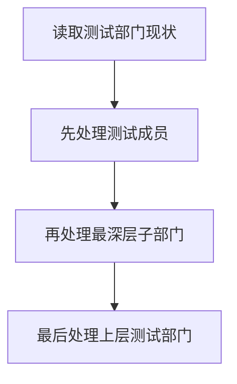
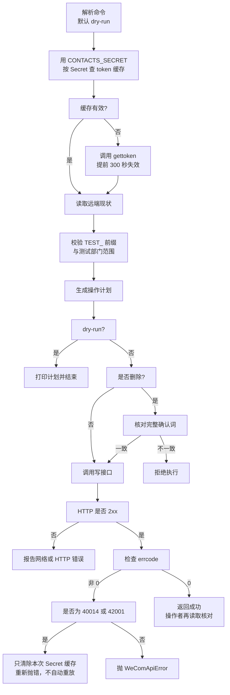

# 第 15 章：Python 修改企业微信通讯录

> 本章定位：建立后续 Python 章节共用的企业微信客户端，并以默认演练模式安全地创建、修改和删除测试部门与测试成员。

## 本章目标

本章从“只读”开始，逐步得到一个可复用、可审计、默认不写入的通讯录工具。完成后你将能够：

1. 用通讯录 Secret 读取部门与成员，而不是误用应用 Secret
2. 用公共 `WeComClient` 统一处理 token、HTTP 和企业微信业务错误
3. 在 token 明确无效或过期时，只清除对应 Secret 的缓存，不在客户端内自动重放请求
4. 只对名称或 UserId 以 `TEST_` 开头的对象做写操作
5. 默认用 dry-run 打印计划，显式加 `--execute` 才真正调用写接口
6. 删除前再次输入完整确认词，防止脚本参数写错后直接删数据
7. 让第 16、17 章直接复用同一个客户端

本章统一使用 **Python 3.12** 与 `requests`：

```bash
python --version
pip install "requests>=2.32,<3"
```

## 前置条件

- 已完成第 1 章的企业、自建应用与通讯录权限配置
- 准备一个名称以 `TEST_` 开头的专用测试根部门，并记下部门 ID
- 已确认当前 `CONTACTS_SECRET` 只能用于你获准操作的通讯录范围
- 所有示例先在测试企业或隔离测试部门执行

## 开始前必须明确的边界

通讯录写接口能影响员工账号和组织结构，风险比发一条测试消息高得多。先约定四条边界：

- **只在测试企业或明确的测试部门练习。**不要在真实组织根部门下试删改。
- 通讯录接口使用 `CONTACTS_SECRET`；`APP_SECRET` 仍用于应用消息，二者不能混用。
- `WeComClient` 只负责可靠调用接口；“只准操作测试对象”的规则放在 `ContactService`，这样后章能复用客户端但不会绕过各自的安全设计。
- 示例没有真实姓名、手机号、邮箱或 Secret。请继续使用 `TEST_` 前缀和虚构值。

建议先在企业微信管理后台建立一个测试部门，例如 `TEST_API_SANDBOX`，记下它的部门 ID。后文把它称为“测试根部门”。

配置文件沿用前章名称：

```python
# config.py：包含机密，不要提交
CORP_ID = "你的企业ID"
AGENT_ID = 1000002
APP_SECRET = "你的应用Secret"
CONTACTS_SECRET = "你的通讯录Secret"
BASE_URL = "https://qyapi.weixin.qq.com/cgi-bin"
CONN_STR = (
    "DRIVER={ODBC Driver 18 for SQL Server};"
    "SERVER=localhost;DATABASE=WeComTutorial;"
    "Trusted_Connection=yes;TrustServerCertificate=yes;"
)
```

`AGENT_ID`、`APP_SECRET` 和 `CONN_STR` 本章暂时不用，但保留统一配置，后续章节不再换名字。

## 版本与目录

| 版本 | 主题 | 解决上一版什么问题 |
|---|---|---|
| V1 | 只读部门与成员 | —— |
| V2 | 公共 `WeComClient` | 每个接口都重复写 token 和错误判断 |
| V3 | 测试部门写操作 | 还不能安全验证部门创建与更新 |
| V4 | 测试成员写操作 | 只会改部门，不会处理成员 |
| V5 | dry-run 与删除确认 | 参数写错就可能真的修改或删除 |
| V6 | 命令行集成 | 代码片段零散，无法给后章复用 |

最终目录如下，不要求现在一次建完：

```text
wecom-contact/
├─ config.py                 # 真实配置，不提交
├─ config.example.py         # 空值模板
├─ wecom_client.py           # V2 起：后章复用的 HTTP 客户端
├─ contact_service.py        # V3 起：测试对象安全规则与通讯录操作
└─ contact_cli.py            # V6：命令行入口，默认 dry-run
```

---

# V1：先读取，不修改

## 上一版的问题

这是第一版，还没有上一版。我们先不碰写接口，只验证三件事：Secret 是否正确、应用能看到哪些部门、成员字段长什么样。

如果一上来就写“创建后再删除”的代码，Secret 或部门 ID 配错时，很难判断到底是权限问题还是写入逻辑问题。

## 简单代码

新建 `v1_read.py`：

```python
# -*- coding: utf-8 -*-
"""V1：只读通讯录，不做任何修改。"""

import requests
import config


def get_json(path, params):
    response = requests.get(
        f"{config.BASE_URL}/{path}", params=params, timeout=10)
    response.raise_for_status()                 # 第一层：HTTP 必须是 2xx
    result = response.json()
    if result.get("errcode") != 0:             # 第二层：企业微信业务码
        raise RuntimeError(f"接口失败：{result}")
    return result


token_result = get_json("gettoken", {
    "corpid": config.CORP_ID,
    "corpsecret": config.CONTACTS_SECRET,      # 不是 APP_SECRET
})
token = token_result["access_token"]

departments = get_json("department/list", {
    "access_token": token,
}).get("department", [])

for department in departments:
    print(department["id"], department["name"], department.get("parentid"))
```

运行：

```bash
python v1_read.py
```

看到的只是当前通讯录 Secret **有权可见**的部门，不一定是整家公司。

## 重要行解释

```python
{"corpsecret": config.CONTACTS_SECRET}
```

通讯录读取和修改依赖通讯录权限。误用 `APP_SECRET` 时，token 可能获取成功，但后面的通讯录接口会报无权限。这就是“HTTP 成功、token 也有值，但业务仍失败”的典型情况。

```python
response.raise_for_status()
if result.get("errcode") != 0:
    raise RuntimeError(f"接口失败：{result}")
```

两层都要检查：HTTP 2xx 只表示服务器给了响应；`errcode == 0` 才表示企业微信接受了业务请求。

## 验证成员读取

先挑一个测试部门 ID，再追加：

```python
test_department_id = 2   # 替换为测试根部门 ID
members = get_json("user/list", {
    "access_token": token,
    "department_id": test_department_id,
    "fetch_child": 0,
}).get("userlist", [])

for member in members:
    print(member["userid"], member.get("name"), member.get("department", []))
```

`fetch_child=0` 表示只读这个部门，不递归子部门。开发阶段范围越小越容易核对。

## V1 的问题

每加一个接口，都要重复获取 token、拼 URL、检查 HTTP、检查 `errcode`。而且异常只打印整个字典，不知道该查什么。

---

# V2：封装公共 WeComClient

## 上一版的问题

V1 能读数据，但请求逻辑全挤在业务代码里。后面有十几个接口，如果复制粘贴，迟早会漏掉超时或 `errcode` 检查。

这一版只解决“可靠调用接口”，暂时不写部门和成员业务。

## 唯一公共契约

从本节起，第 15 章以及所有后续章节只使用这一套公共客户端契约：

- 构造：`WeComClient(corp_id, base_url)`
- 读取：`get(path, secret, params=None)`
- 写入：`post(path, secret, payload)`
- 精确清缓存：`clear_token_cache(secret)`
- 业务异常：`WeComApiError.errcode`、`WeComApiError.errmsg`、`WeComApiError.api`
- 传输异常：`WeComTransportError.kind`、`WeComTransportError.result_unknown`、`WeComTransportError.api`

Secret 必须由业务服务显式传给 `get()` 或 `post()`。后续章节只能导入并复用这个 `wecom_client.py`，不得重新定义客户端、改成无参构造、隐式绑定 Secret，或另造 `get_json()`、`post_json()` 和新的异常类型。V1 的直接 `requests` 代码只是教学过渡，从 V2 起不再作为公共接口。

## 完整客户端

新建 `wecom_client.py`：

```python
# -*- coding: utf-8 -*-
"""企业微信 HTTP 客户端；第 15～17 章共用。"""

import time
import requests


TOKEN_INVALID_ERRCODES = {40014, 42001}


class WeComApiError(RuntimeError):
    """企业微信业务错误；errcode/errmsg/api 是公共属性。"""

    def __init__(self, errcode, errmsg, api):
        self.errcode = errcode
        self.errmsg = errmsg
        self.api = api
        super().__init__(
            f"{api} 失败：errcode={errcode}, errmsg={errmsg}\n"
            f"查询：https://open.work.weixin.qq.com/devtool/query?e={errcode}")

    @property
    def code(self):
        """只读兼容别名；新代码请使用 errcode。"""
        return self.errcode

    @property
    def message(self):
        """只读兼容别名；新代码请使用 errmsg。"""
        return self.errmsg


class WeComTransportError(RuntimeError):
    """传输层错误；异常文本不包含 URL、Secret 或 token。"""

    def __init__(self, api, kind, result_unknown=False):
        self.api = api
        self.kind = kind
        self.result_unknown = result_unknown
        suffix = "，请求结果未知" if result_unknown else ""
        super().__init__(f"{api} 传输失败：{kind}{suffix}")


class WeComClient:
    """统一处理 token 缓存、HTTP 状态与 errcode。"""

    def __init__(self, corp_id, base_url):
        self.corp_id = corp_id
        self.base_url = base_url.rstrip("/")
        self.timeout = 10
        self._session = requests.Session()
        self._token_cache = {}                  # 键是 Secret，不能只存一份

    def get_token(self, secret):
        cached = self._token_cache.get(secret)
        if cached and cached["expire_at"] > time.time():
            return cached["token"]

        result = self._request_raw("GET", "gettoken", params={
            "corpid": self.corp_id,
            "corpsecret": secret,
        })
        token = result["access_token"]
        self._token_cache[secret] = {
            "token": token,
            "expire_at": time.time() + result.get("expires_in", 7200) - 300,
        }
        return token

    def clear_token_cache(self, secret):
        """只清除指定 Secret 的 token；不存在时也视为成功。"""
        self._token_cache.pop(secret, None)

    def get(self, path, secret, params=None):
        try:
            query = dict(params or {})
            query["access_token"] = self.get_token(secret)
            return self._request_raw("GET", path, params=query)
        except WeComApiError as ex:
            if ex.errcode in TOKEN_INVALID_ERRCODES:
                self.clear_token_cache(secret)
            # 只清缓存并重新抛错；客户端绝不自动重放本次业务请求。
            raise

    def post(self, path, secret, payload):
        try:
            params = {"access_token": self.get_token(secret)}
            return self._request_raw("POST", path, params=params, payload=payload)
        except WeComApiError as ex:
            if ex.errcode in TOKEN_INVALID_ERRCODES:
                self.clear_token_cache(secret)
            # 是否再次调用由业务层按副作用判断，客户端不代替业务层决定。
            raise

    def _request_raw(self, method, path, params=None, payload=None):
        api = path.lstrip("/")
        try:
            response = self._session.request(
                method,
                f"{self.base_url}/{api}",
                params=params,
                json=payload,
                timeout=self.timeout,
            )
            response.raise_for_status()          # 先确认 HTTP 2xx
            result = response.json()
        except requests.exceptions.Timeout as ex:
            raise WeComTransportError(
                api, "Timeout", result_unknown=True) from ex
        except requests.exceptions.HTTPError as ex:
            status = ex.response.status_code if ex.response is not None else "unknown"
            unknown = isinstance(status, int) and status >= 500
            raise WeComTransportError(
                api, f"HTTP {status}", result_unknown=unknown) from ex
        except requests.exceptions.JSONDecodeError as ex:
            # 已得到响应却无法解析 JSON，不能据此断定服务端未执行。
            raise WeComTransportError(
                api, "InvalidJson", result_unknown=True) from ex
        except requests.exceptions.RequestException as ex:
            # 不拼 str(ex)：其中可能带含 Secret/token 的完整 URL。
            raise WeComTransportError(
                api, type(ex).__name__, result_unknown=True) from ex

        if result.get("errcode") != 0:           # HTTP 2xx 后仍必须检查
            raise WeComApiError(
                result.get("errcode", -1),
                result.get("errmsg", "未知错误"),
                api,
            )
        return result
```

调用端：

```python
import config
from wecom_client import WeComClient

client = WeComClient(config.CORP_ID, config.BASE_URL)
result = client.get("department/list", config.CONTACTS_SECRET)
print(len(result.get("department", [])))
```

## 重要行解释

### token 必须按 Secret 分开缓存

```python
self._token_cache = {}
cached = self._token_cache.get(secret)
```

同一企业的 `APP_SECRET` 和 `CONTACTS_SECRET` 对应不同权限。若只用一个全局 token，后取得的会覆盖先取得的，错误会随机出现。

### token 无效时只清除对应 Secret

```python
TOKEN_INVALID_ERRCODES = {40014, 42001}
self._token_cache.pop(secret, None)
```

`40014` 和 `42001` 表示企业微信明确判定当前 token 不合法或已过期。`get()` / `post()` 捕获这两个业务码时，只删除**本次调用所用 Secret**的缓存，并把原 `WeComApiError` 重新抛给调用方；其他 Secret 的 token 不受影响。

客户端绝不在这里自动再次调用业务接口。下一次由业务层发起的 `get()` / `post()` 会因为缓存已清除而自然获取新 token，但是否允许“再调用一次”必须按业务副作用决定：只读查询可由第 23 章的安全重试层处理，创建、删除和消息发送等非安全操作不能因为刷新 token 就被隐式重放。

公开的 `clear_token_cache(secret)` 也只精确清除一个 Secret，供需要主动失效缓存的调用方使用；不要提供不分权限来源的全局清空作为常规路径。

### 提前 300 秒失效

```python
{"expire_at": time.time() + result.get("expires_in", 7200) - 300}
```

不要卡着服务端到期秒数使用。提前 5 分钟可以覆盖本机时钟偏差、网络传输和请求排队时间。

### 统一抛 `WeComApiError`

```python
raise WeComApiError(errcode, errmsg, api)
```

新代码统一读取 `error.errcode`、`error.errmsg` 和 `error.api`。`code`、`message` 仅作为迁移旧示例的只读兼容别名，后文不再推荐。这样第 17 章可以直接根据 `error.errcode` 判断“退避重试”还是“立即停止”，不必用正则表达式猜错误码。

### 传输异常为什么不能拼原始 URL

```python
raise WeComTransportError(api, type(ex).__name__, result_unknown=True)
```

`requests` 的原始异常文本可能包含完整 URL；`gettoken` URL 带 Secret，其他接口 URL 带 token。公共客户端只保留接口名、异常类型和“结果是否未知”，不能把 `str(ex)` 直接写日志或数据库。

### “结果未知”必须由业务层解释

超时、连接中断、HTTP 5xx 或无效 JSON 都可能让客户端无法确认服务端结果，因此 `result_unknown=True` 表示“请求结果未知”，不等同于“远端一定发生了写入”。明确的 HTTP 4xx 会设置 `result_unknown=False`，表示这类客户端请求错误不应作为“不确定临时错误”重试。只有业务层知道接口是否有副作用；创建、删除等操作遇到结果未知时必须先读取现状或转人工，不能盲目重试。普通读取也可能结果未知，但不会因此产生远端变更。

尤其不能只按 HTTP 方法判断副作用：企业微信部分删除接口使用 GET。第 23 章只有在调用方声明 `safe=True` 且 `result_unknown=True` 时，才会对传输错误做有限重试。

## V2 的问题

客户端已经可靠，但它并不知道哪些对象可以修改。现在直接调用 `client.post("department/delete", ...)` 仍然可能删到真实部门。

---

# V3：创建和修改测试部门

## 上一版的问题

V2 解决了网络和错误处理，却没有业务安全边界。这一版增加服务层，只允许名称以 `TEST_` 开头、且位于测试根部门内的部门。

## 简单代码

新建 `contact_service.py`，先实现部门部分：

```python
# -*- coding: utf-8 -*-
"""通讯录业务层：默认只演练，只允许明确测试对象。"""

TEST_PREFIX = "TEST_"


class ContactService:
    def __init__(self, client, secret, test_root_department_id, dry_run=True):
        self.client = client
        self.secret = secret
        self.test_root_department_id = test_root_department_id
        self.dry_run = dry_run

    def list_departments(self):
        result = self.client.get("department/list", self.secret)
        return result.get("department", [])

    def _safe_department_ids(self):
        """只信任测试根部门和名称带 TEST_ 的后代。"""
        departments = self.list_departments()
        by_id = {item["id"]: item for item in departments}
        root = by_id.get(self.test_root_department_id)
        if root is None:
            raise ValueError("测试根部门 ID 不存在")
        if not root.get("name", "").startswith(TEST_PREFIX):
            raise ValueError("测试根部门远端名称必须以 TEST_ 开头")

        safe = {self.test_root_department_id}
        changed = True
        while changed:
            changed = False
            for item in departments:
                parent_id = item.get("parentid")
                if (item.get("name", "").startswith(TEST_PREFIX)
                        and parent_id in safe and item["id"] not in safe):
                    safe.add(item["id"])
                    changed = True
        return safe

    def create_department(self, name, parent_id, order=1):
        if not name.startswith(TEST_PREFIX):
            raise ValueError("测试部门名称必须以 TEST_ 开头")
        if parent_id not in self._safe_department_ids():
            raise ValueError("父部门不是已确认的测试部门")

        payload = {"name": name, "parentid": parent_id, "order": order}
        if self.dry_run:
            print("[dry-run] 将创建部门：", payload)
            return None
        return self.client.post("department/create", self.secret, payload)["id"]

    def update_department(self, department_id, new_name, order=1):
        if department_id == self.test_root_department_id:
            raise ValueError("测试根部门只能人工维护，脚本不允许改名")
        if department_id not in self._safe_department_ids():
            raise ValueError("目标不是 TEST_ 测试部门")
        if not new_name.startswith(TEST_PREFIX):
            raise ValueError("修改后的名称仍必须以 TEST_ 开头")

        payload = {"id": department_id, "name": new_name, "order": order}
        if self.dry_run:
            print("[dry-run] 将修改部门：", payload)
            return
        self.client.post("department/update", self.secret, payload)
```

使用：

```python
import config
from wecom_client import WeComClient
from contact_service import ContactService

client = WeComClient(config.CORP_ID, config.BASE_URL)
service = ContactService(
    client,
    config.CONTACTS_SECRET,
    test_root_department_id=2,   # 替换成 TEST_API_SANDBOX 的 ID
)
service.create_department("TEST_PYTHON_TEAM", parent_id=2)
```

默认输出计划，不会创建：

```text
[dry-run] 将创建部门： {'name': 'TEST_PYTHON_TEAM', 'parentid': 2, 'order': 1}
```

## 重要行解释

```python
if parent_id not in self._safe_department_ids():
    raise ValueError("父部门不是已确认的测试部门")
```

`_safe_department_ids()` 会先从远端确认测试根部门存在，而且根名称本身以 `TEST_` 开头。只把一个未经核对的数字 ID 当作根不安全：参数抄错时可能把真实部门纳入允许范围。

只检查新名称不够。若允许把 `TEST_` 部门建到真实部门下面，后续递归读取或删除仍可能波及真实组织。因此名称与父级要同时满足。测试根本身只能人工维护，脚本不允许改名或删除。

```python
if self.dry_run:
    print(...)
    return None
```

演练分支必须在调用 `client.post` **之前**返回。仅在日志里写“dry-run”但仍调接口，是无效防护。

## 验证

先保持默认 dry-run；确认计划正确后，临时创建 `dry_run=False` 的服务并创建一个测试部门。随后重新 `list_departments()`，应能找到它。

## V3 的问题

只能管理部门，不能创建测试成员。成员比部门多手机号、邮箱、所属部门等字段，更容易误写真实 PII。

---

# V4：创建和修改测试成员

## 上一版的问题

V3 已限制测试部门，但还不能验证成员接口。这一版要求 `userid` 和姓名都以 `TEST_` 开头，且成员只能进入测试部门。

## 追加代码

在 `ContactService` 中加入：

```python
    def get_user(self, user_id):
        return self.client.get(
            "user/get", self.secret, {"userid": user_id})

    def create_user(self, user_id, name, department_ids):
        if not user_id.startswith(TEST_PREFIX):
            raise ValueError("测试 UserId 必须以 TEST_ 开头")
        if not name.startswith(TEST_PREFIX):
            raise ValueError("测试姓名必须以 TEST_ 开头")

        safe_ids = self._safe_department_ids()
        if not department_ids or set(department_ids) - safe_ids:
            raise ValueError("成员只能放进已确认的测试部门")

        payload = {
            "userid": user_id,
            "name": name,
            "department": department_ids,
        }
        if self.dry_run:
            print("[dry-run] 将创建成员：", payload)
            return
        self.client.post("user/create", self.secret, payload)

    def update_user(self, user_id, name, department_ids):
        if not user_id.startswith(TEST_PREFIX):
            raise ValueError("只允许修改 TEST_ UserId")
        current = self.get_user(user_id)
        if not current.get("name", "").startswith(TEST_PREFIX):
            raise ValueError("远端现有成员不是测试对象")

        safe_ids = self._safe_department_ids()
        current_ids = set(current.get("department", []))
        if not current_ids or current_ids - safe_ids:
            raise ValueError("远端现有成员不完全位于测试部门")
        if not name.startswith(TEST_PREFIX):
            raise ValueError("修改后的姓名仍必须以 TEST_ 开头")

        if not department_ids or set(department_ids) - safe_ids:
            raise ValueError("成员只能放进已确认的测试部门")

        payload = {
            "userid": user_id,
            "name": name,
            "department": department_ids,
        }
        if self.dry_run:
            print("[dry-run] 将修改成员：", payload)
            return
        self.client.post("user/update", self.secret, payload)
```

调用示例只用虚构数据：

```python
service.create_user(
    user_id="TEST_PY_001",
    name="TEST_接口练习账号",
    department_ids=[2],
)
```

手机号和邮箱不是创建练习所必需，所以示例不填写。需要测试时也应使用专门测试号码和测试邮箱，不能把真实员工资料写进教程、日志或截图。

## 重要行解释

```python
current = self.get_user(user_id)
```

更新前重新读取，是为了确认远端当前对象仍是测试对象。不能只相信命令行传入的 UserId，因为参数可能抄错。

```python
set(department_ids) - safe_ids
```

差集非空说明至少有一个部门不在允许集合中。一个成员可以属于多个部门，所以必须检查全部部门，不能只检查第一个。

## V4 的问题

创建和更新已有测试前缀保护，但仍缺两个总闸门：所有写操作默认演练，以及删除时的第二次人工确认。

---

# V5：加入 dry-run 与删除二次确认

## 上一版的问题

V4 的 `dry_run` 已能拦普通写入，但删除是不可逆动作。仅靠 `--execute` 一个开关不够：复制错部门 ID 时，脚本会立即执行。

## 删除测试成员

在 `ContactService` 中加入：

```python
    def delete_user(self, user_id, confirmation=None):
        if not user_id.startswith(TEST_PREFIX):
            raise ValueError("只允许删除 TEST_ UserId")
        current = self.get_user(user_id)
        if not current.get("name", "").startswith(TEST_PREFIX):
            raise ValueError("远端现有成员不是测试对象")
        safe_ids = self._safe_department_ids()
        current_ids = set(current.get("department", []))
        if not current_ids or current_ids - safe_ids:
            raise ValueError("远端现有成员不完全位于测试部门")

        if self.dry_run:
            print(f"[dry-run] 将删除成员：{user_id}")
            return

        expected = f"DELETE USER {user_id}"
        if confirmation != expected:
            raise ValueError(f"删除未执行；必须完整输入：{expected}")
        self.client.get("user/delete", self.secret, {"userid": user_id})
```

## 删除测试部门

```python
    def delete_department(self, department_id, confirmation=None):
        safe_ids = self._safe_department_ids()
        if department_id == self.test_root_department_id:
            raise ValueError("测试根部门不能由脚本删除")
        if department_id not in safe_ids:
            raise ValueError("只允许删除 TEST_ 测试部门")

        if self.dry_run:
            print(f"[dry-run] 将删除部门：{department_id}")
            return

        expected = f"DELETE DEPARTMENT {department_id}"
        if confirmation != expected:
            raise ValueError(f"删除未执行；必须完整输入：{expected}")
        self.client.get("department/delete", self.secret, {"id": department_id})
```

这里用 GET 是因为企业微信的删除成员、删除部门接口就是通过 URL 参数调用，不应为了“删除看起来像 POST”擅自改变官方协议。

## 重要行解释

```python
expected = f"DELETE USER {user_id}"
if confirmation != expected:
    raise ValueError(f"删除未执行；必须完整输入：{expected}")
```

`--execute` 只打开普通写操作；删除还必须输入包含动作与目标 ID 的完整确认词。两道闸门缺一不可。

## 为什么确认词包含对象 ID

只输入 `YES` 太容易形成肌肉记忆。要求输入：

```text
DELETE USER TEST_PY_001
```

会迫使操作者再次看一遍动作和目标。部门删除同理。

## 删除顺序

企业微信通常不允许直接删除仍有成员或子部门的部门。安全顺序是：



本章不提供“递归一键清空”，因为它会把一次误操作放大成批量删除。

## V5 的问题

安全规则已经齐全，但调用仍散落在临时脚本里，后续章节也没有统一的导入入口。

---

# V6：整合命令行入口

## 上一版的问题

V5 的功能可用但不方便复查。最终版把动作放进命令行，默认 dry-run；只有显式 `--execute` 才写入，删除还必须交互确认。

## `contact_cli.py`

```python
# -*- coding: utf-8 -*-
"""安全的企业微信通讯录命令行。默认只演练。"""

import argparse
import config
from wecom_client import WeComClient
from contact_service import ContactService


def build_parser():
    parser = argparse.ArgumentParser(description="企业微信测试通讯录工具")
    parser.add_argument("--test-root", type=int, required=True,
                        help="TEST_ 测试根部门 ID")
    parser.add_argument("--execute", action="store_true",
                        help="真正执行；不加时为 dry-run")

    commands = parser.add_subparsers(dest="command", required=True)
    commands.add_parser("list-departments")

    create_department = commands.add_parser("create-department")
    create_department.add_argument("--name", required=True)
    create_department.add_argument("--parent-id", type=int, required=True)

    update_department = commands.add_parser("update-department")
    update_department.add_argument("--id", type=int, required=True)
    update_department.add_argument("--name", required=True)

    create_user = commands.add_parser("create-user")
    create_user.add_argument("--userid", required=True)
    create_user.add_argument("--name", required=True)
    create_user.add_argument("--department-id", type=int, required=True)

    update_user = commands.add_parser("update-user")
    update_user.add_argument("--userid", required=True)
    update_user.add_argument("--name", required=True)
    update_user.add_argument("--department-id", type=int, required=True)

    delete_user = commands.add_parser("delete-user")
    delete_user.add_argument("--userid", required=True)

    delete_department = commands.add_parser("delete-department")
    delete_department.add_argument("--id", type=int, required=True)
    return parser


def main():
    args = build_parser().parse_args()
    client = WeComClient(config.CORP_ID, config.BASE_URL)
    service = ContactService(
        client,
        config.CONTACTS_SECRET,
        test_root_department_id=args.test_root,
        dry_run=not args.execute,
    )

    if args.command == "list-departments":
        for item in service.list_departments():
            print(item["id"], item["name"], item.get("parentid"))
    elif args.command == "create-department":
        service.create_department(args.name, args.parent_id)
    elif args.command == "update-department":
        service.update_department(args.id, args.name)
    elif args.command == "create-user":
        service.create_user(args.userid, args.name, [args.department_id])
    elif args.command == "update-user":
        service.update_user(args.userid, args.name, [args.department_id])
    elif args.command == "delete-user":
        confirmation = None
        if args.execute:
            confirmation = input("请输入删除确认词：").strip()
        service.delete_user(args.userid, confirmation)
    elif args.command == "delete-department":
        confirmation = None
        if args.execute:
            confirmation = input("请输入删除确认词：").strip()
        service.delete_department(args.id, confirmation)


if __name__ == "__main__":
    main()
```

## 重要行解释

```python
dry_run=not args.execute
```

不加 `--execute` 时值为 `True`，这是默认安全状态。命令行参数只负责表达意图，`ContactService` 内仍会再次校验 `TEST_` 前缀、远端测试根名称和部门范围。

```python
confirmation = input("请输入删除确认词：").strip()
```

交互确认只在真实执行删除时出现；dry-run 不要求输入，但仍会读取远端对象并验证它确实属于测试范围。

## 使用顺序

先只读：

```bash
python contact_cli.py --test-root 2 list-departments
```

再演练：

```bash
python contact_cli.py --test-root 2 create-user \
  --userid TEST_PY_001 --name TEST_接口练习账号 --department-id 2
```

确认计划后才执行：

```bash
python contact_cli.py --test-root 2 --execute create-user \
  --userid TEST_PY_001 --name TEST_接口练习账号 --department-id 2
```

删除时即使有 `--execute`，仍要输入完整确认词。

## 关于日志

生产化时可以把动作、接口名、对象 ID、`errcode` 和耗时写入日志，但不要记录以下内容：

- 完整 token 或 Secret
- 手机号、邮箱等 PII 全文
- 整个请求与响应 JSON

排错需要标识对象时，优先记录 `TEST_` UserId 或数据库内部任务 ID。

---

# 完整请求流



最后一步是本章要求的人工验证流程，不表示当前 `ContactService` 会自动发第二次请求。创建或更新后应重新运行只读命令核对 ID、名称和部门；删除后确认目标已不可读。

# 自测与故障排查

## 自测表

| 测试 | 做法 | 期望结果 |
|---|---|---|
| 1 通讯录 Secret | 运行只读命令 | 能列出授权范围内部门 |
| 2 Secret 分缓存 | 分别用两个 Secret 取 token | 缓存中是两项，不互相覆盖 |
| 3 精确清缓存 | 预置两个 Secret 的缓存，对其中一个调用 `clear_token_cache()` | 只删除目标 Secret |
| 4 token 失效 | 模拟业务接口返回 `40014` 或 `42001` | 清除本次 Secret 并抛原错误，客户端只调用业务接口一次 |
| 5 提前失效 | 查看 `expire_at` 计算 | 比官方有效期提前 300 秒 |
| 6 HTTP 检查 | 临时改错 `BASE_URL` | 报网络或 HTTP 错误 |
| 7 业务检查 | 改错 Secret | 抛 `WeComApiError`，含 `errcode` |
| 8 默认演练 | 不加 `--execute` 创建 | 只打印计划，远端无变化 |
| 9 前缀保护 | 名称写成 `研发部` | 本地立即拒绝 |
| 10 部门范围 | 指向真实部门 ID | 本地立即拒绝 |
| 11 成员双检查 | 只让 UserId 带前缀、姓名不带 | 本地立即拒绝 |
| 12 删除确认 | 输入 `YES` | 拒绝并提示完整确认词 |
| 13 删除测试成员 | 输入完整确认词 | 仅目标 `TEST_` 成员被删 |
| 14 测试根保护 | 尝试删除测试根部门 | 始终拒绝 |

## 故障排查

| 现象 | 常见原因 | 解决 |
|---|---|---|
| token 成功但通讯录接口无权限 | 用了 `APP_SECRET` | 改用 `CONTACTS_SECRET`，检查通讯录权限 |
| `errcode=40014/42001` | 当前 Secret 对应 token 无效或过期 | 客户端只清除该 Secret 缓存并抛错；由业务层判断是否安全重试，禁止自动重放发送或删除 |
| 只能看到少数部门 | Secret 的可见范围有限 | 到管理后台核对授权范围 |
| `department/list` 为空 | 权限、Secret 或企业 ID 配错 | 先回到 V1，只做读取排查 |
| 创建成员提示参数错误 | UserId、名称或部门字段不符合要求 | 打印 dry-run 计划，逐项核对 |
| 删除部门失败 | 仍有成员或子部门 | 先处理成员，再从最深层子部门开始 |
| 加了 `--execute` 仍未删除 | 确认词不完整 | 按提示输入包含对象 ID 的完整确认词 |
| 请求超时 | 网络抖动或服务端未及时响应 | 先重新读取现状，不要直接重复创建/删除 |
| 日志泄露 token | 打印了完整 URL 或响应 | 删除日志、重置 Secret，并改为脱敏记录 |

# 完成清单

## 理解部分

- [ ] 知道 `APP_SECRET` 与 `CONTACTS_SECRET` 为什么不能共用 token
- [ ] 能解释为什么 HTTP 2xx 后仍要检查 `errcode`
- [ ] 能解释 token 为什么按 Secret 缓存并提前 300 秒失效
- [ ] 知道 `40014/42001` 时为何只清除当前 Secret 且不在客户端自动重放
- [ ] 知道超时为何不能证明写操作没有发生
- [ ] 能说明客户端层和测试安全服务层为何分开
- [ ] 知道删除为什么比普通更新多一道确认

## 操作部分

- [ ] Python 版本为 3.12，`requests>=2.32,<3` 已安装
- [ ] V1 只读测试通过
- [ ] `WeComApiError` 能通过 `errcode`、`errmsg`、`api` 保留业务错误信息
- [ ] `WeComTransportError` 保留 `kind` 与 `result_unknown`
- [ ] `clear_token_cache(secret)` 只删除指定 Secret 的缓存
- [ ] `get()` / `post()` 收到 `40014/42001` 后清缓存并重新抛错，不自动再次调用接口
- [ ] 不加 `--execute` 时所有写操作均不发生
- [ ] 非 `TEST_` 对象与非测试部门均被拒绝
- [ ] 删除必须输入包含对象 ID 的完整确认词
- [ ] `wecom_client.py` 可被第 16、17 章直接导入

# 参考资料

- [企业微信官方：获取 access_token](https://developer.work.weixin.qq.com/document/path/91039)
- [企业微信官方：创建部门](https://developer.work.weixin.qq.com/document/path/90205)
- [企业微信官方：更新部门](https://developer.work.weixin.qq.com/document/path/90206)
- [企业微信官方：删除部门](https://developer.work.weixin.qq.com/document/path/90207)
- [企业微信官方：获取部门列表](https://developer.work.weixin.qq.com/document/path/90208)
- [企业微信官方：创建成员](https://developer.work.weixin.qq.com/document/path/90195)
- [企业微信官方：读取成员](https://developer.work.weixin.qq.com/document/path/90196)
- [企业微信官方：更新成员](https://developer.work.weixin.qq.com/document/path/90197)
- [企业微信官方：删除成员](https://developer.work.weixin.qq.com/document/path/90198)
- [企业微信官方：获取部门成员详情](https://developer.work.weixin.qq.com/document/path/90201)

以上外部资料仅用于核对接口字段、权限与行为；**外部内容已重新表述，以符合许可限制。**实际限制和错误码可能调整，上线前请再次核对官方文档。