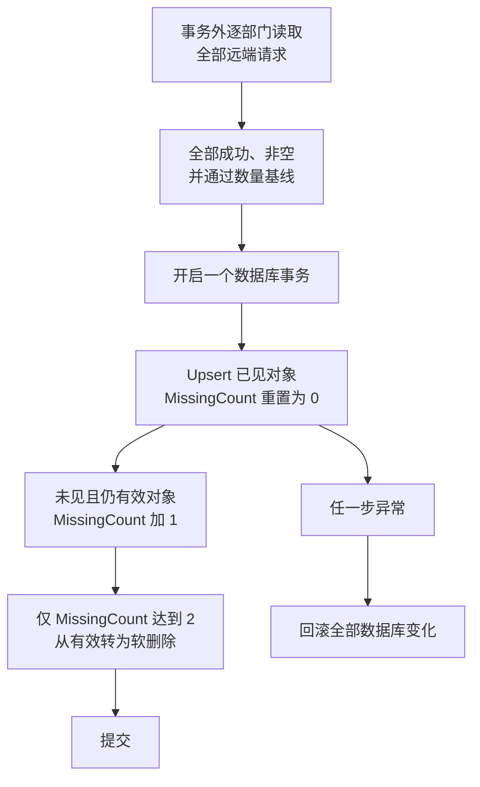
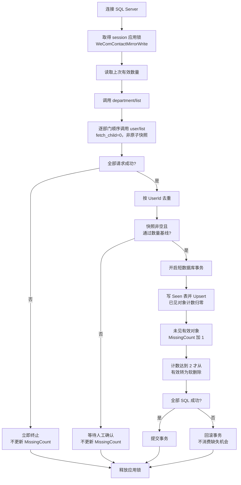

# 第 16 章：Python 同步企业微信通讯录到 SQL Server

> 本章定位：把企业微信通讯录完整拉取到 SQL Server 镜像表；只有连续两次完整、通过数量闸门的快照都未出现某对象，才允许在事务中软删除它。

## 本章目标

上一章解决了“怎样可靠调用通讯录接口”。本章只做一个方向：

```text
企业微信通讯录  ──完整快照──>  SQL Server 镜像表
```

完成后你将得到：

1. `WeComDepartment`、`WeComEmployee` 两张只读镜像表
2. 可重复执行、不会删表重建的幂等 migration
3. 以 `DeptId`、`UserId` 为稳定键的 Upsert
4. “连续两次合格完整快照均缺失”这道软删除闸门
5. 一个数据库事务内的 Upsert、恢复和软删除
6. 可供员工查询页面读取的本地快照

本章统一使用 **Python 3.12**、第 15 章的 `requests` 客户端与 **pyodbc 5.3**：

```bash
python --version
pip install "requests>=2.32,<3" "pyodbc>=5.3,<5.4"
```

## 前置条件

- 已完成第 15 章，`wecom_client.py` 可按 `CONTACTS_SECRET` 读取通讯录
- SQL Server 数据库已创建，机器已安装与 `CONN_STR` 对应的 ODBC Driver
- 当前通讯录权限范围已经过管理员确认，并有可用于数量基线的首次快照
- 已决定镜像表只允许遵守 `WeComContactMirrorWrite` 单写者协议的任务写入，C# 页面只读

## 数据源与安全边界

### 唯一数据源

本章方向中，**企业微信是唯一数据源**。SQL Server 表只是镜像：

- 可以给查询页面、报表和历史关联读取
- 不能在表里手工改姓名后期待企业微信跟着变化
- 不能把这两张表反向推回企业微信
- 第 17 章会另建 `HrDepartment`、`HrEmployee` 与 Outbox，绝不反推本章镜像表

### “完整”是什么意思

这里的“完整拉取”是指：**在当前 `CONTACTS_SECRET` 授权可见范围内，所有计划中的 `department/list` 与 `user/list` 请求都成功完成。**

“完整”不等于“原子”。`user/list` 是逐部门顺序请求，企业微信不会替本任务冻结某一时刻的全局通讯录；成员跨部门移动时可能在一轮中短暂两边都未读到。因此单次完整快照的缺失只累计一次，不能立即软删除。

它不保证覆盖整家公司。若管理员缩小 Secret 权限，程序看到的快照也会变小。生产环境应额外设置数量基线或人工审批，防止权限变化在连续两轮中被误判为大量离职。

### 与前章表所有权的关系

第 3 章曾把镜像表交给 C# WebForms 示例写入。采用本章后，C# 页面和其他未协调程序只能读取。第 16 章全量任务与第 24 章回调增量任务都可以是合法写入者，但任一时刻只能有一个写入者：两条路径必须在同一 SQL Server 数据库中取得同名 `WeComContactMirrorWrite` 应用锁后才能读取远端状态和写镜像。第 11 章的 `SyncFlag` 只能作为“需要运行一次 Python 同步”的信号，不能绕过这项协议直接写表。

## 版本与目录

| 版本 | 主题 | 解决上一版什么问题 |
|---|---|---|
| V1 | 读取部门和成员 | —— |
| V2 | 幂等 migration | 数据无处保存，重复部署可能破坏旧表 |
| V3 | Upsert 部门 | 只能把快照留在内存 |
| V4 | Upsert 成员 | 镜像只有组织结构，没有员工 |
| V5 | 连续缺失后软删除 | 逐部门顺序读取不是原子快照，跨部门移动可能造成单次假缺失 |
| V6 | 全量同步入口 | 步骤分散，事务与失败闸门不统一 |

最终目录：

```text
wecom-contact/
├─ config.py
├─ wecom_client.py             # 第 15 章复用
├─ migrations/
│  └─ 016_contact_mirror.sql   # 幂等 migration
├─ contact_reader.py           # 完整拉取与快照校验
├─ mirror_repository.py        # 参数化 SQL、事务内写镜像
└─ contact_sync.py             # V6 全量同步入口，可导入 sync_all
```

---

# V1：读取部门和成员

## 上一版的问题

这是本章第一版。第 15 章只验证过一个测试部门；要做镜像，必须读取授权范围内全部部门，并处理“一名员工属于多个部门”造成的重复。

## 简单代码

新建 `contact_reader.py`：

```python
# -*- coding: utf-8 -*-
"""从企业微信读取完整通讯录快照。"""


class ContactSnapshot:
    def __init__(self, departments, employees):
        self.departments = departments
        self.employees = employees


class ContactReader:
    def __init__(self, client, contacts_secret):
        self.client = client
        self.secret = contacts_secret

    def fetch_all(self):
        department_result = self.client.get(
            "department/list", self.secret)
        departments = department_result.get("department")
        if not isinstance(departments, list) or not departments:
            raise RuntimeError("部门列表缺失或为空，拒绝生成删除判断快照")

        employees_by_id = {}
        for department in departments:
            result = self.client.get("user/list", self.secret, {
                "department_id": department["id"],
                "fetch_child": 0,
            })
            user_list = result.get("userlist")
            if not isinstance(user_list, list):
                raise RuntimeError(
                    f"部门 {department['id']} 的 userlist 缺失，快照不完整")
            for employee in user_list:
                employees_by_id[employee["userid"]] = employee

        if not employees_by_id:
            raise RuntimeError("成员列表为空，可能是权限异常；拒绝继续")

        return ContactSnapshot(departments, list(employees_by_id.values()))
```

调用：

```python
import config
from wecom_client import WeComClient
from contact_reader import ContactReader

client = WeComClient(config.CORP_ID, config.BASE_URL)
snapshot = ContactReader(client, config.CONTACTS_SECRET).fetch_all()
print(f"部门 {len(snapshot.departments)}，成员 {len(snapshot.employees)}")
```

## 重要行解释

```python
{"fetch_child": 0}
```

我们逐个部门读取，所以不再递归子部门。若写成 `fetch_child=1`，上级部门会反复带回所有下级成员，数据量和重复量迅速增加。

```python
employees_by_id[employee["userid"]] = employee
```

一名成员可属于多个部门，逐部门读取时会出现多次。`UserId` 是稳定唯一键，用字典覆盖同一成员可以去重。

### `department/list` 的权限与性能限制

- 只返回当前通讯录 Secret 有权看到的组织范围；“没返回”不自动等于“已删除”。
- 部门树很大时，返回和解析都需要时间；要设置超时并记录部门数量。
- 管理员改变可见范围后，本次列表可能骤减，生产环境应与上次成功数量比较。

### `user/list` 的权限与性能限制

- 它按部门读取，成员字段还受通讯录字段权限影响；手机号、邮箱可能为空，不应当作接口失败。
- 逐部门调用会产生较多请求；不要在 Web 页面每次打开时现拉，应由定时任务同步。
- 一人多部门会重复返回，必须按 `UserId` 去重。
- 任一部门的读取失败，都不能把已读到的部分集合当成完整快照。

## V1 的问题

数据还只在内存里。下一步需要建表，但不能照第 3 章集成脚本那样先 `DROP TABLE`，否则每次升级都会丢镜像和历史关联。

---

# V2：设计幂等迁移

## 上一版的问题

V1 已能完整读取，但数据库没有稳定结构。部署脚本若重复执行报错，运维会被迫手工改库；若直接删表重建，又会破坏引用关系。

## migration

新建 `migrations/016_contact_mirror.sql`：

```sql
/* 幂等 migration：创建缺失对象并安全扩容旧列，不 DROP，不清空数据。 */
IF OBJECT_ID(N'dbo.WeComDepartment', N'U') IS NULL
BEGIN
    CREATE TABLE dbo.WeComDepartment (
        DeptId       INT NOT NULL,
        Name         NVARCHAR(100) NOT NULL,
        ParentId     INT NULL,
        OrderNo      BIGINT NULL,
        IsDeleted    BIT NOT NULL
            CONSTRAINT DF_WeComDepartment_IsDeleted DEFAULT 0,
        MissingCount INT NOT NULL
            CONSTRAINT DF_WeComDepartment_MissingCount DEFAULT 0,
        SyncedAt     DATETIME2(0) NOT NULL
            CONSTRAINT DF_WeComDepartment_SyncedAt DEFAULT SYSDATETIME(),
        CONSTRAINT PK_WeComDepartment PRIMARY KEY (DeptId)
    );
END;
GO

IF OBJECT_ID(N'dbo.WeComEmployee', N'U') IS NULL
BEGIN
    CREATE TABLE dbo.WeComEmployee (
        UserId       NVARCHAR(64) NOT NULL,
        Name         NVARCHAR(100) NULL,
        Mobile       NVARCHAR(32) NULL,
        Email        NVARCHAR(100) NULL,
        Position     NVARCHAR(100) NULL,
        MainDeptId   INT NULL,
        DeptIds      NVARCHAR(500) NULL,
        Enabled      BIT NULL,
        IsDeleted    BIT NOT NULL
            CONSTRAINT DF_WeComEmployee_IsDeleted DEFAULT 0,
        MissingCount INT NOT NULL
            CONSTRAINT DF_WeComEmployee_MissingCount DEFAULT 0,
        SyncedAt     DATETIME2(0) NOT NULL
            CONSTRAINT DF_WeComEmployee_SyncedAt DEFAULT SYSDATETIME(),
        CONSTRAINT PK_WeComEmployee PRIMARY KEY (UserId)
    );
END;
GO

/* 兼容第 3 章已创建的旧表。COL_LENGTH 对 nvarchar 返回字节数：
   nvarchar(200) 为 400，nvarchar(500) 为 1000，nvarchar(max) 为 -1。 */
IF COL_LENGTH(N'dbo.WeComEmployee', N'DeptIds') IS NULL
BEGIN
    ALTER TABLE dbo.WeComEmployee ADD DeptIds NVARCHAR(500) NULL;
END
ELSE IF COL_LENGTH(N'dbo.WeComEmployee', N'DeptIds') <> -1
    AND COL_LENGTH(N'dbo.WeComEmployee', N'DeptIds') < 1000
BEGIN
    ALTER TABLE dbo.WeComEmployee ALTER COLUMN DeptIds NVARCHAR(500) NULL;
END;
GO

IF COL_LENGTH(N'dbo.WeComDepartment', N'MissingCount') IS NULL
BEGIN
    ALTER TABLE dbo.WeComDepartment ADD MissingCount INT NOT NULL
        CONSTRAINT DF_WeComDepartment_MissingCount DEFAULT 0 WITH VALUES;
END;
GO

IF COL_LENGTH(N'dbo.WeComEmployee', N'MissingCount') IS NULL
BEGIN
    ALTER TABLE dbo.WeComEmployee ADD MissingCount INT NOT NULL
        CONSTRAINT DF_WeComEmployee_MissingCount DEFAULT 0 WITH VALUES;
END;
GO

IF NOT EXISTS (
    SELECT 1 FROM sys.indexes
    WHERE object_id = OBJECT_ID(N'dbo.WeComEmployee')
      AND name IN (N'IX_Employee_Name', N'IX_WeComEmployee_Name'))
BEGIN
    CREATE INDEX IX_WeComEmployee_Name
        ON dbo.WeComEmployee (Name) INCLUDE (UserId, MainDeptId, IsDeleted);
END;
GO

IF NOT EXISTS (
    SELECT 1 FROM sys.indexes
    WHERE object_id = OBJECT_ID(N'dbo.WeComEmployee')
      AND name IN (N'IX_Employee_MainDept', N'IX_WeComEmployee_MainDept'))
BEGIN
    CREATE INDEX IX_WeComEmployee_MainDept
        ON dbo.WeComEmployee (MainDeptId, IsDeleted);
END;
GO
```

如果未来要追加列，也继续写成幂等形式：

```sql
IF COL_LENGTH(N'dbo.WeComEmployee', N'AvatarUrl') IS NULL
BEGIN
    ALTER TABLE dbo.WeComEmployee ADD AvatarUrl NVARCHAR(500) NULL;
END;
GO
```

## 重要行解释

```sql
IF OBJECT_ID(..., N'U') IS NULL
```

只有表不存在才创建。migration 可在开发、测试、生产重复执行；若第 3 章已建表，后续 `COL_LENGTH` 分支只补缺失列或扩大旧列，不删数据。

```sql
COL_LENGTH(N'dbo.WeComEmployee', N'DeptIds') < 1000
```

`COL_LENGTH` 返回字节数而不是字符数：`NVARCHAR(200)` 返回 400，`NVARCHAR(500)` 返回 1000，`NVARCHAR(MAX)` 返回 -1。因此这里只把长度小于 1000 的普通 `nvarchar` 幂等扩大到 500 个字符，不会反复 `ALTER`，也不会把 `nvarchar(max)` 缩小。

```sql
name IN (N'IX_Employee_Name', N'IX_WeComEmployee_Name')
```

第 3 章与本章对等价索引使用过不同名称。任一旧名或新名存在就不再创建，避免升级后出现重复索引；主部门索引采用同样判断。

```sql
MissingCount INT NOT NULL DEFAULT 0
```

新表直接包含该列；升级旧表时用 `COL_LENGTH ... IS NULL` 与 `WITH VALUES` 幂等补列，并把已有行初始化为 0。它记录连续合格完整快照的缺失次数。

```sql
CONSTRAINT PK_WeComEmployee PRIMARY KEY (UserId)
```

远端稳定 ID 直接作主键，数据库层会拒绝重复。不要另建自增 ID 后只靠应用代码“先查再插”。

```sql
IsDeleted BIT NOT NULL DEFAULT 0
```

镜像表用软删除。历史记录仍能关联离职成员，查询当前成员时加 `WHERE IsDeleted = 0`。

`DeptIds` 用逗号分隔是延续第 3 章的新手版设计。若要精确统计多部门关系，应再建关联表；不要对逗号字符串做复杂报表。

## V2 的问题

表已经存在，但没有数据写入。先从较简单的部门 Upsert 开始。

---

# V3：Upsert 部门

## 上一版的问题

V2 只准备结构。若每次同步都先删后插，其他表引用部门时会出现短暂空窗，也丢失软删除状态。

## 简单代码

新建 `mirror_repository.py`，先加入单部门 Upsert：

```python
# -*- coding: utf-8 -*-
"""SQL Server 通讯录镜像仓储。所有业务值都使用参数。"""


def upsert_department(cursor, department):
    cursor.execute("""
        MERGE dbo.WeComDepartment AS target
        USING (SELECT ? AS DeptId, ? AS Name,
                      ? AS ParentId, ? AS OrderNo) AS source
           ON target.DeptId = source.DeptId
        WHEN MATCHED THEN UPDATE SET
            Name = source.Name,
            ParentId = source.ParentId,
            OrderNo = source.OrderNo,
            IsDeleted = 0,
            MissingCount = 0,
            SyncedAt = SYSDATETIME()
        WHEN NOT MATCHED THEN INSERT
            (DeptId, Name, ParentId, OrderNo, IsDeleted, MissingCount, SyncedAt)
        VALUES
            (source.DeptId, source.Name, source.ParentId,
             source.OrderNo, 0, 0, SYSDATETIME());
    """,
        department["id"],
        department["name"],
        department.get("parentid"),
        department.get("order"),
    )
```

临时验证：

```python
import pyodbc
import config

conn = pyodbc.connect(config.CONN_STR)
cursor = conn.cursor()
try:
    for department in snapshot.departments:
        upsert_department(cursor, department)
    conn.commit()
except Exception:
    conn.rollback()
    raise
finally:
    conn.close()
```

## 重要行解释

```sql
USING (SELECT ? AS DeptId, ? AS Name, ...) AS source
```

四个 `?` 是 pyodbc 参数占位符。部门名称即使含单引号也不会破坏 SQL，更不会变成可执行 SQL。

```sql
IsDeleted = 0,
MissingCount = 0
```

一个此前软删除的部门重新出现在企业微信时，应自动恢复为有效；任何本轮见到的部门都把连续缺失次数清零。

## V3 的问题

部门已有镜像，成员仍未保存。成员字段更多，还要把多部门列表稳定地序列化。

---

# V4：Upsert 成员

## 上一版的问题

V3 只能回答“有哪些部门”，不能支持按姓名查员工。还需要处理空字段、主部门和启用状态。

## 简单代码

在 `mirror_repository.py` 中加入：

```python
def upsert_employee(cursor, employee):
    department_ids = employee.get("department", [])
    main_department = employee.get("main_department")
    if main_department is None and department_ids:
        main_department = department_ids[0]

    cursor.execute("""
        MERGE dbo.WeComEmployee AS target
        USING (SELECT ? AS UserId, ? AS Name, ? AS Mobile,
                      ? AS Email, ? AS Position, ? AS MainDeptId,
                      ? AS DeptIds, ? AS Enabled) AS source
           ON target.UserId = source.UserId
        WHEN MATCHED THEN UPDATE SET
            Name = source.Name,
            Mobile = source.Mobile,
            Email = source.Email,
            Position = source.Position,
            MainDeptId = source.MainDeptId,
            DeptIds = source.DeptIds,
            Enabled = source.Enabled,
            IsDeleted = 0,
            MissingCount = 0,
            SyncedAt = SYSDATETIME()
        WHEN NOT MATCHED THEN INSERT
            (UserId, Name, Mobile, Email, Position, MainDeptId,
             DeptIds, Enabled, IsDeleted, MissingCount, SyncedAt)
        VALUES
            (source.UserId, source.Name, source.Mobile, source.Email,
             source.Position, source.MainDeptId, source.DeptIds,
             source.Enabled, 0, 0, SYSDATETIME());
    """,
        employee["userid"],
        employee.get("name"),
        employee.get("mobile"),
        employee.get("email"),
        employee.get("position"),
        main_department,
        ",".join(str(value) for value in department_ids),
        1 if employee.get("status") == 1 else 0,
    )
```

## 重要行解释

```python
employee.get("mobile")
```

通讯录字段权限不足时，手机号可能不返回或为空。缺字段不代表快照失败；用 `.get()` 保存 `NULL`，不要抛 `KeyError`。

```python
",".join(str(value) for value in department_ids)
```

把整数部门 ID 变成稳定字符串。不要直接 `str(list)`，那会带方括号和空格，后续格式不一致。

```python
1 if employee.get("status") == 1 else 0
```

镜像保存远端启用状态，但它和 `IsDeleted` 是两件事：账号可存在但被禁用；只有连续两次完整且通过闸门的快照都未出现时才软删除。

`MERGE` 中的 `MissingCount = 0` 与部门相同：成员只要在本轮任一部门返回，就清除此前的一次缺失记录，并在曾被软删除时恢复为有效。

## V4 的问题

重复出现的对象会恢复为有效，但缺失对象还不会软删除。即使所有请求都成功，逐部门顺序读取也不是同一时刻的原子快照：成员跨部门移动期间，旧部门可能已读不到、新部门又尚未读到，造成单次假缺失；读取中途失败则更不能更新缺失次数。

---

# V5：连续缺失后软删除

## 上一版的问题

V4 每次只更新出现的数据，离职成员会永远显示为有效。需要软删除，但不能把一次顺序快照中的缺失直接等同于离职：只有连续两次完整且通过数量闸门的快照都缺失，删除判断才成立。

## 正确顺序



网络调用不放在数据库事务里，否则数据库锁会在几十次 HTTP 请求期间一直占用。`MissingCount` 只在整轮请求成功、快照非空且数量基线通过后才会增加；失败或被闸门拒绝的运行不会消费一次缺失机会。

## 用临时表保存“本次见到的 ID”

在 `mirror_repository.py` 中加入：

```python
def create_seen_tables(cursor):
    cursor.execute("CREATE TABLE #SeenDepartment (DeptId INT PRIMARY KEY)")
    cursor.execute("CREATE TABLE #SeenEmployee (UserId NVARCHAR(64) PRIMARY KEY)")


def fill_seen_tables(cursor, departments, employees):
    cursor.fast_executemany = True
    cursor.executemany(
        "INSERT INTO #SeenDepartment (DeptId) VALUES (?)",
        [(item["id"],) for item in departments],
    )
    cursor.executemany(
        "INSERT INTO #SeenEmployee (UserId) VALUES (?)",
        [(item["userid"],) for item in employees],
    )


def soft_delete_missing(cursor):
    # 只给“本轮未见且当前仍有效”的成员累计一次；已删除行保持原计数。
    cursor.execute("""
        UPDATE target
        SET MissingCount = MissingCount + 1,
            SyncedAt = SYSDATETIME()
        FROM dbo.WeComEmployee AS target
        WHERE target.IsDeleted = 0
          AND NOT EXISTS (
              SELECT 1 FROM #SeenEmployee AS seen
              WHERE seen.UserId = target.UserId);
    """)
    cursor.execute("""
        UPDATE dbo.WeComEmployee
        SET IsDeleted = 1, SyncedAt = SYSDATETIME()
        WHERE IsDeleted = 0 AND MissingCount >= 2;
    """)
    # rowcount 只对应本语句中从有效转为删除的行。
    deleted_employees = cursor.rowcount

    cursor.execute("""
        UPDATE target
        SET MissingCount = MissingCount + 1,
            SyncedAt = SYSDATETIME()
        FROM dbo.WeComDepartment AS target
        WHERE target.IsDeleted = 0
          AND NOT EXISTS (
              SELECT 1 FROM #SeenDepartment AS seen
              WHERE seen.DeptId = target.DeptId);
    """)
    cursor.execute("""
        UPDATE dbo.WeComDepartment
        SET IsDeleted = 1, SyncedAt = SYSDATETIME()
        WHERE IsDeleted = 0 AND MissingCount >= 2;
    """)
    deleted_departments = cursor.rowcount
    return deleted_departments, deleted_employees
```

## 重要行解释

### 为什么不用 `NOT IN (?, ?, ...)`

部门和员工多时，占位符会非常长，还可能碰到 SQL Server 参数数量限制。临时表更清楚，也能用主键加速 `NOT EXISTS`。

### 为什么必须连续缺失两次

逐部门 `user/list` 由多个顺序 HTTP 请求组成，不是企业微信在同一时间点生成的原子快照。成员从旧部门移动到新部门时，任务可能在旧部门已移除后才读取旧部门、却在新部门加入前就已读完新部门，于是这一轮所有请求都成功但该成员仍短暂缺失。第一次合格缺失只把 `MissingCount` 从 0 加到 1；下一轮重新出现会由 Upsert 重置为 0；只有下一轮仍缺失才从有效转为删除。

部门采用同一规则，以缓冲组织调整期间的短暂不一致。这不是无限期保留：在同步周期固定时，真正移除的对象会在第二次连续合格完整快照后软删除。

### 为什么 `deleted` 只统计本轮状态跃迁

累计缺失和执行软删除分成两条 `UPDATE`。第二条带有 `WHERE IsDeleted = 0 AND MissingCount >= 2`，随后立即读取 `cursor.rowcount`，因此返回值只包含本轮从有效变为删除的记录；此前已删除的行不会重复累计或重复计数。

## 快照闸门

在进入事务前至少检查：

```python
def validate_snapshot(snapshot, previous_counts=None):
    department_count = len(snapshot.departments)
    employee_count = len(snapshot.employees)

    if department_count == 0 or employee_count == 0:
        raise RuntimeError("快照为空，拒绝写库和更新 MissingCount")

    if previous_counts:
        old_departments, old_employees = previous_counts
        if old_departments > 0 and department_count < old_departments * 0.7:
            raise RuntimeError("部门数量骤降超过 30%，需要人工确认")
        if old_employees > 0 and employee_count < old_employees * 0.7:
            raise RuntimeError("成员数量骤降超过 30%，需要人工确认")
```

30% 只是教程示例，不是通用标准。你应根据公司正常入离职幅度设定阈值。

## V5 的问题

安全闸门、Upsert、临时表和事务仍由调用者手工拼装，漏一个 `rollback()` 就会留下半批数据。

---

# V6：整合全量同步入口

## 上一版的问题

V5 的规则正确但代码分散。最终版固定唯一入口：先拉完、再校验、最后用一个短事务写入。

## 读取上次有效数量

```python
def get_active_counts(conn):
    cursor = conn.cursor()
    cursor.execute("""
        SELECT
            (SELECT COUNT(*) FROM dbo.WeComDepartment WHERE IsDeleted = 0),
            (SELECT COUNT(*) FROM dbo.WeComEmployee WHERE IsDeleted = 0)
    """)
    row = cursor.fetchone()
    return row[0], row[1]
```

这是安全基线，不是远端读取的一部分。

## `contact_sync.py`

这个模块既可直接运行，也可供第 22、24 章导入 `sync_all()`。`main()` 只配置日志并调用它；完整同步主体不藏在命令行入口里。

```python
# -*- coding: utf-8 -*-
"""企业微信 -> SQL Server 通讯录全量镜像。"""

import logging
import pyodbc

import config
from wecom_client import WeComClient
from contact_reader import ContactReader
from mirror_repository import (
    create_seen_tables,
    fill_seen_tables,
    soft_delete_missing,
    upsert_department,
    upsert_employee,
)

MIRROR_WRITE_LOCK = "WeComContactMirrorWrite"
log = logging.getLogger("contact-sync-in")


def acquire_mirror_writer_lock(conn, timeout_ms=60000):
    """取得 session 级独占锁；负返回值表示未取得。"""
    cursor = conn.cursor()
    cursor.execute("""
        SET NOCOUNT ON;
        DECLARE @result int;
        EXEC @result = sys.sp_getapplock
            @Resource = ?,
            @LockMode = N'Exclusive',
            @LockOwner = N'Session',
            @LockTimeout = ?,
            @DbPrincipal = N'public';
        SELECT @result;
    """, MIRROR_WRITE_LOCK, timeout_ms)
    result = cursor.fetchone()[0]
    if result < 0:
        raise RuntimeError(f"无法取得镜像写锁，sp_getapplock={result}")


def release_mirror_writer_lock(conn):
    """在取得锁的同一 SQL Server session 上释放。"""
    cursor = conn.cursor()
    cursor.execute("""
        SET NOCOUNT ON;
        DECLARE @result int;
        EXEC @result = sys.sp_releaseapplock
            @Resource = ?,
            @LockOwner = N'Session',
            @DbPrincipal = N'public';
        SELECT @result;
    """, MIRROR_WRITE_LOCK)
    result = cursor.fetchone()[0]
    if result < 0:
        raise RuntimeError(f"释放镜像写锁失败，sp_releaseapplock={result}")


def get_active_counts(conn):
    cursor = conn.cursor()
    cursor.execute("""
        SELECT
            (SELECT COUNT(*) FROM dbo.WeComDepartment WHERE IsDeleted = 0),
            (SELECT COUNT(*) FROM dbo.WeComEmployee WHERE IsDeleted = 0)
    """)
    row = cursor.fetchone()
    return row[0], row[1]


def validate_snapshot(snapshot, previous_counts):
    department_count = len(snapshot.departments)
    employee_count = len(snapshot.employees)
    if department_count == 0 or employee_count == 0:
        raise RuntimeError("快照为空，拒绝同步")

    old_departments, old_employees = previous_counts
    if old_departments and department_count < old_departments * 0.7:
        raise RuntimeError("部门数量骤降超过 30%，拒绝写库和更新 MissingCount")
    if old_employees and employee_count < old_employees * 0.7:
        raise RuntimeError("成员数量骤降超过 30%，拒绝写库和更新 MissingCount")


def write_snapshot(conn, snapshot):
    cursor = conn.cursor()
    try:
        create_seen_tables(cursor)
        fill_seen_tables(cursor, snapshot.departments, snapshot.employees)

        for department in snapshot.departments:
            upsert_department(cursor, department)
        for employee in snapshot.employees:
            upsert_employee(cursor, employee)

        deleted_departments, deleted_employees = soft_delete_missing(cursor)
        conn.commit()              # Upsert、缺失累计和状态跃迁全部成功才提交
        return deleted_departments, deleted_employees
    except Exception:
        conn.rollback()            # 三者一起回滚，不消费一次缺失机会
        raise


def sync_all():
    """在共享单写者锁内读取远端快照并提交镜像。"""
    client = WeComClient(config.CORP_ID, config.BASE_URL)
    reader = ContactReader(client, config.CONTACTS_SECRET)

    # 应用锁由专用 autocommit session 持有，不制造跨 HTTP 的数据库事务。
    lock_conn = pyodbc.connect(config.CONN_STR, autocommit=True)
    lock_acquired = False
    try:
        acquire_mirror_writer_lock(lock_conn)
        lock_acquired = True

        # 锁必须早于远端快照读取，防止增量写入后又被旧全量快照覆盖。
        previous_counts = get_active_counts(lock_conn)
        snapshot = reader.fetch_all()
        validate_snapshot(snapshot, previous_counts)

        # HTTP 已完成后才开始短写事务；锁仍由 lock_conn 持有。
        write_conn = pyodbc.connect(config.CONN_STR, autocommit=False)
        try:
            deleted = write_snapshot(write_conn, snapshot)
        finally:
            write_conn.close()

        log.info(
            "同步成功：部门=%s，成员=%s，软删除部门=%s，软删除成员=%s",
            len(snapshot.departments),
            len(snapshot.employees),
            deleted[0],
            deleted[1],
        )
        return deleted
    finally:
        try:
            if lock_acquired:
                # write_snapshot 已提交或回滚后，才允许下一位写入者进入。
                release_mirror_writer_lock(lock_conn)
        finally:
            lock_conn.close()                     # 异常退出也会释放 session 锁


def main():
    logging.basicConfig(
        level=logging.INFO,
        format="%(asctime)s [%(levelname)s] %(message)s",
    )
    sync_all()


if __name__ == "__main__":
    main()
```

## 重要行解释

```python
acquire_mirror_writer_lock(lock_conn)
previous_counts = get_active_counts(lock_conn)
snapshot = reader.fetch_all()
validate_snapshot(snapshot, previous_counts)
```

`lock_conn` 是专门持有 session 应用锁的 `autocommit=True` 连接，不是跨 HTTP 的数据库写事务。锁在远端快照读取开始前取得，使第 24 章增量任务无法插入“全量读到旧值、增量写入新值、全量再覆盖旧值”的窗口。任一 `user/list` 失败、结果为空或数量骤降，程序会中止，旧镜像与 `MissingCount` 原样保留。

```python
try:
    # create_seen_tables、Upsert 与 soft_delete_missing 在这里执行
    conn.commit()
except Exception:
    conn.rollback()
    raise
```

Upsert、`MissingCount` 累计与软删除状态跃迁属于同一个快照，必须同生共死。不能先提交 Upsert，再单独累计缺失或软删除。只有这次写事务已经提交或回滚，`sync_all()` 才在原 lock session 上释放 `WeComContactMirrorWrite`。日志中的“软删除部门/成员”来自状态跃迁语句的 `rowcount`，不包含首次缺失或此前已删除的记录。

```python
def main():
    logging.basicConfig(...)
    sync_all()
```

第 22、24 章应直接 `from contact_sync import sync_all`。后章不得复制或重定义第 15 章客户端，也不得把完整同步逻辑塞回 `main()`。`sync_all()` 的日志只记录数量和结果，不记录姓名、手机号、邮箱、token 或完整 JSON。

## 与第 24 章增量同步共享单写者锁

`sp_getapplock` 是协作式锁，锁名、数据库、`LockOwner` 与 principal 必须完全一致。第 24 章的增量处理函数必须复用上面的 `acquire_mirror_writer_lock()`、`release_mirror_writer_lock()` 和精确锁名 `WeComContactMirrorWrite`：

1. 在回查企业微信远端现状之前取得锁。
2. 持锁完成该事件的状态判定与镜像写事务。
3. 数据库事务提交或回滚之后才释放锁。
4. 锁等待失败时保留事件并稍后重试，禁止无锁降级写入。

全量和增量可以分别由不同进程或 APScheduler job 运行，但每个 writer 都必须遵守这项协议。各 job 的 `max_instances=1` 只限制自身，不能替代跨 job、跨进程的数据库应用锁；任何绕过该锁的脚本也仍可能破坏镜像。

## 运行

先执行 migration，再运行：

```bash
python contact_sync.py
```

也可以由调度器导入：

```python
from contact_sync import sync_all

sync_all()
```

建议先在测试企业执行两次不变快照，第二次不应产生重复行，主键和行数保持稳定。再用测试对象验证：第一次合格缺失只得到 `MissingCount=1`，连续第二次缺失才软删除。

---

# 完整请求流



# 自测与故障排查

## 自测表

| 测试 | 做法 | 期望结果 |
|---|---|---|
| 1 migration 兼容 | 先按第 3 章建表并留数据，再连续执行两次 016 | 数据不丢；`DeptIds` 的 `max_length=1000`；两表都有 `MissingCount` |
| 2 旧索引兼容 | 保留 `IX_Employee_Name`、`IX_Employee_MainDept` 后执行 016 | 不再创建对应第 16 章索引，不出现等价重复索引 |
| 3 首次同步 | 在测试企业运行 | 两张表出现当前快照，已见对象 `MissingCount=0` |
| 4 重复同步 | 不改远端再运行 | 行数不增加，无重复主键，计数保持 0 |
| 5 更新恢复 | 改测试部门名后同步 | 同一 `DeptId` 被更新 |
| 6 多部门去重 | 测试成员加入两个部门 | `WeComEmployee` 仍只有一行 |
| 7 字段权限 | 手机号不可见时同步 | `Mobile` 为 `NULL`，任务仍成功 |
| 8 读取中断 | 在第二个 `user/list` 人工抛异常 | 数据库与 `MissingCount` 完全不变 |
| 9 事务回滚 | 在 Upsert 后人工抛异常 | Upsert、缺失累计与软删除全部回滚 |
| 10 首次缺失 | 从可见范围移走测试成员并完成一次合格同步 | 原行仍 `IsDeleted=0`，`MissingCount=1`，deleted 返回 0 |
| 11 连续缺失软删除 | 保持缺失并再完成一次合格同步 | 原行变为 `IsDeleted=1`、`MissingCount=2`，本轮 deleted 返回 1 |
| 12 已删除不重复计数 | 保持缺失并完成第三次合格同步 | 状态与计数不变，本轮 deleted 返回 0 |
| 13 单次假缺失恢复 | 模拟跨部门移动令一轮未见，下一轮重新出现 | 始终不软删除，重新出现后 `MissingCount=0` |
| 14 删除后恢复 | 把已软删除成员放回后同步 | 同一行恢复为 `IsDeleted=0`、`MissingCount=0` |
| 15 数量闸门 | 临时把阈值设高制造骤降 | 同步被拒绝，旧镜像与计数不变 |
| 16 日志脱敏 | 查看运行日志 | 只有数量，无 PII、Secret、token；deleted 仅为本轮状态跃迁数 |
| 17 全量与增量互斥 | 同时启动全量和第 24 章增量任务 | 只有一个取得 `WeComContactMirrorWrite` 并进入远端读取/写库区间 |
| 18 锁等待超时 | 持有锁后启动另一 writer | 后者终止或保留任务重试，不无锁写库 |
| 19 异常释放 | 持锁进程异常退出后重新运行 | SQL session 关闭后锁被释放，新任务可继续 |

## 故障排查

| 现象 | 常见原因 | 解决 |
|---|---|---|
| `No module named pyodbc` | 未安装 5.3 | 安装 `pyodbc>=5.3,<5.4` |
| ODBC Driver 找不到 | 机器未装对应驱动 | 安装驱动，或按实际版本调整 `CONN_STR` |
| 部门数量比后台少 | Secret 可见范围有限 | 核对通讯录权限，不要直接放宽删除闸门 |
| 成员重复很多 | 逐部门返回了同一人 | 必须按 `UserId` 去重 |
| 手机号/邮箱为空 | 字段权限未开放 | 这是合法结果，不要把空字段当失败 |
| 同步非常慢 | 部门多，`user/list` 调用次数多 | 放到定时任务；记录耗时，避免页面实时调用 |
| 大量对象在第二轮被软删除 | 权限范围或组织结构连续两轮突变 | 立即停任务，核对数量基线、Secret 权限和两轮快照数量 |
| 对象缺失一轮却未删除 | 连续缺失保护正在生效 | 这是预期行为；确认 `MissingCount=1`，不要手工改成删除 |
| 跨部门移动时成员短暂缺失 | 逐部门顺序请求不是原子快照 | 保持两次连续缺失规则；下一轮见到时 Upsert 会把计数清零 |
| deleted 数量反复包含旧记录 | 状态跃迁语句缺少 `IsDeleted=0`，或过早读取 `rowcount` | 只在软删除 `UPDATE` 后读取 `rowcount`，并限制当前有效行 |
| 第 3 章升级后 `DeptIds` 仍是 200 字符 | 把 `COL_LENGTH` 的字节数误当字符数 | 以 1000 字节判断 `NVARCHAR(500)`，重新执行幂等 016 migration |
| SQL 超时或死锁 | 事务过长，或 writer 未遵守共享互斥协议 | 远端读取放事务外；确认全量、增量均使用 `WeComContactMirrorWrite` |
| migration 报对象已存在或出现重复索引 | 脚本缺少存在性判断，或未识别第 3 章旧索引名 | 使用本章幂等脚本，同时识别 `IX_Employee_*` 与 `IX_WeComEmployee_*`，不要手工 DROP |
| C#、全量与增量互相覆盖 | 有程序绕过共享应用锁写镜像 | C# 只读；所有合法 writer 统一获取同名 session 应用锁 |

# 完成清单

## 理解部分

- [ ] 能说明“完整快照”只覆盖当前 Secret 可见范围
- [ ] 知道任一远端读取失败为何必须禁止更新 `MissingCount` 和软删除
- [ ] 能解释逐部门顺序读取为何不是原子快照，以及跨部门移动为何可能单次假缺失
- [ ] 能说明只有连续两次合格完整快照缺失才软删除，重新出现为何会把计数清零
- [ ] 能解释一人多部门为何按 `UserId` 去重
- [ ] 能区分 `Enabled`、`MissingCount` 与 `IsDeleted`
- [ ] 知道远端 HTTP 请求为何不能放在数据库长事务里
- [ ] 能说明 deleted 返回值为何只统计本轮从有效转为删除的记录
- [ ] 能说明全量和增量为何必须从远端读取前到提交/回滚后共享 `WeComContactMirrorWrite`
- [ ] 能解释第 16 章镜像表为何不能用于第 17 章反向同步

## 操作部分

- [ ] Python 3.12、`requests>=2.32,<3`、`pyodbc>=5.3,<5.4` 环境可用
- [ ] `contact_sync.sync_all()` 可被导入，`main()` 只配置日志并调用它
- [ ] migration 可重复执行且不清空数据，并能把第 3 章 `DeptIds` 从 200 扩到 500 字符
- [ ] migration 同时识别第 3、16 章索引名，不创建等价重复索引
- [ ] 新建表与旧表升级后，部门和员工都具有 `MissingCount NOT NULL DEFAULT 0`
- [ ] `department/list`、全部 `user/list` 成功且通过数量闸门后才写库或累计缺失
- [ ] 部门与成员重复同步不会产生重复行，见到对象会恢复有效并把计数清零
- [ ] 第一次合格缺失只累计为 1，第二次连续合格缺失才软删除
- [ ] Upsert、缺失累计与软删除状态跃迁在同一个事务中
- [ ] 读取失败、单次假缺失和 SQL 失败场景都通过自测
- [ ] 日志不包含真实 PII、Secret 或完整 token

# 参考资料

- [企业微信官方：获取部门列表](https://developer.work.weixin.qq.com/document/path/90208)
- [企业微信官方：获取部门成员详情](https://developer.work.weixin.qq.com/document/path/90201)
- [企业微信官方：读取成员](https://developer.work.weixin.qq.com/document/path/90196)
- [企业微信官方：获取 access_token](https://developer.work.weixin.qq.com/document/path/91039)
- [Microsoft Learn：pyodbc 连接 SQL Server 的 Python 快速入门](https://learn.microsoft.com/sql/connect/python/pyodbc/python-sql-driver-pyodbc-quickstart)
- [Microsoft Learn：SQL Server 事务](https://learn.microsoft.com/sql/t-sql/language-elements/transactions-transact-sql)

以上外部资料仅用于核对接口和数据库行为；**外部内容已重新表述，以符合许可限制。**企业微信权限与接口限制可能调整，上线前请再次核对官方文档。