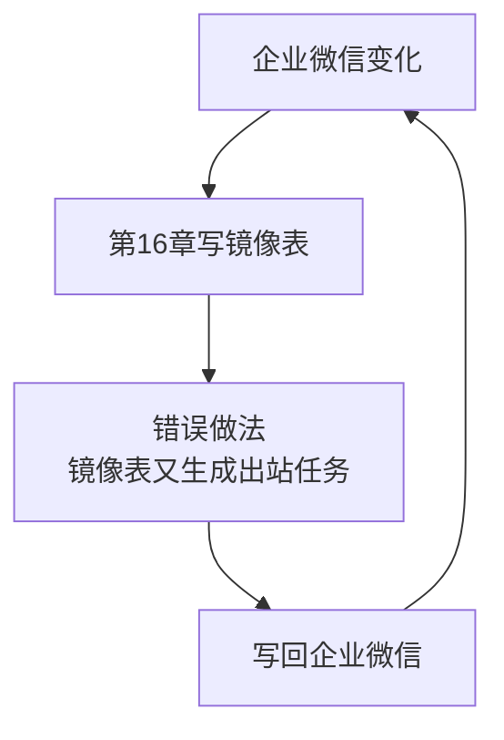
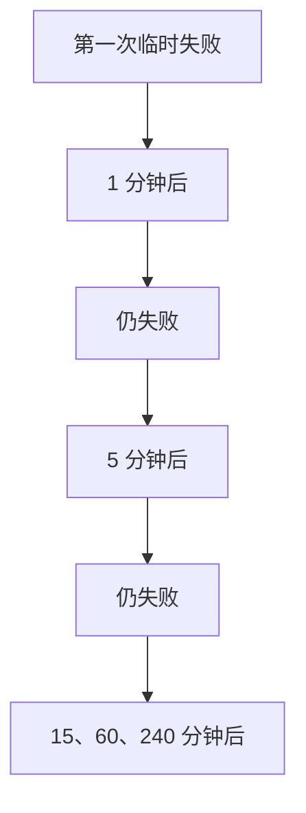
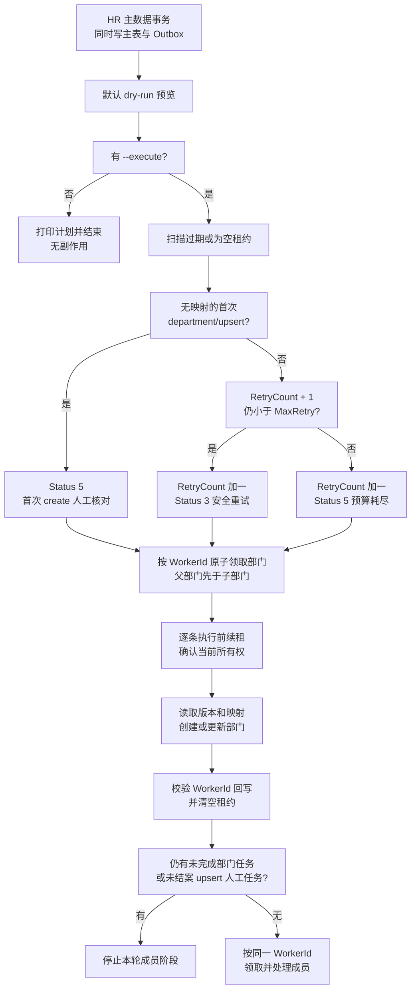
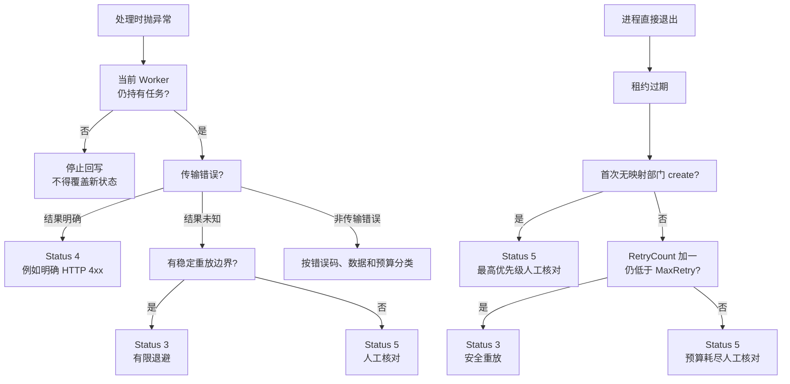

# 第 17 章：Python 从 SQL Server 同步通讯录到企业微信

> 本章定位：以 SQL Server 的 HR 主数据/待同步表为唯一数据源，把变更安全推送到企业微信；禁止直接把第 16 章镜像表反向同步。

## 本章目标

本章方向与上一章相反，但绝不是把箭头简单倒过来：

```text
SQL Server HR 主数据  ──Outbox──>  企业微信通讯录
```

完成后你将能够：

1. 用 `HrDepartment`、`HrEmployee` 表表达企业内部主数据
2. 用 `ContactSyncOutbox` 保存待同步变更和业务幂等键
3. 默认 dry-run 预览计划，显式 `--execute` 才调用写接口
4. 先同步父部门，再同步子部门；全部部门处理后才处理成员
5. 以稳定 UserId、远端 ID 映射和版本号实现可安全重放；无映射的首次部门创建绝不盲重放
6. 用 `WorkerId` 与 `LeaseUntil` 保护任务所有权，旧 Worker 不能覆盖新所有者
7. 把成功、失败、重试次数、下次重试时间回写 SQL Server；传输结果明确时不重试，过期租约恢复也计入预算
8. 对禁用和删除采用保守策略，避免自动扩大破坏范围

统一环境仍为 **Python 3.12**、`requests` 与 **pyodbc 5.3**：

```bash
pip install "requests>=2.32,<3" "pyodbc>=5.3,<5.4"
```

## 前置条件

- 已完成第 15 章，公共 `WeComClient` 可用
- 已执行第 17 章 migration，且 HR 系统能在同一事务写主数据与 Outbox
- `HrDepartment` 的父子关系已经校验无环，UserId 由 HR 稳定分配
- 已明确字段所有权、审批人和删除人工核对流程

## 数据源与防循环边界

### 绝不能反推第 16 章镜像表

第 16 章两张表表达的是“企业微信现在是什么样”：

```text
WeComDepartment / WeComEmployee = 入站镜像，只读
```

本章必须使用另一组表：

```text
HrDepartment / HrEmployee = HR 主数据，出站唯一数据源
ContactSyncOutbox          = 待同步事实
```

若把镜像表直接反推，会形成循环：



轻则反复更新，重则把权限缩小、字段缺失或软删除误写回企业微信。

### SQL Server 是这个方向的唯一数据源

- 人事系统只写 `HrDepartment`、`HrEmployee`，并在同一事务写 Outbox。
- 同步程序只消费 Outbox，不扫描镜像表“猜变化”。
- 企业微信后台临时手工修改可能被下一次 HR 同步覆盖；流程上应明确谁有最终解释权。
- 第 16 章镜像可用于**核对结果**，不能用于生成出站操作。

### 默认不执行

本章所有入口默认 dry-run。只有显式 `--execute` 才领取任务并调用 API。dry-run 不改 Outbox 状态，方便重复预览。

## 版本与目录

| 版本 | 主题 | 解决上一版什么问题 |
|---|---|---|
| V1 | HR 主数据与 Outbox | —— |
| V2 | 预览待同步变更 | 还不知道将对企业微信做什么 |
| V3 | 同步部门 | 成员依赖的组织结构不存在 |
| V4 | 同步成员 | 只有部门，没有账号 |
| V5 | 租约、状态回写与幂等 | 失败会丢失，首次部门创建卡死后可能被盲重放 |
| V6 | 批处理入口 | 顺序、dry-run、重试策略分散 |

最终目录：

```text
wecom-contact/
├─ config.py
├─ wecom_client.py              # 第 15 章复用
├─ migrations/
│  └─ 017_contact_outbox.sql    # HR 主数据与 Outbox
├─ outbox_repository.py         # 预览、租约领取、分类恢复与所有权回写
├─ outbound_service.py          # 部门/成员同步与安全策略
└─ sync_to_wecom.py             # V6，默认 dry-run
```

---

# V1：建立 HR 主数据与 Outbox

## 上一版的问题

这是本章第一版。若直接读取第 16 章镜像，我们无法区分“企业微信返回的现状”和“HR 想要的状态”，也无法记录某次变更是否已推送。

## 幂等 migration

新建 `migrations/017_contact_outbox.sql`：

```sql
/* HR 部门：本章出站主数据。禁止用 WeComDepartment 代替。 */
IF OBJECT_ID(N'dbo.HrDepartment', N'U') IS NULL
BEGIN
    CREATE TABLE dbo.HrDepartment (
        HrDepartmentId       INT NOT NULL,
        ParentHrDepartmentId INT NULL,
        WeComDeptId          INT NULL,
        Name                 NVARCHAR(100) NOT NULL,
        OrderNo              BIGINT NULL,
        DesiredEnabled       BIT NOT NULL
            CONSTRAINT DF_HrDepartment_DesiredEnabled DEFAULT 1,
        SourceVersion        INT NOT NULL
            CONSTRAINT DF_HrDepartment_SourceVersion DEFAULT 1,
        LastSyncedVersion    INT NULL,
        LastSyncAt           DATETIME2(0) NULL,
        LastSyncError        NVARCHAR(500) NULL,
        UpdatedAt            DATETIME2(0) NOT NULL
            CONSTRAINT DF_HrDepartment_UpdatedAt DEFAULT SYSDATETIME(),
        CONSTRAINT PK_HrDepartment PRIMARY KEY (HrDepartmentId),
        CONSTRAINT FK_HrDepartment_Parent FOREIGN KEY (ParentHrDepartmentId)
            REFERENCES dbo.HrDepartment(HrDepartmentId)
    );
END;
GO

IF NOT EXISTS (
    SELECT 1 FROM sys.indexes
    WHERE object_id = OBJECT_ID(N'dbo.HrDepartment')
      AND name = N'UQ_HrDepartment_WeComDeptId')
BEGIN
    CREATE UNIQUE INDEX UQ_HrDepartment_WeComDeptId
        ON dbo.HrDepartment (WeComDeptId)
        WHERE WeComDeptId IS NOT NULL;
END;
GO

/* HR 成员：UserId 是准备写入企业微信的稳定业务账号。 */
IF OBJECT_ID(N'dbo.HrEmployee', N'U') IS NULL
BEGIN
    CREATE TABLE dbo.HrEmployee (
        EmployeeCode       NVARCHAR(64) NOT NULL,
        UserId             NVARCHAR(64) NOT NULL,
        Name               NVARCHAR(100) NOT NULL,
        HrDepartmentId     INT NOT NULL,
        Position           NVARCHAR(100) NULL,
        Mobile             NVARCHAR(32) NULL,
        Email              NVARCHAR(100) NULL,
        DesiredEnabled     BIT NOT NULL
            CONSTRAINT DF_HrEmployee_DesiredEnabled DEFAULT 1,
        SourceVersion      INT NOT NULL
            CONSTRAINT DF_HrEmployee_SourceVersion DEFAULT 1,
        LastSyncedVersion  INT NULL,
        LastSyncAt         DATETIME2(0) NULL,
        LastSyncError      NVARCHAR(500) NULL,
        UpdatedAt          DATETIME2(0) NOT NULL
            CONSTRAINT DF_HrEmployee_UpdatedAt DEFAULT SYSDATETIME(),
        CONSTRAINT PK_HrEmployee PRIMARY KEY (EmployeeCode),
        CONSTRAINT UQ_HrEmployee_UserId UNIQUE (UserId),
        CONSTRAINT FK_HrEmployee_Department FOREIGN KEY (HrDepartmentId)
            REFERENCES dbo.HrDepartment(HrDepartmentId)
    );
END;
GO

/* Outbox：一条记录表达某个版本的一次出站意图。 */
IF OBJECT_ID(N'dbo.ContactSyncOutbox', N'U') IS NULL
BEGIN
    CREATE TABLE dbo.ContactSyncOutbox (
        Id                BIGINT IDENTITY(1,1) NOT NULL,
        AggregateType     NVARCHAR(20) NOT NULL,  -- department / employee
        AggregateKey      NVARCHAR(64) NOT NULL,
        Operation         NVARCHAR(20) NOT NULL,  -- upsert / disable / delete
        SourceVersion     INT NOT NULL,
        IdempotencyKey    NVARCHAR(180) NOT NULL,
        Status            TINYINT NOT NULL
            CONSTRAINT DF_ContactOutbox_Status DEFAULT 0,
            -- 0待处理 1处理中 2成功 3等待重试 4最终失败 5人工处理
        RetryCount        INT NOT NULL
            CONSTRAINT DF_ContactOutbox_RetryCount DEFAULT 0,
        MaxRetry          INT NOT NULL
            CONSTRAINT DF_ContactOutbox_MaxRetry DEFAULT 5,
        NextRetryAt       DATETIME2(0) NULL,
        ErrCode           INT NULL,
        ErrMsg            NVARCHAR(500) NULL,
        ApprovedAt        DATETIME2(0) NULL,      -- 删除必须另行审批
        CreatedAt         DATETIME2(0) NOT NULL
            CONSTRAINT DF_ContactOutbox_CreatedAt DEFAULT SYSDATETIME(),
        ClaimedAt         DATETIME2(0) NULL,
        WorkerId          NVARCHAR(64) NULL,
        LeaseUntil        DATETIME2(0) NULL,
        CompletedAt       DATETIME2(0) NULL,
        CONSTRAINT PK_ContactSyncOutbox PRIMARY KEY (Id),
        CONSTRAINT UQ_ContactOutbox_IdempotencyKey UNIQUE (IdempotencyKey),
        CONSTRAINT CK_ContactOutbox_AggregateType
            CHECK (AggregateType IN (N'department', N'employee')),
        CONSTRAINT CK_ContactOutbox_Operation
            CHECK (Operation IN (N'upsert', N'disable', N'delete')),
        CONSTRAINT CK_ContactOutbox_Status
            CHECK (Status IN (0,1,2,3,4,5))
    );
END;
GO

/* 旧表幂等升级：已有部署也补齐租约列。 */
IF COL_LENGTH(N'dbo.ContactSyncOutbox', N'WorkerId') IS NULL
BEGIN
    ALTER TABLE dbo.ContactSyncOutbox
        ADD WorkerId NVARCHAR(64) NULL;
END;
GO

IF COL_LENGTH(N'dbo.ContactSyncOutbox', N'LeaseUntil') IS NULL
BEGIN
    ALTER TABLE dbo.ContactSyncOutbox
        ADD LeaseUntil DATETIME2(0) NULL;
END;
GO

IF NOT EXISTS (
    SELECT 1 FROM sys.indexes
    WHERE object_id = OBJECT_ID(N'dbo.ContactSyncOutbox')
      AND name = N'IX_ContactOutbox_Claim')
BEGIN
    CREATE INDEX IX_ContactOutbox_Claim
        ON dbo.ContactSyncOutbox
            (AggregateType, Status, NextRetryAt, CreatedAt);
END;
GO

IF NOT EXISTS (
    SELECT 1 FROM sys.indexes
    WHERE object_id = OBJECT_ID(N'dbo.ContactSyncOutbox')
      AND name = N'IX_ContactOutbox_Lease')
BEGIN
    CREATE INDEX IX_ContactOutbox_Lease
        ON dbo.ContactSyncOutbox (Status, LeaseUntil)
        INCLUDE (AggregateType, AggregateKey, Operation, WorkerId);
END;
GO
```

`CREATE TABLE` 覆盖全新安装，两个 `COL_LENGTH` 分支覆盖旧表升级；重复执行不会重复加列。旧库里原有的 `Status=1` 行会得到空 `LeaseUntil`，后文恢复函数把它视为租约已过期并按风险分类，绝不能统一自动重试。`IX_ContactOutbox_Lease` 用于扫描过期租约。

## 主数据和 Outbox 必须同事务写入

下面用虚构测试数据演示参数化写入：

```python
import pyodbc


def save_employee_change(conn, employee, request_id, operation="upsert"):
    """request_id 由上游 HR 事件稳定提供；重放时必须保持不变。"""
    cursor = conn.cursor()
    try:
        cursor.execute("""
            MERGE dbo.HrEmployee AS target
            USING (SELECT ? AS EmployeeCode) AS source
               ON target.EmployeeCode = source.EmployeeCode
            WHEN MATCHED THEN UPDATE SET
                UserId = ?, Name = ?, HrDepartmentId = ?,
                Position = ?, Mobile = ?, Email = ?,
                DesiredEnabled = ?, SourceVersion = SourceVersion + 1,
                UpdatedAt = SYSDATETIME()
            WHEN NOT MATCHED THEN INSERT
                (EmployeeCode, UserId, Name, HrDepartmentId,
                 Position, Mobile, Email, DesiredEnabled, SourceVersion)
            VALUES (source.EmployeeCode, ?, ?, ?, ?, ?, ?, ?, 1);
        """,
            employee["employee_code"],
            employee["user_id"], employee["name"], employee["department_id"],
            employee.get("position"), employee.get("mobile"),
            employee.get("email"), employee["enabled"],
            employee["user_id"], employee["name"], employee["department_id"],
            employee.get("position"), employee.get("mobile"),
            employee.get("email"), employee["enabled"],
        )

        cursor.execute("""
            SELECT SourceVersion FROM dbo.HrEmployee WHERE EmployeeCode = ?
        """, employee["employee_code"])
        version = cursor.fetchone()[0]
        idempotency_key = (
            f"employee:{employee['employee_code']}:{operation}:{request_id}")

        cursor.execute("""
            INSERT INTO dbo.ContactSyncOutbox
                (AggregateType, AggregateKey, Operation,
                 SourceVersion, IdempotencyKey)
            VALUES (N'employee', ?, ?, ?, ?)
        """, employee["employee_code"], operation, version, idempotency_key)
        conn.commit()
        return True
    except pyodbc.IntegrityError as ex:
        conn.rollback()   # 重复请求时，主数据版本递增也随同回滚
        if "UQ_ContactOutbox_IdempotencyKey" in str(ex):
            return False
        raise
    except Exception:
        conn.rollback()
        raise
```

## 重要行解释

```text
employee:E0001:upsert:HR_EVT_000123
```

幂等键包含上游稳定的 `request_id`。同一 HR 事件因网络超时再次提交时，`request_id` 不变，第二次插入会撞唯一约束；因为主数据与 Outbox 在同一事务，前面的版本递增也会一起回滚。真正的新业务事件必须使用新的 `request_id`。

不能用本次执行后才递增出来的 `SourceVersion` 充当请求去重键：重放请求会先得到新版本，反而永远不会重复。

```sql
ApprovedAt DATETIME2(0) NULL
```

删除不是普通更新。即使 HR 产生了 `delete` 任务，也要独立审批；未审批的删除只能进入人工处理状态。

## V1 的问题

表和任务有了，但运行脚本前还看不到它准备做什么。直接领取并执行，不利于新手检查错误数据。

---

# V2：预览待同步变更

## 上一版的问题

V1 只记录“要同步”，没有安全预览。一个错误的部门映射或 UserId 可能直到写入企业微信才暴露。

## 简单代码

新建 `outbox_repository.py`：

```python
# -*- coding: utf-8 -*-
"""Outbox 查询、领取和状态回写。"""


def preview_pending(conn, limit=50):
    cursor = conn.cursor()
    cursor.execute("""
        SELECT TOP (?)
            Id, AggregateType, AggregateKey, Operation,
            SourceVersion, RetryCount, NextRetryAt, ApprovedAt
        FROM dbo.ContactSyncOutbox
        WHERE Status IN (0, 3)
          AND (NextRetryAt IS NULL OR NextRetryAt <= SYSDATETIME())
        ORDER BY
            CASE WHEN AggregateType = N'department' THEN 0 ELSE 1 END,
            CreatedAt, Id
    """, limit)
    return cursor.fetchall()


def print_plan(rows):
    if not rows:
        print("没有到期的待同步任务")
        return
    print("以下仅为 dry-run 计划，不会修改数据库状态或调用企业微信：")
    for row in rows:
        approval = "已审批" if row.ApprovedAt else "未审批"
        print(
            f"#{row.Id} {row.AggregateType}/{row.AggregateKey} "
            f"operation={row.Operation} version={row.SourceVersion} "
            f"retry={row.RetryCount} {approval}")
```

运行：

```python
import pyodbc
import config
from outbox_repository import preview_pending, print_plan

conn = pyodbc.connect(config.CONN_STR)
try:
    print_plan(preview_pending(conn))
finally:
    conn.close()
```

## 重要行解释

```sql
Status IN (0, 3)
AND (NextRetryAt IS NULL OR NextRetryAt <= SYSDATETIME())
```

只预览首次待处理和已经到重试时间的任务。最终失败、人工处理和尚未到期的重试不会混进来。

```sql
CASE WHEN AggregateType = N'department' THEN 0 ELSE 1 END
```

这是第一层顺序保证：部门排在成员前。V3 还要在部门内部处理父子顺序。

### dry-run 必须无副作用

预览不能：

- 把任务改成处理中
- 增加重试次数
- 写 `LastSyncAt`
- 调企业微信接口

否则重复预览会改变系统状态，dry-run 就失去意义。

## V2 的问题

已经能看计划，但企业微信还没有 HR 部门。若先创建成员，其部门 ID 不存在，成员同步必然失败。

---

# V3：同步部门

## 上一版的问题

V2 只是清单。部门有依赖关系：子部门请求里的 `parentid` 必须指向已存在的企业微信父部门，所以不能按任务创建时间随便执行。

## 父部门先于子部门

读取当前 HR 部门后做拓扑排序：

```python
def sort_departments_parent_first(rows):
    """rows 含 HrDepartmentId 和 ParentHrDepartmentId。"""
    remaining = {row.HrDepartmentId: row for row in rows}
    ordered = []
    ordered_ids = set()

    while remaining:
        progressed = False
        for department_id, row in list(remaining.items()):
            parent_id = row.ParentHrDepartmentId
            parent_is_outside_batch = parent_id not in remaining
            if parent_id is None or parent_id in ordered_ids or parent_is_outside_batch:
                ordered.append(row)
                ordered_ids.add(department_id)
                del remaining[department_id]
                progressed = True
        if not progressed:
            raise RuntimeError("HR 部门存在循环父子关系，拒绝同步")
    return ordered
```

若 A 的父级是 B、B 的父级又是 A，循环不会永远卡住，而是明确报错。

## 部门 Upsert

新建 `outbound_service.py`，先写部门：

```python
# -*- coding: utf-8 -*-
"""SQL Server -> 企业微信的出站业务服务。"""

from wecom_client import WeComApiError, WeComTransportError


class UncertainDepartmentCreate(RuntimeError):
    """部门创建请求可能已到达，禁止自动重试。"""


class OutboundService:
    def __init__(self, client, contacts_secret, conn):
        self.client = client
        self.secret = contacts_secret
        self.conn = conn

    def load_department(self, aggregate_key):
        cursor = self.conn.cursor()
        cursor.execute("""
            SELECT HrDepartmentId, ParentHrDepartmentId, WeComDeptId,
                   Name, OrderNo, DesiredEnabled, SourceVersion
            FROM dbo.HrDepartment WHERE HrDepartmentId = ?
        """, int(aggregate_key))
        row = cursor.fetchone()
        if row is None:
            raise ValueError("HR 部门不存在")
        return row

    def sync_department(self, task):
        department = self.load_department(task.AggregateKey)
        if department.SourceVersion != task.SourceVersion:
            return "stale"                      # 旧版本任务，不覆盖新数据

        if task.Operation == "delete":
            return "manual"                     # 部门删除始终人工处理
        if task.Operation == "disable" or not department.DesiredEnabled:
            return "manual"                     # 企业微信部门无通用禁用态

        parent_wecom_id = 1
        if department.ParentHrDepartmentId is not None:
            cursor = self.conn.cursor()
            cursor.execute("""
                SELECT WeComDeptId, SourceVersion, LastSyncedVersion
                FROM dbo.HrDepartment
                WHERE HrDepartmentId = ?
            """, department.ParentHrDepartmentId)
            parent = cursor.fetchone()
            if (parent is None or parent.WeComDeptId is None):
                raise RuntimeError("父部门尚未同步，稍后重试")
            if parent.LastSyncedVersion != parent.SourceVersion:
                raise RuntimeError("父部门仍有未完成版本，子部门暂缓")
            parent_wecom_id = parent.WeComDeptId

        payload = {
            "name": department.Name,
            "parentid": parent_wecom_id,
            "order": department.OrderNo or 1,
        }

        if department.WeComDeptId is None:
            try:
                result = self.client.post(
                    "department/create", self.secret, payload)
            except WeComTransportError as ex:
                if ex.result_unknown:
                    raise UncertainDepartmentCreate(
                        "部门创建结果未知，请先读取远端并补映射") from ex
                raise

            # 请求已经成功返回后，到映射提交完成前仍属于不确定窗口。
            # 响应解析、数据库写入或进程退出都不能退回自动 create。
            try:
                wecom_id = result["id"]
                self._save_department_mapping(
                    department.HrDepartmentId,
                    wecom_id,
                    task.SourceVersion,
                )
            except Exception as ex:
                self.conn.rollback()
                raise UncertainDepartmentCreate(
                    "部门可能已创建但映射未保存，请读取远端并补映射") from ex
            return "created"

        payload["id"] = department.WeComDeptId
        self.client.post("department/update", self.secret, payload)
        self._mark_department_synced(
            department.HrDepartmentId, task.SourceVersion)
        return "updated"
```

配套回写：

```python
    def _save_department_mapping(self, hr_department_id, wecom_id, version):
        cursor = self.conn.cursor()
        cursor.execute("""
            UPDATE dbo.HrDepartment
            SET WeComDeptId = ?, LastSyncedVersion = ?,
                LastSyncAt = SYSDATETIME(), LastSyncError = NULL
            WHERE HrDepartmentId = ?
        """, wecom_id, version, hr_department_id)
        self.conn.commit()

    def _mark_department_synced(self, hr_department_id, version):
        cursor = self.conn.cursor()
        cursor.execute("""
            UPDATE dbo.HrDepartment
            SET LastSyncedVersion = ?, LastSyncAt = SYSDATETIME(),
                LastSyncError = NULL
            WHERE HrDepartmentId = ?
        """, version, hr_department_id)
        self.conn.commit()
```

## 重要行解释

```python
if parent.LastSyncedVersion != parent.SourceVersion:
    raise RuntimeError("父部门仍有未完成版本，子部门暂缓")
```

“父部门有一个旧映射”还不够；父部门当前版本也必须同步完成，子部门才可写入。这样即使父任务落在另一个领取批次，子部门也不会越过父部门调用 API。

## 部门创建的特殊风险

创建部门时，企业微信分配新 ID。若 API 已创建成功，但响应丢失、响应解析失败、保存映射失败，或者进程在远端成功后直接退出，本地都可能仍没有 `WeComDeptId`。这时自动重试可能再创建一个同名部门。

因此本章的保守策略是：

- 部门**更新**使用稳定 `WeComDeptId` 和相同 payload，可在退避后安全重放；必要时先读取现状核对
- 部门**创建**在请求可能已经生效但映射未可靠保存时进入人工处理，不自动盲重试
- 即使进程没有机会抛出异常，租约过期恢复也会识别“`department/upsert` 且仍无 `WeComDeptId`”，直接转 `Status=5`
- 人工必须先查企业微信是否已有目标部门；若已存在则补 `WeComDeptId`，核对版本后显式结案，若不存在才重新执行

租约只保护“谁能回写任务”，不能把 HTTP 与 SQL Server 变成一个原子事务。无映射的首次创建因此始终按结果未知处理。这比“为了自动化而可能创建重复部门”更安全。

## V3 的问题

部门可以同步了，但成员仍不存在。成员必须引用已经写回的 `WeComDeptId`，所以只能放在部门阶段之后。

---

# V4：同步成员

## 上一版的问题

V3 已建立组织树。现在才能创建或更新成员；若成员所属部门还没有映射，应延后而不是临时塞进根部门。

## 简单代码

在 `OutboundService` 中加入：

```python
    def load_employee(self, aggregate_key):
        cursor = self.conn.cursor()
        cursor.execute("""
            SELECT EmployeeCode, UserId, Name, HrDepartmentId,
                   Position, Mobile, Email, DesiredEnabled, SourceVersion
            FROM dbo.HrEmployee WHERE EmployeeCode = ?
        """, aggregate_key)
        row = cursor.fetchone()
        if row is None:
            raise ValueError("HR 成员不存在")
        return row

    def sync_employee(self, task):
        employee = self.load_employee(task.AggregateKey)
        if employee.SourceVersion != task.SourceVersion:
            return "stale"

        cursor = self.conn.cursor()
        cursor.execute("""
            SELECT WeComDeptId, SourceVersion, LastSyncedVersion
            FROM dbo.HrDepartment
            WHERE HrDepartmentId = ?
        """, employee.HrDepartmentId)
        department = cursor.fetchone()
        if department is None or department.WeComDeptId is None:
            raise RuntimeError("成员所属部门尚未同步，稍后重试")
        if department.LastSyncedVersion != department.SourceVersion:
            raise RuntimeError("成员所属部门仍有未完成版本，成员暂缓")

        if task.Operation == "delete":
            return "manual"                     # 默认不自动硬删除

        enabled = False if task.Operation == "disable" else bool(employee.DesiredEnabled)
        payload = {
            "userid": employee.UserId,
            "name": employee.Name,
            "department": [department.WeComDeptId],
            "position": employee.Position or "",
            "enable": 1 if enabled else 0,
        }
        if employee.Mobile:
            payload["mobile"] = employee.Mobile
        if employee.Email:
            payload["email"] = employee.Email

        exists = self._user_exists(employee.UserId)
        api = "user/update" if exists else "user/create"
        self.client.post(api, self.secret, payload)
        self._mark_employee_synced(
            employee.EmployeeCode, task.SourceVersion)
        return "updated" if exists else "created"

    def _user_exists(self, user_id):
        try:
            self.client.get("user/get", self.secret, {"userid": user_id})
            return True
        except WeComApiError as ex:
            if ex.errcode == 60111:              # 成员不存在
                return False
            raise

    def _mark_employee_synced(self, employee_code, version):
        cursor = self.conn.cursor()
        cursor.execute("""
            UPDATE dbo.HrEmployee
            SET LastSyncedVersion = ?, LastSyncAt = SYSDATETIME(),
                LastSyncError = NULL
            WHERE EmployeeCode = ?
        """, version, employee_code)
        self.conn.commit()
```

## 重要行解释

```python
api = "user/update" if exists else "user/create"
```

成员的 `UserId` 由 HR 主数据稳定提供。若上一次创建成功但响应丢失，重试前的 `user/get` 会发现成员已存在，转为更新，不会重复创建另一个账号。

```python
if employee.Mobile:
    payload["mobile"] = employee.Mobile
```

空值不要无条件发送。否则可能把企业微信里由其他受控流程维护的字段清空。哪些字段由 HR 管理，应在上线前形成字段所有权清单。

## 禁用与删除的保守策略

| HR 意图 | 默认动作 | 原因 |
|---|---|---|
| 正常更新 | Upsert | 可用稳定 ID 重放 |
| 停用成员 | `enable=0` 更新 | 保留账号与关联，易恢复 |
| 删除成员 | 转人工处理 | 硬删除不可逆，可能影响历史和应用权限 |
| 停用部门 | 转人工处理 | 部门没有与成员完全相同的通用禁用语义 |
| 删除部门 | 转人工处理 | 必须先处理成员和子部门，风险高 |

即使 Outbox 的 `delete` 已有 `ApprovedAt`，最终批处理也默认不执行；必须额外加命令行危险开关，并再次读取远端现状。V6 会保留这个双闸门。

## V4 的问题

部门和成员调用已经能跑，但 Outbox 还没有带租约的原子领取、所有权受保护的状态回写和失败退避。两个进程可能处理同一任务；更危险的是，首次部门创建远端成功后若进程退出，统一“卡死重试”会再次 create。

---

# V5：状态回写与幂等

## 上一版的问题

V4 只处理业务对象，没有可靠任务状态。领取者必须获得有期限的所有权；程序崩溃后，还必须区分“可安全重放”和“首次部门创建结果未知”，不能把所有处理中任务都自动重试。

## 原子领取

在 `outbox_repository.py` 中加入：

```python
def claim_tasks(conn, aggregate_type, worker_id, limit=20, lease_minutes=30):
    cursor = conn.cursor()
    cursor.execute("""
        UPDATE TOP (?) dbo.ContactSyncOutbox WITH (ROWLOCK, READPAST)
        SET Status = 1,
            ClaimedAt = SYSDATETIME(),
            WorkerId = ?,
            LeaseUntil = DATEADD(MINUTE, ?, SYSDATETIME()),
            ErrCode = NULL,
            ErrMsg = NULL
        OUTPUT inserted.Id, inserted.AggregateType, inserted.AggregateKey,
               inserted.Operation, inserted.SourceVersion,
               inserted.RetryCount, inserted.MaxRetry,
               inserted.ApprovedAt, inserted.CreatedAt,
               inserted.WorkerId, inserted.LeaseUntil
        WHERE AggregateType = ?
          AND Status IN (0, 3)
          AND RetryCount < MaxRetry
          AND (NextRetryAt IS NULL OR NextRetryAt <= SYSDATETIME());
    """, limit, worker_id, lease_minutes, aggregate_type)
    rows = cursor.fetchall()
    conn.commit()
    return rows
```

`UPDATE ... OUTPUT` 在一条 SQL 内完成“标记处理中”和“返回任务”，没有先查后改的并发窗口。

## 成功、人工处理与失败回写

```python
import re
from wecom_client import WeComApiError, WeComTransportError

RETRY_DELAYS_MINUTES = [1, 5, 15, 60, 240]
NO_RETRY_CODES = {40001, 40013, 40014, 60011, 60020, 60111}


def safe_error_text(exception):
    """可持久化的错误摘要；二次防止凭据或 PII 进入数据库。"""
    if isinstance(exception, WeComApiError):
        text = (
            f"{exception.api}: errcode={exception.errcode}, "
            f"errmsg={exception.errmsg}"
        )
    elif isinstance(exception, WeComTransportError):
        text = (
            f"{exception.api}: kind={exception.kind}, "
            f"result_unknown={exception.result_unknown}"
        )
    elif isinstance(exception, (ValueError, RuntimeError)):
        text = str(exception)
    else:
        text = type(exception).__name__
    text = re.sub(
        r"(?i)(access_token|corpsecret)=([^&\s]+)",
        r"\1=***",
        text,
    )
    return text[:500]


class LeaseLostError(RuntimeError):
    """任务已被恢复或转交，旧 Worker 不得覆盖新状态。"""


def _commit_owned_update(conn, cursor, task_id):
    if cursor.rowcount != 1:
        conn.rollback()
        raise LeaseLostError(f"任务 {task_id} 的租约已丢失")
    conn.commit()


def renew_lease(conn, task_id, worker_id, lease_minutes=30):
    """真正执行远端调用前续租；过期或易主后不得继续。"""
    cursor = conn.cursor()
    cursor.execute("""
        UPDATE dbo.ContactSyncOutbox
        SET LeaseUntil = DATEADD(MINUTE, ?, SYSDATETIME())
        WHERE Id = ? AND Status = 1 AND WorkerId = ?
          AND LeaseUntil > SYSDATETIME()
    """, lease_minutes, task_id, worker_id)
    _commit_owned_update(conn, cursor, task_id)


def mark_success(conn, task_id, worker_id):
    cursor = conn.cursor()
    cursor.execute("""
        UPDATE dbo.ContactSyncOutbox
        SET Status = 2, CompletedAt = SYSDATETIME(),
            NextRetryAt = NULL, ErrCode = NULL, ErrMsg = NULL,
            WorkerId = NULL, LeaseUntil = NULL
        WHERE Id = ? AND Status = 1 AND WorkerId = ?
    """, task_id, worker_id)
    _commit_owned_update(conn, cursor, task_id)


def mark_manual(conn, task_id, worker_id, reason):
    cursor = conn.cursor()
    cursor.execute("""
        UPDATE dbo.ContactSyncOutbox
        SET Status = 5, ErrMsg = ?, CompletedAt = SYSDATETIME(),
            NextRetryAt = NULL, WorkerId = NULL, LeaseUntil = NULL
        WHERE Id = ? AND Status = 1 AND WorkerId = ?
    """, reason[:500], task_id, worker_id)
    _commit_owned_update(conn, cursor, task_id)


def has_safe_replay_boundary(conn, task):
    """结果未知时，只允许稳定 UserId 或已有 WeComDeptId 的任务重放。"""
    if task.AggregateType == "employee":
        return True
    if task.AggregateType != "department":
        return False

    cursor = conn.cursor()
    cursor.execute("""
        SELECT WeComDeptId
        FROM dbo.HrDepartment
        WHERE HrDepartmentId = TRY_CONVERT(INT, ?)
    """, task.AggregateKey)
    row = cursor.fetchone()
    return row is not None and row[0] is not None


def mark_failure(conn, task, worker_id, exception):
    errcode = (
        exception.errcode if isinstance(exception, WeComApiError) else None
    )
    retry_count = task.RetryCount + 1
    error_text = safe_error_text(exception)
    bad_data = isinstance(exception, ValueError)
    transport_error = isinstance(exception, WeComTransportError)
    result_unknown = transport_error and exception.result_unknown
    safe_replay = (
        result_unknown and has_safe_replay_boundary(conn, task)
    )
    unsafe_unknown = result_unknown and not safe_replay
    can_retry = (
        not bad_data
        and errcode not in NO_RETRY_CODES
        and retry_count < task.MaxRetry
        and (
            not transport_error
            or (result_unknown and safe_replay)
        )
    )

    cursor = conn.cursor()
    if unsafe_unknown:
        # 防御性兜底：首次无映射部门 create 正常会先转
        # UncertainDepartmentCreate；即使异常直接到这里，也绝不自动重放。
        cursor.execute("""
            UPDATE dbo.ContactSyncOutbox
            SET Status = 5, RetryCount = ?, ErrCode = ?, ErrMsg = ?,
                CompletedAt = SYSDATETIME(), NextRetryAt = NULL,
                WorkerId = NULL, LeaseUntil = NULL
            WHERE Id = ? AND Status = 1 AND WorkerId = ?
        """, retry_count, errcode, error_text, task.Id, worker_id)
    elif can_retry:
        index = min(retry_count - 1, len(RETRY_DELAYS_MINUTES) - 1)
        delay = RETRY_DELAYS_MINUTES[index]
        cursor.execute("""
            UPDATE dbo.ContactSyncOutbox
            SET Status = 3, RetryCount = ?, ErrCode = ?, ErrMsg = ?,
                NextRetryAt = DATEADD(MINUTE, ?, SYSDATETIME()),
                WorkerId = NULL, LeaseUntil = NULL
            WHERE Id = ? AND Status = 1 AND WorkerId = ?
        """, retry_count, errcode, error_text, delay, task.Id, worker_id)
    else:
        # 明确传输结果、坏数据、不可重试码或预算耗尽：最终失败。
        cursor.execute("""
            UPDATE dbo.ContactSyncOutbox
            SET Status = 4, RetryCount = ?, ErrCode = ?, ErrMsg = ?,
                CompletedAt = SYSDATETIME(), NextRetryAt = NULL,
                WorkerId = NULL, LeaseUntil = NULL
            WHERE Id = ? AND Status = 1 AND WorkerId = ?
        """, retry_count, errcode, error_text, task.Id, worker_id)
    _commit_owned_update(conn, cursor, task.Id)


def has_blocking_department_tasks(conn):
    """未完成部门任务及未结案的首次创建人工任务阻断成员阶段。"""
    cursor = conn.cursor()
    cursor.execute("""
        SELECT COUNT(*)
        FROM dbo.ContactSyncOutbox
        WHERE AggregateType = N'department'
          AND Operation <> N'delete'
          AND (
              Status IN (0, 1, 3, 4)
              OR (Status = 5 AND Operation = N'upsert')
          )
    """)
    return cursor.fetchone()[0] > 0
```

## 重要行解释

```python
error_text = safe_error_text(exception)
```

第 15 章客户端已经不暴露 URL，这里持久化前仍做第二次脱敏。业务错误统一读取 `exception.errcode`、`exception.errmsg`、`exception.api`；传输错误继续读取 `exception.kind` 与 `exception.result_unknown`。未知的数据库或应用异常只保存异常类型，避免参数值、手机号或邮箱随驱动错误文本进入 Outbox。

`mark_failure()` 与第 23 章采用同一条传输错误边界：`WeComTransportError.result_unknown=False` 表示结果明确，例如明确 HTTP 4xx，直接写 `Status=4`，不进入 Retry；`result_unknown=True` 也不是无条件重试，只有稳定 `UserId` 的成员或已有 `WeComDeptId` 的部门才允许退避重放。无映射的首次部门 create 正常由 `UncertainDepartmentCreate` 转 `Status=5`，`mark_failure()` 内的 `unsafe_unknown` 分支只是防御性兜底，确保异常即使绕过上层分类也仍进入 Manual。业务 API 错误则继续按错误码、坏数据类型和 `MaxRetry` 判断。

```sql
UPDATE TOP (?) ...
SET WorkerId = ?, LeaseUntil = ...
OUTPUT inserted.WorkerId, inserted.LeaseUntil
```

领取和返回任务由一条语句完成；两个进程不会先后领到同一条待处理记录。`WorkerId` 是本进程稳定且重启后不同的所有者标识，`LeaseUntil` 由 SQL Server 时间计算。批量任务真正调用远端前还会通过 `renew_lease()` 校验所有权并续租；若租约已过期或易主，`rowcount=0`，该 Worker 必须跳过远端调用。成功、人工、失败三个出口都以 `Id + Status=1 + WorkerId` 更新，清空租约并检查 `rowcount`；若更新数不是 1，旧 Worker 必须停止，不能覆盖恢复者或新所有者。

## 过期租约的分类恢复

进程可能在领取后崩溃。下次执行先扫描 `LeaseUntil` 已过期的任务；旧表升级后遗留的 `Status=1` 没有租约，也按过期处理：

```python
def recover_expired_leases(conn):
    cursor = conn.cursor()

    # 无映射的部门 upsert 可能已在远端完成首次 create，最高优先级转人工；
    # 它不属于可安全恢复任务，因此不消耗自动重试预算。
    cursor.execute("""
        UPDATE outbox WITH (ROWLOCK, READPAST)
        SET Status = 5,
            ErrMsg = N'租约过期且部门无远端映射；首次创建结果未知，请查远端并补映射',
            CompletedAt = SYSDATETIME(), NextRetryAt = NULL,
            WorkerId = NULL, LeaseUntil = NULL
        FROM dbo.ContactSyncOutbox AS outbox
        LEFT JOIN dbo.HrDepartment AS department
          ON department.HrDepartmentId = TRY_CONVERT(INT, outbox.AggregateKey)
        WHERE outbox.Status = 1
          AND (outbox.LeaseUntil IS NULL
               OR outbox.LeaseUntil <= SYSDATETIME())
          AND outbox.AggregateType = N'department'
          AND outbox.Operation = N'upsert'
          AND department.WeComDeptId IS NULL
    """)
    first_create_manual_count = cursor.rowcount

    # 剩余过期任务有稳定 UserId 或 WeComDeptId；恢复也消耗一次预算。
    # 只有加一后仍小于 MaxRetry，才允许回到自动重试队列。
    cursor.execute("""
        UPDATE outbox WITH (ROWLOCK, READPAST)
        SET Status = 3,
            RetryCount = RetryCount + 1,
            NextRetryAt = SYSDATETIME(),
            ErrMsg = N'租约过期，已消耗一次重试预算并释放旧所有者',
            CompletedAt = NULL,
            WorkerId = NULL, LeaseUntil = NULL
        FROM dbo.ContactSyncOutbox AS outbox
        WHERE outbox.Status = 1
          AND (outbox.LeaseUntil IS NULL
               OR outbox.LeaseUntil <= SYSDATETIME())
          AND outbox.RetryCount + 1 < outbox.MaxRetry
          AND NOT (
              outbox.AggregateType = N'department'
              AND outbox.Operation = N'upsert'
              AND NOT EXISTS (
                  SELECT 1
                  FROM dbo.HrDepartment AS department
                  WHERE department.HrDepartmentId =
                        TRY_CONVERT(INT, outbox.AggregateKey)
                    AND department.WeComDeptId IS NOT NULL
              )
          )
    """)
    safe_retry_count = cursor.rowcount

    # 第一条已截获不确定的首次 create；这里剩余的是预算已耗尽的
    # 安全边界任务。进程曾崩溃，最终结果仍需人工核对，不能写最终失败。
    cursor.execute("""
        UPDATE outbox WITH (ROWLOCK, READPAST)
        SET Status = 5,
            RetryCount = RetryCount + 1,
            ErrMsg = N'租约过期且重试预算已耗尽，请人工核对远端结果',
            CompletedAt = SYSDATETIME(), NextRetryAt = NULL,
            WorkerId = NULL, LeaseUntil = NULL
        FROM dbo.ContactSyncOutbox AS outbox
        WHERE outbox.Status = 1
          AND (outbox.LeaseUntil IS NULL
               OR outbox.LeaseUntil <= SYSDATETIME())
          AND outbox.RetryCount + 1 >= outbox.MaxRetry
          AND NOT (
              outbox.AggregateType = N'department'
              AND outbox.Operation = N'upsert'
              AND NOT EXISTS (
                  SELECT 1
                  FROM dbo.HrDepartment AS department
                  WHERE department.HrDepartmentId =
                        TRY_CONVERT(INT, outbox.AggregateKey)
                    AND department.WeComDeptId IS NOT NULL
              )
          )
    """)
    budget_exhausted_manual_count = cursor.rowcount
    conn.commit()
    return (
        first_create_manual_count,
        safe_retry_count,
        budget_exhausted_manual_count,
    )
```

三个 `UPDATE` 都只处理仍为 `Status=1` 且已经过期的行，并清空 `WorkerId/LeaseUntil`，所以并发恢复者不会重复接管。第一条最高优先级截获无映射的首次部门创建并直接转 Manual，不消耗自动重试预算；后两条再次显式排除这类任务，避免它在语句间刚好过期时误入 Retry。对其余具有稳定重放边界的任务，恢复本身先把 `RetryCount` 加一：仅当 `RetryCount + 1 < MaxRetry` 时写 `Status=3`，达到预算则写 `Status=5`，因为进程崩溃后的远端结果仍需人工核对，而不是简单标为最终失败。函数分别返回首次 create 人工数、安全重试数和预算耗尽人工数，供入口记录。

### 一个必须承认的窗口

HTTP 成功后、映射或任务状态回写前，进程可能直接退出。租约不能消除这个跨系统窗口，只能让恢复决策更安全：

1. Outbox 唯一 `IdempotencyKey` 防止同一上游 HR 事件重复入队
2. 已有 `WeComDeptId` 的部门更新和有稳定 `UserId` 的成员可以读取远端后安全重放，但每次过期恢复都先增加 `RetryCount`，只在预算尚未耗尽时进入退避
3. 无 `WeComDeptId` 的 `department/upsert` 租约过期后最高优先级直接转 `Status=5`，绝不自动重放 create，也不占用自动重试预算
4. 安全边界任务若 `RetryCount + 1 >= MaxRetry`，同样转 `Status=5`；进程崩溃后的远端结果必须人工核对
5. 人工先读取企业微信：已存在则补映射并按审计流程把人工任务显式结案；确认不存在才重新执行
6. 迟到的旧 Worker 即使恢复运行，也会因所有权条件和 `rowcount` 检查而无法覆盖当前状态

未结案的部门 `upsert` 人工任务继续阻断成员阶段，避免在父部门结果仍不确定时向下推进。

## 退避为何不是立即重试



服务临时不可用时，立即连续重试只会迅速耗尽次数并放大压力，因此只有具备稳定重放边界且结果未知的传输失败才按阶梯退避。`result_unknown=False` 的明确传输结果（例如 HTTP 4xx）、配置、权限和坏数据错误不应重试；这与第 23 章“先判断操作是否安全，再判断错误是否可重试”的边界一致。

## V5 的问题

基础设施齐全，但还缺一个固定主流程来保证：dry-run 不领取；执行时先父部门、后子部门，再处理成员；删除默认转人工。

---

# V6：整合批处理入口

## 上一版的问题

V5 的函数若被随意组合，仍可能先领取成员或在 dry-run 中误改状态。最终版把顺序写死在一个入口里。

## 部门任务排序辅助

领取部门任务后，按 HR 树排序：

```python
def order_department_tasks(conn, tasks):
    if not tasks:
        return []

    # 每次读取完整 HR 部门树，才能发现跨批次的循环依赖。
    cursor = conn.cursor()
    cursor.execute("""
        SELECT HrDepartmentId, ParentHrDepartmentId
        FROM dbo.HrDepartment
    """)
    rows = cursor.fetchall()

    ordered_departments = sort_departments_parent_first(rows)
    position = {
        row.HrDepartmentId: index
        for index, row in enumerate(ordered_departments)
    }
    return sorted(
        tasks,
        key=lambda task: position.get(int(task.AggregateKey), 999999),
    )
```

## `sync_to_wecom.py`

```python
# -*- coding: utf-8 -*-
"""SQL Server -> 企业微信通讯录同步。默认 dry-run。"""

import argparse
import logging
import uuid
import pyodbc

import config
from wecom_client import WeComClient
from outbox_repository import (
    LeaseLostError,
    claim_tasks,
    has_blocking_department_tasks,
    mark_failure,
    mark_manual,
    mark_success,
    preview_pending,
    print_plan,
    recover_expired_leases,
    renew_lease,
)
from outbound_service import (
    OutboundService,
    UncertainDepartmentCreate,
    order_department_tasks,
)

logging.basicConfig(
    level=logging.INFO,
    format="%(asctime)s [%(levelname)s] %(message)s",
)
log = logging.getLogger("contact-sync-out")


def parse_args():
    parser = argparse.ArgumentParser(description="HR 通讯录出站同步")
    parser.add_argument("--execute", action="store_true",
                        help="真正调用接口；不加时只预览")
    parser.add_argument("--limit", type=int, default=20)
    parser.add_argument("--allow-approved-delete", action="store_true",
                        help="危险开关：仅允许处理另已审批的删除")
    return parser.parse_args()


def process_one(service, conn, task, worker_id, allow_delete=False):
    try:
        if task.Operation == "delete":
            if not allow_delete or task.ApprovedAt is None:
                mark_manual(
                    conn, task.Id, worker_id,
                    "删除未通过双重开关，转人工处理")
                return

            # 本教程仍不自动实现批量硬删除；批准后只进入人工执行点。
            mark_manual(
                conn, task.Id, worker_id,
                "删除已审批，请人工核对远端依赖后执行")
            return

        if task.AggregateType == "department":
            result = service.sync_department(task)
        else:
            result = service.sync_employee(task)

        if result == "manual":
            mark_manual(conn, task.Id, worker_id, "操作需要人工核对")
        else:
            mark_success(conn, task.Id, worker_id)
            log.info("任务 %s 完成：%s", task.Id, result)

    except UncertainDepartmentCreate:
        conn.rollback()
        try:
            mark_manual(
                conn, task.Id, worker_id,
                "部门创建结果未知，请先读取远端并补映射")
        except Exception as state_error:
            conn.rollback()
            log.error(
                "任务 %s 人工状态回写失败：%s",
                task.Id,
                type(state_error).__name__,
            )
    except LeaseLostError:
        conn.rollback()
        log.warning("任务 %s 的租约已丢失，旧 Worker 停止回写", task.Id)
    except Exception as ex:
        # 包括 pyodbc、KeyError 等意外异常：先回滚，再尽力回写状态。
        conn.rollback()
        try:
            mark_failure(conn, task, worker_id, ex)
        except LeaseLostError:
            conn.rollback()
            log.warning("任务 %s 的租约已丢失，失败状态未覆盖", task.Id)
        except Exception as state_error:
            conn.rollback()
            log.error(
                "任务 %s 状态回写失败：%s",
                task.Id,
                type(state_error).__name__,
            )


def run_execute(conn, limit, allow_delete):
    # 每个进程只生成一次；重启会得到新值，不能复用旧 WorkerId。
    worker_id = uuid.uuid4().hex
    lease_minutes = 30

    first_create_manual_count, safe_retry_count, budget_manual_count = (
        recover_expired_leases(conn)
    )
    if first_create_manual_count:
        log.warning(
            "过期租约转首次部门创建人工核对 %s 条",
            first_create_manual_count,
        )
    if safe_retry_count:
        log.warning(
            "过期租约消耗预算并安全释放到重试队列 %s 条",
            safe_retry_count,
        )
    if budget_manual_count:
        log.warning(
            "过期租约因重试预算耗尽转人工核对 %s 条",
            budget_manual_count,
        )

    client = WeComClient(config.CORP_ID, config.BASE_URL)
    service = OutboundService(client, config.CONTACTS_SECRET, conn)

    # 第一阶段：循环领取所有到期部门任务；每批仍按父级优先排序。
    department_total = 0
    while True:
        department_tasks = claim_tasks(
            conn, "department", worker_id, limit, lease_minutes)
        if not department_tasks:
            break
        department_tasks = order_department_tasks(conn, department_tasks)
        for task in department_tasks:
            try:
                # 批内等待不会沿用旧租约；远端调用前必须重新确认所有权。
                renew_lease(conn, task.Id, worker_id, lease_minutes)
            except LeaseLostError:
                log.warning("任务 %s 执行前已丢失租约，跳过远端调用", task.Id)
                continue
            process_one(service, conn, task, worker_id, allow_delete)
        department_total += len(department_tasks)

    # 未完成部门任务和未结案的 department/upsert 人工任务都会阻断成员。
    # 人工先查远端、补映射并按审计流程显式结案，再运行下一轮。
    if has_blocking_department_tasks(conn):
        log.warning("仍有未完成或待人工结案的部门任务，本轮不处理成员")
        return

    # 第二阶段：部门闸门通过后，再循环处理全部到期成员任务。
    employee_total = 0
    while True:
        employee_tasks = claim_tasks(
            conn, "employee", worker_id, limit, lease_minutes)
        if not employee_tasks:
            break
        for task in employee_tasks:
            try:
                renew_lease(conn, task.Id, worker_id, lease_minutes)
            except LeaseLostError:
                log.warning("任务 %s 执行前已丢失租约，跳过远端调用", task.Id)
                continue
            process_one(service, conn, task, worker_id, allow_delete)
        employee_total += len(employee_tasks)

    log.info(
        "本轮处理：部门=%s，成员=%s",
        department_total, employee_total)


def main():
    args = parse_args()
    conn = pyodbc.connect(config.CONN_STR, autocommit=False)
    try:
        if not args.execute:
            rows = preview_pending(conn, args.limit)
            print_plan(rows)
            print("确认无误后再加 --execute；当前没有调用企业微信。")
            return
        run_execute(conn, args.limit, args.allow_approved_delete)
    finally:
        conn.close()


if __name__ == "__main__":
    main()
```

上面的 `sort_departments_parent_first` 与 `order_department_tasks` 放在 `outbound_service.py`，所以最终入口可直接导入并复用。

## 重要行解释

```python
worker_id = uuid.uuid4().hex
while True:
    department_tasks = claim_tasks(
        conn, "department", worker_id, limit, lease_minutes)
```

`worker_id` 在本进程执行期内保持不变，并同时传给部门、成员领取、执行前续租及每一次状态回写；进程重启后必须生成新值。批量领取后，每条任务在远端调用前都以 `Id + Status=1 + WorkerId` 续租并检查 `rowcount`，因此排队等待导致租约过期时，旧 Worker 会跳过该任务而不是继续 create。部门阶段持续领取到没有到期任务，随后 `has_blocking_department_tasks()` 同时检查未完成任务和未结案的 `department/upsert` 人工任务；闸门未通过时，本轮完全不领取成员。

```python
try:
    renew_lease(conn, task.Id, worker_id, lease_minutes)
except LeaseLostError:
    log.warning("任务执行前已丢失租约，跳过远端调用")
    continue
process_one(service, conn, task, worker_id, allow_delete)
```

真正发起远端调用前先续租；过期或已经易主时，不调用 API。处理中的意外 pyodbc、字段或程序错误会先回滚，再尽力写失败状态。所有出口都校验 WorkerId 并检查 `rowcount`；租约已经被恢复时，旧 Worker 只记录告警，不再覆盖状态。`lease_minutes` 必须大于客户端一次远端请求及其内部重试的最坏耗时；批量等待由逐条执行前续租覆盖。

## 使用顺序

先预览：

```bash
python sync_to_wecom.py
```

确认对象、操作和版本正确后执行普通 Upsert/禁用：

```bash
python sync_to_wecom.py --execute
```

即使增加危险开关，删除仍进入人工处理点：

```bash
python sync_to_wecom.py --execute --allow-approved-delete
```

这是有意设计。教程不提供“一键批量硬删除通讯录”的最终实现，避免把示例变成高风险工具。生产系统若确需自动删除，应增加审批人、审批时间、影响范围、远端依赖检查和审计记录。

## 状态回写的可观测性

常用运维查询：

```sql
-- 各状态数量
SELECT Status, COUNT(*) AS TaskCount
FROM dbo.ContactSyncOutbox
GROUP BY Status
ORDER BY Status;

-- 正在处理和过期租约
SELECT Id, AggregateType, AggregateKey, WorkerId,
       ClaimedAt, LeaseUntil,
       CASE WHEN LeaseUntil IS NULL OR LeaseUntil <= SYSDATETIME()
            THEN 1 ELSE 0 END AS LeaseExpired
FROM dbo.ContactSyncOutbox
WHERE Status = 1
ORDER BY LeaseUntil;

-- 等待重试
SELECT Id, AggregateType, AggregateKey, RetryCount,
       NextRetryAt, ErrCode, ErrMsg
FROM dbo.ContactSyncOutbox
WHERE Status = 3
ORDER BY NextRetryAt;

-- 人工处理与最终失败
SELECT Id, AggregateType, AggregateKey, Operation,
       Status, ErrCode, ErrMsg, ApprovedAt, WorkerId, LeaseUntil
FROM dbo.ContactSyncOutbox
WHERE Status IN (4, 5)
ORDER BY CreatedAt;
```

查询值不需要拼字符串。应用代码中仍应用 `?` 参数处理用户输入。

当无映射的首次部门创建进入 `Status=5` 时，操作员先按名称、父部门和其他受控字段查询企业微信。确认远端对象已存在后，在审计事务中补写 `HrDepartment.WeComDeptId`、核对 `LastSyncedVersion`，再把对应人工任务显式结案；确认远端不存在时，才创建新的受控重试任务。不要仅把原任务改回 `Status=3`，否则会重新执行不确定的 create。

当安全边界任务因过期恢复达到预算而进入 `Status=5` 时，也要先读取远端核对最后一次调用是否生效，再决定补写本地状态或创建新的受控任务；不要通过减少 `RetryCount` 绕过预算。

---

# 完整请求流

## 正常同步与阶段闸门



普通人工处理状态 5 仍是自动化终态，但**未结案的部门 `upsert` 人工任务会继续阻断成员阶段**。人工先查远端并补映射，再按审计流程显式结案；状态 0、1、3、4 的非删除部门任务也继续阻断。

## 失败分类与状态回写



所有正常状态出口都校验 `Id + Status=1 + WorkerId`、清空 `WorkerId/LeaseUntil` 并检查 `rowcount`。传输结果明确时不重试；结果未知也只有成员稳定 `UserId` 或部门已有 `WeComDeptId` 才能退避。进程直接退出由租约恢复兜底：无映射首次部门创建永不自动重试；其余安全任务每次恢复都增加 `RetryCount`，预算耗尽后进入人工核对。

# 自测与故障排查

## 自测表

| 测试 | 做法 | 期望结果 |
|---|---|---|
| 1 防循环 | 搜索出站代码的数据源 | 不读取 `WeComDepartment`、`WeComEmployee` 生成任务 |
| 2 migration 幂等 | 新建库执行两次，并从旧表结构升级两次 | 两列与索引只创建一次，旧 `Status=1/LeaseUntil=NULL` 可被分类恢复 |
| 3 Outbox 幂等 | 同一幂等键插两次 | 第二次被唯一约束拒绝 |
| 4 默认 dry-run | 不加参数运行 | 只打印计划，状态和远端均不变 |
| 5 原子领取 | 同时开两个不同 WorkerId 的进程 | 同一任务只被一个进程领取并得到 `LeaseUntil` |
| 6 旧 Worker 回写 | 租约恢复后让旧进程调用 success/failure | `rowcount=0` 并抛 `LeaseLostError`，不覆盖新状态 |
| 7 父子顺序 | 同时入队父、子部门 | 日志先父后子 |
| 8 循环部门 | 制造 A→B→A | 排序明确报错，不调用 API |
| 9 部门先于成员 | 同时入队部门和成员 | 部门阶段全部结束后才处理成员 |
| 10 成员重放 | 创建成功后把任务退回重试 | `user/get` 发现已存在，转更新，不重复创建 |
| 11 旧版本任务 | 任务版本小于 HR 当前版本 | 标记成功/过期，不覆盖新数据 |
| 12 结果未知且可重放 | 让成员或已有映射部门抛 `result_unknown=True` | 状态变 3，清空租约，`NextRetryAt` 按阶梯后移 |
| 13 结果明确的传输失败 | 模拟明确 HTTP 4xx，令 `result_unknown=False` | 直接变 4，清空租约，不进入 Retry |
| 14 结果未知但不可重放 | 让无映射首次部门 create 的未知结果进入异常分类 | 状态变 5，绝不自动再次 create |
| 15 不可重试 API 错误 | 使用无权限 Secret | 状态变 4，清空租约，不无限重试 |
| 16 安全租约恢复 | 令 `RetryCount=1, MaxRetry=5` 的成员或已有映射部门租约过期 | `RetryCount` 变 2、状态变 3，并返回安全重试计数 1 |
| 17 租约恢复预算耗尽 | 令安全任务 `RetryCount=4, MaxRetry=5` 后租约过期 | `RetryCount` 变 5、状态变 5、清空租约，并返回预算耗尽人工数 1 |
| 18 首次创建崩溃 | 模拟 create 远端成功、写映射前退出，再令租约过期 | 第一优先转状态 5，不消耗自动重试预算，不发生第二次 create |
| 19 映射后崩溃 | 映射提交后、Outbox 成功前退出 | 在预算内增加 `RetryCount` 后只走 update/结案，不重复 create |
| 20 未过期租约 | 在 `LeaseUntil` 前运行恢复 | 任务仍为原 Worker 所有，不被恢复，三个返回计数均不含该任务 |
| 21 批内等待过期 | 让前一任务耗时到后一任务旧租约过期 | 后一任务执行前续租失败并跳过 API，由恢复流程增加预算并分类 |
| 22 人工部门闸门 | 保留未结案的 `department/upsert` 状态 5 | 成员阶段不启动；查远端、补映射并结案后才放行 |
| 23 禁用成员 | `DesiredEnabled=0` 入队 | 更新为禁用，不硬删除 |
| 24 未审批删除 | 生成 delete 任务 | 状态变人工处理，远端不删除 |
| 25 已审批删除 | 填 `ApprovedAt` 并加危险开关 | 仍要求人工依赖核对，不批量硬删除 |
| 26 参数化 SQL | 用含单引号的测试名称 | 正常保存，不改变 SQL 结构 |
| 27 日志脱敏 | 查看日志 | 无 Secret、token、手机号、邮箱全文 |

## 故障排查

| 现象 | 常见原因 | 解决 |
|---|---|---|
| dry-run 后任务变成处理中 | 预览错误调用了领取函数 | dry-run 只能调用 `preview_pending` |
| 子部门一直重试 | 父部门没有 `WeComDeptId` | 先处理父部门或修复映射 |
| 提示循环父子关系 | HR 数据形成环 | 修正 `ParentHrDepartmentId`，不要跳过检查 |
| 成员提示部门未同步 | HR 部门映射为空 | 先完成部门阶段 |
| 首次部门任务变成人工 | create 后响应丢失、映射写失败、进程退出或旧空租约 | 先查企业微信；存在则补 `WeComDeptId` 并显式结案，不存在才受控重试 |
| 部门出现重名 | 绕过人工核对，把无映射首次创建直接退回重试 | 停止自动 create，核对远端并补映射 |
| 成员重复创建 | UserId 不稳定或未预读 | HR 固定 UserId，创建前先 `user/get` |
| 任务不断立即失败 | 没有退避或错误分类 | 使用 `NextRetryAt` 与不可重试错误集合 |
| 明确 HTTP 4xx 仍进入 Retry | 忽略了 `WeComTransportError.result_unknown=False` | 在 `mark_failure()` 直接写状态 4，不安排 `NextRetryAt` |
| 未知结果的首次部门 create 进入 Retry | 只看“临时网络错误”，没有检查稳定重放边界 | 无 `WeComDeptId` 时转状态 5；先查远端并补映射 |
| 过期安全任务的重试数不变 | 恢复只改状态，没有消耗预算 | 恢复时先执行 `RetryCount = RetryCount + 1` |
| 过期任务达到预算仍反复重试 | 恢复未判断 `RetryCount + 1 < MaxRetry` | 达到预算转状态 5、清空租约并人工核对远端结果 |
| 任务永久卡在 1 | 恢复逻辑未处理过期或 NULL 租约 | 查 `WorkerId/LeaseUntil`，运行 `recover_expired_leases` |
| 运行中的任务被提前恢复 | 租期短于单次请求最坏耗时，或执行前没有续租 | 调整租期覆盖请求与内部重试，并保留逐条执行前所有权续租 |
| 旧 Worker 把状态改回成功 | 回写缺少 WorkerId 条件或未检查 `rowcount` | 所有出口校验所有权；更新数不为 1 立即停止 |
| 首次部门人工未结案却处理成员 | 闸门忽略了 upsert 的 Status 5 | 让未结案 `department/upsert` 人工任务继续阻断 |
| 删除未执行 | 本章默认保守处理 | 审批后人工核对成员、子部门和历史依赖 |
| HR 改了但无任务 | 只更新主表，没写 Outbox | 主数据和 Outbox 必须同一事务提交 |
| 企业微信手工修改又被覆盖 | SQL Server 是本方向唯一数据源 | 明确字段所有权，手工变更回写 HR 流程 |
| PII 出现在日志 | 打印了 payload 或整行对象 | 只记录任务 ID、聚合键、状态和错误码 |

# 完成清单

## 理解部分

- [ ] 能说明为什么第 16 章镜像表绝不能直接反向同步
- [ ] 知道 SQL Server 为何是本方向唯一数据源
- [ ] 能解释主数据与 Outbox 为什么必须同事务写入
- [ ] 能说明父部门为何必须先于子部门、部门为何必须先于成员
- [ ] 能区分业务幂等键、远端稳定 ID、任务租约与状态各自的作用
- [ ] 知道租约只保护任务所有权，不能让 HTTP 与 SQL Server 获得 exactly-once 原子性
- [ ] 知道无映射的首次部门创建租约过期为什么必须人工查远端并补映射
- [ ] 能说明 `result_unknown=False` 为什么直接最终失败，以及结果未知为何仍要检查稳定重放边界
- [ ] 能说明安全任务的过期恢复为什么增加 `RetryCount`，以及预算耗尽为何转人工核对
- [ ] 能说明旧 Worker 为什么不能覆盖恢复者或新所有者
- [ ] 能说明禁用为何比硬删除保守

## 操作部分

- [ ] Python 3.12、`requests>=2.32,<3`、`pyodbc>=5.3,<5.4` 环境可用
- [ ] 所有业务异常都读取 `errcode`、`errmsg`、`api`，传输异常读取 `kind`、`result_unknown`；明确结果直接最终失败，未知结果仅在安全边界内退避
- [ ] 三张表与索引可重复 migration，旧表可幂等补齐 `WorkerId/LeaseUntil`
- [ ] dry-run 无数据库和远端副作用
- [ ] 领取写入 WorkerId/LeaseUntil，远端调用前续租，成功、人工、失败回写均校验所有权、清空租约并检查 `rowcount`
- [ ] 过期成员和已有映射部门每次恢复都增加 `RetryCount`：预算内转 Retry，达到预算转 Manual；无映射首次部门 upsert 始终第一优先转 Manual
- [ ] `recover_expired_leases()` 的三个返回计数与入口解包、日志一一对应
- [ ] 首次 create 后映射前崩溃、映射后结案前崩溃、旧 Worker 迟到均通过自测
- [ ] 人工查远端、补映射、显式结案及成员阶段闸门均通过自测
- [ ] 部门拓扑排序和部门先于成员顺序通过自测
- [ ] 旧版本任务不会覆盖新主数据
- [ ] 删除任务默认进入人工处理
- [ ] 所有业务 SQL 使用参数，代码和日志无真实 PII/Secret

# 参考资料

- [企业微信官方：创建部门](https://developer.work.weixin.qq.com/document/path/90205)
- [企业微信官方：更新部门](https://developer.work.weixin.qq.com/document/path/90206)
- [企业微信官方：删除部门](https://developer.work.weixin.qq.com/document/path/90207)
- [企业微信官方：获取部门列表](https://developer.work.weixin.qq.com/document/path/90208)
- [企业微信官方：创建成员](https://developer.work.weixin.qq.com/document/path/90195)
- [企业微信官方：读取成员](https://developer.work.weixin.qq.com/document/path/90196)
- [企业微信官方：更新成员](https://developer.work.weixin.qq.com/document/path/90197)
- [企业微信官方：删除成员](https://developer.work.weixin.qq.com/document/path/90198)
- [Microsoft Learn：SQL Server 的 OUTPUT 子句](https://learn.microsoft.com/sql/t-sql/queries/output-clause-transact-sql)
- [Microsoft Learn：SQL Server 事务](https://learn.microsoft.com/sql/t-sql/language-elements/transactions-transact-sql)

以上外部资料仅用于核对接口、事务和并发行为；**外部内容已重新表述，以符合许可限制。**实际权限、字段与限制可能调整，上线前请再次核对官方文档。