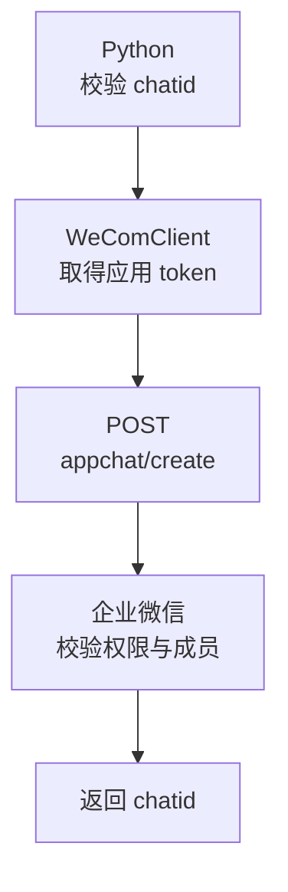
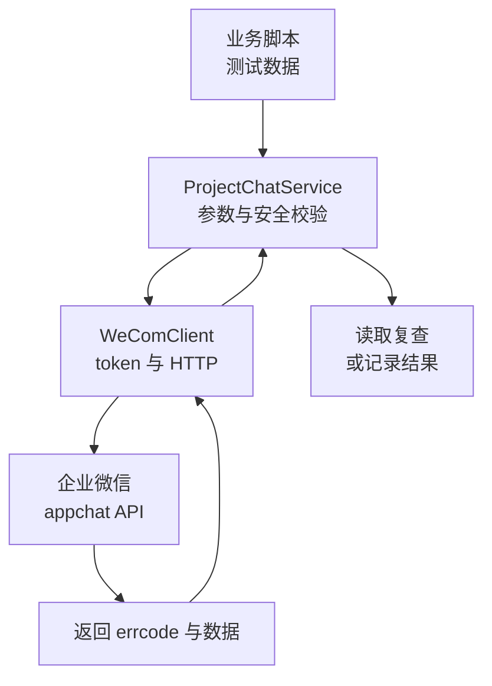

# 第 18 章：Python 创建与管理企业内部项目群

> 本章定位：使用自建应用的 `appchat` API 创建、读取、修改和管理企业内部项目群；它不同于群机器人和客户群。

## 本章目标

第 15 章把取 token、HTTP 超时和企业微信错误码统一放进了 `WeComClient`。但只有通用客户端，还不知道“项目群”有哪些接口和安全边界。本章从一个**只含虚拟员工的测试群**开始，逐步完成：

1. 调用 `appchat/create` 创建内部应用群；
2. 调用 `appchat/get` 读取并核对群资料；
3. 调用 `appchat/update` 安全增删成员、改群名和群主；
4. 调用 `appchat/send` 发送测试文本和文件；
5. 封装可供第 19、20 章复用的 `ProjectChatService`。

> **安全约定：**本章所有 UserId、群名和消息都是虚拟示例。请先在测试企业或测试应用可见范围内演练，不要直接操作生产群。

## 前置条件与版本

- Python 3.11 或 3.12；
- `requests` 2.32.x；
- 已完成第 15 章，并有可用的 `WeComClient`；
- 只能使用**企业自建应用**调用本章 appchat 接口，且该应用的可见范围必须配置为**根部门**；
- 创建、读取、更新和发送群消息必须始终使用创建该群的同一个自建应用及其 `APP_SECRET`；
- 测试成员 `test_owner`、`test_dev01`、`test_dev02` 已存在；创建群时成员总数必须为 2～2000 人；
- 操作者已获得企业管理员授权，可以使用该应用创建内部群。

安装依赖：

```bash
python -m pip install "requests>=2.32,<3"
```

本章严格沿用第 15 章客户端契约。客户端构造时传企业 ID 和基础地址，每次调用再显式传入对应应用的 Secret：

```python
import config
from wecom_client import WeComClient

client = WeComClient(config.CORP_ID, config.BASE_URL)
result = client.get(
    "appchat/get", config.APP_SECRET, {"chatid": "TESTPROJECT001"}
)
result = client.post(
    "appchat/create", config.APP_SECRET, {"name": "测试群", ...}
)
```

- `path` 是相对于 `https://qyapi.weixin.qq.com/cgi-bin` 的路径；
- 客户端自动取得并注入 `access_token`；
- `get(path, secret, params)` 用第三个参数传查询参数；
- `post(path, secret, payload)` 用第三个参数传 JSON；
- 客户端设置连接和读取超时，先检查 HTTP 状态，再检查 JSON 的 `errcode`；
- 明确业务错误抛 `WeComApiError`；传输错误抛 `WeComTransportError`，写请求仅当 `exc.result_unknown=True` 时表示结果不确定；
- 客户端不在日志中打印完整 token、Secret 或消息正文。

如果你的第 15 章方法名不同，请只在客户端适配一次，不要在项目群服务里重新实现 token 和 HTTP。

## 三类“群”的边界

“企业微信群”在口语里很容易混淆。本章只处理第一种：

| 类型 | 本章是否使用 | 调用身份 | 常见入口 | 适用场景 |
|---|---:|---|---|---|
| 企业内部应用群（appchat） | **是** | 自建应用的 `access_token` | `appchat/create/get/update/send` | 企业内部项目协作、系统通知 |
| 群机器人 | 否 | 群里的 webhook key | webhook 地址 | 向一个已手工配置机器人的群推送；不能用本章接口管理成员 |
| 客户群 | 否 | 客户联系能力与相关 Secret | 客户联系/客户群接口 | 外部联系人、客户运营；权限、字段和合规要求都不同 |

不要把群机器人的 webhook 地址交给 `WeComClient`，也不要拿客户群的 `chat_id` 调 `appchat/get`。它们只是名字都带“群”，不是同一套资源。

另一个容易误解的地方是权限：

- appchat 接口仅适用于**企业自建应用**，该应用的可见范围必须配置为**根部门**；
- 创建群、读取群、更新群和发送群消息必须使用创建该群的同一个应用及其 `APP_SECRET`；不能拿其他应用创建的 `chatid` 发送；
- 创建群时 `userlist` 必须包含 2～2000 名企业成员，群主必须在其中；
- 不存在、已停用的成员会导致接口失败；
- `errcode=0` 只表示企业微信接受了本次操作，不表示每位成员已经阅读消息。

## 版本与最终目录

| 版本 | 主题 | 解决上一版什么问题 |
|---|---|---|
| V1 | 创建测试项目群 | —— |
| V2 | 读取群信息 | 创建成功后无法确认真实成员和群主 |
| V3 | 安全增删成员 | 只能在创建时固定成员，误删风险高 |
| V4 | 修改群名与群主 | 项目变化后资料无法维护 |
| V5 | 发送测试消息 | 群已存在但程序还不能通知成员 |
| V6 | 封装服务 | 代码零散，第 19、20 章无法稳定复用 |

最终只需要这些文件：

```text
wecom_project_chat/
├─ .env                         # 本地配置，不提交
├─ config.py                    # 企业 ID、应用 Secret 等
├─ wecom_client.py              # 第 15 章 WeComClient
├─ project_chat.py              # 本章最终服务
└─ demo_project_chat.py         # 只操作测试群的演练入口
```

---

## V1：创建测试项目群

### 上一版的问题

第 15 章只有通用 HTTP 客户端，还没有任何项目群。先完成最小闭环：创建一个测试群。

### 最小代码

新建 `v1_create_chat.py`：

```python
# -*- coding: utf-8 -*-
"""V1：创建只含虚拟成员的测试项目群。"""

import re

import config
from wecom_client import WeComClient

CHAT_ID = "TESTPROJECT001"
USER_LIST = ["test_owner", "test_dev01"]

if not re.fullmatch(r"[A-Za-z0-9]{1,32}", CHAT_ID):
    raise ValueError("chatid 只能包含字母和数字，长度必须为 1～32")
if not 2 <= len(set(USER_LIST)) <= 2000:
    raise ValueError("成员数量必须为 2～2000")

client = WeComClient(config.CORP_ID, config.BASE_URL)
result = client.post(
    "/appchat/create",
    config.APP_SECRET,
    {
        "name": "API测试项目群",
        "owner": "test_owner",
        "userlist": USER_LIST,
        "chatid": CHAT_ID,
    },
)
print("创建成功：", result["chatid"])
```

### 请求流与关键行



`re.fullmatch(...)` 是本教程主动收紧的规则：`chatid` **只用字母和数字，且不超过 32 个字符**。这样可以避免空格、中文和符号在数据库、日志或 URL 中带来歧义。

`owner` 必须也在 `userlist` 中。示例固定使用 `TEST` 前缀，提醒所有人这是演练资源。不要用生产项目名测试删除和改群主。

`client.post` 会自动加入 token，并在 `errcode != 0` 时抛异常，因此业务代码不再重复写错误检查。

### 验证

1. 运行脚本一次，记录返回的 `chatid`；
2. 请 `test_owner` 在企业微信客户端确认出现“API测试项目群”；
3. 再运行一次应得到“群 ID 已存在”一类错误，而不是创建第二个群。

### V1 的问题

终端说创建成功还不够。我们尚未读取服务端实际保存的群名、群主和成员，也无法判断配置是否符合预期。

---

## V2：读取群信息

### 上一版的问题

V1 只相信创建响应。发生人工改名、成员变化或脚本参数写错时，程序没有核对依据。

### 代码

```python
import config
from wecom_client import WeComClient

client = WeComClient(config.CORP_ID, config.BASE_URL)
result = client.get(
    "/appchat/get",
    config.APP_SECRET,
    {"chatid": "TESTPROJECT001"},
)
chat = result["chat_info"]

print("群 ID：", chat["chatid"])
print("群名：", chat["name"])
print("群主：", chat["owner"])
print("成员：", ", ".join(chat["userlist"]))
```

### 关键行说明

GET 接口的 `chatid` 放在 `params` 中，由 `requests` 正确编码；不要自己拼接 `?chatid=...&access_token=...`。读取结果时先取 `chat_info`，再访问群字段，避免把外层响应误当成群对象。

读取接口不仅用于展示。所有修改前都应该先读一次，构成“读取—校验—修改—复查”的安全闭环。

### 验证

检查输出中：

- `chatid` 与 `TESTPROJECT001` 完全相同；
- `owner` 在 `userlist` 中；
- 成员集合与测试名单一致。

### V2 的问题

现在能看，但还不能安全改。直接把一整份新名单覆盖上去，很容易误删群主或把最后一个成员删掉。

---

## V3：安全增删群成员

### 上一版的问题

V2 能读取现状，却没有把“想增加谁、想删除谁”转换成最小变更，也没有删除保护。

### 安全更新代码

```python
import config
from wecom_client import WeComClient

client = WeComClient(config.CORP_ID, config.BASE_URL)
chat_id = "TESTPROJECT001"

current = client.get(
    "/appchat/get", config.APP_SECRET, {"chatid": chat_id}
)["chat_info"]
current_users = set(current["userlist"])
owner = current["owner"]

wanted_add = {"test_dev02"}
wanted_delete = {"test_dev01"}

add_users = sorted(wanted_add - current_users)
delete_users = sorted(wanted_delete & current_users)
remaining_users = (current_users | set(add_users)) - set(delete_users)

if owner in delete_users:
    raise ValueError("不能删除当前群主；请先在 V4 转移群主")
if not 2 <= len(remaining_users) <= 2000:
    raise ValueError("更新后成员数量必须为 2～2000")

payload = {"chatid": chat_id}
if add_users:
    payload["add_user_list"] = add_users
if delete_users:
    payload["del_user_list"] = delete_users

if len(payload) == 1:
    print("成员无变化，不调用接口")
else:
    client.post("/appchat/update", config.APP_SECRET, payload)
    print("成员更新成功")
```

### 为什么先做集合运算

- `wanted_add - current_users`：只增加尚未入群的人，重复执行不会反复提交相同成员；
- `wanted_delete & current_users`：只删除当前确实在群里的人；
- 先计算 `remaining_users`：在网络请求前阻止“删空群”操作；
- 排序后再发送：便于日志和人工复核，但日志只写 UserId 数量或测试 UserId，不写真实姓名。

这里使用增量字段 `add_user_list`、`del_user_list`，而不是用本地名单想当然地覆盖服务端全部成员。**新增与删除有交集时必须先报错**，生产代码还应加入：

```python
if wanted_add & wanted_delete:
    raise ValueError("同一成员不能同时加入和删除")
```

### 安全演练顺序

1. 只增加 `test_dev02`；
2. 调 `appchat/get` 复查；
3. 再删除 `test_dev01`；
4. 再次读取，确认群主仍在且群不为空。

### V3 的问题

成员可以变化了，但项目改名或负责人交接时，群名与群主仍是旧值。

---

## V4：修改群名与群主

### 上一版的问题

V3 明确禁止直接删除群主，却还没有提供安全的群主转移步骤。

### 代码

```python
import config
from wecom_client import WeComClient

client = WeComClient(config.CORP_ID, config.BASE_URL)
chat_id = "TESTPROJECT001"
new_owner = "test_dev02"
new_name = "API测试项目群-第二阶段"

chat = client.get(
    "/appchat/get", config.APP_SECRET, {"chatid": chat_id}
)["chat_info"]
users = set(chat["userlist"])

if new_owner not in users:
    raise ValueError("新群主必须先加入群，再转移群主")
if not new_name.strip():
    raise ValueError("群名不能为空")

client.post(
    "/appchat/update",
    config.APP_SECRET,
    {
        "chatid": chat_id,
        "name": new_name.strip(),
        "owner": new_owner,
    },
)

updated = client.get(
    "/appchat/get", config.APP_SECRET, {"chatid": chat_id}
)["chat_info"]
assert updated["owner"] == new_owner
assert updated["name"] == new_name
print("群资料更新并复查成功")
```

### 关键步骤

转移顺序一定是：**先确认新群主已在群内 → 更新 owner → 重新读取确认 → 如有需要再删除旧群主**。不要把“加新群主、改 owner、删旧群主”未经检查地混成一次操作。

`assert` 适合教程自测；长期程序应改成明确异常和告警，因为 Python 可用优化参数关闭断言。

### V4 的问题

群已经可管理，但业务价值还没有体现：程序仍不能向这个项目群发通知。

---

## V5：发送测试消息

### 上一版的问题

V4 只管理群资料。要供第 19 章使用，还必须跑通 `appchat/send`。

### 发送文本

```python
import config
from wecom_client import WeComClient

client = WeComClient(config.CORP_ID, config.BASE_URL)
result = client.post(
    "/appchat/send",
    config.APP_SECRET,
    {
        "chatid": "TESTPROJECT001",
        "msgtype": "text",
        "text": {"content": "[测试] 项目群 API 已连通"},
        "safe": 0,
    },
)
print("接口已接受消息：", result.get("errmsg", "ok"))
```

消息结构必须满足：`msgtype` 是 `text`，请求体就必须有同名的 `text` 对象。文件消息同理：

```python
client.post(
    "/appchat/send",
    config.APP_SECRET,
    {
        "chatid": "TESTPROJECT001",
        "msgtype": "file",
        "file": {"media_id": "第5章上传后得到的media_id"},
        "safe": 0,
    },
)
```

`safe=0` 表示普通消息。是否支持、是否需要保密能力，应以企业后台和官方文档为准，不要擅自把生产消息设成不同安全级别。

> **发送成功边界：**收到 `errcode=0` 表示企业微信服务器接受了请求，不代表所有群成员已阅读。若 HTTP 读取超时，消息可能已发送，也可能未发送；第 19 章会把这种情况记为 `Unknown`，不能无条件自动重发。

### V5 的问题

创建、读取、修改和发送的代码散落在五个脚本里。下一章若复制这些 payload，很快会出现字段不一致。

---

## V6：封装 ProjectChatService

### 上一版的问题

V5 已跑通接口，但缺少统一校验、测试群保护和可复用方法。

### 完整 `project_chat.py`

```python
# -*- coding: utf-8 -*-
"""企业内部应用群服务；HTTP 与 token 统一交给 WeComClient。"""

from __future__ import annotations

import re
from typing import Iterable

from wecom_client import WeComClient

_CHAT_ID_RE = re.compile(r"[A-Za-z0-9]{1,32}")


class ProjectChatService:
    """封装 appchat/create、get、update、send。"""

    def __init__(self, client: WeComClient, app_secret: str) -> None:
        self.client = client
        self.app_secret = app_secret

    @staticmethod
    def _check_chat_id(chat_id: str) -> str:
        if not _CHAT_ID_RE.fullmatch(chat_id):
            raise ValueError("chatid 只能包含字母和数字，长度必须为 1～32")
        return chat_id

    @staticmethod
    def _clean_users(users: Iterable[str]) -> list[str]:
        cleaned = sorted({user.strip() for user in users if user.strip()})
        if not 2 <= len(cleaned) <= 2000:
            raise ValueError("成员数量必须为 2～2000")
        return cleaned

    def create(self, chat_id: str, name: str,
               owner: str, users: Iterable[str]) -> dict:
        chat_id = self._check_chat_id(chat_id)
        user_list = self._clean_users(users)
        if owner not in user_list:
            raise ValueError("群主必须包含在成员列表中")
        if not name.strip():
            raise ValueError("群名不能为空")
        return self.client.post(
            "/appchat/create",
            self.app_secret,
            {
                "chatid": chat_id,
                "name": name.strip(),
                "owner": owner,
                "userlist": user_list,
            },
        )

    def get(self, chat_id: str) -> dict:
        chat_id = self._check_chat_id(chat_id)
        result = self.client.get(
            "/appchat/get", self.app_secret, {"chatid": chat_id}
        )
        return result["chat_info"]

    def update_members(self, chat_id: str,
                       add_users: Iterable[str] = (),
                       delete_users: Iterable[str] = ()) -> dict | None:
        chat_id = self._check_chat_id(chat_id)
        current = self.get(chat_id)
        current_users = set(current["userlist"])
        requested_additions = {u.strip() for u in add_users if u.strip()}
        requested_deletions = {u.strip() for u in delete_users if u.strip()}
        if requested_additions & requested_deletions:
            raise ValueError("同一成员不能同时加入和删除")

        additions = requested_additions - current_users
        deletions = requested_deletions & current_users

        if current["owner"] in deletions:
            raise ValueError("不能删除当前群主；请先转移群主")
        remaining_users = (current_users | additions) - deletions
        if not 2 <= len(remaining_users) <= 2000:
            raise ValueError("更新后成员数量必须为 2～2000")

        payload: dict = {"chatid": chat_id}
        if additions:
            payload["add_user_list"] = sorted(additions)
        if deletions:
            payload["del_user_list"] = sorted(deletions)
        if len(payload) == 1:
            return None
        return self.client.post(
            "/appchat/update", self.app_secret, payload
        )

    def update_profile(self, chat_id: str, *,
                       name: str | None = None,
                       owner: str | None = None) -> dict:
        chat_id = self._check_chat_id(chat_id)
        current = self.get(chat_id)
        payload: dict = {"chatid": chat_id}
        if name is not None:
            if not name.strip():
                raise ValueError("群名不能为空")
            payload["name"] = name.strip()
        if owner is not None:
            if owner not in current["userlist"]:
                raise ValueError("新群主必须已经在群内")
            payload["owner"] = owner
        if len(payload) == 1:
            raise ValueError("至少提供 name 或 owner")
        return self.client.post(
            "/appchat/update", self.app_secret, payload
        )

    def send_text(self, chat_id: str, content: str, safe: int = 0) -> dict:
        chat_id = self._check_chat_id(chat_id)
        if not content.strip():
            raise ValueError("消息内容不能为空")
        return self.client.post(
            "/appchat/send",
            self.app_secret,
            {
                "chatid": chat_id,
                "msgtype": "text",
                "text": {"content": content},
                "safe": safe,
            },
        )

    def send_file(self, chat_id: str, media_id: str,
                  safe: int = 0) -> dict:
        chat_id = self._check_chat_id(chat_id)
        if not media_id.strip():
            raise ValueError("media_id 不能为空")
        return self.client.post(
            "/appchat/send",
            self.app_secret,
            {
                "chatid": chat_id,
                "msgtype": "file",
                "file": {"media_id": media_id},
                "safe": safe,
            },
        )
```

### 使用入口 `demo_project_chat.py`

```python
import config
from project_chat import ProjectChatService
from wecom_client import WeComClient

client = WeComClient(config.CORP_ID, config.BASE_URL)
service = ProjectChatService(client, config.APP_SECRET)
chat_id = "TESTPROJECT001"

chat = service.get(chat_id)
print(f"准备向测试群发送，群名={chat['name']}，成员数={len(chat['userlist'])}")

if not chat_id.startswith("TEST"):
    raise RuntimeError("演练脚本只允许操作 TEST 开头的群")

service.send_text(chat_id, "[测试] ProjectChatService 工作正常")
print("测试消息请求成功")
```

### 为什么这样分层

| 层 | 负责 | 不负责 |
|---|---|---|
| `WeComClient` | token、GET/POST、超时、HTTP/JSON/errcode | 群成员安全规则 |
| `ProjectChatService` | appchat 路径、payload、chatid 与成员校验 | 自己再取 token |
| 业务入口 | 选择哪个测试群、发什么业务消息 | 拼 API JSON |

这样第 19 章只调用 `service.send_text(...)`，第 20 章只调用 `service.send_file(...)`。

## 完整请求流



完整管理顺序是：创建测试群 → 读取确认 → 增加成员 → 读取确认 → 转移群主 → 读取确认 → 删除旧成员 → 发送测试消息。任何一步失败，都先停止并读取现状，不要靠猜测继续执行。

## 自测与故障排查

### 自测表

| 编号 | 操作 | 期望结果 |
|---|---|---|
| T1 | 用 `TESTPROJECT001` 创建群 | 返回同一 chatid，测试成员看到群 |
| T2 | 再次创建同一 chatid | 明确失败，不产生第二个群 |
| T3 | 用含中文、横线或 33 位 chatid | 本地 `ValueError`，不发请求 |
| T4 | 读取群 | 群主在成员列表中 |
| T5 | 重复增加已有成员 | 不调用更新接口 |
| T6 | 尝试删除当前群主 | 本地拒绝 |
| T7 | 转移群主后删除旧群主 | 更新成功且读取结果正确 |
| T8 | 发送文本 | 群内出现带 `[测试]` 的消息 |
| T9 | 模拟读取超时 | 报“结果不确定”，不自动重发 |

### 常见故障

| 现象 | 常见原因 | 处理方法 |
|---|---|---|
| 创建或加人失败 | 成员不存在、停用或不在应用可见范围 | 在管理后台核对 UserId 和应用可见范围 |
| 权限不足 | 用错 Secret，或应用没有对应能力 | 确认使用自建应用 Secret，由管理员授权 |
| 找不到群 | 混用了机器人群、客户群或写错 chatid | 确认该 ID 来自 `appchat/create` |
| chatid 校验失败 | 含符号、中文、空格或超过 32 位 | 改为 1～32 位字母数字 |
| 无法删除成员 | 目标是当前群主 | 先把群主转移给已在群内的成员 |
| `errcode=0` 但成员说没看到 | 客户端离线、通知设置或尚未查看 | 请成员在企业微信中打开群核对；接口不提供已读证明 |
| HTTP 超时 | 网络中断或服务端响应丢失 | 先读取/人工核对；发送消息不能无条件重试 |
| 频繁报 token 错误 | token 缓存未按应用 Secret 隔离 | 回到第 15 章检查 WeComClient 缓存键 |

排错时可以记录：接口路径、chatid、HTTP 状态、`errcode`、脱敏后的 `errmsg` 和请求时间。不要记录 Secret、完整 token、真实姓名或敏感消息正文。

## 完成清单

- [ ] 能说清 appchat、群机器人、客户群不是同一套接口
- [ ] 已使用企业自建应用凭证，且应用可见范围配置为根部门
- [ ] 创建、管理和发送始终使用创建该群的同一个 `APP_SECRET`
- [ ] 创建或更新后的成员数量始终为 2～2000
- [ ] `chatid` 仅含字母数字且不超过 32 位
- [ ] 已完成 `appchat/create/get/update/send` 四类调用
- [ ] 修改前读取现状，修改后再次读取复查
- [ ] 不会直接删除当前群主或删空成员
- [ ] `ProjectChatService` 只复用 `WeComClient.get/post`
- [ ] 理解接口成功不等于成员已读
- [ ] 理解发送超时代表结果不确定，不能无条件重发
- [ ] 日志不含 Secret、完整 token 和真实敏感内容

## 参考资料

- [企业微信官方：创建群聊（appchat/create）](https://developer.work.weixin.qq.com/document/path/90245)
- [企业微信官方：获取群聊会话（appchat/get）](https://developer.work.weixin.qq.com/document/path/90246)
- [企业微信官方：修改群聊（appchat/update）](https://developer.work.weixin.qq.com/document/path/90247)
- [企业微信官方：应用推送消息到群聊会话（appchat/send）](https://developer.work.weixin.qq.com/document/path/90248)
- [企业微信官方：获取 access_token](https://developer.work.weixin.qq.com/document/path/91039)

> 本章对外部官方资料的接口含义、限制和流程均已重新表述，以适合新手阅读；实际字段、权限和限额可能调整，上线前请以企业微信最新官方文档为准。
