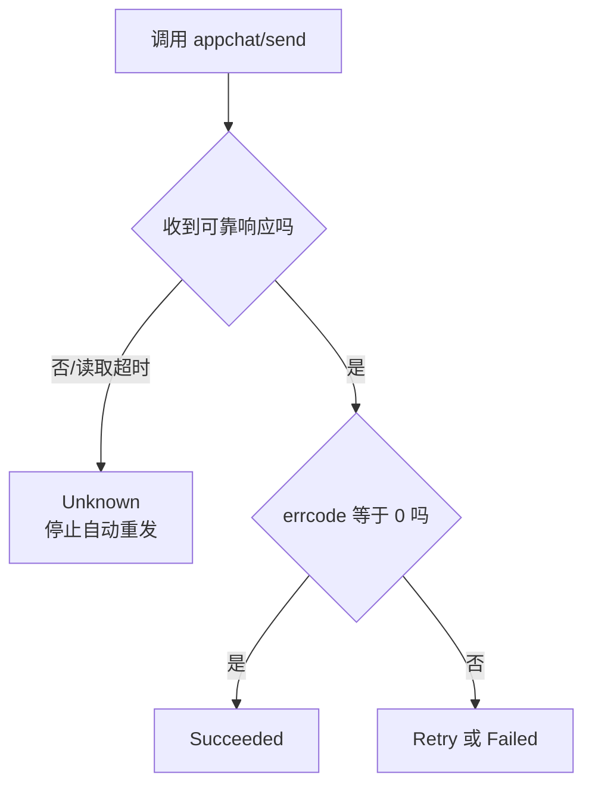
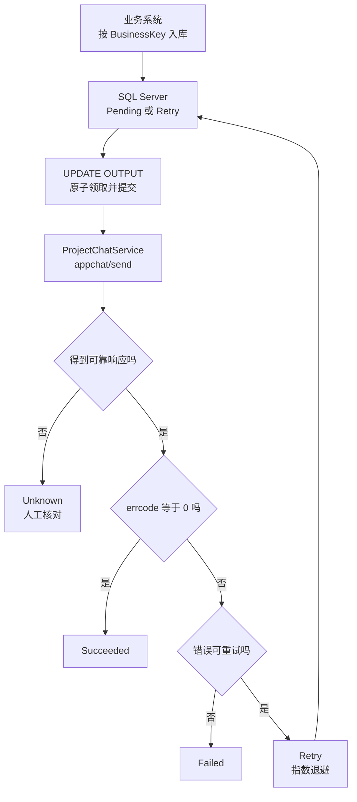

# 第 19 章：Python 从 SQL Server 读取任务并发送项目群消息

> 本章定位：建立独立的项目群消息任务表，领取待发任务后调用 `appchat/send`，并正确处理并发、退避和发送结果不确定性。

## 本章目标

第 18 章已经能执行 `service.send_text(chat_id, content)`，但消息仍写死在脚本里。上一章的做法有四个问题：业务系统无法提交任务、两个进程可能重复发送、失败无法追踪、程序崩溃后无法恢复。

本章把项目群通知变成数据库任务，完成：

1. 新建独立的 `AppChatMessageTask`，并通过业务键防止重复入库；
2. 用参数化 SQL 读取和写入任务；
3. 用 `UPDLOCK + READPAST + ROWLOCK` 原子领取任务；
4. 成功、明确失败和**结果不确定**分别回写；
5. 对明确可重试错误做指数退避，对卡住任务进入人工核对；
6. 整合一个可重复调度的批处理入口。

本章追求的是 **at-least-once 的任务处理记录加人工兜底**，不宣称消息发送达到 exactly-once。

## 前置条件与版本

- Python 3.11 或 3.12；
- `pyodbc` 5.3.x；
- SQL Server 2019 或更高版本；
- Microsoft ODBC Driver 18 for SQL Server；
- 已执行第 18 章，并可导入 `ProjectChatService`；
- 第 15 章 `WeComClient` 能区分：
  - 企业微信明确返回的业务错误 `WeComApiError`；
  - 传输错误 `WeComTransportError`；其中 `result_unknown=True` 表示写请求可能已送达但结果未知。

安装依赖：

```bash
python -m pip install "pyodbc>=5.3,<5.4" "requests>=2.32,<3"
```

> 第 15 章的 `get/post` 会把传输问题统一包装为 `WeComTransportError`。对 `appchat/send` 来说，只有 `result_unknown=True` 才进入 `Unknown`；`result_unknown=False` 是明确的传输失败，进入 `Failed`，不能混为一类。

## 为什么不直接复用 MessageTask

第 3、4 章的 `MessageTask` 面向员工、部门或标签，最终调用 `message/send`；项目群任务面向一个 `chatid`，调用 `appchat/send`。两者不是换个收件人字段那么简单：

| 对比项 | `MessageTask` | `AppChatMessageTask` |
|---|---|---|
| 目标 | 员工、部门、标签 | 一个内部应用群 `chatid` |
| 接口 | `message/send` | `appchat/send` |
| 明细结果 | 可能处理 `invaliduser` 等 | 不沿用逐员工结果模型 |
| 业务键 | 员工通知业务语义 | 群消息业务语义 |
| 超时核对 | 员工通知流程 | 需要按群和时间人工核对 |

强行复用会出现两个错误：把 `chatid` 塞进 `ToUser`，或者把员工消息的 `agentid/touser` payload 发给 appchat。建立独立表，能让字段和状态直接表达项目群发送语义。

## 状态约定、版本与最终目录

| 状态值 | 名称 | 含义 | 是否自动处理 |
|---:|---|---|---|
| 0 | Pending | 等待首次领取 | 是 |
| 1 | Processing | 已被某个 worker 原子领取 | 否，只有该 worker 可回写 |
| 2 | Succeeded | 收到 `errcode=0` | 否，终态 |
| 3 | Retry | 收到明确、可重试的失败，等待 `NextRetryAt` | 是 |
| 4 | Failed | 明确且不可重试，或达到上限 | 否，终态 |
| 5 | Unknown | 请求可能已送达，但没有可靠结果 | **否，人工核对** |

| 版本 | 主题 | 解决上一版什么问题 |
|---|---|---|
| V1 | 建立幂等任务表 | —— |
| V2 | 读取一条待发任务 | 任务只能靠手工 SQL 查看 |
| V3 | 原子领取任务 | 多个进程会抢到同一任务 |
| V4 | 发送并回写 | 领取后没有成功/失败记录 |
| V5 | 退避与卡住恢复 | 失败立即重试，崩溃任务永久卡住 |
| V6 | 整合批处理入口 | 代码零散，无法被调度器稳定调用 |

最终目录：

```text
appchat_sender/
├─ .env
├─ config.py
├─ wecom_client.py             # 第 15 章
├─ project_chat.py             # 第 18 章
├─ migrations/
│  └─ 019_appchat_message_task.sql
├─ appchat_task_repository.py
└─ run_appchat_sender.py
```

---

## V1：建立幂等任务表

### 上一版的问题

第 18 章直接从脚本发送，程序退出后没有“谁要求发、是否处理过”的记录。先把任务状态放到 SQL Server。

### 幂等 migration

新建 `migrations/019_appchat_message_task.sql`。整个脚本可重复执行：表或索引已存在时不会再次创建。

```sql
USE WeComTutorial;
GO

IF OBJECT_ID(N'dbo.AppChatMessageTask', N'U') IS NULL
BEGIN
    CREATE TABLE dbo.AppChatMessageTask (
        Id              BIGINT IDENTITY(1,1) NOT NULL
                            CONSTRAINT PK_AppChatMessageTask PRIMARY KEY,
        BusinessKey     NVARCHAR(128) NOT NULL,
        ChatId          VARCHAR(32) NOT NULL,
        MsgType         VARCHAR(16) NOT NULL
                            CONSTRAINT DF_AppChatTask_MsgType DEFAULT ('text'),
        Content         NVARCHAR(4000) NOT NULL,
        Status          TINYINT NOT NULL
                            CONSTRAINT DF_AppChatTask_Status DEFAULT (0),
        RetryCount      INT NOT NULL
                            CONSTRAINT DF_AppChatTask_RetryCount DEFAULT (0),
        MaxRetry        INT NOT NULL
                            CONSTRAINT DF_AppChatTask_MaxRetry DEFAULT (3),
        NextRetryAt     DATETIME2(0) NOT NULL
                            CONSTRAINT DF_AppChatTask_NextRetryAt DEFAULT (SYSDATETIME()),
        LockedAt        DATETIME2(0) NULL,
        WorkerId        VARCHAR(64) NULL,
        LastErrorCode   VARCHAR(32) NULL,
        LastError       NVARCHAR(1000) NULL,
        SentAt          DATETIME2(0) NULL,
        CreatedAt       DATETIME2(0) NOT NULL
                            CONSTRAINT DF_AppChatTask_CreatedAt DEFAULT (SYSDATETIME()),
        UpdatedAt       DATETIME2(0) NOT NULL
                            CONSTRAINT DF_AppChatTask_UpdatedAt DEFAULT (SYSDATETIME()),

        CONSTRAINT CK_AppChatTask_Status
            CHECK (Status IN (0, 1, 2, 3, 4, 5)),
        CONSTRAINT CK_AppChatTask_Retry
            CHECK (RetryCount >= 0 AND MaxRetry >= 0),
        CONSTRAINT CK_AppChatTask_MsgType
            CHECK (MsgType IN ('text')),
        CONSTRAINT CK_AppChatTask_ChatId
            CHECK (ChatId NOT LIKE '%[^A-Za-z0-9]%' AND LEN(ChatId) BETWEEN 1 AND 32)
    );
END;
GO

IF NOT EXISTS (
    SELECT 1 FROM sys.indexes
    WHERE object_id = OBJECT_ID(N'dbo.AppChatMessageTask')
      AND name = N'UX_AppChatMessageTask_BusinessKey'
)
BEGIN
    CREATE UNIQUE INDEX UX_AppChatMessageTask_BusinessKey
        ON dbo.AppChatMessageTask(BusinessKey);
END;
GO

IF NOT EXISTS (
    SELECT 1 FROM sys.indexes
    WHERE object_id = OBJECT_ID(N'dbo.AppChatMessageTask')
      AND name = N'IX_AppChatMessageTask_Claim'
)
BEGIN
    CREATE INDEX IX_AppChatMessageTask_Claim
        ON dbo.AppChatMessageTask(Status, NextRetryAt, Id)
        INCLUDE (ChatId, MsgType, RetryCount, MaxRetry);
END;
GO
```

### 插入一条虚拟任务

```sql
INSERT INTO dbo.AppChatMessageTask (BusinessKey, ChatId, Content)
SELECT N'demo-project-20250801-001', 'TESTPROJECT001', N'[测试] 数据库任务已送达'
WHERE NOT EXISTS (
    SELECT 1 FROM dbo.AppChatMessageTask
    WHERE BusinessKey = N'demo-project-20250801-001'
);
```

`BusinessKey` 由业务系统生成，表示“同一件业务”。唯一索引是最后防线：即使两个进程同时执行 `WHERE NOT EXISTS`，最多也只有一个能插入成功。

**这个幂等键只防止重复创建数据库任务，不能证明一次超时的 HTTP 请求是否已发送。**

`Content` 用 `NVARCHAR` 保存中文；`ChatId` 用 `VARCHAR(32)` 并加字母数字约束，与第 18 章一致；错误文本限制 1000 字符，避免把 HTML 网关页或异常堆栈无限写入数据库。

### V1 的问题

表能防止重复入库，但发送程序若用普通 `SELECT`，两个进程仍会同时读到同一条 Pending 任务。

---

## V2：读取一条待发任务

### 上一版的问题

V1 只有 SQL 表，还没有 Python 读取代码。先写最简单版本理解字段，再修复并发。

```python
# -*- coding: utf-8 -*-
"""V2：读取一条到期任务；本版尚不能并发运行。"""

import pyodbc
import config

with pyodbc.connect(config.CONN_STR) as conn:
    cursor = conn.cursor()
    cursor.execute(
        """
        SELECT TOP (1)
            Id, BusinessKey, ChatId, MsgType, Content,
            RetryCount, MaxRetry
        FROM dbo.AppChatMessageTask
        WHERE Status IN (?, ?)
          AND NextRetryAt <= SYSDATETIME()
        ORDER BY NextRetryAt, Id;
        """,
        0, 3,
    )
    task = cursor.fetchone()

if task is None:
    print("没有到期任务")
else:
    print(f"读到任务 {task.Id}，目标群 {task.ChatId}")
```

`?` 是 pyodbc 参数占位符。即使状态值来自代码，也坚持参数化，形成统一习惯。业务键、chatid、消息内容更不能用 f-string 拼入 SQL。

### V2 的问题

普通 `SELECT` 不会占有任务。进程 A 查到 Id=1 后尚未更新，进程 B 也会查到 Id=1；两边都可能发送。

---

## V3：原子领取任务

### 上一版的问题

V2 把“查询”和“改成处理中”分成两条语句，中间存在竞争窗口。本版用一条 `UPDATE ... OUTPUT` 同时领取并返回任务。

### 领取 SQL

```sql
;WITH Candidate AS (
    SELECT TOP (1) *
    FROM dbo.AppChatMessageTask WITH (UPDLOCK, READPAST, ROWLOCK)
    WHERE Status IN (0, 3)
      AND NextRetryAt <= SYSDATETIME()
    ORDER BY NextRetryAt, Id
)
UPDATE Candidate
SET Status = 1,
    LockedAt = SYSDATETIME(),
    WorkerId = ?,
    UpdatedAt = SYSDATETIME()
OUTPUT
    inserted.Id,
    inserted.BusinessKey,
    inserted.ChatId,
    inserted.MsgType,
    inserted.Content,
    inserted.RetryCount,
    inserted.MaxRetry;
```

三个锁提示的含义：

| 锁提示 | 作用 | 注意 |
|---|---|---|
| `UPDLOCK` | 读候选行时就按“准备更新”锁住 | 防止另一 worker 同领该行 |
| `READPAST` | 跳过已被其他 worker 锁住的行 | 队列不会在第一行互相等待 |
| `ROWLOCK` | 建议 SQL Server 使用行锁 | 是提示而非绝对保证，仍需监控锁升级 |

### Python 领取函数

```python
import socket
import uuid

CLAIM_SQL = """上面的 SQL 原样放这里"""


def make_worker_id() -> str:
    return f"{socket.gethostname()}-{uuid.uuid4().hex[:12]}"[:64]


def claim_one(conn, worker_id: str):
    cursor = conn.cursor()
    cursor.execute(CLAIM_SQL, worker_id)
    row = cursor.fetchone()
    conn.commit()                    # 领取后立即提交，立刻释放数据库锁
    return row
```

最重要的一行是 `conn.commit()`。不要在数据库事务中调用企业微信：网络请求可能等十几秒，若锁一直不释放，其他 worker 和后台维护都会被堵住。

`WorkerId` 每个进程唯一，后续成功/失败回写都必须带 `WHERE Id=? AND Status=1 AND WorkerId=?`，避免已经被人工处理的旧 worker 覆盖新状态。

### V3 的问题

任务已能安全领取，但发送后若不回写，所有任务都会永久停在 Processing。

---

## V4：发送并回写结果

### 上一版的问题

V3 只有领取，没有定义“明确成功、明确失败、没有收到响应”三种结果。

### 三种结果必须分开



HTTP 超时只表示客户端没有按时拿到完整响应。请求可能已经到达企业微信并发出消息，所以**不能捕获所有异常后统一改回 Pending**。

### 回写函数

```python
SUCCESS_SQL = """
UPDATE dbo.AppChatMessageTask
SET Status = 2, SentAt = SYSDATETIME(), UpdatedAt = SYSDATETIME(),
    LockedAt = NULL, WorkerId = NULL,
    LastErrorCode = NULL, LastError = NULL
WHERE Id = ? AND Status = 1 AND WorkerId = ?;
"""

UNKNOWN_SQL = """
UPDATE dbo.AppChatMessageTask
SET Status = 5, UpdatedAt = SYSDATETIME(),
    LockedAt = NULL, WorkerId = NULL,
    LastErrorCode = ?, LastError = ?
WHERE Id = ? AND Status = 1 AND WorkerId = ?;
"""


def mark_succeeded(conn, task_id: int, worker_id: str) -> None:
    cursor = conn.cursor()
    cursor.execute(SUCCESS_SQL, task_id, worker_id)
    if cursor.rowcount != 1:
        conn.rollback()
        raise RuntimeError("成功回写失败：任务已不属于当前 worker")
    conn.commit()


def mark_unknown(conn, task_id: int, worker_id: str,
                 code: str, message: str) -> None:
    cursor = conn.cursor()
    cursor.execute(UNKNOWN_SQL, code[:32], message[:1000], task_id, worker_id)
    if cursor.rowcount != 1:
        conn.rollback()
        raise RuntimeError("Unknown 回写失败：请立即告警并人工核对")
    conn.commit()
```

所有值都通过 `?` 传入；`message[:1000]` 与表字段长度一致；先检查 `rowcount` 再提交，防止悄悄丢失状态。

### 发送主干

下面严格使用第 15 章的两个异常。`WeComTransportError.result_unknown=True` 表示请求可能已经离开本机但没有可靠响应；`result_unknown=False` 表示明确的传输失败。`WeComApiError` 表示企业微信明确返回了 `errcode`。

```python
from project_chat import ProjectChatService
from wecom_client import WeComApiError, WeComTransportError


def send_claimed_task(conn, service: ProjectChatService,
                      task, worker_id: str) -> None:
    try:
        service.send_text(task.ChatId, task.Content)
    except WeComTransportError as exc:
        if exc.result_unknown:
            mark_unknown(conn, task.Id, worker_id,
                         "HTTP_OUTCOME_UNKNOWN", str(exc))
            print(f"任务 {task.Id} 结果不确定，已停止自动重发")
        else:
            mark_definite_failure(
                conn, task, worker_id, exc.kind, str(exc), retryable=False
            )
            print(f"任务 {task.Id} 明确传输失败，不自动重试")
        return
    except WeComApiError:
        # V5 再实现明确 API 失败的分类与退避。
        raise
    else:
        mark_succeeded(conn, task.Id, worker_id)
        print(f"任务 {task.Id} 发送成功")
```

不要把完整 `Content` 写入日志；任务 Id、BusinessKey、ChatId、错误码和耗时已经足够排查。

### V4 的问题

明确成功、传输失败和结果不确定已经安全落库，但 `WeComApiError` 的限流、系统繁忙等明确业务错误尚未分类退避；程序崩溃还会留下 Processing。

---

## V5：失败退避与卡住恢复

### 上一版的问题

V4 遇到明确错误只会抛异常。立即循环重试会制造请求风暴；永不重试又会浪费可恢复机会。

### 指数退避

本章示例以 30 秒为基数：第 1 次失败等 30 秒，第 2 次等 60 秒，第 3 次等 120 秒，最长不超过 30 分钟。

```python
from datetime import datetime, timedelta


def retry_delay_seconds(retry_count: int) -> int:
    """retry_count 是本次失败前已经失败的次数。"""
    return min(1800, 30 * (2 ** retry_count))
```

只有**已收到明确错误响应且确认可重试**时才使用它。示例把系统繁忙或服务暂不可用归为可重试；具体错误码清单应集中维护，并按官方文档和实际响应复核，不能把所有 `errcode` 都重试。

```python
RETRY_SQL = """
UPDATE dbo.AppChatMessageTask
SET Status = ?, RetryCount = RetryCount + 1,
    NextRetryAt = ?, UpdatedAt = SYSDATETIME(),
    LockedAt = NULL, WorkerId = NULL,
    LastErrorCode = ?, LastError = ?
WHERE Id = ? AND Status = 1 AND WorkerId = ?;
"""


def mark_definite_failure(conn, task, worker_id: str,
                          error_code: str, message: str,
                          retryable: bool) -> None:
    next_count = task.RetryCount + 1
    can_retry = retryable and next_count <= task.MaxRetry
    status = 3 if can_retry else 4
    next_time = (
        datetime.now() + timedelta(seconds=retry_delay_seconds(task.RetryCount))
        if can_retry else datetime.now()
    )

    cursor = conn.cursor()
    cursor.execute(
        RETRY_SQL,
        status, next_time, error_code[:32], message[:1000],
        task.Id, worker_id,
    )
    if cursor.rowcount != 1:
        conn.rollback()
        raise RuntimeError("失败回写没有更新任何行")
    conn.commit()
```

`MaxRetry=3` 表示最多允许三次失败后的重新领取；达到上限进入 Failed。永久错误，例如 chatid 不存在、参数不合法、应用无权限，应直接 Failed，修正数据后由人工创建新任务或明确重置。

### 卡住恢复

若进程在领取后崩溃，任务会一直是 Processing。最危险的做法是把超时 Processing 全部改回 Pending，因为进程可能恰好在“企业微信已发送、数据库尚未回写”之间崩溃。

因此本章的恢复策略是：**超时 Processing 一律转 Unknown，人工核对，不自动重发。**

```sql
DECLARE @StuckBefore DATETIME2(0) = DATEADD(MINUTE, -10, SYSDATETIME());

UPDATE dbo.AppChatMessageTask
SET Status = 5,
    LastErrorCode = 'WORKER_STUCK',
    LastError = N'worker 超过 10 分钟未回写；消息可能已发送，请人工核对群记录',
    LockedAt = NULL,
    WorkerId = NULL,
    UpdatedAt = SYSDATETIME()
WHERE Status = 1
  AND LockedAt < @StuckBefore;
```

10 分钟必须大于一次正常发送的最长时间。若你的 HTTP 总超时是 30 秒，10 分钟有足够余量；不要把阈值设成 20 秒，否则正常任务也会被回收。

人工处理 Unknown 的推荐步骤：

1. 按 `ChatId`、`BusinessKey`、任务创建时间在测试群中核对；
2. 能确认已发送：人工把状态改为 Succeeded，并记录操作人和依据（生产系统应另建审计表）；
3. 能确认未发送：创建一个**新的 BusinessKey** 或经审批重置任务；
4. 无法确认：保持 Unknown，不用“试着再发一次”掩盖不确定性。

### V5 的问题

关键算法已有，但连接、领取、恢复、异常隔离仍散落，不能直接交给计划任务循环调用。

---

## V6：整合批处理入口

### 上一版的问题

V5 需要一个明确的入口来控制每批数量、单任务异常隔离和连接生命周期。

### `appchat_task_repository.py`

```python
# -*- coding: utf-8 -*-
"""项目群消息任务的 SQL Server 仓储。"""

from datetime import datetime, timedelta

CLAIM_SQL = """
;WITH Candidate AS (
    SELECT TOP (1) *
    FROM dbo.AppChatMessageTask WITH (UPDLOCK, READPAST, ROWLOCK)
    WHERE Status IN (0, 3)
      AND NextRetryAt <= SYSDATETIME()
    ORDER BY NextRetryAt, Id
)
UPDATE Candidate
SET Status = 1, LockedAt = SYSDATETIME(), WorkerId = ?,
    UpdatedAt = SYSDATETIME()
OUTPUT inserted.Id, inserted.BusinessKey, inserted.ChatId,
       inserted.MsgType, inserted.Content,
       inserted.RetryCount, inserted.MaxRetry;
"""


class AppChatTaskRepository:
    def __init__(self, conn) -> None:
        self.conn = conn

    def claim_one(self, worker_id: str):
        cursor = self.conn.cursor()
        cursor.execute(CLAIM_SQL, worker_id)
        task = cursor.fetchone()
        self.conn.commit()
        return task

    def mark_succeeded(self, task_id: int, worker_id: str) -> None:
        cursor = self.conn.cursor()
        cursor.execute(
            """
            UPDATE dbo.AppChatMessageTask
            SET Status=2, SentAt=SYSDATETIME(), UpdatedAt=SYSDATETIME(),
                LockedAt=NULL, WorkerId=NULL,
                LastErrorCode=NULL, LastError=NULL
            WHERE Id=? AND Status=1 AND WorkerId=?;
            """,
            task_id, worker_id,
        )
        self._commit_one(cursor, "成功回写")

    def mark_unknown(self, task_id: int, worker_id: str,
                     code: str, message: str) -> None:
        cursor = self.conn.cursor()
        cursor.execute(
            """
            UPDATE dbo.AppChatMessageTask
            SET Status=5, UpdatedAt=SYSDATETIME(),
                LockedAt=NULL, WorkerId=NULL,
                LastErrorCode=?, LastError=?
            WHERE Id=? AND Status=1 AND WorkerId=?;
            """,
            code[:32], message[:1000], task_id, worker_id,
        )
        self._commit_one(cursor, "Unknown 回写")

    def mark_failure(self, task, worker_id: str, code: str,
                     message: str, retryable: bool) -> None:
        next_count = task.RetryCount + 1
        can_retry = retryable and next_count <= task.MaxRetry
        status = 3 if can_retry else 4
        delay = min(1800, 30 * (2 ** task.RetryCount))
        next_time = datetime.now() + timedelta(seconds=delay)

        cursor = self.conn.cursor()
        cursor.execute(
            """
            UPDATE dbo.AppChatMessageTask
            SET Status=?, RetryCount=RetryCount+1, NextRetryAt=?,
                UpdatedAt=SYSDATETIME(), LockedAt=NULL, WorkerId=NULL,
                LastErrorCode=?, LastError=?
            WHERE Id=? AND Status=1 AND WorkerId=?;
            """,
            status, next_time, code[:32], message[:1000],
            task.Id, worker_id,
        )
        self._commit_one(cursor, "失败回写")

    def recover_stuck(self, minutes: int = 10) -> int:
        cutoff = datetime.now() - timedelta(minutes=minutes)
        cursor = self.conn.cursor()
        cursor.execute(
            """
            UPDATE dbo.AppChatMessageTask
            SET Status=5, UpdatedAt=SYSDATETIME(),
                LockedAt=NULL, WorkerId=NULL,
                LastErrorCode='WORKER_STUCK',
                LastError=N'worker 超时未回写；消息结果不确定，请人工核对'
            WHERE Status=1 AND LockedAt < ?;
            """,
            cutoff,
        )
        count = cursor.rowcount
        self.conn.commit()
        return count

    def _commit_one(self, cursor, action: str) -> None:
        if cursor.rowcount != 1:
            self.conn.rollback()
            raise RuntimeError(f"{action}失败：任务不属于当前 worker")
        self.conn.commit()
```

### `run_appchat_sender.py`

```python
# -*- coding: utf-8 -*-
"""每次处理有限数量的项目群消息任务。"""

import socket
import uuid

import pyodbc

import config
from appchat_task_repository import AppChatTaskRepository
from project_chat import ProjectChatService
from wecom_client import (
    WeComApiError,
    WeComClient,
    WeComTransportError,
)

# 仅示例。生产环境按官方错误码与本企业策略维护白名单。
RETRYABLE_ERROR_CODES = {-1}


def worker_id() -> str:
    return f"{socket.gethostname()}-{uuid.uuid4().hex[:12]}"[:64]


def run_batch(batch_size: int = 20) -> int:
    wid = worker_id()
    processed = 0
    client = WeComClient(config.CORP_ID, config.BASE_URL)
    service = ProjectChatService(client, config.APP_SECRET)

    with pyodbc.connect(config.CONN_STR) as conn:
        repo = AppChatTaskRepository(conn)
        stuck = repo.recover_stuck(minutes=10)
        if stuck:
            print(f"发现 {stuck} 条卡住任务，已转 Unknown 等待人工核对")

        for _ in range(batch_size):
            task = repo.claim_one(wid)
            if task is None:
                break

            try:
                service.send_text(task.ChatId, task.Content)
            except WeComTransportError as exc:
                if exc.result_unknown:
                    repo.mark_unknown(
                        task.Id, wid, "HTTP_OUTCOME_UNKNOWN", str(exc)
                    )
                else:
                    repo.mark_failure(
                        task, wid, exc.kind, str(exc), retryable=False
                    )
            except WeComApiError as exc:
                repo.mark_failure(
                    task, wid, str(exc.errcode), exc.errmsg,
                    retryable=exc.errcode in RETRYABLE_ERROR_CODES,
                )
            except Exception as exc:
                # 未知程序错误不代表请求一定未发出，宁可人工核对。
                repo.mark_unknown(task.Id, wid,
                                  "UNEXPECTED_EXCEPTION", str(exc))
            else:
                repo.mark_succeeded(task.Id, wid)
            processed += 1

    return processed


if __name__ == "__main__":
    count = run_batch(batch_size=20)
    print(f"本批处理 {count} 条任务")
```

`run_batch` 每次只处理有限条，便于第 22 章一类调度器周期调用。每条任务独立回写，一条失败不会让整批事务回滚。

最后一个 `except Exception` 选择 Unknown 而不是 Retry，是保守策略：无法证明异常发生在 HTTP 调用前，就不能自动重发。更成熟的 `WeComClient` 应把“连接前明确失败”和“发送后结果未知”分成不同异常，使分类更精确。

## 完整请求流



一次完整请求包含：业务写入 → 唯一索引去重 → worker 原子领取 → **提交领取事务** → WeComClient 取 token → `appchat/send` → 按结果单独提交状态。数据库事务绝不跨越外部 HTTP 调用。

## 自测与故障排查

### 自测表

| 编号 | 方法 | 期望结果 |
|---|---|---|
| T1 | migration 连续执行两次 | 第二次不报“对象已存在” |
| T2 | 同 BusinessKey 插入两次 | 唯一索引阻止第二条 |
| T3 | 启动两个 worker | 同一任务只被一个 worker 领取 |
| T4 | 插入含引号的测试内容 | 正常保存，证明使用参数化 SQL |
| T5 | 模拟明确可重试错误 | Status=3，NextRetryAt 按 30/60/120 秒增长 |
| T6 | 模拟永久参数错误 | Status=4，不再自动领取 |
| T7 | 模拟 HTTP 读取超时 | Status=5，不自动重发 |
| T8 | 制造 11 分钟前的 Processing | 恢复为 Unknown，不回 Pending |
| T9 | worker A 领取后由人工改状态 | worker A 回写 rowcount=0 并告警 |
| T10 | 一批中一条失败 | 后续任务仍继续处理 |

### 常见故障

| 现象 | 常见原因 | 处理方法 |
|---|---|---|
| 两个进程发了重复消息 | 用了 SELECT 后 UPDATE，或超时后无条件重试 | 改用 `UPDATE...OUTPUT`；Unknown 停止自动处理 |
| 队列不动 | `NextRetryAt` 在未来、连接时区不一致或状态不是 0/3 | 查询状态和时间；统一数据库服务器时间 |
| 大量锁等待 | HTTP 调用放在事务内，或缺少领取索引 | 领取后立即 commit；检查 `IX_AppChatMessageTask_Claim` |
| Retry 疯狂增长 | 没有退避或把永久错误列为可重试 | 使用白名单和指数退避，达到 MaxRetry 后 Failed |
| Processing 长期存在 | worker 崩溃，恢复任务未运行 | 调 `recover_stuck`，转 Unknown 后人工核对 |
| Unknown 很多 | 网络不稳定、超时过短或进程被强杀 | 检查网络和超时；仍不可直接批量重发 |
| 中文错误变乱码 | 错误字段用了 VARCHAR | 使用 NVARCHAR，并传 Python str |
| 回写更新 0 行 | WorkerId 不匹配或任务被人工修改 | 停止覆盖并告警，核对审计记录 |

排查 SQL：

```sql
SELECT Id, BusinessKey, ChatId, Status, RetryCount, MaxRetry,
       NextRetryAt, LockedAt, WorkerId, LastErrorCode, LastError,
       CreatedAt, UpdatedAt, SentAt
FROM dbo.AppChatMessageTask
ORDER BY Id DESC;
```

## 完成清单

- [ ] 使用独立 `AppChatMessageTask`，没有误用 `MessageTask`
- [ ] migration 可以安全重复执行
- [ ] `BusinessKey` 有唯一索引，理解它只防重复入库
- [ ] 所有业务值都通过 `?` 参数传给 SQL
- [ ] 使用 `UPDLOCK + READPAST + ROWLOCK` 和 `UPDATE...OUTPUT` 原子领取
- [ ] 领取后先 commit，再调用企业微信
- [ ] 成功、Retry、Failed、Unknown 分开回写
- [ ] 明确可重试错误使用指数退避和最大次数
- [ ] HTTP 超时视为“结果不确定”，不无条件自动重发
- [ ] 卡住 Processing 转 Unknown，由人工核对
- [ ] 回写同时校验 Id、Status、WorkerId 和 rowcount
- [ ] 日志不打印完整 token 和消息正文

## 参考资料

- [企业微信官方：应用推送消息到群聊会话](https://developer.work.weixin.qq.com/document/path/90248)
- [企业微信官方：全局错误码](https://developer.work.weixin.qq.com/document/path/90313)
- [Microsoft Learn：SQL Server 表提示（UPDLOCK、READPAST、ROWLOCK）](https://learn.microsoft.com/sql/t-sql/queries/hints-transact-sql-table)
- [Microsoft Learn：OUTPUT 子句](https://learn.microsoft.com/sql/t-sql/queries/output-clause-transact-sql)
- [Microsoft Learn：pyodbc 驱动快速入门](https://learn.microsoft.com/sql/connect/python/pyodbc/python-sql-driver-pyodbc-quickstart)

> 本章对外部官方资料的接口、数据库锁与错误处理含义均已重新表述；上线前请核对企业微信最新错误码说明和 Microsoft 最新驱动文档。
