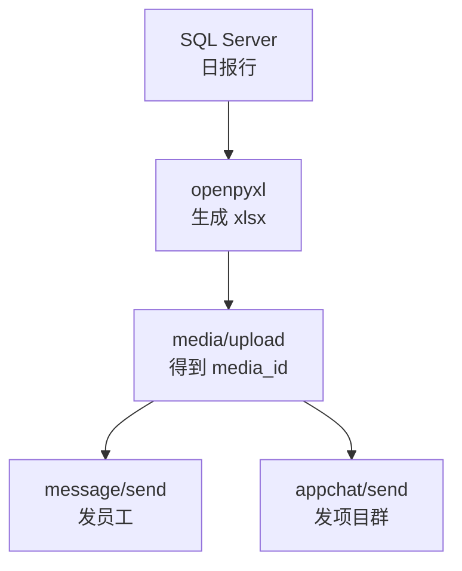
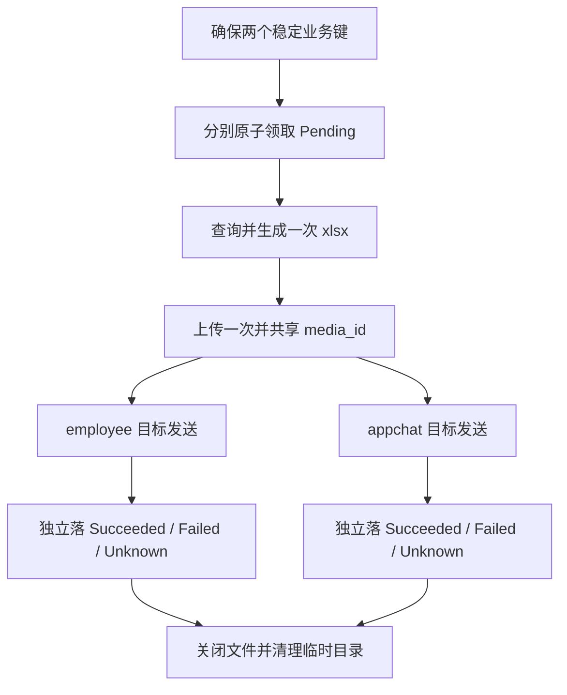

# 第 20 章：Python 生成 Excel 日报并发送

> 本章定位：从 SQL Server 查询日报数据，用 `openpyxl` 生成简单 Excel 文件，再复用素材上传能力发送给员工或项目群。

## 本章目标

第 19 章解决了“项目群文本任务如何可靠处理”，但日报不是一段短文本：它来自数据库，需要生成 `.xlsx`，上传成临时素材，再通过不同接口发送。

本章从最小查询开始，逐步完成：

1. 用 `pyodbc` 和参数化 SQL 查询某一天的示例日报；
2. 用 **openpyxl 3.1.5** 生成可打开的 `.xlsx`；
3. 增加标题、日期/数字格式、列宽和冻结窗格；
4. 复用第 5 章 `media.get_media_id(...)` 上传临时素材；
5. 通过 `message/send` 发给虚拟员工；
6. 通过 `appchat/send` 发给第 18 章测试项目群；
7. 为 employee 与 appchat 建立两个稳定业务键，分别保存 `Succeeded`、`Failed` 或 `Unknown`；
8. 用临时目录保证成功或失败后都清理本地文件。

> 本章所有人员、项目和金额都是虚构的示例数据：`test_manager`、`test_analyst`、星河项目、远山项目。请勿把真实员工信息、客户数据或生产金额复制到教程截图和日志中。

## 前置条件与版本

- Python 3.11 或 3.12；
- SQL Server 2019 或更高版本；
- Microsoft ODBC Driver 18 for SQL Server；
- `pyodbc` 5.3.x；
- **`openpyxl` 3.1.5**；
- 已完成第 5 章，能导入 `media.py`；
- 已完成第 15 章，能使用 `WeComClient.get/post`；
- 已完成第 18 章，能使用 `ProjectChatService.send_file`；
- 测试员工和 `TESTPROJECT001` 均在自建应用可见范围内。

固定版本安装：

```bash
python -m pip install "pyodbc>=5.3,<5.4" "openpyxl==3.1.5" "requests>=2.32,<3" "requests-toolbelt>=1,<2"
```

## 文件发送边界

Excel 不能直接放进 JSON。完整链路必须分三步：



这三步的成功含义不同：

| 步骤 | 成功代表什么 | 能否自动重试 |
|---|---|---|
| 生成 Excel | 本地文件已写完且能重新打开 | 可以重新生成 |
| 上传素材 | 企业微信保存了临时文件并返回 `media_id` | 一般可重试，最多产生未引用素材 |
| 发送文件消息 | 企业微信明确返回 `errcode=0` | 明确失败按规则处理；HTTP 超时不能盲目重试 |

`media_id` 是短期有效的服务端引用，不是永久下载地址。上传成功也不代表员工或群已经收到；必须再调用发送接口。

本章只生成普通 `.xlsx`，不嵌入宏、脚本、外部链接或真实个人数据。临时文件名和工作表内容都来自受控代码，不接受用户输入直接拼接路径。

## 版本与最终目录

| 版本 | 主题 | 解决上一版什么问题 |
|---|---|---|
| V1 | 查询日报数据 | —— |
| V2 | 生成最小 Excel | 只有 Python 行对象，业务人员无法查看 |
| V3 | 增加标题和格式 | 文件能打开但难读 |
| V4 | 上传临时素材 | 文件只在服务器本地 |
| V5 | 发送给员工 | 上传后没有投递 |
| V6 | 发送到项目群 | 只能单独发员工 |
| V7 | 幂等整合日报入口 | 临时文件、连接和步骤散落，双通道结果无法独立保存 |

最终目录：

```text
daily_report/
├─ .env
├─ config.py
├─ wecom_client.py              # 第 15 章
├─ media.py                     # 第 5 章
├─ project_chat.py              # 第 18 章
├─ migrations/
│  └─ 020_daily_report_delivery.sql
├─ daily_report.py              # 查询与生成
├─ daily_report_delivery.py     # 两个目标的独立投递状态
└─ run_daily_report.py          # 上传、发送、清理入口
```

不新增测试项目；本章代码直接放进现有 Python 示例目录即可。

### 最小幂等投递表

员工和项目群是两个独立目标，不能共用一个“日报已发送”布尔值。新建 `migrations/020_daily_report_delivery.sql`；表和索引都有存在性判断，脚本可连续执行两次：

```sql
USE WeComTutorial;
GO

IF OBJECT_ID(N'dbo.DailyReportDelivery', N'U') IS NULL
BEGIN
    CREATE TABLE dbo.DailyReportDelivery (
        Id              BIGINT IDENTITY(1,1) NOT NULL
                            CONSTRAINT PK_DailyReportDelivery PRIMARY KEY,
        BusinessKey     NVARCHAR(128) NOT NULL,
        ReportDate      DATE NOT NULL,
        TargetType      VARCHAR(16) NOT NULL,
        TargetKey       NVARCHAR(256) NOT NULL,
        Status          TINYINT NOT NULL
                            CONSTRAINT DF_DailyReportDelivery_Status DEFAULT (0),
        LockedAt        DATETIME2(0) NULL,
        LastErrorCode   NVARCHAR(64) NULL,
        LastError       NVARCHAR(1000) NULL,
        SentAt          DATETIME2(0) NULL,
        CreatedAt       DATETIME2(0) NOT NULL
                            CONSTRAINT DF_DailyReportDelivery_Created DEFAULT (SYSDATETIME()),
        UpdatedAt       DATETIME2(0) NOT NULL
                            CONSTRAINT DF_DailyReportDelivery_Updated DEFAULT (SYSDATETIME()),
        CONSTRAINT CK_DailyReportDelivery_Target
            CHECK (TargetType IN ('employee', 'appchat')),
        CONSTRAINT CK_DailyReportDelivery_Status
            CHECK (Status IN (0, 1, 2, 4, 5))
    );
END;
GO

IF NOT EXISTS (
    SELECT 1 FROM sys.indexes
    WHERE object_id = OBJECT_ID(N'dbo.DailyReportDelivery')
      AND name = N'UX_DailyReportDelivery_BusinessKey'
)
BEGIN
    CREATE UNIQUE INDEX UX_DailyReportDelivery_BusinessKey
        ON dbo.DailyReportDelivery (BusinessKey);
END;
GO

IF NOT EXISTS (
    SELECT 1 FROM sys.indexes
    WHERE object_id = OBJECT_ID(N'dbo.DailyReportDelivery')
      AND name = N'IX_DailyReportDelivery_Claim'
)
BEGIN
    CREATE INDEX IX_DailyReportDelivery_Claim
        ON dbo.DailyReportDelivery (ReportDate, Status, Id);
END;
GO
```

状态沿用第 19 章：`0 Pending`、`1 Processing`、`2 Succeeded`、`4 Failed`、`5 Unknown`。本章故意不自动重试：`Succeeded` 和 `Unknown` 永不自动领取；普通“明确且整体未投递”的 `Failed` 只有在人工确认并修正原因后，才可显式把原记录重置为 `Pending`。但 `INVALID_USER` 表示同一次请求可能已有部分员工成功收到，原 employee 记录是**不可整体重放终态**，绝不能重置；若修正后确需补发，必须新建只包含已核实被拒收员工的独立补发业务键。稳定业务键分别为 `daily-report:日期:employee` 与 `daily-report:日期:appchat`；唯一索引防止重复建任务，但不宣称 HTTP 请求能做到 exactly-once。

---

## V1：查询日报数据

### 上一版的问题

前两章已经能发消息，但还没有任何日报数据。本版先只解决“按日期安全查询”。

### 准备纯示例数据

如果你没有可用的练习表，可在教程数据库执行下面脚本。名称、员工和数值全部是虚拟数据；已有业务表时，请改字段映射，不要把生产数据贴进文档。

```sql
USE WeComTutorial;
GO

IF OBJECT_ID(N'dbo.DailyProjectDemo', N'U') IS NULL
BEGIN
    CREATE TABLE dbo.DailyProjectDemo (
        Id              INT IDENTITY(1,1) PRIMARY KEY,
        ReportDate      DATE NOT NULL,
        ProjectName     NVARCHAR(100) NOT NULL,
        OwnerUserId     VARCHAR(64) NOT NULL,
        OwnerDisplay    NVARCHAR(100) NOT NULL,
        CompletedCount  INT NOT NULL,
        PendingCount    INT NOT NULL,
        PlannedAmount   DECIMAL(18,2) NOT NULL,
        CONSTRAINT CK_DailyProjectDemo_Count
            CHECK (CompletedCount >= 0 AND PendingCount >= 0)
    );
END;
GO

DECLARE @DemoDate DATE = '2025-08-01';

IF NOT EXISTS (
    SELECT 1 FROM dbo.DailyProjectDemo WHERE ReportDate = @DemoDate
)
BEGIN
    INSERT INTO dbo.DailyProjectDemo
        (ReportDate, ProjectName, OwnerUserId, OwnerDisplay,
         CompletedCount, PendingCount, PlannedAmount)
    VALUES
        (@DemoDate, N'星河项目', 'test_manager', N'虚拟员工甲', 8, 2, 12000.00),
        (@DemoDate, N'远山项目', 'test_analyst', N'虚拟员工乙', 5, 1, 8500.00);
END;
GO
```

### Python 查询

新建 `v1_query_report.py`：

```python
# -*- coding: utf-8 -*-
"""V1：查询指定日期的虚拟日报数据。"""

from datetime import date

import pyodbc
import config

report_date = date(2025, 8, 1)

sql = """
SELECT ProjectName, OwnerUserId, OwnerDisplay,
       CompletedCount, PendingCount, PlannedAmount
FROM dbo.DailyProjectDemo
WHERE ReportDate = ?
ORDER BY ProjectName;
"""

with pyodbc.connect(config.CONN_STR) as conn:
    cursor = conn.cursor()
    cursor.execute(sql, report_date)       # 日期通过参数传入，不拼 SQL 字符串
    rows = cursor.fetchall()

print(f"{report_date} 共 {len(rows)} 行")
for row in rows:
    print(row.ProjectName, row.CompletedCount, row.PendingCount)
```

### 关键行说明

`date(2025, 8, 1)` 是明确的日期对象，不依赖系统区域格式。不要拼成 `WHERE ReportDate = '...用户输入...'`，否则既有注入风险，也容易把 `2025-08-01` 误解析成其他格式。

连接放在 `with` 中，即使查询抛异常也会关闭。`fetchall()` 适合本章两三行的简单日报；几十万行报表应流式读取或先在 SQL 聚合，不能照搬。

空结果不一定是错误。日报可以生成“当日无数据”的文件，但发送前应明确提示，避免业务人员误以为查询失败。

### V1 的问题

查询结果只能在终端打印，收件人无法排序、保存或在 Excel 中查看。

---

## V2：生成最小 Excel

### 上一版的问题

V1 的 pyodbc 行对象只存在内存里。本版先生成一个最小、可重新打开的 `.xlsx`。

```python
# -*- coding: utf-8 -*-
"""V2：把查询结果写入最小 Excel。"""

from pathlib import Path
from openpyxl import Workbook, load_workbook


def write_minimal_excel(rows, output_path: Path) -> None:
    workbook = Workbook()
    sheet = workbook.active
    sheet.title = "项目日报"

    sheet.append(["项目", "负责人", "已完成", "待处理", "计划金额"])
    for row in rows:
        sheet.append([
            row.ProjectName,
            row.OwnerDisplay,
            row.CompletedCount,
            row.PendingCount,
            float(row.PlannedAmount),
        ])

    workbook.save(output_path)
    workbook.close()


output = Path("项目日报-2025-08-01.xlsx")
write_minimal_excel(rows, output)  # rows 来自 V1

# 重新打开一次，证明文件不是只“看起来保存成功”。
check = load_workbook(output, read_only=True, data_only=True)
print("工作表：", check.sheetnames)
print("总行数：", check["项目日报"].max_row)
check.close()
```

`Workbook()` 创建工作簿；`sheet.append(...)` 每次追加一行；`save()` 根据 `.xlsx` 扩展名写入 Office Open XML 文件。`Decimal` 在不同环境中处理可能不同，简单教程先转 `float`；精确财务系统应制定统一的金额精度和舍入规则。

重新 `load_workbook` 是低成本自测：磁盘空间不足、文件被占用或文件损坏时，可以在上传前发现。

### V2 的问题

文件能打开，但没有日期标题、数字格式和列宽；表头与明细混在一起，不适合作为日报。

---

## V3：增加标题和格式

### 上一版的问题

V2 只保证“可打开”，没有保证“好读”。本版仍保持简单，只增加最常用格式。

```python
from datetime import date
from pathlib import Path

from openpyxl import Workbook, load_workbook
from openpyxl.styles import Alignment, Font, PatternFill


def build_daily_excel(rows, report_date: date, output_path: Path) -> None:
    workbook = Workbook()
    sheet = workbook.active
    sheet.title = "项目日报"

    sheet.merge_cells("A1:E1")
    title = sheet["A1"]
    title.value = f"项目日报（{report_date:%Y-%m-%d}）"
    title.font = Font(size=16, bold=True)
    title.alignment = Alignment(horizontal="center")

    headers = ["项目", "负责人", "已完成", "待处理", "计划金额"]
    sheet.append([])                         # 第 2 行留空
    sheet.append(headers)                    # 表头位于第 3 行

    header_fill = PatternFill("solid", fgColor="D9EAF7")
    for cell in sheet[3]:
        cell.font = Font(bold=True)
        cell.fill = header_fill
        cell.alignment = Alignment(horizontal="center")

    if rows:
        for row in rows:
            sheet.append([
                row.ProjectName,
                row.OwnerDisplay,
                row.CompletedCount,
                row.PendingCount,
                float(row.PlannedAmount),
            ])
    else:
        sheet.append(["当日无数据", "", 0, 0, 0])

    for cell in sheet["E"][3:]:
        cell.number_format = '#,##0.00'

    sheet.freeze_panes = "A4"               # 滚动时保留标题和表头
    sheet.auto_filter.ref = f"A3:E{sheet.max_row}"
    sheet.column_dimensions["A"].width = 20
    sheet.column_dimensions["B"].width = 16
    sheet.column_dimensions["C"].width = 12
    sheet.column_dimensions["D"].width = 12
    sheet.column_dimensions["E"].width = 16

    workbook.save(output_path)
    workbook.close()

    check = load_workbook(output_path, read_only=True, data_only=True)
    try:
        if "项目日报" not in check.sheetnames:
            raise RuntimeError("生成后校验失败：缺少项目日报工作表")
    finally:
        check.close()
```

### 重要行说明

- `merge_cells("A1:E1")` 只用于标题，不合并明细，避免影响筛选；
- `number_format` 只改变显示格式，不把金额转成带逗号的字符串；
- `freeze_panes="A4"` 表示滚动时固定前三行；
- 列宽使用固定值。openpyxl 不会像 Excel 客户端那样自动精确测量中文宽度；
- `try/finally` 保证校验工作簿关闭，Windows 上否则可能无法删除临时文件。

### V3 的问题

现在文件只在运行 Python 的服务器上。企业微信不能读取你的本地路径，必须先上传。

---

## V4：上传临时素材

### 上一版的问题

V3 得到了 `C:\...\项目日报.xlsx` 一类本地文件，但消息接口只接受 `media_id`。

### 复用第 5 章

不要再写一份 multipart 上传代码。直接调用第 5 章最终模块：

```python
from pathlib import Path

import pyodbc
import config
import media

report_path = Path("项目日报-2025-08-01.xlsx")

# media.get_media_id 会使用 MediaCache，并可能在连接上 commit。
# 因此给素材缓存单独连接，不与第 19 章任务事务共用。
with pyodbc.connect(config.CONN_STR) as media_conn:
    media_cursor = media_conn.cursor()
    media_id = media.get_media_id(
        media_cursor,
        media_conn,
        str(report_path),
        "file",
    )

print("上传成功，media_id 已取得；日志中只记录前 8 位：", media_id[:8])
```

第 5 章负责：

- 校验文件是否存在、扩展名和大小；
- 以 `multipart/form-data` 上传；
- 保留中文文件名；
- 按文件哈希读取/保存素材缓存；
- 为临时素材使用保守有效期。

不要把完整 `media_id` 当普通业务数据长期打印。它虽然不是 Secret，但仍是短期资源引用。

上传可以在明确失败后重试，因为未被消息引用的重复素材通常不会导致员工收到两份消息；**发送文件消息不适用这个推论**。

### V4 的问题

素材已在企业微信服务器，但没有任何收件人。下一版调用员工应用消息接口。

---

## V5：发送给员工

### 上一版的问题

V4 只拿到 `media_id`。给员工发送必须调用 `message/send`，不能把员工 UserId 当成项目群 chatid。

### 使用 WeComClient.post

```python
from wecom_client import WeComClient
import config

client = WeComClient(config.CORP_ID, config.BASE_URL)

result = client.post(
    "/message/send",
    config.APP_SECRET,
    {
        "touser": "test_manager|test_analyst",
        "msgtype": "file",
        "agentid": config.AGENT_ID,
        "file": {"media_id": media_id},
        "safe": 0,
    },
)
print("员工文件消息已被接口接受：", result.get("errmsg", "ok"))
```

重要字段：

| 字段 | 含义 |
|---|---|
| `touser` | 虚拟员工 UserId；多人用 `|` 分隔 |
| `agentid` | 自建应用 AgentId，不是 Secret |
| `msgtype` | 必须是 `file` |
| `file.media_id` | V4 上传得到的临时素材引用 |

本章示例不使用 `@all`，避免演练时误发全企业。最终版会检查明确成功响应中的 `invaliduser`：只要存在无效员工，就把 employee 目标记为 `Failed`，错误日志只保留人数，不记录 UserId。接口返回成功也不等于员工已打开附件。

如果 `message/send` HTTP 读取超时，结果同样不确定：可能已发给员工。记录目标、日报日期和时间，转人工核对，不要无条件再发。

### V5 的问题

现在能给员工发，但项目团队还需要在内部应用群里共享同一份日报。员工消息接口不能代替 appchat。

---

## V6：发送到项目群

### 上一版的问题

V5 的 payload 使用 `touser + agentid`。项目群接口需要 `chatid`，必须复用第 18 章服务，而不是修改员工 payload 硬凑。

```python
import config
from project_chat import ProjectChatService
from wecom_client import WeComClient

client = WeComClient(config.CORP_ID, config.BASE_URL)
project_chat = ProjectChatService(client, config.APP_SECRET)
project_chat.send_file(
    chat_id="TESTPROJECT001",
    media_id=media_id,
)
print("项目群文件消息已被接口接受")
```

`ProjectChatService.send_file` 内部通过 `WeComClient.post` 调用 `/appchat/send`，生成：

```json
{
  "chatid": "TESTPROJECT001",
  "msgtype": "file",
  "file": {"media_id": "上传结果"},
  "safe": 0
}
```

同一份 Excel 只生成一次、上传一次，再把同一个 `media_id` 用于员工和项目群。不要为了不同收件人重复上传相同文件。

如果企业微信明确返回素材失效错误（例如官方定义的 `40007`），当前目标会落为 `Failed`。人工确认旧请求明确失败、重新上传素材后，可以显式把该目标的原投递记录重置为 `Pending`；不能改动已经 `Succeeded` 或 `Unknown` 的另一目标。HTTP 超时不是 40007，必须落 `Unknown`，禁止自动重发。

### V6 的问题

查询、生成、上传、两个发送通道仍由手工拼接；任何一步异常时，本地文件可能残留。

---

## V7：幂等整合日报入口

### 上一版的问题

V6 已跑通全部能力，但连接和临时文件生命周期分散。最终版把纯函数与外部操作分开，并用临时目录自动清理。

### `daily_report.py`

```python
# -*- coding: utf-8 -*-
"""查询虚拟日报数据并生成 xlsx。"""

from datetime import date
from pathlib import Path

from openpyxl import Workbook, load_workbook
from openpyxl.styles import Alignment, Font, PatternFill

QUERY_SQL = """
SELECT ProjectName, OwnerUserId, OwnerDisplay,
       CompletedCount, PendingCount, PlannedAmount
FROM dbo.DailyProjectDemo
WHERE ReportDate = ?
ORDER BY ProjectName;
"""


def query_daily_rows(conn, report_date: date):
    cursor = conn.cursor()
    cursor.execute(QUERY_SQL, report_date)
    return cursor.fetchall()


def build_daily_excel(rows, report_date: date, output_path: Path) -> None:
    workbook = Workbook()
    sheet = workbook.active
    sheet.title = "项目日报"

    sheet.merge_cells("A1:E1")
    sheet["A1"] = f"项目日报（{report_date:%Y-%m-%d}）"
    sheet["A1"].font = Font(size=16, bold=True)
    sheet["A1"].alignment = Alignment(horizontal="center")

    sheet.append([])
    sheet.append(["项目", "负责人", "已完成", "待处理", "计划金额"])
    fill = PatternFill("solid", fgColor="D9EAF7")
    for cell in sheet[3]:
        cell.font = Font(bold=True)
        cell.fill = fill
        cell.alignment = Alignment(horizontal="center")

    if rows:
        for row in rows:
            sheet.append([
                row.ProjectName, row.OwnerDisplay,
                row.CompletedCount, row.PendingCount,
                float(row.PlannedAmount),
            ])
    else:
        sheet.append(["当日无数据", "", 0, 0, 0])

    for cell in sheet["E"][3:]:
        cell.number_format = '#,##0.00'
    sheet.freeze_panes = "A4"
    sheet.auto_filter.ref = f"A3:E{sheet.max_row}"
    for column, width in {"A": 20, "B": 16, "C": 12,
                          "D": 12, "E": 16}.items():
        sheet.column_dimensions[column].width = width

    workbook.save(output_path)
    workbook.close()

    check = load_workbook(output_path, read_only=True, data_only=True)
    try:
        if check["项目日报"].max_row < 4:
            raise RuntimeError("日报生成后校验失败")
    finally:
        check.close()
```

### `daily_report_delivery.py`

这个仓储只做四件事：幂等创建两个目标、把超时的 `Processing` 保守转为 `Unknown`、原子领取 `Pending`、独立回写每个目标。

```python
# -*- coding: utf-8 -*-
"""日报双通道投递状态；不跨 HTTP 保持数据库事务。"""

from datetime import date


class DailyReportDeliveryRepository:
    def __init__(self, conn) -> None:
        self.conn = conn

    def ensure_targets(self, report_date: date,
                       users: list[str], chat_id: str) -> None:
        if not users or not chat_id.strip():
            raise ValueError("员工目标和项目群目标都不能为空")
        targets = [
            (f"daily-report:{report_date:%Y%m%d}:employee",
             "employee", "|".join(users)),
            (f"daily-report:{report_date:%Y%m%d}:appchat",
             "appchat", chat_id),
        ]
        cursor = self.conn.cursor()
        for business_key, target_type, target_key in targets:
            cursor.execute(
                """
                INSERT INTO dbo.DailyReportDelivery
                    (BusinessKey, ReportDate, TargetType, TargetKey)
                SELECT ?, ?, ?, ?
                WHERE NOT EXISTS (
                    SELECT 1 FROM dbo.DailyReportDelivery WITH (UPDLOCK, HOLDLOCK)
                    WHERE BusinessKey = ?
                );
                """,
                business_key, report_date, target_type, target_key,
                business_key,
            )
        self.conn.commit()

    def recover_stuck(self, minutes: int = 10) -> int:
        cursor = self.conn.cursor()
        cursor.execute(
            """
            UPDATE dbo.DailyReportDelivery
            SET Status=5, LockedAt=NULL, UpdatedAt=SYSDATETIME(),
                LastErrorCode='WORKER_STUCK',
                LastError=N'投递进程超时未回写；结果不确定，禁止自动重发'
            WHERE Status=1
              AND LockedAt < DATEADD(MINUTE, ?, SYSDATETIME());
            """,
            -minutes,
        )
        count = cursor.rowcount
        self.conn.commit()
        return count

    def claim_pending(self, report_date: date):
        cursor = self.conn.cursor()
        cursor.execute(
            """
            ;WITH Candidate AS (
                SELECT TOP (2) *
                FROM dbo.DailyReportDelivery WITH (UPDLOCK, READPAST, ROWLOCK)
                WHERE ReportDate=? AND Status=0
                ORDER BY Id
            )
            UPDATE Candidate
            SET Status=1, LockedAt=SYSDATETIME(), UpdatedAt=SYSDATETIME()
            OUTPUT inserted.Id, inserted.BusinessKey,
                   inserted.TargetType, inserted.TargetKey;
            """,
            report_date,
        )
        deliveries = cursor.fetchall()
        self.conn.commit()  # 领取后提交，事务不跨越 HTTP
        return deliveries

    def mark(self, delivery_id: int, status: int,
             code: str | None = None, message: str | None = None) -> None:
        if status not in (2, 4, 5):
            raise ValueError("只能回写 Succeeded、Failed 或 Unknown")
        cursor = self.conn.cursor()
        cursor.execute(
            """
            UPDATE dbo.DailyReportDelivery
            SET Status=?, LockedAt=NULL, UpdatedAt=SYSDATETIME(),
                SentAt=CASE WHEN ?=2 THEN SYSDATETIME() ELSE SentAt END,
                LastErrorCode=?, LastError=?
            WHERE Id=? AND Status=1;
            """,
            status, status, code,
            message[:1000] if message else None,
            delivery_id,
        )
        if cursor.rowcount != 1:
            self.conn.rollback()
            raise RuntimeError("投递状态回写失败：记录已不在 Processing")
        self.conn.commit()
```

### `run_daily_report.py`

```python
# -*- coding: utf-8 -*-
"""生成一次日报、上传一次，两个目标分别记录投递结果。"""

from datetime import date
from pathlib import Path
from tempfile import TemporaryDirectory

import pyodbc

import config
import media
from daily_report import build_daily_excel, query_daily_rows
from daily_report_delivery import DailyReportDeliveryRepository
from project_chat import ProjectChatService
from wecom_client import (
    WeComApiError,
    WeComClient,
    WeComTransportError,
)

TEST_USERS = ["test_manager", "test_analyst"]
TEST_CHAT_ID = "TESTPROJECT001"


def send_employee_file(client: WeComClient,
                       media_id: str, users: list[str]) -> dict:
    if not users:
        raise ValueError("员工收件人不能为空")
    return client.post(
        "/message/send",
        config.APP_SECRET,
        {
            "touser": "|".join(users),
            "msgtype": "file",
            "agentid": config.AGENT_ID,
            "file": {"media_id": media_id},
            "safe": 0,
        },
    )


def deliver_one(repo: DailyReportDeliveryRepository,
                client: WeComClient,
                project_chat: ProjectChatService,
                delivery, media_id: str) -> int:
    """返回最终状态：2 Succeeded、4 Failed、5 Unknown。"""
    employee_result = None
    try:
        if delivery.TargetType == "employee":
            employee_result = send_employee_file(
                client, media_id, delivery.TargetKey.split("|")
            )
        elif delivery.TargetType == "appchat":
            project_chat.send_file(delivery.TargetKey, media_id)
        else:
            raise ValueError(f"未知目标类型：{delivery.TargetType}")
    except WeComTransportError as exc:
        if exc.result_unknown:
            status, code = 5, "HTTP_OUTCOME_UNKNOWN"
        else:
            status, code = 4, exc.kind
        repo.mark(delivery.Id, status, code, str(exc))
    except WeComApiError as exc:
        status = 4
        repo.mark(delivery.Id, status, str(exc.errcode), exc.errmsg)
    except Exception as exc:
        # 无法证明异常发生在发送前，保守停止自动重发。
        status = 5
        repo.mark(delivery.Id, status, "UNEXPECTED_EXCEPTION", str(exc))
    else:
        if employee_result is not None:
            invalid_users = [
                user_id
                for user_id in (
                    employee_result.get("invaliduser") or ""
                ).split("|")
                if user_id
            ]
            if invalid_users:
                status = 4
                repo.mark(
                    delivery.Id, status, "INVALID_USER",
                    f"员工消息明确部分拒收：{len(invalid_users)} 个无效员工",
                )
                return status
        status = 2
        repo.mark(delivery.Id, status)
    return status


def run_daily_report(report_date: date) -> None:
    with pyodbc.connect(config.CONN_STR) as delivery_conn:
        repo = DailyReportDeliveryRepository(delivery_conn)
        repo.ensure_targets(report_date, TEST_USERS, TEST_CHAT_ID)
        stuck = repo.recover_stuck(minutes=10)
        if stuck:
            print(f"{stuck} 条超时投递已转 Unknown，等待人工核对")

        deliveries = repo.claim_pending(report_date)
        if not deliveries:
            print("没有可自动投递的目标；Succeeded、Failed、Unknown 均不会重发")
            return

        with pyodbc.connect(config.CONN_STR) as data_conn:
            rows = query_daily_rows(data_conn, report_date)

        with TemporaryDirectory(prefix="wecom-report-") as temp_dir:
            report_path = Path(temp_dir) / f"项目日报-{report_date:%Y-%m-%d}.xlsx"
            try:
                build_daily_excel(rows, report_date, report_path)

                # 素材缓存可能 commit，因此使用独立连接。Excel 和 media_id
                # 只生成一次，随后供本次领取到的两个目标共享。
                with pyodbc.connect(
                    config.CONN_STR
                ) as media_conn:
                    media_id = media.get_media_id(
                        media_conn.cursor(), media_conn,
                        str(report_path), "file",
                    )
            except Exception as exc:
                # 尚未调用任何发送接口，可明确记为 Failed。
                for delivery in deliveries:
                    repo.mark(
                        delivery.Id, 4, "PREPARE_FAILED",
                        f"日报生成或素材上传失败：{type(exc).__name__}",
                    )
                raise

            client = WeComClient(config.CORP_ID, config.BASE_URL)
            project_chat = ProjectChatService(client, config.APP_SECRET)
            results = {}
            for delivery in deliveries:
                results[delivery.TargetType] = deliver_one(
                    repo, client, project_chat, delivery, media_id
                )

            for target_type, status in results.items():
                print(f"目标 {target_type} 已独立落库，Status={status}")
            if results and all(status == 2 for status in results.values()):
                print("本次领取的目标均收到明确成功响应")

    print("本地临时日报已清理")


if __name__ == "__main__":
    run_daily_report(date(2025, 8, 1))
```

### 最终版的重要边界

1. **生成一次、上传一次。**本次领取到的员工和项目群目标复用同一 `media_id`；
2. **投递结果不合并。**两个稳定业务键分别拥有 `Succeeded`、`Failed` 或 `Unknown` 状态，employee 的任何结果都不会改写 appchat；
3. **员工部分拒收是明确但不可整体重放的终态。**`message/send` 明确成功但 `invaliduser` 非空时，当前 employee 目标落 `Failed`，错误码为 `INVALID_USER`，错误消息只记录无效员工数量；部分员工可能已经成功收到，因此原记录绝不能重置为 `Pending`。修正后若确需补发，必须新建独立补发业务键，并且只包含已经核实被拒收的员工；appchat 继续独立处理；
4. **Unknown 禁止自动重发。**`WeComTransportError.result_unknown=True` 只更新当前目标为 `Unknown`；下次运行只领取 `Pending`；
5. **明确失败也不偷偷重试。**传输层明确失败或 `WeComApiError` 落 `Failed`；只有能够证明整次请求未投递的普通失败，人工修正后才可显式重置原记录。`INVALID_USER` 原记录不可重置，只能按新的补发业务键处理；
6. **数据库事务不跨 HTTP。**领取先提交，每次发送后再独立提交自己的结果；
7. **临时文件必清理。**`TemporaryDirectory` 包住生成、上传和发送；任何一步抛异常都会尝试删除目录；
8. **业务键不是 HTTP exactly-once。**唯一索引只防止重复创建投递记录；超时仍必须人工核对。

## 完整请求流



实际 HTTP 请求流是：`media/upload` 使用 multipart 上传二进制 → 返回 `media_id` → 两个独立投递分别调用 `message/send` 与 `appchat/send`。两次发送可以共享文件和 `media_id`，但各自回写状态；任一目标进入 `Succeeded` 或 `Unknown` 后都不会被自动领取。

## 自测与故障排查

### 自测表

| 编号 | 操作 | 期望结果 |
|---|---|---|
| T1 | 查询 2025-08-01 | 只得到两条虚拟项目数据 |
| T2 | 查询无数据日期 | 生成包含“当日无数据”的 Excel |
| T3 | 用包含引号的日期字符串输入 | 入口先解析为 date；SQL 仍使用参数 |
| T4 | 生成后用 openpyxl 重开 | 有“项目日报”工作表且至少 4 行 |
| T5 | 检查 Excel | 标题、表头、金额格式、筛选和冻结窗格正确 |
| T6 | 上传文件 | 得到非空 media_id，中文文件名可读 |
| T7 | 发给虚拟员工，响应不含 `invaliduser` | `message/send` 明确返回成功，employee=Succeeded，测试账号可见文件 |
| T8 | 发到 TESTPROJECT001 | `appchat/send` 明确返回成功，测试群可见文件 |
| T9 | 让发送步骤抛异常 | 临时目录最终仍被删除 |
| T10 | 模拟员工发送读取超时 | employee=Unknown，appchat 独立处理；再次运行不重发 employee |
| T11 | 明确返回素材失效 | 只将该目标记为 Failed；人工确认后才可显式重置原记录 |
| T12 | migration 连续执行两次 | 第二次不报表或索引已存在 |
| T13 | 员工成功、项目群明确失败 | employee=Succeeded，appchat=Failed，两个结果不合并 |
| T14 | 员工接口明确成功但返回两个 `invaliduser` | employee=Failed、错误码为 `INVALID_USER`，消息只记数量 2；原记录不可重置；appchat 独立处理且不受影响 |
| T15 | 修正一个被拒收员工后准备补发 | 新建只含该员工的独立补发业务键，不复用原完整 TargetKey，已成功员工不会再次收到 |

### 常见故障

| 现象 | 常见原因 | 处理方法 |
|---|---|---|
| `ModuleNotFoundError: openpyxl` | 未安装依赖或装到了另一个 Python | 用当前解释器执行 `python -m pip install openpyxl==3.1.5` |
| SQL 登录或证书失败 | ODBC 驱动、连接串或证书配置错误 | 先用最小 `SELECT 1` 检查连接；生产不要随意关闭证书验证 |
| 日报为空 | 日期不匹配、时区或数据尚未汇总 | 在 SQL 中单独查询日期范围；空结果与查询失败分开处理 |
| Excel 打不开 | 保存中断、磁盘满或扩展名错误 | 上传前用 `load_workbook` 重新打开验证 |
| 金额显示成文本 | 写入了带逗号/货币符号的字符串 | 写数值并使用 `number_format` |
| 上传失败 | 文件不存在、过大、扩展名不允许或 token 错 | 打印脱敏错误码，按第 5 章先做本地校验 |
| 中文文件名乱码 | 绕过了第 5 章实现 | 复用 `media.get_media_id`，不要另写 multipart |
| 员工未收到 | UserId 不在应用可见范围，或误用 chatid | 核对 `touser`、AgentId 和可见范围 |
| 员工只收到一部分 | 明确成功响应的 `invaliduser` 非空 | 当前 employee 目标记 `Failed/INVALID_USER`，日志只记无效人数；原记录不可重置。修正后若需补发，使用新业务键且只包含已核实被拒收员工，appchat 不受影响 |
| 项目群未收到 | 把 `message/send` 当成 appchat，或 chatid 错 | 使用 `ProjectChatService.send_file` |
| 返回 40007 | 临时素材已失效 | 当前目标记 Failed；人工确认后重新上传，并显式重置该目标原记录 |
| 发送 HTTP 超时 | 响应丢失，实际可能已送达 | 记 Unknown 并人工核对，不能无条件重发 |
| Windows 无法删除文件 | 工作簿或文件句柄未关闭 | `workbook.close()`，所有读取放在 `try/finally` |
| 临时文件长期残留 | 用固定目录且异常时没有 finally | 使用 `TemporaryDirectory`，并监控清理失败日志 |

排错日志建议只包含：`business_key`、日报日期、行数、文件字节数、media_id 前 8 位、目标类型、目标测试 ID、耗时、HTTP 状态和错误码。不要打印完整 token、完整 media_id、日报明细和真实员工姓名。

## 完成清单

- [ ] 使用 `pyodbc` 参数化查询，没有拼接日期或业务值
- [ ] 使用 `openpyxl==3.1.5` 生成 `.xlsx`
- [ ] 文件含标题、表头、数字格式、列宽、筛选和冻结窗格
- [ ] 空数据也有明确结果，不与查询异常混淆
- [ ] 上传前重新打开 Excel 做最小校验
- [ ] 复用第 5 章 `media.get_media_id`，没有复制上传实现
- [ ] 同一日报只生成一次、上传一次
- [ ] 员工通道通过 `WeComClient.post("/message/send", config.APP_SECRET, payload)`
- [ ] 员工明确成功响应中的 `invaliduser` 非空时，employee 落 `Failed/INVALID_USER`，错误消息只记数量
- [ ] `INVALID_USER` 原 employee 记录绝不重置为 `Pending`；补发使用新业务键且只包含已核实被拒收员工
- [ ] 员工部分拒收不会落 `Unknown`，也不会影响 appchat 的独立投递和状态
- [ ] 项目群通道通过 `ProjectChatService(client, config.APP_SECRET)` 调用 `appchat/send`
- [ ] migration 连续执行安全，两个稳定业务键分别唯一
- [ ] employee 与 appchat 分别落 `Succeeded`、`Failed` 或 `Unknown`
- [ ] `WeComTransportError.result_unknown=True` 时只把当前目标记为 `Unknown`，不自动重发
- [ ] 只使用虚拟员工、测试群和示例数据
- [ ] 临时文件在成功或失败后都会清理
- [ ] 理解两个发送通道不是一个可回滚事务
- [ ] 理解发送超时是结果不确定，不能盲目重发
- [ ] 日志不包含完整 token、真实日报明细和个人信息

## 参考资料

- [openpyxl 3.1.5 官方文档](https://openpyxl.readthedocs.io/en/3.1/)
- [Microsoft Learn：使用 pyodbc 连接 SQL Server](https://learn.microsoft.com/sql/connect/python/pyodbc/python-sql-driver-pyodbc-quickstart)
- [企业微信官方：上传临时素材](https://developer.work.weixin.qq.com/document/path/91054)
- [企业微信官方：发送应用消息](https://developer.work.weixin.qq.com/document/path/90236)
- [企业微信官方：应用推送消息到群聊会话](https://developer.work.weixin.qq.com/document/path/90248)
- [Python 官方：tempfile 临时文件与目录](https://docs.python.org/zh-cn/3/library/tempfile.html)

> 本章对外部官方资料中的 API、库方法和文件生命周期说明均已重新表述，以便新手理解；接口限制、素材有效期和文件大小上限可能调整，上线前请以企业微信和各依赖的最新官方文档为准。
