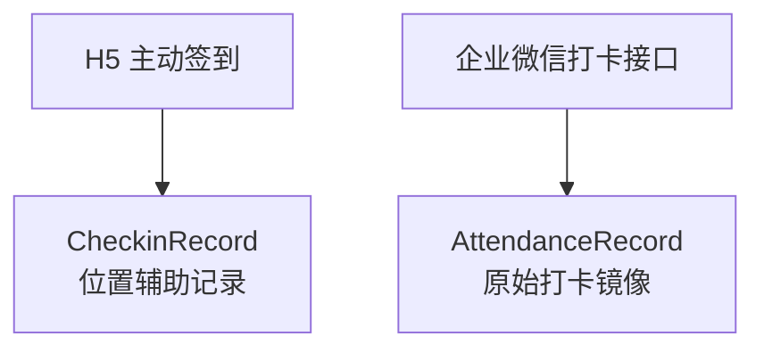
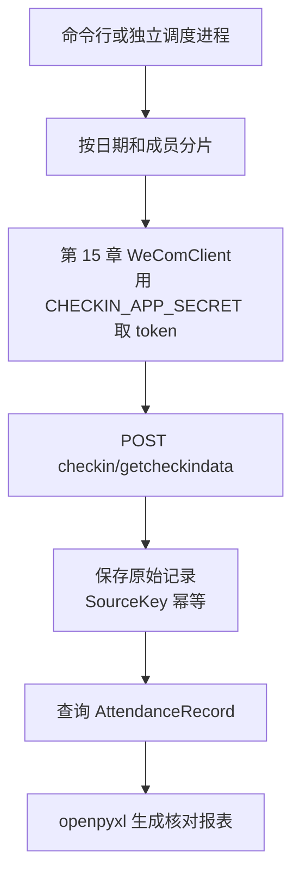

# 第 21 章：Python 获取打卡数据与生成考勤报表

> 本章定位：调用企业微信打卡接口，把原始打卡记录写入独立 `AttendanceRecord` 表，并生成用于核对的考勤 Excel；**绝不复用第 10 章 H5 签到表**。

## 本章目标

完成本章后，你将能够：

- 调用 `checkin/getcheckindata` 获取一小段原始打卡数据；
- 正确提交 `opencheckindatatype`、`starttime`、`endtime`、`useridlist`；
- 新建独立的 `AttendanceRecord`，与第 10 章 `CheckinRecord` 分开；
- 按自然日和成员批次切分请求，避免一次拉取过大；
- 依靠稳定来源键幂等写库，同时保留企业微信返回的原始 JSON；
- 用 `openpyxl` 生成核对型 Excel；
- 优先展示 `sch_checkin_time` 与 `exception_type`，不自行武断推导“迟到”。

## 企业微信打卡与 H5 签到的区别

上一章已经能处理文件和业务数据，但“第 10 章签到”与“企业微信打卡”看起来很像，最容易在这里混表。

| 对比项 | 第 10 章 H5 签到 | 本章企业微信打卡 |
|---|---|---|
| 数据来源 | 员工在自建 H5 页面点击并授权定位 | 企业微信打卡应用产生，由接口批量读取 |
| 采集方式 | JS-SDK `wx.getLocation` | 服务端 `checkin/getcheckindata` |
| 主要字段 | 经纬度、精度、地址、签到时间 | 班次时间、打卡时间、打卡类型、异常类型等 |
| 数据表 | `CheckinRecord` | **新建 `AttendanceRecord`** |
| 可否直接判定考勤 | 不可以，只是位置辅助记录 | 也不要自行推断，优先采用企业微信原始结果 |



**不要把两张表合并。**它们的数据来源、权限、字段语义和合规用途都不同。特别是第 10 章的 `CheckinRecord` 不能改名后拿来复用。

## 前置条件与版本

- 已完成第 2、3、15 章，现有 `config.py`、第 15 章公共客户端 `wecom_client.py` 和 SQL Server 连接可用；
- 自建应用或对应凭证已取得打卡数据读取权限；
- 运行账号只能读取业务所需范围，数据库账号只授予必要表权限；
- Python 3.11 或 3.12；
- `requests>=2.32,<3`、`pyodbc>=5.3,<5.4`、`openpyxl>=3.1,<4`；
- 示例使用 `zoneinfo.ZoneInfo("Asia/Shanghai")` 生成 Unix 秒，避免服务器时区不同导致日期偏移。

安装依赖：

```bash
python -m pip install "requests>=2.32,<3" "pyodbc>=5.3,<5.4" "openpyxl>=3.1,<4"
```

在 `config.py` 增加专用凭证名，不要把真实值写进教程或版本库：

```python
CHECKIN_APP_SECRET = "从服务器安全配置读取"
CONN_STR = "Driver={ODBC Driver 18 for SQL Server};..."
```

`CHECKIN_APP_SECRET` 必须是**企业自建应用的 Secret**，并且管理员已在企业微信管理后台把这个自建应用配置为“**打卡 - 可调用接口的应用**”。它不是 `CONTACTS_SECRET`，也不是旧版“打卡”系统应用 Secret；新配置不要再寻找或依赖旧系统应用凭证。

本章严格复用第 15 章的唯一公共契约：`WeComClient(config.CORP_ID, config.BASE_URL)`，以及 `client.post(path, secret, payload)`。不直接调用 `requests`，不另写 token 获取函数，也不假设存在 `post_json`。

## 最终目录

```text
code/
├── config.py                  # 增加 CHECKIN_APP_SECRET，不入版本库
├── wecom_client.py            # 严格复用第 15 章公共客户端
├── checkin_api.py             # 拉取与时间分片
├── attendance_store.py        # 幂等保存
├── attendance_report.py       # 生成 Excel
├── attendance_main.py         # 命令行入口
├── migrations/
│   └── 021_attendance.sql
└── output/
    └── attendance_2025-08-01_2025-08-07.xlsx
```

## V1：获取一小段打卡数据

### 上一版的问题

目前只有通用 token 能力，还没有真正调用打卡接口。先只查一个测试成员、十分钟数据，确认权限和字段，不要一开始就拉全公司一个月。

新建 `checkin_api.py`：

```python
import config
from wecom_client import WeComClient

client = WeComClient(config.CORP_ID, config.BASE_URL)


def get_checkin_data(userids, start_ts, end_ts, data_type=3):
    """读取原始打卡数据；时间参数是 Unix 秒。"""
    payload = {
        "opencheckindatatype": data_type,
        "starttime": start_ts,
        "endtime": end_ts,
        "useridlist": userids,
    }
    result = client.post(
        "checkin/getcheckindata",
        config.CHECKIN_APP_SECRET,
        payload,
    )
    return result.get("checkindata", [])
```

最小调用：

```python
from datetime import datetime, timedelta
from zoneinfo import ZoneInfo

from checkin_api import get_checkin_data

TZ = ZoneInfo("Asia/Shanghai")
end = datetime.now(TZ)
start = end - timedelta(minutes=10)
rows = get_checkin_data(
    ["test-user"],
    int(start.timestamp()),
    int(end.timestamp()),
    data_type=3,
)
print(f"收到 {len(rows)} 条")
for row in rows[:3]:
    print(row)
```

四个请求字段必须分清：

| 字段 | 含义 | 常见错误 |
|---|---|---|
| `opencheckindatatype` | 要读取的打卡数据类型 | 与业务需要不符，导致漏数据 |
| `starttime` | 开始时间，Unix 秒 | 误传毫秒，时间范围完全错误 |
| `endtime` | 结束时间，Unix 秒 | 小于开始时间或跨度过大 |
| `useridlist` | 企业微信成员 UserId 列表 | 误传姓名、手机号或空列表 |

`opencheckindatatype` 的可选值和每次请求限制可能随官方文档调整，上线前必须按当前官方说明核对。本章示例用 `3` 表示读取全部类型，不在代码里自行猜测更多业务含义。

### V1 的问题

数据只打印在终端。进程结束后无法追溯，也无法判断第二次拉取是否重复。

## V2：建立 `AttendanceRecord`

### 上一版的问题

如果直接写入 `CheckinRecord`，会把“企业微信原生打卡”和“H5 位置签到”混为一谈，后续报表无法解释来源。

新建 `migrations/021_attendance.sql`：

```sql
/* 可重复执行：只创建缺失的表和索引，不 DROP、不清空数据。 */
IF OBJECT_ID(N'dbo.AttendanceRecord', N'U') IS NULL
BEGIN
    CREATE TABLE dbo.AttendanceRecord (
        Id               BIGINT IDENTITY(1,1) PRIMARY KEY,
        SourceKey        CHAR(64) NOT NULL,
        UserId           NVARCHAR(64) NOT NULL,
        CheckinType      NVARCHAR(32) NULL,
        ExceptionType    NVARCHAR(100) NULL,
        CheckinTime      BIGINT NOT NULL,
        SchCheckinTime   BIGINT NULL,
        GroupId          BIGINT NULL,
        ScheduleId       BIGINT NULL,
        TimelineId       BIGINT NULL,
        LocationTitle    NVARCHAR(300) NULL,
        LocationDetail   NVARCHAR(500) NULL,
        DeviceId         NVARCHAR(200) NULL,
        RawJson          NVARCHAR(MAX) NOT NULL,
        FetchedAt        DATETIME2(0) NOT NULL DEFAULT SYSDATETIME(),
        UpdatedAt        DATETIME2(0) NOT NULL DEFAULT SYSDATETIME(),

        CONSTRAINT UQ_Attendance_SourceKey UNIQUE (SourceKey)
    );
END;
GO

IF NOT EXISTS (
    SELECT 1 FROM sys.indexes
    WHERE object_id = OBJECT_ID(N'dbo.AttendanceRecord')
      AND name = N'IX_Attendance_User_Time'
)
BEGIN
    CREATE INDEX IX_Attendance_User_Time
        ON dbo.AttendanceRecord (UserId, CheckinTime DESC);
END;
GO

IF NOT EXISTS (
    SELECT 1 FROM sys.indexes
    WHERE object_id = OBJECT_ID(N'dbo.AttendanceRecord')
      AND name = N'IX_Attendance_CheckinTime'
)
BEGIN
    CREATE INDEX IX_Attendance_CheckinTime
        ON dbo.AttendanceRecord (CheckinTime);
END;
GO
```

设计重点：

1. `CheckinTime` 与 `SchCheckinTime` 保存接口原始 Unix 秒，不受数据库服务器时区影响；
2. `ExceptionType` 原样保存，不翻译成自创状态；
3. `RawJson` 保存**该条解密后、接口返回的原始记录**，便于将来字段增加后重放；
4. `SourceKey` 是幂等键，不依赖数据库自增 `Id`；
5. 表内可能含考勤和位置相关个人信息，必须配置访问权限和保留期。

### V2 的问题

有表还不够。若每次同步都直接 `INSERT`，同一条打卡会重复出现。

## V3：幂等保存原始记录

### 上一版的问题

定时任务会反复读取相邻时间段，接口也可能返回同一记录。用“先查再插”仍有并发窗口，应让唯一约束做最终判断。

新建 `attendance_store.py`：

```python
import hashlib
import json

import pyodbc

import config


def _source_key(row):
    """只用较稳定的来源字段识别同一条打卡。"""
    identity = {
        "userid": row.get("userid"),
        "checkin_time": row.get("checkin_time"),
        "checkin_type": row.get("checkin_type"),
        "deviceid": row.get("deviceid"),
        "groupid": row.get("groupid"),
        "schedule_id": row.get("schedule_id"),
        "timeline_id": row.get("timeline_id"),
    }
    raw = json.dumps(
        identity, ensure_ascii=False, sort_keys=True, separators=(",", ":")
    )
    return hashlib.sha256(raw.encode("utf-8")).hexdigest()


def _json(row):
    return json.dumps(
        row, ensure_ascii=False, sort_keys=True, separators=(",", ":")
    )


def save_records(rows):
    """同一来源记录重复同步时更新原始值，不增加新行。"""
    sql = """
    MERGE AttendanceRecord WITH (HOLDLOCK) AS target
    USING (SELECT ? AS SourceKey) AS src
       ON target.SourceKey = src.SourceKey
    WHEN MATCHED THEN UPDATE SET
        UserId = ?, CheckinType = ?, ExceptionType = ?,
        CheckinTime = ?, SchCheckinTime = ?, GroupId = ?,
        ScheduleId = ?, TimelineId = ?, LocationTitle = ?,
        LocationDetail = ?, DeviceId = ?, RawJson = ?,
        UpdatedAt = SYSDATETIME()
    WHEN NOT MATCHED THEN INSERT
        (SourceKey, UserId, CheckinType, ExceptionType,
         CheckinTime, SchCheckinTime, GroupId, ScheduleId,
         TimelineId, LocationTitle, LocationDetail, DeviceId, RawJson)
    VALUES
        (src.SourceKey, ?, ?, ?, ?, ?, ?, ?, ?, ?, ?, ?, ?);
    """
    conn = pyodbc.connect(config.CONN_STR)
    try:
        cursor = conn.cursor()
        for row in rows:
            user_id = row.get("userid")
            checkin_time = row.get("checkin_time")
            if not user_id or checkin_time is None:
                raise ValueError("打卡记录缺少 userid 或 checkin_time")

            values = (
                user_id,
                row.get("checkin_type"),
                row.get("exception_type"),
                int(checkin_time),
                row.get("sch_checkin_time"),
                row.get("groupid"),
                row.get("schedule_id"),
                row.get("timeline_id"),
                row.get("location_title"),
                row.get("location_detail"),
                row.get("deviceid"),
                _json(row),
            )
            cursor.execute(sql, _source_key(row), *values, *values)
        conn.commit()
        return len(rows)
    except Exception:
        conn.rollback()
        raise
    finally:
        conn.close()
```

这里采用“稳定来源字段生成键 + `MERGE ... WITH (HOLDLOCK)` + 唯一约束”：

- 同一条记录再次读取，只更新原始结果与 `UpdatedAt`；
- 企业微信后续修正 `exception_type` 时，库中会保留最新原始结果；
- 两个同步进程意外并发时，唯一约束仍是最后防线；
- `RawJson` 是原始**记录对象**，不是包含 `access_token` 的完整请求 URL。

如果你的业务要求保留每次变化的历史版本，应另建审计表，不要靠重复插入制造“历史”。

### V3 的问题

一次请求若覆盖太多人、太多天，会变慢、超时，也不容易从失败点恢复。

## V4：按日期分段获取

### 上一版的问题

把整月全员塞进一个请求，任何一次网络抖动都要从头再来。更稳妥的办法是“成员分批 + 自然日分片”。

在 `checkin_api.py` 追加：

```python
from datetime import date, datetime, time, timedelta
from zoneinfo import ZoneInfo

TZ = ZoneInfo("Asia/Shanghai")
USER_BATCH_SIZE = 100  # 上线前按当前官方限制核对


def chunks(items, size=USER_BATCH_SIZE):
    for i in range(0, len(items), size):
        yield items[i:i + size]


def day_windows(start_date, end_date):
    """按上海时区生成闭区间日期；Unix 秒窗口首尾相接。"""
    current = start_date
    while current <= end_date:
        start = datetime.combine(current, time.min, TZ)
        next_day = start + timedelta(days=1)
        yield int(start.timestamp()), int(next_day.timestamp()) - 1
        current += timedelta(days=1)


def sync_range(userids, start_date, end_date, data_type=3):
    from attendance_store import save_records

    total = 0
    for start_ts, end_ts in day_windows(start_date, end_date):
        for user_batch in chunks(userids):
            rows = get_checkin_data(
                user_batch, start_ts, end_ts, data_type=data_type
            )
            total += save_records(rows)
    return total
```

为什么按自然日，而不是简单每 24 小时：

- 报表本来就按本地日期核对；
- `Asia/Shanghai` 明确了业务时区；
- 某一日失败时，只需重跑该日；
- 边界即使偶尔重复，V3 的幂等保存也能兜底。

不要静默截断过大的 `useridlist`。程序应明确分批；批大小也应在部署时对照企业微信当前限制确认。

### V4 的问题

数据库已有原始数据，但行政或员工无法直接核对，仍需一个易读文件。

## V5：生成考勤明细 Excel

### 上一版的问题

直接让使用者查询 SQL 不现实；但报表若自行用“打卡时间 > 计划时间”推断迟到，又可能忽略弹性班次、补卡、跨日班次和企业规则。

新建 `attendance_report.py`：

```python
from datetime import datetime
from pathlib import Path
from zoneinfo import ZoneInfo

import pyodbc
from openpyxl import Workbook
from openpyxl.styles import Alignment, Font, PatternFill
from openpyxl.utils import get_column_letter

import config

TZ = ZoneInfo("Asia/Shanghai")


def display_ts(value):
    if value is None:
        return ""
    return datetime.fromtimestamp(int(value), TZ).strftime("%Y-%m-%d %H:%M:%S")


def export_report(start_date, end_date, output_path):
    start_ts = int(datetime.combine(start_date, datetime.min.time(), TZ).timestamp())
    end_ts = int(datetime.combine(
        end_date, datetime.max.time().replace(microsecond=0), TZ
    ).timestamp())

    conn = pyodbc.connect(config.CONN_STR)
    try:
        cursor = conn.cursor()
        cursor.execute("""
            SELECT UserId, CheckinType, ExceptionType,
                   CheckinTime, SchCheckinTime,
                   LocationTitle, LocationDetail, UpdatedAt
            FROM AttendanceRecord
            WHERE CheckinTime BETWEEN ? AND ?
            ORDER BY UserId, CheckinTime
        """, start_ts, end_ts)
        rows = cursor.fetchall()
    finally:
        conn.close()

    wb = Workbook()
    ws = wb.active
    ws.title = "打卡明细"
    headers = [
        "成员 UserId", "打卡类型", "企业微信异常类型",
        "实际打卡时间", "计划打卡时间",
        "位置标题", "位置详情", "同步更新时间", "人工核对备注",
    ]
    ws.append(headers)

    for row in rows:
        ws.append([
            row.UserId,
            row.CheckinType or "",
            row.ExceptionType or "",
            display_ts(row.CheckinTime),
            display_ts(row.SchCheckinTime),
            row.LocationTitle or "",
            row.LocationDetail or "",
            row.UpdatedAt.strftime("%Y-%m-%d %H:%M:%S"),
            "",  # 不在程序里武断推导迟到，由规则所有者核对
        ])

    fill = PatternFill("solid", fgColor="D9EAF7")
    for cell in ws[1]:
        cell.font = Font(bold=True)
        cell.fill = fill
        cell.alignment = Alignment(horizontal="center")
    ws.freeze_panes = "A2"
    ws.auto_filter.ref = ws.dimensions

    widths = [18, 14, 22, 21, 21, 26, 36, 21, 30]
    for index, width in enumerate(widths, 1):
        ws.column_dimensions[get_column_letter(index)].width = width

    path = Path(output_path)
    path.parent.mkdir(parents=True, exist_ok=True)
    wb.save(path)
    return path, len(rows)
```

报表刻意把这两列并排：

- `sch_checkin_time`：企业微信返回的计划打卡时间；
- `exception_type`：企业微信返回的原始异常结果。

**不要只凭两列时间在本教程里写一个 `if actual > scheduled: 迟到`。**弹性班次、休息日、跨日班次、补卡和管理员修正都可能改变结论。若企业后续确实需要二次规则计算，应由考勤规则负责人确认，并把“原始结果”和“派生结论”分列保存。

### V5 的问题

功能散在三个文件里，每次手工改日期容易出错，也不利于第 22 章定时调用。

## V6：整合入口

### 上一版的问题

同步与导出还没有稳定的函数入口。我们把“业务函数”和“命令行解析”分开，让手工运行和定时调度都能复用。

新建 `attendance_main.py`：

```python
import argparse
import logging
from datetime import date

from attendance_report import export_report
from checkin_api import sync_range


def parse_date(value):
    return date.fromisoformat(value)


def run(userids, start_date, end_date, output):
    if end_date < start_date:
        raise ValueError("end 必须大于或等于 start")
    if not userids:
        raise ValueError("至少提供一个 UserId")

    saved = sync_range(userids, start_date, end_date)
    path, exported = export_report(start_date, end_date, output)
    logging.getLogger(__name__).info(
        "同步返回记录数=%s，报表行数=%s，文件=%s",
        saved, exported, path,
    )
    return path


def main():
    parser = argparse.ArgumentParser()
    parser.add_argument("--users", required=True, help="逗号分隔的 UserId")
    parser.add_argument("--start", required=True, type=parse_date)
    parser.add_argument("--end", required=True, type=parse_date)
    parser.add_argument("--output", required=True)
    args = parser.parse_args()

    logging.basicConfig(
        level=logging.INFO,
        format="%(asctime)s %(levelname)s %(name)s %(message)s",
    )
    users = [x.strip() for x in args.users.split(",") if x.strip()]
    run(users, args.start, args.end, args.output)


if __name__ == "__main__":
    main()
```

手工运行：

```bash
python attendance_main.py --users test-user --start 2025-08-01 --end 2025-08-07 --output output/attendance_2025-08-01_2025-08-07.xlsx
```

这里的 `logging.basicConfig()` 只放在入口。第 23 章会进一步统一异常、重试和日志脱敏；库文件仍只调用 `logging.getLogger(__name__)`，不抢占全局日志配置。

## 完整请求流



注意这条链路只有两类外部资源：企业微信和 SQL Server。Excel 在数据库事务提交后生成；报表失败时重跑导出即可，不需要重新请求接口。

## 自测

仅使用测试成员和短日期范围，不新增测试项目。

| 编号 | 操作 | 期望结果 |
|---|---|---|
| 1 | 连续执行两次 `021_attendance.sql` | 第二次成功，已有考勤数据不丢失 |
| 2 | 查询测试成员十分钟数据 | HTTP 与 `errcode` 均成功，可为空列表 |
| 3 | 把 `starttime` 误改成毫秒 | 请求失败或结果异常，恢复 Unix 秒后正常 |
| 4 | 同一日期运行两次 | `AttendanceRecord` 行数不翻倍 |
| 5 | 查看任一行 `RawJson` | 能看到该条接口原始字段，不含 token |
| 6 | 跨两天同步 | 日志能看出按日执行，失败可单日重跑 |
| 7 | 打开 Excel | 中文正常，首行冻结，可筛选 |
| 8 | 核对异常列 | 原样展示 `exception_type`，没有程序自创“迟到” |
| 9 | 核对表边界 | `CheckinRecord` 没有被写入或修改 |

可用 SQL 检查重复：

```sql
SELECT SourceKey, COUNT(*) AS Cnt
FROM AttendanceRecord
GROUP BY SourceKey
HAVING COUNT(*) > 1;
```

应返回空结果。

## 故障排查

| 现象 | 常见原因 | 处理办法 |
|---|---|---|
| `errcode` 提示无权限 | Secret 没有打卡数据权限，或成员不在范围 | 在管理后台核对应用权限与可见范围 |
| 返回空列表 | 时间范围、UserId、数据类型不匹配，或确实无记录 | 先查一个已知打过卡的测试成员和当天短时间段 |
| 日期差一天 | 用了服务器本地时区或把毫秒当秒 | 固定 `Asia/Shanghai`，打印时间戳对应时间 |
| SQL 插入失败 | 迁移没执行、字段长度不够或连接账号无权 | 先执行迁移，再核对最小数据库权限 |
| 重跑后记录翻倍 | 没走 `SourceKey` 唯一约束，或另写了直接 `INSERT` | 统一调用 `save_records()`，保留唯一约束 |
| Excel 被占用 | 文件正在 Excel 中打开 | 关闭文件或输出带日期的新文件名 |
| Excel 中“迟到”与后台不同 | 自己按时间差推导了结论 | 删除武断推导，展示 `sch_checkin_time` 和 `exception_type` 原值 |
| 一次同步很慢 | 日期跨度或成员批次过大 | 按自然日、成员批次拆分，从失败分片重跑 |

## 完成清单

- [ ] 已确认打卡接口权限和测试成员范围；
- [ ] 已配置“打卡 - 可调用接口的应用”对应的 `CHECKIN_APP_SECRET`，且确认它不是 `CONTACTS_SECRET` 或旧系统应用 Secret；
- [ ] 已提交四个必需字段：`opencheckindatatype`、`starttime`、`endtime`、`useridlist`；
- [ ] `021_attendance.sql` 的表和索引可重复执行且不清空数据；
- [ ] 已新建 `AttendanceRecord`，没有复用 `CheckinRecord`；
- [ ] 已保存单条原始 `RawJson`，并用 `SourceKey` 幂等；
- [ ] 已按自然日和成员批次分片；
- [ ] 已用 `openpyxl` 生成可筛选的核对报表；
- [ ] 报表优先展示 `sch_checkin_time` 与 `exception_type`；
- [ ] 没有仅凭时间差武断判定迟到；
- [ ] 已按企业合规要求限制考勤数据访问和保留期限。

## 参考资料

- [企业微信开发者中心：获取打卡数据](https://developer.work.weixin.qq.com/document/path/90262)
- [企业微信开发者中心：获取 access_token](https://developer.work.weixin.qq.com/document/path/91039)
- [openpyxl 官方文档](https://openpyxl.readthedocs.io/)
- [Python `zoneinfo` 官方文档](https://docs.python.org/zh-cn/3/library/zoneinfo.html)

> 外部资料中的接口说明、限制与概念均已重新表述，未照录原文（Content was rephrased for compliance with licensing restrictions）。企业微信接口会演进，生产上线前请以当前官方文档为准。