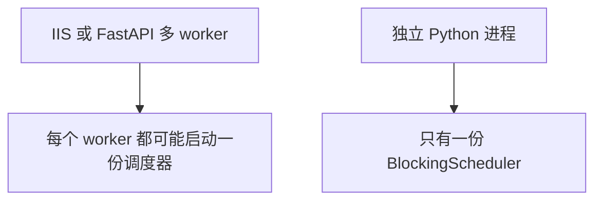
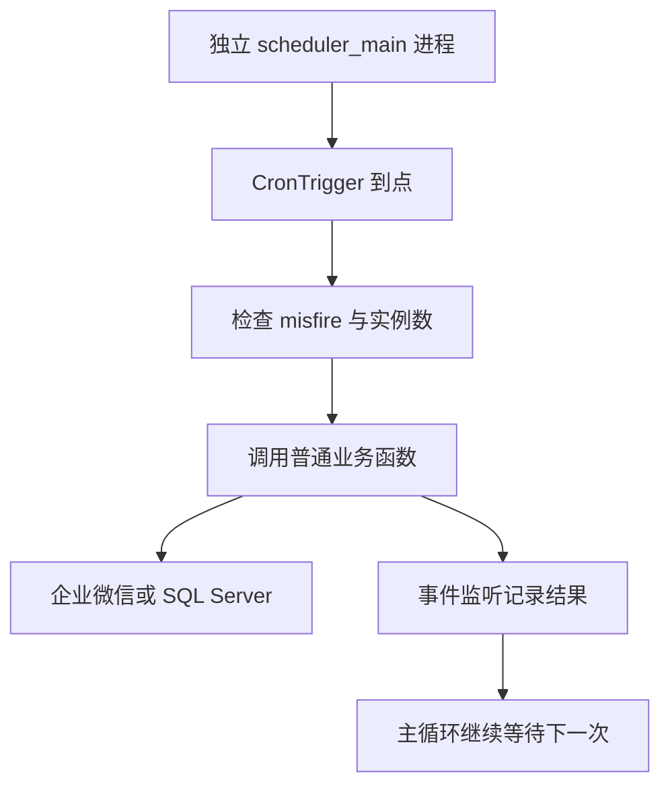

# 第 22 章：Python 使用 APScheduler 实现定时任务

> 本章定位：锁定 APScheduler 3.x 的稳定 API，用 `BlockingScheduler` 建立**独立调度进程**，定时运行同步、消息和报表任务，并避免多进程重复执行。

## 本章目标

完成本章后，你将能够：

- 在前台运行一个最小 `BlockingScheduler`；
- 用 `CronTrigger` 表达固定业务时间；
- 把第 16—21 章的业务函数接入调度器；
- 正确设置 `max_instances=1`、`coalesce=True`、`misfire_grace_time`；
- 监听成功、失败、错过和达到并发上限等事件；
- 保证单个任务异常只标记本次失败，**不让调度进程退出**；
- 将调度器部署为一个独立、单实例、可监控的进程。

## 部署边界

上一章已经提供可重复调用的同步与报表函数，但仍要人工执行。最直接的想法是在 Web 服务启动时顺便启动定时器，这恰好是本章必须避免的错误。



必须遵守以下边界：

1. `BlockingScheduler` 运行在**独立进程**，不放进 IIS；
2. 不放进 FastAPI 的启动事件、生命周期函数或多 worker 服务；
3. 生产环境只启动一个调度实例；
4. `max_instances=1` 只限制**同一个调度器进程内**的并发，不能阻止两个操作系统进程各跑一份；
5. 多主机高可用需要数据库锁或外部协调，不要误以为内存 JobStore 能自动选主。

`BlockingScheduler.start()` 会占住当前线程，这是本章主动选择的行为：这个进程只负责调度，不同时承载 HTTP 请求。

## 前置条件与版本

- Python 3.11 或 3.12；
- 已把需要调度的业务整理成普通函数；
- 第 16 章的 `contact_sync.sync_all()`、第 19 章的 `run_appchat_sender.run_batch()` 与第 21 章的 `attendance_main.run()` 均可被导入；
- 生产服务器时区已确认，本章仍显式使用 `Asia/Shanghai`；
- **锁定 APScheduler 3.x**，不把 4.x 文档和 API 混进来。

`requirements.txt`：

```text
requests>=2.32,<3
pyodbc>=5.3,<5.4
APScheduler>=3.10,<4
```

安装并确认版本：

```bash
python -m pip install -r requirements.txt
python -c "import apscheduler; print(apscheduler.__version__)"
```

不要写成无上限的 `APScheduler>=3.10`。将来 4.x 的 API 和概念可能不同，本章代码只承诺 3.x。

## 最终目录

```text
code/
├── config.py
├── scheduled_jobs.py          # 业务适配函数
├── scheduler_main.py          # 唯一调度入口
├── attendance_main.py         # 第 21 章 run
├── run_appchat_sender.py      # 第 19 章 run_batch
├── contact_sync.py         # 第 16 章 sync_all
├── logs/
│   └── scheduler.log
└── requirements.txt
```

## V1：运行一个间隔任务

### 上一版的问题

现在没有调度器。先用 10 秒间隔观察它确实在前台持续运行，不急着接数据库和企业微信。

新建 `scheduler_main.py`：

```python
import logging
from datetime import datetime
from zoneinfo import ZoneInfo

from apscheduler.schedulers.blocking import BlockingScheduler

TZ = ZoneInfo("Asia/Shanghai")


def heartbeat():
    logging.getLogger(__name__).info("调度器心跳：%s", datetime.now(TZ))


def main():
    logging.basicConfig(
        level=logging.INFO,
        format="%(asctime)s %(levelname)s %(name)s %(message)s",
    )
    scheduler = BlockingScheduler(timezone=TZ)
    scheduler.add_job(heartbeat, "interval", seconds=10, id="heartbeat")
    scheduler.start()


if __name__ == "__main__":
    main()
```

运行：

```bash
python scheduler_main.py
```

终端会保持不返回，每 10 秒出现一条心跳。按 `Ctrl+C` 才是正常停止。

### V1 的问题

间隔任务会从进程启动时开始计算。例如服务器 08:07 重启，“每 24 小时一次”会变成每天 08:07，并不等于业务要求的每天 08:00。

## V2：改成 `CronTrigger`

### 上一版的问题

业务时间通常是“每天几点”或“工作日几点”，应该用日历规则，而不是从启动时刻累计间隔。

```python
from apscheduler.triggers.cron import CronTrigger

scheduler.add_job(
    heartbeat,
    trigger=CronTrigger(hour=8, minute=0, timezone=TZ),
    id="daily-heartbeat",
    replace_existing=True,
)
```

常用示例：

```python
# 周一到周五 08:30
CronTrigger(day_of_week="mon-fri", hour=8, minute=30, timezone=TZ)

# 每 5 分钟，在秒数为 0 时触发
CronTrigger(minute="*/5", second=0, timezone=TZ)

# 每月 1 日 07:00
CronTrigger(day=1, hour=7, minute=0, timezone=TZ)
```

同时在调度器和触发器上写时区，阅读代码的人不必猜服务器本地时区。业务跨地区时不要统一硬编码，应把每个业务的时区作为明确配置。

### V2 的问题

现在只会打印心跳，对通讯录、消息和考勤没有实际作用。

## V3：接入现有业务函数

### 上一版的问题

如果把命令行解析、`sys.exit()` 和业务代码绑在一起，调度器很难复用。调度任务应调用普通函数，并让异常向 APScheduler 报告。

新建 `scheduled_jobs.py`：

```python
import logging
from datetime import datetime, timedelta
from functools import wraps
from zoneinfo import ZoneInfo

import config

TZ = ZoneInfo("Asia/Shanghai")
log = logging.getLogger(__name__)


def job_boundary(name):
    """记录任务边界；异常继续抛给 APScheduler 记录本次失败。"""
    def decorate(func):
        @wraps(func)
        def wrapper(*args, **kwargs):
            log.info("任务开始：%s", name)
            try:
                result = func(*args, **kwargs)
                log.info("任务完成：%s", name)
                return result
            except Exception:
                log.exception("任务失败：%s", name)
                raise
        return wrapper
    return decorate


@job_boundary("项目群消息队列")
def send_appchat_tasks():
    """薄适配：直接调用第 19 章公开的有限批处理入口。"""
    from run_appchat_sender import run_batch
    return run_batch(batch_size=100)


@job_boundary("通讯录全量同步")
def sync_contacts():
    """薄适配：直接调用第 16 章公开的全量同步入口。"""
    from contact_sync import sync_all
    return sync_all()


@job_boundary("昨日考勤报表")
def build_yesterday_attendance():
    from attendance_main import run

    yesterday = datetime.now(TZ).date() - timedelta(days=1)
    output = f"output/attendance_{yesterday:%Y-%m-%d}.xlsx"
    return run(
        userids=config.ATTENDANCE_USER_IDS,
        start_date=yesterday,
        end_date=yesterday,
        output=output,
    )
```

重点有四个：

- 库模块只 `logging.getLogger(__name__)`，不调用 `basicConfig()`；
- `scheduled_jobs.py` 只做日志边界、固定批量参数和日期计算；业务分别落到 `contact_sync.sync_all()`、`run_appchat_sender.run_batch()`、`attendance_main.run()`；
- 不虚构其他模块入口；如果入口参数需要适配，也只在这里写薄函数，不复制业务实现；
- `job_boundary` 记录开始和结束并重新抛出异常，APScheduler 会把**本次执行**标为失败，但调度循环仍继续运行。

不要在任务函数里调用 `sys.exit()`、`os._exit()`，也不要捕获后终止主进程。`KeyboardInterrupt` 和 `SystemExit` 也不应被普通业务代码制造。

### V3 的问题

若一次报表运行超过下一次触发时间，可能重叠执行；服务器停机后恢复时，也可能短时间补跑很多次。

## V4：防止任务重叠与补跑风暴

### 上一版的问题

调度系统必须明确回答三个问题：同一任务能否重叠？错过多次是否全部补跑？迟到多久还值得执行？

统一默认值：

```python
job_defaults = {
    "max_instances": 1,
    "coalesce": True,
    "misfire_grace_time": 300,
}
scheduler = BlockingScheduler(timezone=TZ, job_defaults=job_defaults)
```

三个参数的作用：

| 参数 | 本章值 | 含义 |
|---|---:|---|
| `max_instances` | `1` | 同一调度器内，同一 job 最多运行一份 |
| `coalesce` | `True` | 停机期间错过多次，只合并成一次执行 |
| `misfire_grace_time` | 依任务设置 | 超过宽限时间的旧触发不再执行 |

不同任务可以覆盖默认值：

```python
scheduler.add_job(
    send_appchat_tasks,
    CronTrigger(minute="*/2", timezone=TZ),
    id="send-appchat-tasks",
    replace_existing=True,
    max_instances=1,
    coalesce=True,
    misfire_grace_time=60,
)

scheduler.add_job(
    build_yesterday_attendance,
    CronTrigger(hour=6, minute=30, timezone=TZ),
    id="build-yesterday-attendance",
    replace_existing=True,
    max_instances=1,
    coalesce=True,
    misfire_grace_time=3600,
)
```

为什么宽限时间不同：消息扫描两分钟一次，迟到一小时的某次扫描没有意义；日报每天一次，服务器晚启动半小时仍值得补一次。

**`max_instances=1` 不等于全局锁。**如果误启动两个 `scheduler_main.py`，每个进程都认为自己只有一个实例，任务仍会执行两遍。生产环境还必须做到：

- 服务管理器只定义一个实例；
- 不用多个 Windows 计划任务同时拉起它；
- 发布脚本先确认旧进程已停止；
- 多主机部署时，在业务函数内增加 SQL Server 应用锁或业务幂等键。

对于消息发送，即使有锁也必须保留第 23 章的持久化状态与幂等设计，因为进程可能在“发送成功、状态未落库”之间崩溃。

### V4 的问题

任务是否成功、是否错过、是否因并发上限被跳过，目前只能靠零散日志猜测。

## V5：监听执行结果

### 上一版的问题

没有统一事件监听器，运维无法区分“执行失败”和“根本没执行”。

```python
import logging

from apscheduler.events import (
    EVENT_JOB_ERROR,
    EVENT_JOB_EXECUTED,
    EVENT_JOB_MAX_INSTANCES,
    EVENT_JOB_MISSED,
)

log = logging.getLogger(__name__)


def on_job_event(event):
    if event.code == EVENT_JOB_EXECUTED:
        log.info("任务成功：job_id=%s", event.job_id)
    elif event.code == EVENT_JOB_ERROR:
        log.error(
            "任务异常：job_id=%s exception=%s",
            event.job_id,
            event.exception,
        )
    elif event.code == EVENT_JOB_MISSED:
        log.warning("任务错过：job_id=%s", event.job_id)
    elif event.code == EVENT_JOB_MAX_INSTANCES:
        log.warning("任务仍在运行，本次跳过：job_id=%s", event.job_id)


EVENT_MASK = (
    EVENT_JOB_EXECUTED
    | EVENT_JOB_ERROR
    | EVENT_JOB_MISSED
    | EVENT_JOB_MAX_INSTANCES
)
scheduler.add_listener(on_job_event, EVENT_MASK)
```

任务函数抛出普通异常时，APScheduler 的执行器会记录 `EVENT_JOB_ERROR`，**不会让 `BlockingScheduler` 主循环退出**。下一次触发仍会继续。若你发现整个进程退出，应检查：

- 任务是否调用了 `sys.exit()`；
- 是否发生进程级崩溃、内存耗尽或被服务管理器终止；
- 异常是否发生在 `scheduler.start()` 之前的配置阶段；
- 日志目录权限是否导致入口初始化失败。

监听器自身也应保持简单，不要在里面做慢网络请求。告警可写数据库或交给另一个轻量函数发送。

### V5 的问题

配置仍散落在片段里，缺少可直接部署的唯一入口和优雅停止逻辑。

## V6：整合独立调度入口

### 上一版的问题

生产代码需要一次性看到：版本边界、日志入口、任务默认值、事件监听、任务注册和停止行为。

完整 `scheduler_main.py`：

```python
import logging
import signal
import sys
from logging.handlers import TimedRotatingFileHandler
from pathlib import Path
from zoneinfo import ZoneInfo

from apscheduler.events import (
    EVENT_JOB_ERROR,
    EVENT_JOB_EXECUTED,
    EVENT_JOB_MAX_INSTANCES,
    EVENT_JOB_MISSED,
)
from apscheduler.schedulers.blocking import BlockingScheduler
from apscheduler.triggers.cron import CronTrigger

from scheduled_jobs import (
    build_yesterday_attendance,
    send_appchat_tasks,
    sync_contacts,
)

TZ = ZoneInfo("Asia/Shanghai")
log = logging.getLogger(__name__)


def configure_logging():
    Path("logs").mkdir(exist_ok=True)
    handler = TimedRotatingFileHandler(
        "logs/scheduler.log",
        when="midnight",
        backupCount=30,
        encoding="utf-8",
    )
    logging.basicConfig(
        level=logging.INFO,
        format="%(asctime)s %(levelname)s %(name)s %(message)s",
        handlers=[handler, logging.StreamHandler()],
    )


def on_job_event(event):
    if event.code == EVENT_JOB_EXECUTED:
        log.info("任务成功：job_id=%s", event.job_id)
    elif event.code == EVENT_JOB_ERROR:
        log.error("任务异常：job_id=%s error=%s", event.job_id, event.exception)
    elif event.code == EVENT_JOB_MISSED:
        log.warning("任务错过：job_id=%s", event.job_id)
    elif event.code == EVENT_JOB_MAX_INSTANCES:
        log.warning("任务重叠，本次跳过：job_id=%s", event.job_id)


def build_scheduler():
    scheduler = BlockingScheduler(
        timezone=TZ,
        job_defaults={
            "max_instances": 1,
            "coalesce": True,
            "misfire_grace_time": 300,
        },
    )
    scheduler.add_listener(
        on_job_event,
        EVENT_JOB_EXECUTED | EVENT_JOB_ERROR
        | EVENT_JOB_MISSED | EVENT_JOB_MAX_INSTANCES,
    )

    scheduler.add_job(
        send_appchat_tasks,
        CronTrigger(minute="*/2", timezone=TZ),
        id="send-appchat-tasks",
        replace_existing=True,
        misfire_grace_time=60,
    )
    scheduler.add_job(
        sync_contacts,
        CronTrigger(minute="*/10", timezone=TZ),
        id="sync-contacts",
        replace_existing=True,
        misfire_grace_time=300,
    )
    scheduler.add_job(
        build_yesterday_attendance,
        CronTrigger(hour=6, minute=30, timezone=TZ),
        id="build-yesterday-attendance",
        replace_existing=True,
        misfire_grace_time=3600,
    )
    return scheduler


def main():
    configure_logging()
    scheduler = build_scheduler()

    def stop(signum, frame):
        log.info("收到停止信号 %s，等待正在运行的任务结束", signum)
        scheduler.shutdown(wait=True)

    if hasattr(signal, "SIGTERM"):
        signal.signal(signal.SIGTERM, stop)
    if hasattr(signal, "SIGINT"):
        signal.signal(signal.SIGINT, stop)

    log.info("独立调度进程启动，时区=%s", TZ)
    try:
        scheduler.start()
    except (KeyboardInterrupt, SystemExit):
        log.info("调度进程正常停止")


if __name__ == "__main__":
    main()
```

这里不在最外层写 `except Exception: pass`。启动配置错误（模块不存在、日志无权限、时区错误）应让服务管理器看到启动失败并告警；**业务任务异常**则由 APScheduler 捕获并继续主循环。两类错误不要混为一谈。

生产运行方式示意：

```text
Windows 服务或受控进程管理器
└── python.exe C:\WeComApp\scheduler_main.py
```

不要使用下面这些方式：

```text
IIS 应用启动 -> scheduler.start()          错误
uvicorn --workers 4 -> 每个 worker 启动调度器  错误
FastAPI lifespan -> BlockingScheduler.start()  错误
```

## 完整请求流



任务抛异常时，请求流停在“本次任务失败”，不会回到进程入口触发退出。下一次触发仍由同一个主循环处理。

## 自测

不新增测试项目，先用测试函数和测试环境手工验证。

| 编号 | 操作 | 期望结果 |
|---|---|---|
| 1 | 把测试 trigger 改成每 10 秒 | 能连续执行，不只执行一次 |
| 2 | 任务中主动 `raise RuntimeError` | 记录 `EVENT_JOB_ERROR`，进程仍在，下一次继续触发 |
| 3 | 任务 `sleep(20)`，每 5 秒触发 | 同时只有一个实例，其他触发被跳过并有日志 |
| 4 | 停止进程一段时间后重启 | `coalesce=True`，不会瞬间补跑所有错过次数 |
| 5 | 超过宽限时间后启动 | 旧触发记为 missed 或不执行 |
| 6 | 同时误开两个进程 | 会观察到重复执行，从而确认还需部署单实例约束 |
| 7 | 正常发送停止信号 | 等待当前任务结束后退出 |
| 8 | 检查进程列表 | 调度进程独立于 IIS/FastAPI，且只有一份 |

用于验证异常不退出的临时代码：

```python
def broken_job():
    raise RuntimeError("仅用于测试的任务异常")
```

验证后删除临时 job，不新增测试工程。

## 故障排查

| 现象 | 常见原因 | 处理办法 |
|---|---|---|
| `BlockingScheduler` 后面的代码不执行 | `start()` 本来就阻塞当前线程 | 把初始化放在 `start()` 前，停止逻辑用 signal |
| 同一任务执行两次 | 启动了两个进程，或任务自身不幂等 | 保证部署单实例，并增加数据库幂等/锁 |
| FastAPI 每个 worker 都执行 | 把 scheduler 放进 Web 生命周期 | 移出 Web 服务，单独运行 `scheduler_main.py` |
| 重启后大量补跑 | `coalesce=False` 或未设置 | 使用 `coalesce=True`，按业务设置宽限时间 |
| 长任务重叠 | 没设 `max_instances` 或 job ID 不稳定 | 固定 `id`，设置 `max_instances=1` |
| 任务到点没跑 | 时区错误、已超过 grace、上次仍在运行 | 查看 missed/max-instances 日志与下次执行时间 |
| 一个任务报错后进程退出 | 任务调用 `sys.exit()`，或错误发生在启动阶段 | 业务只抛普通异常；区分启动错误与执行错误 |
| 日志没有错误堆栈 | 包装器吞掉异常 | 使用 `log.exception()` 后重新 `raise` |
| 升级后导入失败 | 安装了不兼容主版本 | 固定 `APScheduler>=3.10,<4`，按 3.x 文档开发 |

## 完成清单

- [ ] `requirements.txt` 已固定 `requests>=2.32,<3`、`pyodbc>=5.3,<5.4` 和 `APScheduler>=3.10,<4`；
- [ ] 业务适配器只调用 `contact_sync.sync_all()`、`run_appchat_sender.run_batch()` 与 `attendance_main.run()`；
- [ ] 使用 `BlockingScheduler`，并显式设置业务时区；
- [ ] 调度器运行在独立 Python 进程；
- [ ] 没有放入 IIS、FastAPI 生命周期或多 worker；
- [ ] 每个生产任务有固定且唯一的 `id`；
- [ ] 已设置 `max_instances=1`；
- [ ] 已设置 `coalesce=True`；
- [ ] 已按任务价值设置 `misfire_grace_time`；
- [ ] 单个任务异常会记录失败，但调度进程继续运行；
- [ ] 已监听执行成功、失败、错过和并发上限事件；
- [ ] 部署层确保只有一个调度进程；
- [ ] 消息、同步和报表函数仍有自身幂等保护。

## 参考资料

- [APScheduler 3.x 用户指南](https://apscheduler.readthedocs.io/en/3.x/userguide.html)
- [APScheduler 3.x BlockingScheduler API](https://apscheduler.readthedocs.io/en/3.x/modules/schedulers/blocking.html)
- [APScheduler 3.x CronTrigger API](https://apscheduler.readthedocs.io/en/3.x/modules/triggers/cron.html)
- [APScheduler 3.x 事件 API](https://apscheduler.readthedocs.io/en/3.x/modules/events.html)
- [Python logging 官方文档](https://docs.python.org/zh-cn/3/library/logging.html)

> 外部资料中的 API 行为和概念已重新表述（Content was rephrased for compliance with licensing restrictions）。本文只针对 APScheduler 3.x；生产升级前请重新核对对应版本官方文档。