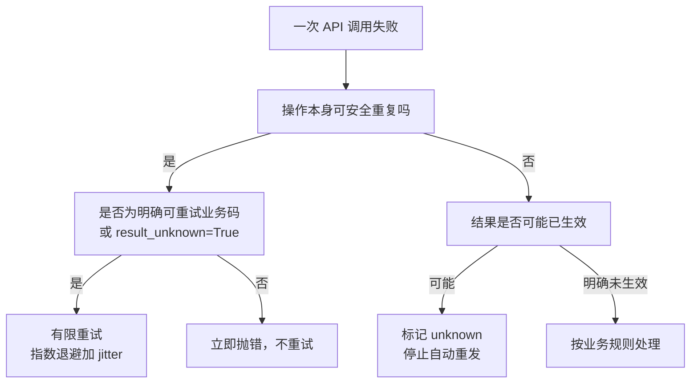
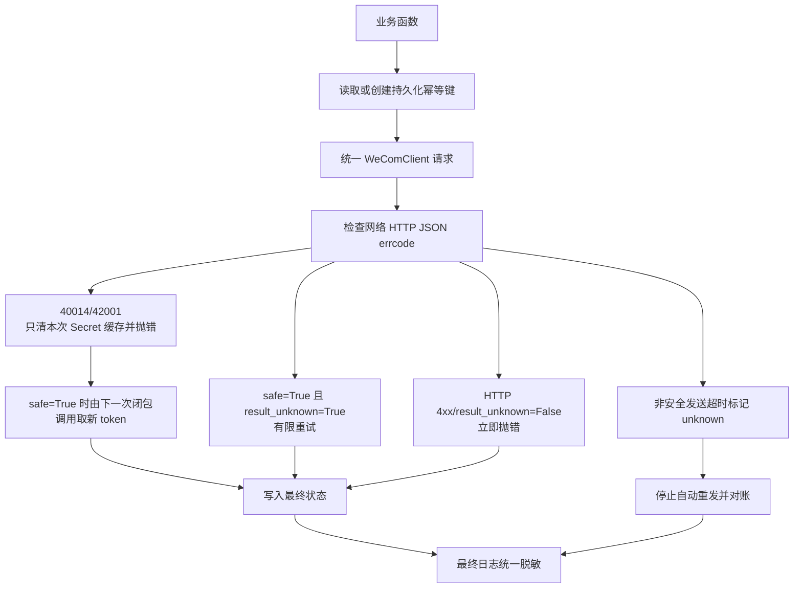

# 第 23 章：Python 失败重试、幂等与日志脱敏

> 本章定位：为前面 Python 章节补齐统一异常、有限重试、业务幂等和日志脱敏，并明确“发送超时结果不确定”不能无条件重发。

## 本章目标

完成本章后，你将能够：

- 用 `WeComApiError(errcode, errmsg)` 表示企业微信业务错误；
- 统一检查网络、HTTP、JSON 与 `errcode` 四层结果；
- 只对安全操作执行有限重试；
- 安全操作遇到 `40014/42001` 时，让下一次调用自然获取新 token；
- 仅对 `safe=True` 且 `result_unknown=True` 的传输错误有限重试，明确 HTTP 4xx 不重试；
- 使用“指数退避 + jitter”避免多个进程同时重试；
- 用数据库唯一幂等键防止业务重复执行；
- 把消息发送超时标记为“结果未知”，而不是自动当作失败重发；
- 从日志中移除 `access_token`、`corpsecret`、OAuth `code`、Webhook `key`、手机号和邮箱；
- 只在程序入口统一调用 `logging.basicConfig()`，库模块只取 logger。

## 先区分三类失败

上一章的调度器能保证单个任务异常不拖垮进程，但它不知道某个错误是否应该重试。重试策略不能只看“抛异常了没有”，必须先判断业务语义。

| 类型 | 示例 | 是否自动重试 |
|---|---|---|
| 不确定的临时传输失败 | 网络中断、HTTP 5xx、响应 JSON 无法解析 | 仅当操作 `safe=True` 时有限重试 |
| 明确的传输失败 | HTTP 4xx，`result_unknown=False` | 不重试，修正请求或配置 |
| 明确业务失败 | 无权限、参数错误、成员不存在、文件格式错误 | 通常不重试；仅小范围明确临时码例外 |
| 非安全操作结果不确定 | 消息请求已经发出，等待响应时超时 | **不要无条件重发**，先对账或人工确认 |



“GET 才安全、POST 都危险”也不准确。企业微信很多查询接口使用 POST；素材上传重复后通常只是多出一份临时素材，业务副作用可接受；消息发送也是 POST，但重复会让员工收到两条。判断标准是**重复执行的业务后果**，不是 HTTP 方法名称。

## 前置条件与版本

- Python 3.11 或 3.12；
- `requests>=2.32,<3`、`pyodbc>=5.3,<5.4`；
- 已有第 15 章的 `wecom_client.py`、`config.py`，并把它们作为唯一客户端与异常契约；
- 已理解第 3、4、5 章的唯一约束、消息状态和素材上传；
- 已执行本章迁移后再启用持久化幂等。

第 15 章已经固定唯一契约：`WeComClient(config.CORP_ID, config.BASE_URL)`、`client.get(path, secret, params)`、`client.post(path, secret, payload)`、`client.clear_token_cache(secret)`，以及 `WeComApiError`、`WeComTransportError`。其中 `get()` / `post()` 遇到 `40014/42001` 时只清除本次 Secret 的 token 缓存并重新抛错，绝不在客户端内部重放业务请求。本章只在 `reliable_wecom.py` 提供接收“客户端调用闭包”的 `call_with_retry()`；不继承、不包装出第二个客户端类，也不绕过第 15 章直接调用 `requests`。

## 最终目录

```text
code/
├── config.py
├── reliable_wecom.py          # 仅提供 call_with_retry，不定义客户端/异常
├── idempotency.py             # 持久化幂等状态
├── safe_logging.py            # 最终输出脱敏
├── app_main.py                # 唯一 basicConfig 入口
├── wecom_client.py            # 第 15 章唯一客户端与异常契约
├── media.py
├── scheduler_main.py
└── migrations/
    └── 023_reliability.sql
```

## V1：复用第 15 章异常契约

### 上一版的问题

前面章节如果各自定义异常，调用方就无法稳定分类。本章不再定义任何企业微信客户端或异常类，统一从第 15 章导入：

```python
import config
from wecom_client import (
    WeComApiError,
    WeComClient,
    WeComTransportError,
)

client = WeComClient(config.CORP_ID, config.BASE_URL)
```

业务错误按第 15 章约定读取 `errcode`、`errmsg`；传输错误读取 `result_unknown`：

```python
try:
    client.get("user/get", config.CONTACTS_SECRET, {"userid": "test-user"})
except WeComApiError as ex:
    if ex.errcode == 60111:
        print("成员不存在")
    else:
        raise
except WeComTransportError as ex:
    if ex.result_unknown:
        print("调用结果不能确认")
    raise
```

`errcode`、`errmsg` 和 `result_unknown` 是调用方做分支判断的稳定属性。不要从异常字符串解析错误码，也不要把完整 URL、token、Secret 或请求体加入异常文本。第 15 章还保证：当业务接口明确返回 `40014` 或 `42001` 时，只清除本次 Secret 的缓存并重新抛出 `WeComApiError`。因此下一次闭包调用会自然获取新 token，但本章仍必须先判断 `safe`，不能把“缓存已清除”等同于“可以重放请求”。

### V1 的问题

只有异常类还不够。HTTP 200 可能包含非零 `errcode`，HTTP 错误也可能没有可解析 JSON；每个模块自己检查会漏掉某一层。

## V2：统一 HTTP 与 `errcode` 检查

### 上一版的问题

第 15 章的 `WeComClient` 已统一处理 token 缓存、网络异常、HTTP 状态、JSON 解析和非零 `errcode`，本章不能再复制一套 `request_json/get_json/post_json`。业务函数只描述接口、Secret 和 payload：

```python
import config
from wecom_client import WeComClient

client = WeComClient(config.CORP_ID, config.BASE_URL)


def fetch_member_once(user_id):
    return client.get(
        "user/get",
        config.CONTACTS_SECRET,
        {"userid": user_id},
    )


def fetch_checkin_once(payload):
    return client.post(
        "checkin/getcheckindata",
        config.CHECKIN_APP_SECRET,
        payload,
    )
```

后续的 `call_with_retry()` 接收的就是 `lambda: client.get(...)` 或 `lambda: client.post(...)` 这类**客户端调用闭包**。这样 token、HTTP、JSON 与企业微信业务码仍只有第 15 章一个实现，本章只负责决定“是否可以再调用一次”。

请求日志只记录接口名、HTTP 状态、`errcode`、耗时。不要记录完整 URL，因为查询串含有效 `access_token`；也不要默认记录整个请求体或响应体。

### V2 的问题

统一抛异常后，如果简单写一个“任何异常重试三次”的装饰器，消息发送超时也会自动重发，可能造成重复通知。

## V3：只重试安全操作

### 上一版的问题

重试必须由调用方显式声明该操作是否安全。默认值应该是“不重试”，而不是“遇错都试试”。

可按本教程场景这样分类：

| 操作 | 自动重试 | 原因 |
|---|---|---|
| 获取 token | 可以 | 重复获取不会产生业务记录 |
| 查询成员、部门、打卡数据 | 可以 | 只读 |
| 上传临时素材 | 可以，有限次数 | 最坏多一份临时素材，不会重复通知员工 |
| 生成本地 Excel | 可以 | 用同一路径覆盖或用业务键控制 |
| 创建/修改部门成员 | 默认不自动重试 | 是否安全取决于接口和业务幂等设计 |
| 发送应用消息 | **响应超时不可自动重试** | 第一次可能已发送成功 |
| Webhook 发送 | **响应超时不可自动重试** | `key` 是凭证，重复发送仍会产生重复消息 |

在 `reliable_wecom.py` 追加：

```python
import logging
import random
import time

from wecom_client import WeComApiError, WeComTransportError

log = logging.getLogger(__name__)

# 示例集合。上线前按业务和官方错误码逐项确认，不要无限扩张。
RETRYABLE_ERRCODES = {
    -1,       # 系统繁忙类临时错误
    40014,    # token 不合法；第 15 章已精确清除本次 Secret 缓存
    42001,    # token 过期；下一次安全调用会自然获取新 token
}


def call_with_retry(client_call, *, safe, max_attempts=3,
                    base_delay=1.0, max_delay=15.0):
    """执行无参数客户端调用闭包；只有 safe=True 才可能重试。"""
    if max_attempts < 1:
        raise ValueError("max_attempts 至少为 1")

    for attempt in range(1, max_attempts + 1):
        try:
            return client_call()
        except WeComApiError as ex:
            retryable = ex.errcode in RETRYABLE_ERRCODES
            if not safe or not retryable or attempt == max_attempts:
                raise
        except WeComTransportError as ex:
            # 只有安全操作遇到“结果未知”的临时传输错误才有限重试。
            # 明确 HTTP 4xx 等 result_unknown=False 的错误立即抛出。
            if (not safe or not ex.result_unknown
                    or attempt == max_attempts):
                raise

        # 指数退避：1、2、4...；jitter 打散同时重试的进程
        cap = min(max_delay, base_delay * (2 ** (attempt - 1)))
        wait = random.uniform(0, cap)
        log.warning(
            "安全操作暂时失败，第 %s/%s 次，%.2f 秒后重试",
            attempt,
            max_attempts,
            wait,
        )
        time.sleep(wait)
```

查询打卡数据：

```python
result = call_with_retry(
    lambda: client.post(
        "checkin/getcheckindata",
        config.CHECKIN_APP_SECRET,
        {
            "opencheckindatatype": 3,
            "starttime": start_ts,
            "endtime": end_ts,
            "useridlist": userids,
        },
    ),
    safe=True,
)
```

消息发送则明确关闭自动重试：

```python
result = call_with_retry(
    lambda: client.post("message/send", config.APP_SECRET, payload),
    safe=False,
)
```

即使这次发送返回 `40014/42001`，第 15 章也只会清除 `APP_SECRET` 的 token 缓存并抛错；`safe=False` 会阻止闭包再次执行。客户端刷新 token 的准备动作绝不构成自动重发消息的理由。

指数退避不给出固定的 1、2、4 秒，而在上限内加入随机抖动 `jitter`。如果企业微信短时故障，几十个任务不会在同一秒再次冲击接口。

具体的网络、HTTP 与 JSON 分类全部由第 15 章 `WeComClient` 完成；本章不读取 `requests` 底层异常，也不新增 `WeComHttpError`。传输错误必须同时满足 `safe=True` 与 `ex.result_unknown=True` 才能重试：网络中断、HTTP 5xx、无效 JSON 等不确定临时错误可以进入有限重试；明确 HTTP 4xx 对应 `result_unknown=False`，即使操作安全也立即抛出。

对于 `40014/42001`，第 15 章在抛错前已经只清除了本次 Secret 的缓存。`safe=True` 时，`call_with_retry()` 的下一次闭包调用会照常进入同一个 `client.get()` / `client.post()`，自然重新获取 token；重试层不直接操作缓存，也不需要定义第二套客户端。`safe=False` 时仍在第一次错误后立即抛出，因此消息发送不会仅仅因为 token 已失效并被清缓存就自动再发一次。

关键基线是“安全操作 + 明确可重试业务码或结果未知的临时传输错误 + 有限次数 + 有上限等待”，绝不能无限循环。

### V3 的问题

网络层重试只能覆盖一次函数调用。调度器重启、人工重复点击、两个进程同时执行时，仍可能重复创建同一业务动作。

## V4：建立业务幂等键

### 上一版的问题

内存中的 `attempt` 在进程退出后会丢失。真正的业务幂等必须持久化，并由数据库唯一约束处理并发。

新建 `migrations/023_reliability.sql`：

```sql
/* 可重复执行：只创建缺失的表和索引，不 DROP、不清空数据。 */
IF OBJECT_ID(N'dbo.IdempotencyRecord', N'U') IS NULL
BEGIN
    CREATE TABLE dbo.IdempotencyRecord (
        Id             BIGINT IDENTITY(1,1) PRIMARY KEY,
        Operation      NVARCHAR(80) NOT NULL,
        IdempotencyKey NVARCHAR(200) NOT NULL,
        ResultState    TINYINT NOT NULL DEFAULT 0,
        -- 0处理中 1成功 2明确失败 3结果未知
        ResultRef      NVARCHAR(300) NULL,
        ErrCode        INT NULL,
        ErrMsg         NVARCHAR(500) NULL,
        CreatedAt      DATETIME2(0) NOT NULL DEFAULT SYSDATETIME(),
        UpdatedAt      DATETIME2(0) NOT NULL DEFAULT SYSDATETIME(),

        CONSTRAINT UQ_Idempotency_Operation_Key
            UNIQUE (Operation, IdempotencyKey),
        CONSTRAINT CK_Idempotency_State
            CHECK (ResultState IN (0, 1, 2, 3))
    );
END;
GO

IF NOT EXISTS (
    SELECT 1 FROM sys.indexes
    WHERE object_id = OBJECT_ID(N'dbo.IdempotencyRecord')
      AND name = N'IX_Idempotency_State_Time'
)
BEGIN
    CREATE INDEX IX_Idempotency_State_Time
        ON dbo.IdempotencyRecord (ResultState, UpdatedAt);
END;
GO
```

幂等键必须来自稳定业务事实：

```text
日报：attendance-report:2025-08-01
任务通知：message-task:12345
员工导入：employee-import:HR-2025-08-批次03
```

不要用随机 UUID 作为“重试幂等键”。每次重试都生成新 UUID，数据库当然判断不出它们是同一业务。

新建 `idempotency.py`：

```python
import pyodbc

import config


class AlreadyExists(RuntimeError):
    pass


def begin(operation, key):
    """直接插入；唯一冲突表示相同业务已经存在。"""
    conn = pyodbc.connect(config.CONN_STR)
    try:
        cursor = conn.cursor()
        try:
            cursor.execute("""
                INSERT INTO IdempotencyRecord
                    (Operation, IdempotencyKey, ResultState)
                VALUES (?, ?, 0)
            """, operation, key)
            conn.commit()
        except pyodbc.IntegrityError as ex:
            conn.rollback()
            text = str(ex)
            if "2601" in text or "2627" in text:
                raise AlreadyExists(f"业务已登记：{operation}/{key}") from ex
            raise
    finally:
        conn.close()


def finish(operation, key, state, result_ref=None,
           errcode=None, errmsg=None):
    if state not in (1, 2, 3):
        raise ValueError("结束状态只能是成功、明确失败或结果未知")
    conn = pyodbc.connect(config.CONN_STR)
    try:
        cursor = conn.cursor()
        cursor.execute("""
            UPDATE IdempotencyRecord
            SET ResultState = ?, ResultRef = ?, ErrCode = ?, ErrMsg = ?,
                UpdatedAt = SYSDATETIME()
            WHERE Operation = ? AND IdempotencyKey = ?
        """, state, result_ref, errcode,
             (errmsg or "")[:500] or None, operation, key)
        if cursor.rowcount != 1:
            raise RuntimeError("幂等记录不存在")
        conn.commit()
    except Exception:
        conn.rollback()
        raise
    finally:
        conn.close()
```

为什么“直接插入再捕获唯一冲突”，而不是先 `SELECT`：两个进程可能同时查到“不存在”，随后都执行。唯一约束才能原子地决定谁先取得业务键。

`ResultState=0` 卡太久时不要直接重做。先确认旧进程是否仍运行，再根据操作类型决定回收；发送类任务尤其不能把“处理中”自动改回待发送。

### V4 的问题

有了幂等表，仍不能证明一次已发出的消息到底成功还是失败。发送后网络超时是最棘手的中间状态。

## V5：处理发送结果不确定

### 上一版的问题

下面的写法很危险：

```python
# 错误示例：忽略 result_unknown 并再次调用，员工可能收到两条
for _ in range(3):
    try:
        return client.post("message/send", config.APP_SECRET, payload)
    except WeComTransportError:
        continue
```

超时可能发生在“企业微信已接收并发送，但响应没有回到你的服务器”之后。客户端看到失败，不代表服务端没执行。

更安全的发送边界遵守一条不可省略的映射：**捕获到 `WeComTransportError` 且 `result_unknown=True` 时，必须写入 `ResultState=3`（Unknown），停止自动重发。**只有 `result_unknown=False` 才能按明确失败处理。

```python
import config
from idempotency import begin, finish
from reliable_wecom import call_with_retry
from wecom_client import WeComApiError, WeComTransportError


def send_once(client, biz_key, payload):
    operation = "message-send"
    begin(operation, biz_key)

    try:
        # safe=False + max_attempts=1：发送只有一次客户端调用。
        result = call_with_retry(
            lambda: client.post(
                "message/send", config.APP_SECRET, payload
            ),
            safe=False,
            max_attempts=1,
        )
    except WeComTransportError as ex:
        if ex.result_unknown:
            # 请求可能已到达企业微信：必须落 Unknown，停止自动重发。
            finish(operation, biz_key, 3, errmsg="发送结果未确认")
            raise RuntimeError(
                f"消息 {biz_key} 结果未知，请先对账，不要直接重发"
            ) from ex

        # 第 15 章明确标记 result_unknown=False 时，才可记明确失败。
        finish(operation, biz_key, 2, errmsg="发送明确失败")
        raise
    except WeComApiError as ex:
        # 企业微信明确返回非零 errcode，可记明确失败。
        finish(
            operation,
            biz_key,
            2,
            errcode=ex.errcode,
            errmsg=ex.errmsg,
        )
        raise
    else:
        finish(
            operation,
            biz_key,
            1,
            result_ref=str(result.get("msgid") or ""),
        )
        return result
```

`ResultState=3` 的处理流程：

1. 停止自动重发；
2. 查看企业微信可用的发送记录、接收人反馈和本地 `MessageTask` 状态；
3. 能对账则人工改为成功或明确失败；
4. 无法对账且业务必须补发时，由操作员创建**新的补发业务键**并说明原因；
5. 不要悄悄把原键状态改回待发送。

如果某个具体接口提供官方幂等参数或可查询结果的请求 ID，应优先使用；不能因为本地有 `biz_key` 就声称企业微信服务端一定不会重复。本地幂等只能防止本系统主动发起两次，无法撤销已经到达服务端的第一次请求。

### V5 的问题

错误处理已经更稳，但日志可能把完整异常、URL 和成员资料写到磁盘。可靠性不能以泄露凭证和个人信息为代价。

## V6：日志脱敏

### 上一版的问题

`requests` 异常可能包含完整 URL；调试时打印请求体可能包含手机号、邮箱、OAuth `code`。只提醒开发者“注意不要打印”不够，应在最终日志输出处再加一道脱敏。

新建 `safe_logging.py`：

```python
import logging
import re

REDACTED = "***"

PATTERNS = [
    # URL 查询参数：access_token=...、corpsecret=...、code=...、key=...
    (re.compile(
        r"(?i)([?&](?:access_token|corpsecret|secret|code|key)=)[^&\s]+"
    ), r"\1" + REDACTED),

    # JSON / 字典风格凭证
    (re.compile(
        r'''(?i)(["'](?:access_token|corpsecret|secret|code|key)["']\s*[:=]\s*["'])[^"']+'''
    ), r"\1" + REDACTED),

    # 中国大陆手机号；按项目实际号码规则调整
    (re.compile(r"(?<!\d)1[3-9]\d{9}(?!\d)"), "1**********"),

    # 邮箱只保留占位，不保留完整账号和域名
    (re.compile(r"(?i)\b[A-Z0-9._%+-]+@[A-Z0-9.-]+\.[A-Z]{2,}\b"),
     "***@***"),
]


def redact(text):
    value = str(text)
    for pattern, replacement in PATTERNS:
        value = pattern.sub(replacement, value)
    return value


class RedactingFormatter(logging.Formatter):
    """在 message 和 traceback 完成格式化后，对最终文本脱敏。"""

    def format(self, record):
        return redact(super().format(record))
```

只在入口统一配置。`app_main.py`：

```python
import logging
from logging.handlers import TimedRotatingFileHandler
from pathlib import Path

from safe_logging import RedactingFormatter


def configure_logging():
    Path("logs").mkdir(exist_ok=True)
    file_handler = TimedRotatingFileHandler(
        "logs/app.log",
        when="midnight",
        backupCount=30,
        encoding="utf-8",
    )
    console_handler = logging.StreamHandler()

    # basicConfig 只在入口调用一次
    logging.basicConfig(
        level=logging.INFO,
        handlers=[file_handler, console_handler],
    )
    formatter = RedactingFormatter(
        "%(asctime)s %(levelname)s %(name)s %(message)s"
    )
    for handler in logging.getLogger().handlers:
        handler.setFormatter(formatter)


def main():
    configure_logging()
    logging.getLogger(__name__).info("程序启动")
    # 调用实际业务入口


if __name__ == "__main__":
    main()
```

库文件只能这样写：

```python
import logging

log = logging.getLogger(__name__)
```

不要在 `wecom.py`、`media.py`、`attendance_store.py` 中再次调用 `logging.basicConfig()`。否则导入顺序会决定日志格式、文件位置和级别。

脱敏规则是最后一道保险，不是记录敏感数据的许可证。仍应坚持：

- 不记录完整请求 URL；
- 不记录请求头、Cookie、Secret 配置和原始 token 响应；
- 不默认记录通讯录和回调完整正文；
- 日志中的 UserId 也应按最小必要原则处理；
- 日志目录限制读取权限，并设置保留期；
- Webhook URL 中的 `key` 与 access token 一样视为凭证。

### V6 的问题

异常、重试、幂等和脱敏都已有片段，但调用者仍可能绕过某一层。最后把默认基线固定下来。

## V7：整合可靠性基线

### 上一版的问题

可靠性规则如果只是“建议”，新模块很容易直接调用 `requests`、无限重试或打印完整响应。

统一调用模板：

```python
import logging

import config
from reliable_wecom import call_with_retry
from wecom_client import WeComClient

log = logging.getLogger(__name__)


def fetch_member(client, user_id):
    """只读查询：允许有限安全重试。"""
    return call_with_retry(
        lambda: client.get(
            "user/get",
            config.CONTACTS_SECRET,
            {"userid": user_id},
        ),
        safe=True,
        max_attempts=3,
    )


def upload_temp_media(upload_once):
    """重复上传只产生临时冗余：允许有限重试。"""
    return call_with_retry(upload_once, safe=True, max_attempts=3)


def send_business_message(client, biz_key, payload):
    """发送：使用持久化业务键，网络结果未知时停止。"""
    return send_once(client, biz_key, payload)
```

代码评审时逐项问：

1. 这个操作重复执行会发生什么？
2. 是查询、token、素材上传，还是会通知员工/改变业务状态？
3. 业务码是否在小而明确的可重试集合中，或传输错误是否同时满足 `safe=True` 和 `result_unknown=True`？
4. 最大尝试次数和最长等待是多少？
5. 幂等键是否来自稳定业务事实？
6. 超时后能否确认服务端未执行？
7. token 缓存清除后，非安全发送是否仍保证不会自动重放？
8. 日志是否可能包含 URL、凭证、手机号或邮箱？
9. 库模块是否擅自配置了全局日志？

不要把 token 过期简单理解为“所有请求刷新 token 后都能重试”。第 15 章对 `40014/42001` 只清除当前 Secret 缓存并抛错，本章也只有 `safe=True` 才会再次执行闭包。对于消息发送，`safe=False` 保证不会因 token 刷新而自动重发；如果第一次请求已经到达服务端，而本地只收到了超时，再用新 token 重发仍可能重复。安全性始终由操作语义决定。

## 完整请求流



## 自测

只运行示例或手工注入异常，不新增测试项目；全部使用测试应用和测试成员。

| 编号 | 操作 | 期望结果 |
|---|---|---|
| 1 | 连续执行两次 `023_reliability.sql` | 第二次成功，已有数据不丢失 |
| 2 | 构造 `errcode != 0` 响应 | 抛 `WeComApiError`，可读取 `errcode`、`errmsg` |
| 3 | 安全查询第一次返回 `42001`、第二次成功 | 第一次只清当前 Secret 缓存；下一次闭包调用自然获取新 token |
| 4 | 非安全发送返回 `40014/42001` | 清当前 Secret 缓存并立即抛错，发送闭包只执行一次 |
| 5 | 安全查询前两次发生 `result_unknown=True`、第三次成功 | 最多三次，等待含随机 jitter |
| 6 | 安全查询得到 HTTP 4xx / `result_unknown=False` | 立即抛错，不进入重试等待 |
| 7 | 参数错误 | 不因“重试也许会好”而循环调用 |
| 8 | 同一幂等键并发 `begin()` | 只有一个成功，另一个得到 `AlreadyExists` |
| 9 | 消息发送得到 `result_unknown=True` | 状态为 3（Unknown），不自动重发 |
| 10 | 日志写入带 token 的 URL | 文件中只看到 `access_token=***` |
| 11 | 日志写入 Secret、OAuth code、Webhook key | 对应值被替换 |
| 12 | 日志写入测试手机号和邮箱 | 手机号、邮箱被脱敏 |
| 13 | 导入任一库模块 | 不改变根 logger 配置 |

可用无效的**测试占位值**检查脱敏，不要把真实凭证故意写进日志：

```python
log.warning(
    "https://example.invalid/api?access_token=fake-token&code=fake-code "
    "phone=13800000000 email=test@example.invalid"
)
```

## 故障排查

| 现象 | 常见原因 | 处理办法 |
|---|---|---|
| HTTP 200 却被当成功 | 绕过了第 15 章客户端的 `errcode` 检查 | 所有调用走 `WeComClient.get()` / `post()` |
| 安全查询持续使用过期 token | 未复用第 15 章按 Secret 清缓存逻辑，或闭包绕过了统一客户端 | 确认 `40014/42001` 清除本次 Secret，下一次闭包仍调用同一客户端 |
| HTTP 4xx 被重复请求 | 只判断了 `safe`，未判断 `result_unknown` | 传输重试必须同时满足 `safe=True` 与 `result_unknown=True` |
| 参数错误重复三次 | 把所有 `WeComApiError` 都设为可重试 | 只维护小而明确的可重试码集合 |
| 员工收到重复消息 | 对发送超时进行了自动重发 | 改为 `safe=False`，落“结果未知”并对账 |
| 素材上传偶尔重复 | 上传重试产生临时冗余 | 这是可接受副作用；继续用文件哈希缓存减少重复 |
| 幂等键每次都不同 | 使用了随机 UUID 或当前时间 | 改用任务号、报表日期等稳定业务事实 |
| 两个进程都执行成功 | 使用“先查再插” | 用唯一约束和直接插入捕获冲突 |
| 日志仍出现 token | 记录了二进制文件、旁路 handler 或未装脱敏 formatter | 检查所有 handler，并从源头停止记录完整 URL |
| `errcode` 被误脱敏 | 正则把 `code` 写得过宽 | 只匹配独立键名，不匹配 `errcode` |
| 库一导入就改日志格式 | 库调用了 `basicConfig()` | 只在入口配置，库只 `getLogger` |
| 任务永久卡在处理中 | 进程在状态更新前崩溃 | 先按操作类型对账；发送任务不可盲目回收重发 |

## 完成清单

- [ ] 只导入第 15 章 `WeComClient`、`WeComApiError`、`WeComTransportError`，没有重定义第二套契约；
- [ ] 业务错误读取 `errcode` / `errmsg`，传输错误读取 `result_unknown`；
- [ ] `call_with_retry()` 只接收第 15 章客户端调用闭包；
- [ ] 第 15 章对 `40014/42001` 只清除本次 Secret 缓存并重新抛错；
- [ ] `safe=True` 的 token 错误由下一次闭包调用自然获取新 token；
- [ ] `safe=False` 不会因为 token 已清缓存而自动重放发送；
- [ ] 默认不重试，只有明确安全的操作才开启有限重试；
- [ ] `WeComTransportError` 只有在 `safe=True` 且 `result_unknown=True` 时重试，明确 HTTP 4xx 不重试；
- [ ] 查询、token、素材上传与消息发送采用不同策略；
- [ ] 重试使用指数退避与 jitter，并限制次数和最长等待；
- [ ] 已建立持久化业务幂等键和唯一约束；
- [ ] 幂等键来自稳定业务事实，不是每次随机生成；
- [ ] `023_reliability.sql` 的表和索引可重复执行且不清空数据；
- [ ] `result_unknown=True` 会写入 Unknown（状态 3），不会无条件重发；
- [ ] 日志移除了 access token、corpsecret、OAuth code、Webhook key；
- [ ] 手机号和邮箱已脱敏；
- [ ] `logging.basicConfig()` 只在入口调用；
- [ ] 所有库模块只使用 `logging.getLogger(__name__)`。

## 参考资料

- [企业微信开发者中心：全局错误码](https://developer.work.weixin.qq.com/document/path/90313)
- [企业微信开发者中心：发送应用消息](https://developer.work.weixin.qq.com/document/path/90236)
- [企业微信开发者中心：上传临时素材](https://developer.work.weixin.qq.com/document/path/90253)
- [Requests 官方：超时](https://requests.readthedocs.io/en/latest/user/quickstart/#timeouts)
- [Python logging 官方文档](https://docs.python.org/zh-cn/3/library/logging.html)
- [OWASP Logging Cheat Sheet](https://cheatsheetseries.owasp.org/cheatsheets/Logging_Cheat_Sheet.html)

> 外部资料中的错误语义、安全建议与 API 行为均已重新表述（Content was rephrased for compliance with licensing restrictions）。错误码和接口能力会变化，生产策略应以当前官方文档和实际业务副作用为准。