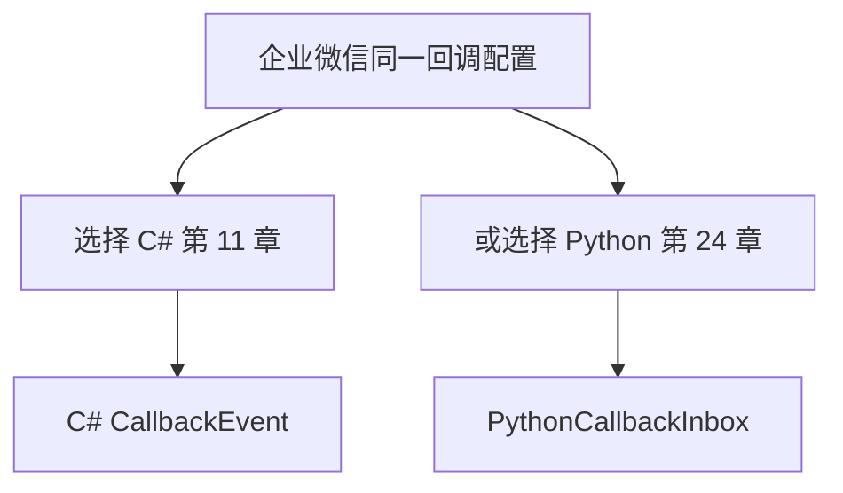
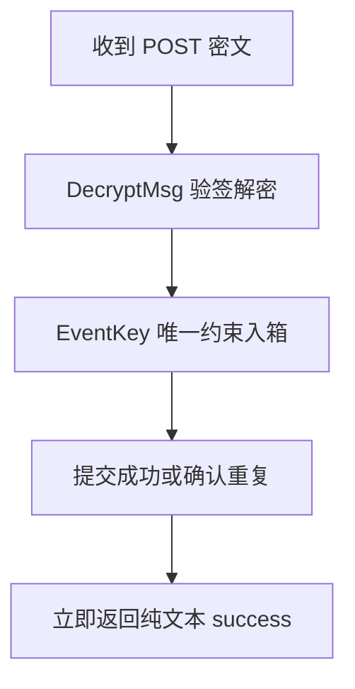
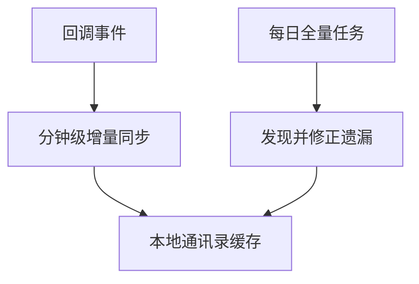
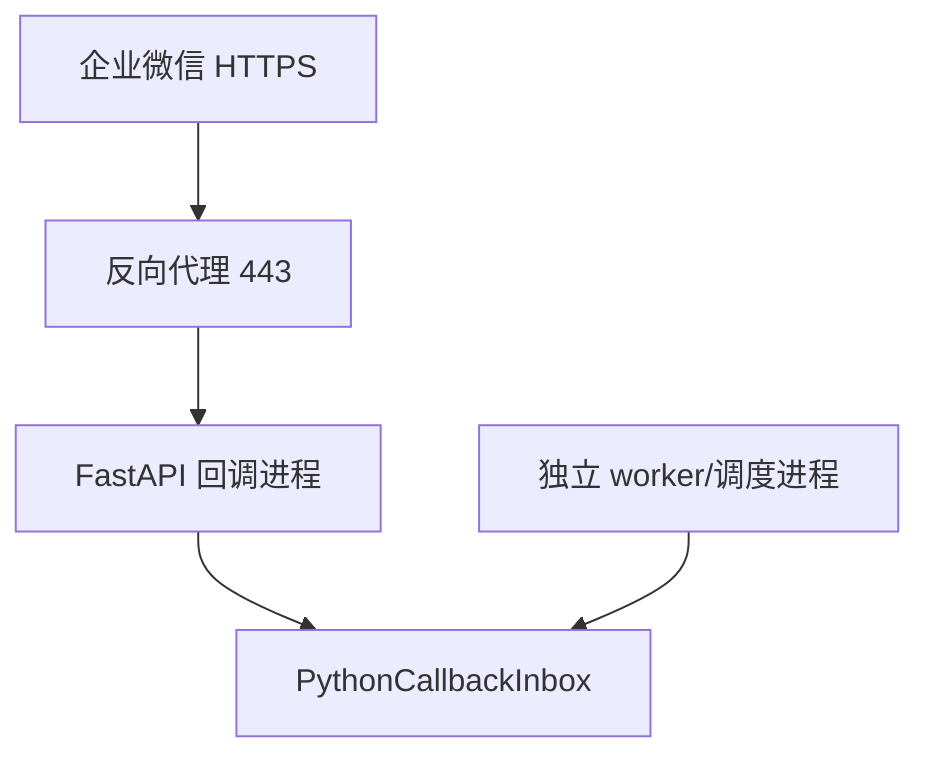
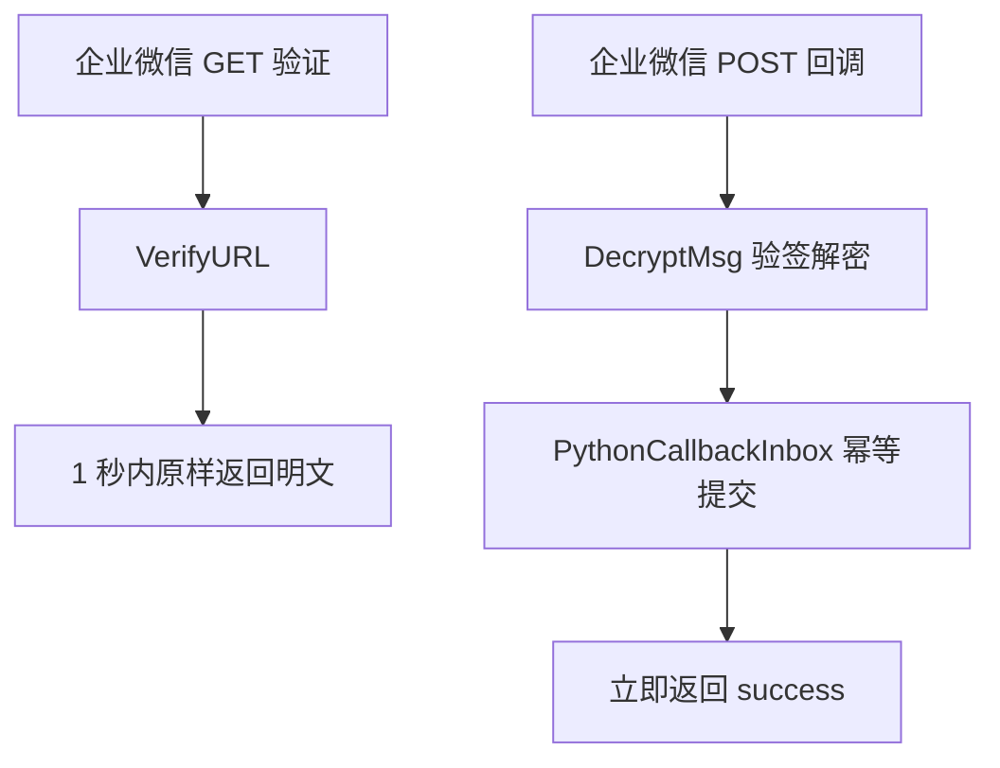
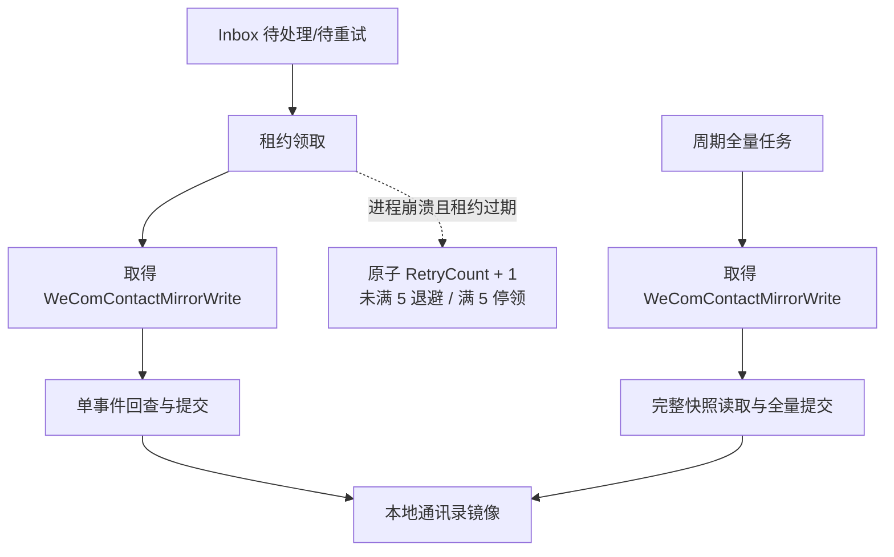

# 第 24 章：Python 回调事件与增量通讯录同步

> 本章定位：把第 11 章 C# 回调作为**独立替代路线**：使用 FastAPI 和企业微信提供的 `WXBizMsgCrypt` API 接收通讯录变更回调，快速幂等落入 Python 专属 Inbox 后立即返回 `success`，再由独立 worker 增量同步，并用周期全量同步兜底。

## 本章目标

完成本章后，你将能够：

- 明确 Python 路线与第 11 章 C# 路线只能二选一；
- 使用企业微信提供的 `WXBizMsgCrypt` 接口，不自行实现 AES、签名或填充算法；
- 用 FastAPI 在 1 秒内完成 GET URL 验证并原样返回解密明文；
- 对 POST 回调先验签、解密，再幂等写入 `PythonCallbackInbox`；
- 数据库提交后立即返回纯文本 `success`，不在请求里同步通讯录；
- 用独立 worker 原子领取事件，按成员或部门做增量同步；
- 让普通异常与进程级崩溃共享五次重试预算，耗尽后停止自动领取并转人工处理；
- 正确认识回调可能重复、延迟或遗漏，并用周期全量对账修正；
- 正确标注 Python 3 加解密代码的维护来源，不把第三方兼容分支冒充官方 SDK。

## 与第 11 章 C# 回调的互斥边界

上一章已经建立 Python 可靠性基线，但第 11 章已有一条 C# WebForms 回调路线。这里首先解决的不是代码，而是入口所有权。



必须遵守：

1. **同一个回调 URL 只能由一条路线负责。**反向代理不能把同一路径轮询到 C# 和 Python；
2. Python 路线不写、不领取第 11 章的 `CallbackEvent`；
3. C# 路线不写、不领取本章的 `PythonCallbackInbox`；
4. 不要让两边同时消费同一个事件后都更新通讯录；
5. 切换路线时要有明确切换时刻和回滚方案。

如果继续使用第 11 章，就不部署本章回调入口；如果采用本章，就把企业微信后台回调 URL 指向 Python，例如：

```text
https://wecom.example.com/wecom/python-contact-callback
```

不要把同一路径同时反向代理到两个后端。旧 C# 地址在切换后可短暂保留为“只记录并返回、绝不处理业务”的排水入口，但不能继续与 Python 竞争事件。

## 前置条件与版本

- 第 7 章的公网 HTTPS、域名、证书和反向代理已可用；
- 已理解第 11 章的验签、解密、快速响应和幂等原理；
- 第 15 章的 `wecom_client.py` 可用，通讯录调用显式传入 `CONTACTS_SECRET`；
- 第 16 章已提供 `contact_sync.sync_all()`、完整快照读取、同名 SQL Server 应用锁，以及可复用的 `upsert_department`、`upsert_employee`；本章只补单对象回查、软删除和改名迁移适配器；
- 第 22 章有独立调度进程；
- 第 23 章的异常、有限重试、幂等和日志脱敏已启用；
- Python 3.11 或 3.12；
- `requests>=2.32,<3`、`pyodbc>=5.3,<5.4`、`fastapi>=0.110,<1`、`uvicorn>=0.29,<1`、`defusedxml>=0.7,<1`。

安装（`requests` 基线沿用第 15 章，`pyodbc` 与第 16 章一致）：

```bash
python -m pip install "requests>=2.32,<3" "pyodbc>=5.3,<5.4" \
  "fastapi>=0.110,<1" "uvicorn>=0.29,<1" "defusedxml>=0.7,<1"
```

### 通讯录回调入口与凭证边界

**通讯录变更回调必须配置在“通讯录同步助手”或企业微信当前官方明确允许接收通讯录变更事件的入口。**任意自建应用的普通消息回调并不会因此自动收到通讯录变更事件；上线前应按当前管理后台和官方文档核对应用类型、可见范围与事件权限。

两组凭证用途完全不同：

- `CALLBACK_TOKEN`、`CALLBACK_AES_KEY`：仅用于回调 URL 验证、签名校验和消息解密；
- `CONTACTS_SECRET`：仅用于 `user/get`、`department/get` 等通讯录 API 回查；
- `APP_SECRET`：普通自建应用 API 使用，本章通讯录回查不用它。

不能用 Callback Token/AES Key 换取 API access token，也不能把 `APP_SECRET` 或 `CONTACTS_SECRET` 当回调 AES Key。

### 加解密库来源必须说清楚

本章只调用以下三个既有 API：

```text
WXBizMsgCrypt(token, encoding_aes_key, corp_id)
VerifyURL(msg_signature, timestamp, nonce, echostr)
DecryptMsg(post_data, msg_signature, timestamp, nonce)
```

**禁止照着文章自行实现 AES、签名排序、Base64 和填充。**优先从企业微信当前官方“加解密库下载与返回码”页面取得示例库，并记录下载日期、版本或文件哈希。

网上存在为了 Python 3 修改的社区分支。它们可以经过安全评审后使用，但如果维护者不是企业微信，就必须在依赖清单中写“第三方兼容版本”，**绝不能称为企业微信官方 Python 3 SDK**。例如搜索中常见的 [`WXBizMsgCrypt_python3` 社区仓库](https://github.com/ZheYang/WXBizMsgCrypt_python3) 明确属于第三方来源；是否采用由团队审查决定，本教程不替它背书。

不要仅凭 PyPI 包名相似就安装。至少核对来源、许可证、最近维护、变更内容，并用官方回调验证流程做兼容性检查。

配置只从服务器安全配置读取：

```python
CALLBACK_TOKEN = "从环境或受限配置文件读取"
CALLBACK_AES_KEY = "从环境或受限配置文件读取"
CORP_ID = "企业 ID"
CONTACTS_SECRET = "通讯录 Secret"
APP_SECRET = "普通自建应用 Secret；本章通讯录回查不使用"
BASE_URL = "https://qyapi.weixin.qq.com/cgi-bin"
CONN_STR = "SQL Server 连接串"
```

所有 Secret、Callback Token 和 AES Key 都不能出现在日志、异常详情、仓库或截图中，并应使用不同配置项和最小权限账号隔离。

## 最终目录

```text
code/
├── config.py
├── wecom_client.py             # 第 15 章公共客户端
├── contact_sync.py             # 第 16 章真实全量入口 sync_all() 与共享锁
├── mirror_repository.py        # 第 16 章 Upsert 仓储函数
├── callback_app.py             # FastAPI：GET/POST 快速入口
├── callback_crypt.py           # 只适配 WXBizMsgCrypt API
├── callback_inbox.py           # 幂等入箱、租约领取与回收
├── callback_worker.py          # 独立异步 worker
├── contact_incremental.py      # 本章明确实现的单对象适配器
├── reliable_wecom.py           # 第 23 章
├── WXBizMsgCrypt.py            # 经来源审查的官方示例或明确标注的第三方版本
├── migrations/
│   └── 024_python_callback_inbox.sql
└── logs/
    ├── callback-web.log
    └── callback-worker.log
```

这里的“异步”指**接收与业务处理解耦**，不是要求所有函数都写成 `async def`。SQL Server worker 是独立进程，FastAPI 返回后它再处理。

## V1：准备回调配置与加解密库

### 上一版的问题

若把加解密算法散落在路由里，后续很难确认用的是官方接口还是自创实现，也容易混淆 `str` 与 `bytes`。

新建 `callback_crypt.py`：

```python
import config
from WXBizMsgCrypt import WXBizMsgCrypt


class CallbackCryptError(RuntimeError):
    def __init__(self, action, code):
        self.action = action
        self.code = int(code)
        super().__init__(f"回调{action}失败，返回码={self.code}")


def _bytes(value):
    if isinstance(value, bytes):
        return value
    return str(value).encode("utf-8")


def _text(value):
    if isinstance(value, bytes):
        return value.decode("utf-8")
    return str(value)


class CallbackCrypt:
    def __init__(self):
        self._crypt = WXBizMsgCrypt(
            config.CALLBACK_TOKEN,
            config.CALLBACK_AES_KEY,
            config.CORP_ID,
        )

    def verify_url(self, msg_signature, timestamp, nonce, echostr):
        code, plain_echo = self._crypt.VerifyURL(
            msg_signature, timestamp, nonce, echostr
        )
        if code != 0:
            raise CallbackCryptError("URL 验证", code)
        return _bytes(plain_echo)

    def decrypt_message(self, post_data, msg_signature, timestamp, nonce):
        # 官方 DecryptMsg API 内部完成签名校验和解密。
        code, plain_xml = self._crypt.DecryptMsg(
            _text(post_data), msg_signature, timestamp, nonce
        )
        if code != 0:
            raise CallbackCryptError("验签或解密", code)
        return _text(plain_xml)
```

为什么只做适配：不同来源版本在 Python 3 下可能返回 `bytes` 或 `str`。适配层只统一类型和错误，不重写密码算法。

在部署记录中保存来源说明，例如：

```text
文件：WXBizMsgCrypt.py
来源：企业微信开发者中心下载页 / 或明确的第三方仓库 URL
取得日期：2025-08-01
SHA256：由部署流程计算并留档
本地修改：无 / 列出具体兼容修改
```

### V1 的问题

加解密对象准备好了，但企业微信后台保存回调配置前会发 GET 请求验证 URL；若响应包成 JSON 或处理超过时限，配置仍无法通过。

## V2：通过 GET URL 验证

### 上一版的问题

URL 验证不是普通网页。必须读取四个查询参数，调用 `VerifyURL`，在 1 秒内把**解密后的明文**原样作为响应体返回。

新建 `callback_app.py`：

```python
import logging
import time

from fastapi import FastAPI, HTTPException, Query
from fastapi.responses import Response

from callback_crypt import CallbackCrypt, CallbackCryptError

log = logging.getLogger(__name__)
app = FastAPI()
crypt = CallbackCrypt()


@app.get("/wecom/python-contact-callback")
def verify_callback(
    msg_signature: str = Query(...),
    timestamp: str = Query(...),
    nonce: str = Query(...),
    echostr: str = Query(...),
):
    started = time.perf_counter()
    try:
        plain_echo = crypt.verify_url(
            msg_signature, timestamp, nonce, echostr
        )
    except CallbackCryptError as ex:
        log.warning("回调 URL 验证失败：code=%s", ex.code)
        raise HTTPException(status_code=403, detail="verify failed") from ex

    elapsed = time.perf_counter() - started
    if elapsed >= 1:
        log.warning("回调 URL 验证耗时过长：%.3fs", elapsed)

    # Response 接受 bytes；不要 JSON 编码，不加引号，不加 XML，不加换行。
    return Response(content=plain_echo, media_type="text/plain")
```

这一条路由不查数据库、不取 token、不调用通讯录接口。目标是应用代码和反向代理合计尽量在 1 秒内返回。

所谓“原样返回”是返回 `VerifyURL` 得到的解密明文，不是把查询参数中的密文 `echostr` 原样返回。以下响应都不对：

```text
{"echo":"明文"}       错误：包成 JSON
<xml>明文</xml>        错误：包成 XML
"明文"                错误：多了 JSON 引号
明文\n                 错误：多了换行
```

### V2 的问题

GET 只在配置时验证入口。真正的通讯录事件通过 POST 到达，正文仍是密文，不能直接解析 XML。

## V3：接收并解密 POST 回调

### 上一版的问题

直接解析外层 XML 或只解密不验签，都不能建立可信事件。必须先通过 `DecryptMsg` 完成验签与解密，失败的请求绝不能入库。

先写最小 POST 路由：

```python
from fastapi import Request
from fastapi.responses import PlainTextResponse


@app.post("/wecom/python-contact-callback")
async def receive_callback(
    request: Request,
    msg_signature: str = Query(...),
    timestamp: str = Query(...),
    nonce: str = Query(...),
):
    encrypted_body = await request.body()
    try:
        plain_xml = crypt.decrypt_message(
            encrypted_body, msg_signature, timestamp, nonce
        )
    except CallbackCryptError as ex:
        log.warning("回调验签或解密失败：code=%s", ex.code)
        raise HTTPException(status_code=403, detail="decrypt failed") from ex

    # V3 只证明能解密。不要在生产日志打印 plain_xml。
    log.info("收到并解密一个企业微信回调")
    return PlainTextResponse("success")
```

`DecryptMsg` 的职责包括校验消息签名和解密。本章不再写一份 `hashlib.sha1 + AES` 代码“验证一下”，因为两个实现稍有差异就会产生安全和兼容问题。

不要把 `plain_xml` 记录到普通日志。它可能包含成员标识、手机号、邮箱或通讯录变更内容。下一版将它保存到有权限和保留期控制的 Inbox。

### V3 的问题

现在解密后立刻返回，但事件没有持久化；进程在返回前后重启都可能丢失。另一方面，企业微信也可能重推同一事件，直接处理会重复执行。

## V4：幂等写入回调收件箱

### 上一版的问题

回调请求里做通讯录同步会变慢并触发重推。正确顺序是“验签解密 → 幂等落库并提交 → 立即 `success`”。

新建 `migrations/024_python_callback_inbox.sql`：

```sql
/* 可重复执行：新环境建表，旧环境只补缺失列和索引。 */
IF OBJECT_ID(N'dbo.PythonCallbackInbox', N'U') IS NULL
BEGIN
    CREATE TABLE dbo.PythonCallbackInbox (
        Id            BIGINT IDENTITY(1,1) PRIMARY KEY,
        EventKey      CHAR(64) NOT NULL,
        EventType     NVARCHAR(64) NULL,
        ChangeType    NVARCHAR(64) NULL,
        UserId        NVARCHAR(64) NULL,
        NewUserId     NVARCHAR(64) NULL,
        PartyId       BIGINT NULL,
        CreateTime    BIGINT NULL,
        RawXml        NVARCHAR(MAX) NOT NULL,
        Status        TINYINT NOT NULL
            CONSTRAINT DF_PythonCallbackInbox_Status DEFAULT 0,
        -- 0待处理 1处理中 2已完成 3待重试 4永久失败/人工处理
        RetryCount    INT NOT NULL
            CONSTRAINT DF_PythonCallbackInbox_RetryCount DEFAULT 0,
        NextRetryAt   DATETIME2(0) NULL,
        LastError     NVARCHAR(500) NULL,
        ReceivedAt    DATETIME2(0) NOT NULL
            CONSTRAINT DF_PythonCallbackInbox_ReceivedAt DEFAULT SYSDATETIME(),
        LockedAt      DATETIME2(0) NULL,
        WorkerId      NVARCHAR(128) NULL,
        LeaseUntil    DATETIME2(0) NULL,
        ProcessedAt   DATETIME2(0) NULL,
        CONSTRAINT UQ_PythonCallbackInbox_EventKey UNIQUE (EventKey),
        CONSTRAINT CK_PythonCallbackInbox_Status
            CHECK (Status IN (0, 1, 2, 3, 4))
    );
END;
GO

/* 兼容执行过旧版 024 的数据库。列升级也必须幂等。 */
IF COL_LENGTH(N'dbo.PythonCallbackInbox', N'NewUserId') IS NULL
    ALTER TABLE dbo.PythonCallbackInbox ADD NewUserId NVARCHAR(64) NULL;
GO
IF COL_LENGTH(N'dbo.PythonCallbackInbox', N'WorkerId') IS NULL
    ALTER TABLE dbo.PythonCallbackInbox ADD WorkerId NVARCHAR(128) NULL;
GO
IF COL_LENGTH(N'dbo.PythonCallbackInbox', N'LeaseUntil') IS NULL
    ALTER TABLE dbo.PythonCallbackInbox ADD LeaseUntil DATETIME2(0) NULL;
GO

IF NOT EXISTS (
    SELECT 1 FROM sys.indexes
    WHERE object_id = OBJECT_ID(N'dbo.PythonCallbackInbox')
      AND name = N'IX_PythonCallbackInbox_ClaimLease'
)
BEGIN
    CREATE INDEX IX_PythonCallbackInbox_ClaimLease
        ON dbo.PythonCallbackInbox
            (Status, NextRetryAt, LeaseUntil, ReceivedAt);
END;
GO
```

脚本不 `DROP` 表、不清数据；重复执行不会重复建表、补列或建索引。新索引使用新名称，已经执行过旧版 `IX_PythonCallbackInbox_Claim` 的环境也可以平滑升级。

这是 Python 路线专属表，**不要改成第 11 章 `CallbackEvent`**。新建 `callback_inbox.py`：

```python
import hashlib

import pyodbc
from defusedxml import ElementTree as ET

import config


def _value(root, *names):
    for name in names:
        node = root.find(name)
        if node is not None and node.text:
            return node.text
    return None


def parse_event(plain_xml):
    root = ET.fromstring(plain_xml)
    event_type = _value(root, "Event", "InfoType")
    change_type = _value(root, "ChangeType")
    user_id = _value(root, "UserID", "UserId")
    # 企业微信成员改名事件使用 NewUserID；大小写按官方 XML 字段读取。
    new_user_id = _value(root, "NewUserID", "NewUserId")
    party_text = _value(root, "Id", "PartyId")
    create_time = _value(root, "CreateTime")

    return {
        # 重推的解密明文相同；哈希无需把个人信息放进索引。
        "event_key": hashlib.sha256(
            plain_xml.encode("utf-8")
        ).hexdigest(),
        "event_type": event_type,
        "change_type": change_type,
        "user_id": user_id,
        "new_user_id": new_user_id,
        "party_id": int(party_text) if party_text else None,
        "create_time": int(create_time) if create_time else None,
        "raw_xml": plain_xml,
    }


def enqueue(plain_xml):
    """返回 True 表示新事件，False 表示重复重推。"""
    event = parse_event(plain_xml)
    conn = pyodbc.connect(config.CONN_STR)
    try:
        cursor = conn.cursor()
        try:
            cursor.execute("""
                INSERT INTO dbo.PythonCallbackInbox
                    (EventKey, EventType, ChangeType, UserId, NewUserId,
                     PartyId, CreateTime, RawXml)
                VALUES (?, ?, ?, ?, ?, ?, ?, ?)
            """, event["event_key"], event["event_type"],
                 event["change_type"], event["user_id"],
                 event["new_user_id"], event["party_id"],
                 event["create_time"], event["raw_xml"])
            conn.commit()
            return True
        except pyodbc.IntegrityError as ex:
            conn.rollback()
            text = str(ex)
            if "2601" in text or "2627" in text:
                return False
            raise
    finally:
        conn.close()
```

把 POST 路由替换为：

```python
from starlette.concurrency import run_in_threadpool

from callback_inbox import enqueue


@app.post("/wecom/python-contact-callback")
async def receive_callback(
    request: Request,
    msg_signature: str = Query(...),
    timestamp: str = Query(...),
    nonce: str = Query(...),
):
    encrypted_body = await request.body()
    try:
        plain_xml = crypt.decrypt_message(
            encrypted_body, msg_signature, timestamp, nonce
        )
        is_new = await run_in_threadpool(enqueue, plain_xml)
    except CallbackCryptError as ex:
        log.warning("回调验签或解密失败：code=%s", ex.code)
        raise HTTPException(status_code=403, detail="invalid callback") from ex
    except Exception:
        # 未可靠落库，不能假装成功；让企业微信稍后重推。
        log.exception("回调收件箱写入失败")
        raise HTTPException(status_code=503, detail="inbox unavailable")

    log.info("回调已入箱：new=%s", is_new)
    # 只有数据库 commit 成功或确认重复后才返回 success。
    return PlainTextResponse("success")
```

关键顺序不能调换：



不要在返回前调用成员查询、部门全量同步、发消息或生成报表。数据库不可用时返回 503，让上游有机会重推；验签失败则 403，不接受伪造数据。

### V4 的问题

Inbox 中的事件只会积压，还没有独立进程领取和处理。

## V5：异步处理通讯录增量

### 上一版的问题

使用 FastAPI `BackgroundTasks` 看起来简单，但任务只存在于 Web 进程内存中，部署重启时可能丢失，也会让多个 Web worker 争抢。应由独立 worker 扫描持久化 Inbox。

在 `callback_inbox.py` 追加原子领取：

```python
from dataclasses import dataclass


@dataclass
class InboxItem:
    id: int
    change_type: str | None
    user_id: str | None
    new_user_id: str | None
    party_id: int | None
    raw_xml: str


def requeue_expired_leases():
    """回收崩溃 worker 的租约，并与普通异常共享五次重试预算。"""
    conn = pyodbc.connect(config.CONN_STR)
    try:
        cursor = conn.cursor()
        cursor.execute("""
            UPDATE dbo.PythonCallbackInbox
                WITH (UPDLOCK, READPAST, ROWLOCK)
            SET RetryCount = RetryCount + 1,
                Status = CASE WHEN RetryCount + 1 < 5 THEN 3 ELSE 4 END,
                NextRetryAt = CASE WHEN RetryCount + 1 < 5
                    THEN DATEADD(SECOND,
                        POWER(CAST(2 AS FLOAT), RetryCount + 1) * 30,
                        SYSDATETIME())
                    ELSE NULL END,
                ProcessedAt = CASE WHEN RetryCount + 1 < 5
                    THEN NULL ELSE SYSDATETIME() END,
                LastError = CASE WHEN RetryCount + 1 < 5
                    THEN N'worker lease expired; queued for retry'
                    ELSE N'worker lease expired; retry budget exhausted' END,
                WorkerId = NULL,
                LeaseUntil = NULL
            OUTPUT inserted.Status
            WHERE Status = 1
              AND (LeaseUntil IS NULL OR LeaseUntil <= SYSDATETIME())
        """)
        statuses = [int(row.Status) for row in cursor.fetchall()]
        conn.commit()
        retry_count = sum(status == 3 for status in statuses)
        exhausted_count = sum(status == 4 for status in statuses)
        return retry_count, exhausted_count
    except Exception:
        conn.rollback()
        raise
    finally:
        conn.close()


def claim(worker_id, limit=1, lease_seconds=300):
    if not worker_id:
        raise ValueError("worker_id 不能为空")
    limit = max(1, min(int(limit), 20))
    lease_seconds = max(30, min(int(lease_seconds), 3600))
    conn = pyodbc.connect(config.CONN_STR)
    try:
        cursor = conn.cursor()
        cursor.execute(f"""
            ;WITH next_items AS (
                SELECT TOP ({limit}) *
                FROM dbo.PythonCallbackInbox
                    WITH (UPDLOCK, READPAST, ROWLOCK)
                WHERE Status = 0
                   OR (Status = 3 AND NextRetryAt <= SYSDATETIME())
                ORDER BY ReceivedAt
            )
            UPDATE next_items
            SET Status = 1,
                LockedAt = SYSDATETIME(),
                WorkerId = ?,
                LeaseUntil = DATEADD(SECOND, ?, SYSDATETIME())
            OUTPUT inserted.Id, inserted.ChangeType,
                   inserted.UserId, inserted.NewUserId,
                   inserted.PartyId, inserted.RawXml;
        """, worker_id, lease_seconds)
        items = [
            InboxItem(
                id=row.Id,
                change_type=row.ChangeType,
                user_id=row.UserId,
                new_user_id=row.NewUserId,
                party_id=row.PartyId,
                raw_xml=row.RawXml,
            )
            for row in cursor.fetchall()
        ]
        conn.commit()
        return items
    except Exception:
        conn.rollback()
        raise
    finally:
        conn.close()


def renew_lease(item_id, worker_id, lease_seconds=300):
    """长事件可在处理期间由心跳定期续租；所有权不匹配即失败。"""
    conn = pyodbc.connect(config.CONN_STR)
    try:
        cursor = conn.cursor()
        cursor.execute("""
            UPDATE dbo.PythonCallbackInbox
            SET LeaseUntil = DATEADD(SECOND, ?, SYSDATETIME())
            WHERE Id = ? AND Status = 1 AND WorkerId = ?
        """, lease_seconds, item_id, worker_id)
        if cursor.rowcount != 1:
            conn.rollback()
            raise RuntimeError("续租失败：事件已不属于当前 worker")
        conn.commit()
    except Exception:
        conn.rollback()
        raise
    finally:
        conn.close()
```

这里先显式回收过期租约，再领取待处理/待重试行。**进程级崩溃与普通处理异常共享同一个五次预算**：过期租约每恢复一次也先把 `RetryCount` 加 1；只有 `RetryCount + 1 < 5` 才进入 `Status=3` 并按 60、120、240、480 秒做有限指数退避，达到 5 次立即进入 `Status=4` 永久失败/人工处理，`claim()` 因此不会再次领取它。不能让反复崩溃的最老事件无限回到队首、长期挤占后续事件。

回收只使用一条带 `OUTPUT` 的 `UPDATE`。SQL Server 的 `SET` 表达式都基于更新前的同一行求值，所以各个 `CASE` 统一用 `RetryCount + 1` 表示本次恢复后的计数；同一语句原子完成加一、状态分流、退避或耗尽标记。`WHERE Status = 1` 配合更新锁保证并发回收器对同一过期行只会成功处理一次，而单个 `CASE` 只会选择 `Status=3` 或 `Status=4` 其中一个分支。函数根据 `OUTPUT inserted.Status` 分别返回 `retry_count` 与 `exhausted_count`。

新手版默认一次领取一条，租约应大于单事件最坏处理时间；如果批量领取或单次 API 可能超过租约，必须在处理期间调用 `renew_lease`，不能让仍在工作的事件因租约悄悄过期而消耗重试预算。

增量处理不要完全信任回调里携带的展示字段。创建或更新事件只取资源标识，再调用通讯录接口读取当前权威结果；删除事件则在本地软删除。

第 16 章已经真实提供 `contact_sync.sync_all()`，并且其全量锁从远端快照读取前一直覆盖到短写事务提交/回滚后。本章**直接导入该入口，不新建、不覆盖 `contact_sync.py`，也不再套第二层 session 锁**；两个不同 SQL session 重复申请同一排他锁会造成自等待。

第 16 章同时公开 `acquire_mirror_writer_lock(conn)` 和 `release_mirror_writer_lock(conn)`。增量路径必须在同一连接上复用这两个函数，才能保证资源名 `WeComContactMirrorWrite`、`LockOwner='Session'`、数据库 principal 和释放方式完全一致。

新建 `contact_incremental.py`，明确实现 worker 会调用的所有适配函数：

```python
import logging
from contextlib import contextmanager

import pyodbc

import config
from contact_sync import (
    acquire_mirror_writer_lock,
    release_mirror_writer_lock,
)
from mirror_repository import upsert_department, upsert_employee
from wecom_client import WeComClient

log = logging.getLogger(__name__)
client = WeComClient(config.CORP_ID, config.BASE_URL)


class PermanentEventError(RuntimeError):
    """自动重试不能安全修复，必须进入永久失败/人工处理。"""


@contextmanager
def mirror_write_lock(timeout_ms=60000):
    """在同一 SQL session 上复用第 16 章的取得/释放锁协议。"""
    conn = pyodbc.connect(config.CONN_STR, autocommit=True)
    acquired = False
    try:
        acquire_mirror_writer_lock(conn, timeout_ms=timeout_ms)
        acquired = True
        yield
    finally:
        try:
            if acquired:
                release_mirror_writer_lock(conn)
        finally:
            conn.close()


def _write_one(action):
    conn = pyodbc.connect(config.CONN_STR, autocommit=False)
    try:
        action(conn.cursor())
        conn.commit()
    except Exception:
        conn.rollback()
        raise
    finally:
        conn.close()


def sync_user_by_id(user_id):
    employee = client.get(
        "user/get", config.CONTACTS_SECRET, {"userid": user_id}
    )
    _write_one(lambda cursor: upsert_employee(cursor, employee))


def sync_department_by_id(party_id):
    result = client.get(
        "department/get", config.CONTACTS_SECRET, {"id": party_id}
    )
    department = result.get("department")
    if not isinstance(department, dict):
        raise RuntimeError("department/get 未返回 department")
    _write_one(lambda cursor: upsert_department(cursor, department))


def mark_user_deleted(user_id):
    def action(cursor):
        cursor.execute("""
            UPDATE dbo.WeComEmployee
            SET IsDeleted = 1, SyncedAt = SYSDATETIME()
            WHERE UserId = ? AND IsDeleted = 0
        """, user_id)
    _write_one(action)


def mark_department_deleted(party_id):
    def action(cursor):
        cursor.execute("""
            UPDATE dbo.WeComDepartment
            SET IsDeleted = 1, SyncedAt = SYSDATETIME()
            WHERE DeptId = ? AND IsDeleted = 0
        """, party_id)
    _write_one(action)


def migrate_user_id(old_user_id, new_user_id):
    """幂等迁移镜像主键；声明为外键的本地引用必须 ON UPDATE CASCADE。"""
    if not old_user_id or not new_user_id:
        raise PermanentEventError("UserID/NewUserID 不完整，无法迁移")
    if old_user_id == new_user_id:
        return

    conn = pyodbc.connect(config.CONN_STR, autocommit=False)
    try:
        cursor = conn.cursor()
        # SQL Server 外键不可延迟。所有指向 WeComEmployee.UserId 的本地引用
        # 必须使用 ON UPDATE CASCADE；否则拒绝迁移，而不是留下半套引用。
        cursor.execute("""
            SELECT fk.name
            FROM sys.foreign_keys AS fk
            INNER JOIN sys.foreign_key_columns AS fkc
                ON fkc.constraint_object_id = fk.object_id
            INNER JOIN sys.columns AS referenced_column
                ON referenced_column.object_id = fkc.referenced_object_id
               AND referenced_column.column_id = fkc.referenced_column_id
            WHERE fk.referenced_object_id = OBJECT_ID(N'dbo.WeComEmployee')
              AND referenced_column.name = N'UserId'
              AND fk.update_referential_action <> 1
        """)
        unsafe_fks = [row[0] for row in cursor.fetchall()]
        if unsafe_fks:
            raise PermanentEventError(
                "存在未配置 ON UPDATE CASCADE 的本地引用外键："
                + ",".join(unsafe_fks)
            )

        cursor.execute("""
            SELECT UserId
            FROM dbo.WeComEmployee WITH (UPDLOCK, HOLDLOCK)
            WHERE UserId IN (?, ?)
        """, old_user_id, new_user_id)
        existing = {row[0] for row in cursor.fetchall()}

        if old_user_id not in existing and new_user_id in existing:
            conn.commit()             # 重试：上次迁移已经成功
            return
        if old_user_id not in existing:
            raise PermanentEventError("旧、新 UserId 都不存在，无法证明安全迁移")
        if new_user_id in existing:
            raise PermanentEventError("新 UserId 已被另一成员占用，拒绝合并")

        # 主键更新由 SQL Server 原子级联到所有已声明的本地外键引用。
        cursor.execute("""
            UPDATE dbo.WeComEmployee
            SET UserId = ?, SyncedAt = SYSDATETIME()
            WHERE UserId = ?
        """, new_user_id, old_user_id)
        if cursor.rowcount != 1:
            raise PermanentEventError("UserId 迁移影响行数不是 1")
        conn.commit()
    except Exception:
        conn.rollback()
        raise
    finally:
        conn.close()


def process_contact_event(item):
    # 与全量相同的 session application lock，覆盖一个事件的迁移、API 回查和提交。
    with mirror_write_lock():
        change = (item.change_type or "").lower()

        if change == "create_user":
            if not item.user_id:
                raise PermanentEventError("成员创建事件缺少 UserID")
            sync_user_by_id(item.user_id)
        elif change == "update_user":
            if not item.user_id:
                raise PermanentEventError("成员更新事件缺少 UserID")
            target_user_id = item.user_id
            if item.new_user_id and item.new_user_id != item.user_id:
                # 先原子迁移旧主键及所有声明的本地引用，再按新 ID 回查权威值。
                migrate_user_id(item.user_id, item.new_user_id)
                target_user_id = item.new_user_id
            sync_user_by_id(target_user_id)
        elif change == "delete_user":
            if not item.user_id:
                raise PermanentEventError("删除成员事件缺少 UserID")
            mark_user_deleted(item.user_id)
        elif change in {"create_party", "update_party"}:
            if item.party_id is None:
                raise PermanentEventError("部门变更事件缺少 Id/PartyId")
            sync_department_by_id(item.party_id)
        elif change == "delete_party":
            if item.party_id is None:
                raise PermanentEventError("删除部门事件缺少 Id/PartyId")
            mark_department_deleted(item.party_id)
        else:
            raise PermanentEventError(f"未知通讯录变更类型：{change!r}")
```

第 16 章镜像表本身没有其他成员引用，因此上面的主键迁移已经完整；业务系统若增加引用 `dbo.WeComEmployee(UserId)` 的表，migration 必须给这些外键配置 `ON UPDATE CASCADE`。没有外键约束的“散落 UserId 文本”无法安全自动发现，应先补外键或项目专用迁移存储过程；检测到非级联外键、ID 冲突或无法证明迁移安全时，`PermanentEventError` 会进入人工处理，绝不能继续按旧 ID 查询后静默标完成。

增量事件持有同一个 `WeComContactMirrorWrite` session application lock，边界是“开始处理单事件 → 改名迁移/远端回查 → 本地短事务提交或回滚”。因此全量和增量都不会在对方写入窗口中穿插。

新建 `callback_worker.py`：

```python
import logging
import socket
import uuid

import pyodbc

import config
from callback_inbox import claim, requeue_expired_leases
from contact_incremental import PermanentEventError, process_contact_event

log = logging.getLogger(__name__)
WORKER_ID = f"{socket.gethostname()}:{uuid.uuid4().hex}"


def _owned_update(item_id, worker_id, sql, *params):
    conn = pyodbc.connect(config.CONN_STR)
    try:
        cursor = conn.cursor()
        cursor.execute(sql, *params, item_id, worker_id)
        if cursor.rowcount != 1:
            conn.rollback()
            raise RuntimeError("状态回写失败：租约已丢失或事件状态已改变")
        conn.commit()
    except Exception:
        conn.rollback()
        raise
    finally:
        conn.close()


def mark_done(item_id, worker_id):
    _owned_update(item_id, worker_id, """
        UPDATE dbo.PythonCallbackInbox
        SET Status = 2, ProcessedAt = SYSDATETIME(),
            LastError = NULL, WorkerId = NULL, LeaseUntil = NULL
        WHERE Id = ? AND Status = 1 AND WorkerId = ?
    """)


def mark_retry(item_id, worker_id, error):
    _owned_update(item_id, worker_id, """
        UPDATE dbo.PythonCallbackInbox
        SET RetryCount = RetryCount + 1,
            Status = CASE WHEN RetryCount + 1 < 5 THEN 3 ELSE 4 END,
            NextRetryAt = CASE WHEN RetryCount + 1 < 5
                THEN DATEADD(SECOND,
                    POWER(CAST(2 AS FLOAT), RetryCount + 1) * 30,
                    SYSDATETIME())
                ELSE NULL END,
            ProcessedAt = CASE WHEN RetryCount + 1 < 5
                THEN NULL ELSE SYSDATETIME() END,
            LastError = ?, WorkerId = NULL, LeaseUntil = NULL
        WHERE Id = ? AND Status = 1 AND WorkerId = ?
    """, str(error)[:500])


def mark_permanent(item_id, worker_id, error):
    _owned_update(item_id, worker_id, """
        UPDATE dbo.PythonCallbackInbox
        SET Status = 4, ProcessedAt = SYSDATETIME(),
            LastError = ?, WorkerId = NULL, LeaseUntil = NULL
        WHERE Id = ? AND Status = 1 AND WorkerId = ?
    """, str(error)[:500])


def process_batch(limit=1, lease_seconds=300):
    retry_count, exhausted_count = requeue_expired_leases()
    if retry_count:
        log.warning(
            "已回收过期 worker 租约并进入退避重试：count=%s",
            retry_count,
        )
    if exhausted_count:
        log.error(
            "过期 worker 租约已耗尽五次预算并转人工处理：count=%s",
            exhausted_count,
        )

    items = claim(WORKER_ID, limit=limit, lease_seconds=lease_seconds)
    for item in items:
        try:
            process_contact_event(item)
            mark_done(item.id, WORKER_ID)
        except PermanentEventError as ex:
            log.exception("事件需人工处理：id=%s", item.id)
            mark_permanent(item.id, WORKER_ID, ex)
        except Exception as ex:
            log.exception("增量通讯录事件处理失败：id=%s", item.id)
            mark_retry(item.id, WORKER_ID, ex)
    return len(items)
```

`mark_done`、`mark_retry`、`mark_permanent` 都以 `Id + Status + WorkerId` 校验所有权并检查 `rowcount == 1`；完成或释放时清空租约。旧 worker 即使在租约过期后恢复，也不能覆盖新 worker 的结果。本章只同步通讯录镜像，不执行“结果未知”的消息发送，因此未耗尽预算的崩溃事件可以安全回到 `Retry`；增量写和改名迁移仍必须保持幂等。

`mark_retry()` 与 `requeue_expired_leases()` 都先将 `RetryCount` 增加 1，并用更新前的 `RetryCount + 1` 判断新计数是否小于 5。前者覆盖进程仍存活时捕获到的普通异常，后者覆盖进程级崩溃、强制退出或失联造成的租约过期；二者不是两套额度，而是共享总计五次的同一预算。前四次失败进入有限退避，第五次直接进入 `Status=4`，不再被 `claim()` 自动领取。`process_batch()` 分别记录本轮重新排队的 `retry_count` 和预算耗尽的 `exhausted_count`，便于告警区分。

单条失败不影响后续事件。普通异常与崩溃恢复合计达到五次后进入永久失败；改名冲突、缺少关键 ID、未知事件等不可安全自动处理的情况立即进入永久失败，由运维查看，不能静默丢弃，也不能无限重领最老事件。

worker 可以由第 22 章独立 `BlockingScheduler` 每分钟调用 `process_batch()`，也可以由一个专用循环进程调用。无论哪种方式，都不能在 FastAPI 请求线程中直接执行。

### V5 的问题

增量回调很及时，但不能保证绝不遗漏。配置切换、网络故障、权限变化和永久失败都可能让本地通讯录偏离真实数据。

## V6：失败重试与全量对账

### 上一版的问题

把回调当成唯一事实来源，会让偶发遗漏永久存在。正确模型是“回调加速，周期全量校准”。



在第 22 章独立调度入口注册两个任务：

```python
from apscheduler.triggers.cron import CronTrigger

from callback_worker import process_batch
from contact_sync import sync_all

scheduler.add_job(
    process_batch,
    CronTrigger(minute="*", second=0, timezone=TZ),
    kwargs={"limit": 1, "lease_seconds": 300},
    id="python-callback-worker",
    replace_existing=True,
    max_instances=1,
    coalesce=True,
    misfire_grace_time=30,
)

scheduler.add_job(
    sync_all,
    CronTrigger(hour=2, minute=30, timezone=TZ),
    id="contact-full-reconcile",
    replace_existing=True,
    max_instances=1,
    coalesce=True,
    misfire_grace_time=3600,
)
```

FastAPI 只负责接收。APScheduler 仍在第 22 章的独立进程里，**不要因为本章用了 FastAPI，就把 scheduler 放进 FastAPI lifespan 或多 worker**。

`max_instances=1` 只防止同一个 job 自己重入，不能让两个不同 job 互斥。真正的互斥来自两条路径共同取得 SQL Server session application lock `WeComContactMirrorWrite`：

- 第 16 章的 `contact_sync.sync_all()` 已在远端快照读取**之前**取得锁，直到校验和数据库提交/回滚全部结束后才释放；本章调度器直接导入它，不再包装第二层锁；
- 本章 `process_contact_event()` 在单事件开始时，通过同一连接复用第 16 章的 `acquire_mirror_writer_lock`，直到改名迁移、权威 API 回查和本地事务结束后才释放；
- `sp_getapplock` 返回负数时，第 16 章锁函数会抛异常；任务必须失败/重试，不能绕过锁继续写。

应用锁由独立 autocommit session 持有，所以不会把第 16 章的普通数据库写事务扩展到 HTTP 读取期间；全量的数据事务仍然只覆盖最终短写入阶段。锁覆盖整个远端快照窗口，是为了避免“全量读到旧快照 → 增量先写入新事件 → 旧全量最后覆盖新值”。

全量对账至少应做到：

- 更新企业微信仍存在的成员和部门；
- 对完整成功同步后仍未出现的本地记录做软删除；
- 若全量读取中途失败，跳过删除阶段，避免误删；
- 记录同步开始、结束、数量和错误码，但不记录 Secret 或完整成员正文；
- 对比 Inbox 永久失败数量和最老待处理时间。

回调可能重试，所以靠 `EventKey` 幂等；回调可能遗漏，所以靠全量对账；事件可能乱序，所以更新事件应回查当前资源，而不是盲目用旧回调内容覆盖新数据。

### V6 的问题

本机运行正确不等于公网可用。反向代理、超时、进程数和切换步骤仍可能破坏入口互斥或原始请求参数。

## V7：部署 FastAPI 回调服务

### 上一版的问题

若直接把开发服务器暴露到公网，或让代理改写查询参数，URL 验证和 POST 签名都会失败。若切换时两条路线都在处理，又会重复同步。

开发环境启动：

```bash
uvicorn callback_app:app --host 127.0.0.1 --port 8000
```

生产边界：



部署检查：

- 公网只开放 HTTPS，证书链完整；
- FastAPI 监听内网或回环地址，不直接暴露管理端口；
- 代理保留 `msg_signature`、`timestamp`、`nonce`、`echostr` 查询参数；
- 不改写 POST 原始正文；
- GET 验证总耗时目标小于 1 秒；
- POST 只做到数据库提交，不等待 worker；
- Web 进程和 worker 使用不同最小权限账号；
- 日志应用第 23 章脱敏，不输出正文和凭证；
- Inbox 的 `RawXml` 有访问控制、审计和保留期。

### 从 C# 路线切换到 Python 路线

建议按以下顺序：

1. 在测试环境部署 Python 新 URL，完成 GET 验证和测试事件；
2. 执行 `024_python_callback_inbox.sql`，启动独立 worker；
3. 记录正式切换时刻，确认 Python 全量同步基线完成；
4. 在企业微信后台把回调配置一次性改到 Python URL；
5. 立刻停止 C# `CallbackEvent` 的业务处理器，绝不双消费；
6. 观察 Python Inbox 入站、重复率、失败率和最老待处理时间；
7. 若回滚，反向执行：先停 Python worker，再把 URL 切回 C#，不能同时启用。

若必须沿用相同公网路径，反向代理也只能在某一时刻将它**整体指向一个后端**，不能用负载均衡把请求分给 C# 和 Python。

FastAPI 可以有多个纯接收 worker，因为数据库唯一约束会处理重复并发；但调度器和业务 worker 的实例数仍要单独控制。新手环境建议先用一个 Web worker和一个业务 worker，链路更容易排查。

## 完整请求流

### GET/POST 回调入口



### worker/全量对账



两图均最多两条并行链。第二图中，崩溃恢复和普通异常共享五次预算，耗尽行进入 `Status=4` 后不再回到领取链；增量与全量路径取得的则是 SQL Server 中**同名、排他的 session application lock**，不是各自进程内的锁。

## 自测

只用测试企业、测试部门和测试成员；不新增测试项目。

| 编号 | 操作 | 期望结果 |
|---|---|---|
| 1 | 在官方允许接收通讯录事件的入口保存回调配置 | GET 在 1 秒内返回明文，验证通过 |
| 2 | 故意把 Callback Token 改错 | `VerifyURL` 返回非零码，接口 403，不泄露配置 |
| 3 | 发送合法 POST | 验签解密后 Inbox 增加一行，响应纯文本 `success` |
| 4 | 重放完全相同 POST | Inbox 不增加第二行，仍返回 `success` |
| 5 | 连续执行两次 024 migration | 第二次不报对象已存在，列和索引不重复 |
| 6 | 停止 worker 再推事件 | Web 仍快速返回，事件保持待处理 |
| 7 | worker 领取后强制退出并等租约到期 | `RetryCount` 增加 1；未满 5 次时进入有限退避的 Retry；旧 WorkerId 不能回写结果 |
| 8 | 对同一事件交替制造普通异常和进程崩溃，共计五次 | 两类失败共享预算；第五次进入 `Status=4`，`NextRetryAt` 清空，此后不再自动领取，也不会无限阻塞最老事件 |
| 9 | 让单成员查询临时失败 | 事件增加同一个 `RetryCount` 并进入待重试，不影响后续事件 |
| 10 | 触发带 `NewUserID` 的成员改名 | 旧 ID 与级联引用先迁移，再按新 ID 回查；冲突时进入永久失败 |
| 11 | 删除测试成员 | 本地记录软删除，不破坏历史关联 |
| 12 | 全量读取旧快照期间触发增量 | 两者竞争同名应用锁，不会由旧全量覆盖新事件 |
| 13 | 人工模拟漏掉事件后执行全量 | 全量对账修正本地差异 |
| 14 | 检查路由和表 | C# 与 Python 没有竞争同一 URL 或 `CallbackEvent` |
| 15 | 检查日志 | 分别记录重新排队数和预算耗尽数，且没有 Token、AES Key、Secret、明文 XML、手机号或邮箱 |

查询积压：

```sql
SELECT Status, COUNT(*) AS Cnt, MIN(ReceivedAt) AS Oldest
FROM dbo.PythonCallbackInbox
GROUP BY Status;
```

查询重复不会出现两行，因为 `EventKey` 有唯一约束。重复次数若需监控，可以另加不含正文的计数指标，不要为了计数取消幂等约束。

## 故障排查

| 现象 | 常见原因 | 处理办法 |
|---|---|---|
| 后台保存 URL 失败 | 返回了加密 `echostr`、JSON、换行，或超过时限 | 调 `VerifyURL`，用原始 `Response` 返回解密 bytes |
| `VerifyURL` 返回非零 | Token、AES Key、CorpId 或参数顺序错误 | 与后台逐项核对，不打印真实值 |
| POST 一直 403 | 查询参数丢失、正文被代理改写、签名不匹配 | 先查代理配置，再查 `DecryptMsg` 返回码 |
| POST 一直重推 | 入库慢、数据库失败或未返回纯文本 `success` | 请求中只做验签解密和幂等提交 |
| 同一事件处理两次 | 没有唯一约束，或 C#/Python 双消费 | 恢复 `EventKey` 唯一约束，确保入口互斥 |
| Inbox 不重复但业务重复 | worker 非原子领取，或下游写入不幂等 | 使用 `UPDATE ... OUTPUT`，下游保留业务键 |
| worker 崩溃后事件卡住 | 没有租约回收，或 `LeaseUntil` 过长 | 原子回收过期 lease；未满五次进入有限退避，达到五次转人工处理，并检查 WorkerId 所有权与租约时长 |
| 最老事件被无限重领，后续长期饥饿 | 过期租约恢复未增加 `RetryCount`，或耗尽后仍设为 Retry | 崩溃恢复与普通异常共用计数；只在 `RetryCount + 1 < 5` 时设 `Status=3`，否则设 `Status=4` 并清空 `NextRetryAt` |
| 旧 worker 覆盖新结果 | 状态回写只按 Id，没有检查所有权 | `WHERE Id/Status/WorkerId` 并验证 `rowcount == 1` |
| 成员改名后本地丢失 | 未解析 `NewUserID`，仍按旧 ID 回查 | 先迁移主键和级联引用，再按新 ID 回查；冲突进入人工处理 |
| 全量覆盖刚收到的增量 | 两条写路径没有共同互斥 | 全量与单事件都取得 `WeComContactMirrorWrite` session application lock |
| 回调成功但本地数据旧 | 事件漏失、乱序或永久失败 | 查积压，并运行周期全量对账 |
| Web 重启时任务丢失 | 使用了内存 `BackgroundTasks` | 改为持久化 Inbox + 独立 worker |
| 多 worker 启动多个 scheduler | 把 APScheduler 放进 FastAPI | 移到第 22 章独立进程 |
| Python 3 出现 bytes/str 错误 | 加解密库来源版本不兼容 | 在适配层统一类型，核对来源和兼容说明 |
| 安全审计认为“官方 SDK”不实 | 使用社区 fork 却标成官方 | 明确第三方来源、版本、哈希和本地修改 |

## 完成清单

- [ ] 已在 C# 与 Python 回调路线中二选一；
- [ ] 没有让两边竞争同一 URL 或第 11 章 `CallbackEvent`；
- [ ] 使用 `WXBizMsgCrypt` 的 `VerifyURL`、`DecryptMsg` API；
- [ ] 没有自行实现 AES、签名、Base64 或填充算法；
- [ ] 已记录加解密库来源、日期和哈希；
- [ ] 非官方 Python 3 兼容版本已明确标为第三方；
- [ ] GET 在 1 秒内原样返回解密明文，无 JSON 包装和换行；
- [ ] POST 先验签解密，再幂等写入 `PythonCallbackInbox`；
- [ ] 只有提交成功或确认重复后才立即返回 `success`；
- [ ] FastAPI 请求中没有执行通讯录同步；
- [ ] 通讯录变更回调配置在官方允许的通讯录同步入口，不是任意自建应用普通消息回调；
- [ ] Callback Token/AES Key 与 `CONTACTS_SECRET`、`APP_SECRET` 分开存储和授权；
- [ ] 024 migration 可重复执行，并已补齐 `NewUserId`、`WorkerId`、`LeaseUntil`；
- [ ] 独立 worker 使用带 WorkerId 的租约领取、过期回收和有限重试；
- [ ] 每次回收崩溃 worker 的过期租约都会增加 `RetryCount`，并与普通异常共享五次预算；
- [ ] 只有 `RetryCount + 1 < 5` 才进入 `Status=3` 和有限退避，达到五次进入 `Status=4`、清空 `NextRetryAt` 并停止自动领取；
- [ ] 过期租约用一条原子 `UPDATE` 完成计数和互斥分流，`process_batch()` 分别记录 `retry_count` 与 `exhausted_count`；
- [ ] 所有完成/重试/永久失败回写均校验 `Id + Status + WorkerId` 和 `rowcount`；
- [ ] `update_user` 解析 `NewUserID`，先安全迁移主键及引用，再按新 ID 回查；
- [ ] 无法安全迁移的改名事件进入永久失败/人工处理，不静默完成；
- [ ] `contact_incremental.py` 已明确定义单成员、单部门、软删除和改名适配函数；
- [ ] 调度器直接导入第 16 章真实入口 `contact_sync.sync_all()`，没有覆盖模块或重复套锁；
- [ ] 增量路径复用第 16 章 `acquire_mirror_writer_lock` / `release_mirror_writer_lock`；
- [ ] 全量与增量使用同名 `WeComContactMirrorWrite` session application lock；
- [ ] 全量锁覆盖远端快照读取至提交，增量锁覆盖完整单事件处理；
- [ ] 增量更新会回查当前权威数据，删除使用软删除；
- [ ] 已配置周期全量对账，处理回调遗漏和乱序；
- [ ] 日志和数据库权限符合第 23 章脱敏与最小权限要求。

## 参考资料

- [企业微信开发者中心：接收消息与事件](https://developer.work.weixin.qq.com/document/path/90238)
- [企业微信开发者中心：回调接口加解密](https://developer.work.weixin.qq.com/document/path/90968)
- [企业微信开发者中心：通讯录变更事件](https://developer.work.weixin.qq.com/document/path/90970)
- [FastAPI 官方文档：Response](https://fastapi.tiangolo.com/advanced/response-directly/)
- [FastAPI 官方文档：部署概念](https://fastapi.tiangolo.com/deployment/concepts/)
- [defusedxml 项目说明](https://pypi.org/project/defusedxml/)
- [第三方 Python 3 兼容实现示例（非企业微信官方）](https://github.com/ZheYang/WXBizMsgCrypt_python3)

> 外部内容已重新表述（Content was rephrased for compliance with licensing restrictions）。企业微信回调字段、返回码和下载文件可能更新，上线前必须以当前官方文档为准；任何第三方 Python 3 兼容来源都不得冒充官方维护。